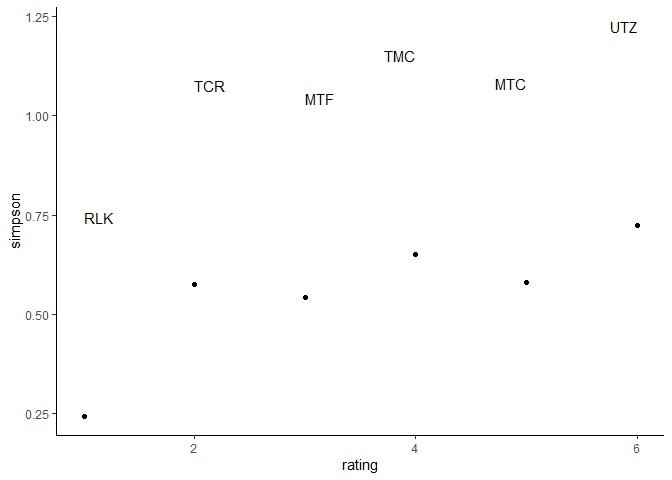
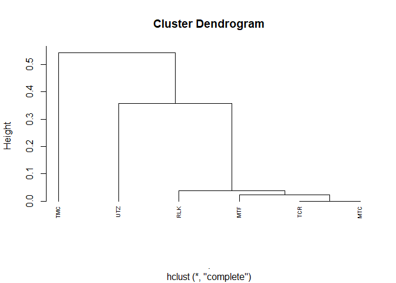

Similarity & diversity
================

Lewis uses a modified form of Simpson's diversity index to evaluate dietary niche breadth. But first they standardized their data to account for different numbers of prey categories between nests (and what is *that* supposed to mean??) They use Morisita's index of similarity for it's suitability to count data and small sample sizes to evaluate dietary overlap between nests. But then, they use count data, apparently because it was very similar to biomass data... but I'd feel a lot happier using my biomass numbers. They use items identified to genus. Miller also uses Simpson's diversity index (not modified, apparently) and is careful to note that the index is biases due to not all items being identified to genus (thanks for being honest, Miller!). And Miller also uses Morisita's index of overlap. No mention of counts vs biomass... but I suppose it has to be counts, doesn't it?

Oh, and Smithers et al. 2005 did something cool with cluster analysis?? And a nice table showing their Morisita results (simplified index).

So it sounds like Simpson and Morisita are the way to go... I just have to decide whether to go with simplified versions or not.

``` r
# Load up some libraries.
library('tidyverse')
library('lubridate')
library('vegan')
library('ggplot2')
library('knitr')
library('kableExtra')

# Import the data.
df <- read.csv('../data/interim/camera_corrected.csv', stringsAsFactors=FALSE)

# Do the datetime thing.
df <- df %>% mutate(datetime=parse_date_time(datetime, 
                       orders=c('%Y-%m-%d %H:%M:%S', '%Y/%m/%d %H:%M:%S')))

source('../src/prey_attributes.R')
```

My first step is to get my data into a form that `vegan` can eat.

``` r
to.genus <- items %>% filter(genus != 'Unknown') %>% 
  group_by(site, genus, species) %>% 
  mutate(count=n()) %>% 
  dplyr::select(site, genus, species, count) %>% 
  unite(name, 2:3, sep=' ') %>% 
  distinct() %>% 
  pivot_wider(names_from=name, values_from=count,
                         values_fill=list(count = 0))

to.genus
```

    ## # A tibble: 6 x 18
    ## # Groups:   site [6]
    ##   site  `Patagoienas fa… `Cyanocitta ste… `Perisoreus can… `Bonasa umbellu…
    ##   <chr>            <int>            <int>            <int>            <int>
    ## 1 TCR                  3                0                0                0
    ## 2 MTF                  0                1                2                0
    ## 3 UTZ                  0                1                0                1
    ## 4 MTC                  0                0                0                0
    ## 5 TMC                  0                0                0                0
    ## 6 RLK                  0                0                0                0
    ## # … with 13 more variables: `Dendragapus fulignosus` <int>, `Catharus
    ## #   ustulatus` <int>, `Ixoreus naevius` <int>, `Turdus migratorius` <int>,
    ## #   `Lepus americanus` <int>, `Rattus sp` <int>, `Cricetidae cinerea` <int>,
    ## #   `Glaucomys sabrinus` <int>, `Neotamias sp` <int>, `Tamiasciurus
    ## #   douglasii` <int>, `Tamiasciurus hudsonicus` <int>, `Tamiasciurus sp` <int>,
    ## #   `Myotis sp` <int>

That looks great, my only problem is that Tamiasciurus sp. at UTZ, because that's the only place where we had both Douglas and red squirrels. It shouldn't be counted as a third species of squirrel, but I also can't just arbitrarily assign it one or the other. So I may just have to drop it.

``` r
# Remove the oddity.
to.genus <- to.genus %>% dplyr::select(-`Tamiasciurus sp`)

# And run Simpson's index of diversity.
simpson <- plyr::ddply(to.genus, ~site, function(x) {
           data.frame(simpson=diversity(x[-1], index='simpson'))
   })

simpson
```

    ##   site   simpson
    ## 1  MTC 0.5798611
    ## 2  MTF 0.5432526
    ## 3  RLK 0.2448980
    ## 4  TCR 0.5763889
    ## 5  TMC 0.6505190
    ## 6  UTZ 0.7232000

Ok, so not a huge range here, which is to be expected, since Douglas squirrels are pretty dominant. Also unsurprising is that Utziletz is the most diverse, since it's such a crazy site. More surprising is that Ruby Lake is by far the least diverse, though that could be an artefact of how difficult it was to id prey items from that camera.

What if I run it through my BS coastalness index?

``` r
simpson %>% add_column(rating=c(5, 3, 1, 2, 4, 6)) %>% 
  ggplot(aes(x=rating, y=simpson, label=site)) +
  geom_point() +
  geom_text(hjust='inward', nudge_y = 0.5) +
  theme_classic()
```



Eh, maybe if you squint. But not really. I should come back to this with more landscape info. For now, let's move on to Morisita.

``` r
vegdist(to.genus[-1 ], method='morisita')
```

    ##            1          2          3          4          5
    ## 2 0.02701298                                            
    ## 3 0.30256065 0.31838705                                 
    ## 4 0.00000000 0.02279212 0.27784052                      
    ## 5 0.25158180 0.33946880 0.54253442 0.29648698           
    ## 6 0.03720930 0.03925893 0.35777998 0.03406440 0.40862423

Great, except it strips away my site names and I have no idea how to get them back. Assuming the sites are in the same order as they appear in the Simpson's index...

``` r
morisita <- vegdist(to.genus[-1 ], method='morisita') %>% 
  as.matrix

colnames(morisita) <- c('MTC', 'MTF', 'RLK', 'TCR', 'TMC', 'UTZ')
rownames(morisita) <- c('MTC', 'MTF', 'RLK', 'TCR', 'TMC', 'UTZ')

morisita
```

    ##            MTC        MTF       RLK        TCR       TMC        UTZ
    ## MTC 0.00000000 0.02701298 0.3025606 0.00000000 0.2515818 0.03720930
    ## MTF 0.02701298 0.00000000 0.3183870 0.02279212 0.3394688 0.03925893
    ## RLK 0.30256065 0.31838705 0.0000000 0.27784052 0.5425344 0.35777998
    ## TCR 0.00000000 0.02279212 0.2778405 0.00000000 0.2964870 0.03406440
    ## TMC 0.25158180 0.33946880 0.5425344 0.29648698 0.0000000 0.40862423
    ## UTZ 0.03720930 0.03925893 0.3577800 0.03406440 0.4086242 0.00000000

Of course, now it's all cluttered and hard to read. Supposedly 1 means complete overlap, but I'm honestly not 100% sure what `vegan` is doing here. If I check by looking at MTC x TCR (which = 0) I should see either 100% overlap or 0% overlap, but...

``` r
to.genus %>% filter(site %in% c('MTC', 'TCR'))
```

    ## # A tibble: 2 x 17
    ## # Groups:   site [2]
    ##   site  `Patagoienas fa… `Cyanocitta ste… `Perisoreus can… `Bonasa umbellu…
    ##   <chr>            <int>            <int>            <int>            <int>
    ## 1 TCR                  3                0                0                0
    ## 2 MTC                  0                0                0                0
    ## # … with 12 more variables: `Dendragapus fulignosus` <int>, `Catharus
    ## #   ustulatus` <int>, `Ixoreus naevius` <int>, `Turdus migratorius` <int>,
    ## #   `Lepus americanus` <int>, `Rattus sp` <int>, `Cricetidae cinerea` <int>,
    ## #   `Glaucomys sabrinus` <int>, `Neotamias sp` <int>, `Tamiasciurus
    ## #   douglasii` <int>, `Tamiasciurus hudsonicus` <int>, `Myotis sp` <int>

...that looks like neither of those things. Which means either I have no idea what these numbers mean, or that the sites are completely out of order. Either makes this table useless.

With some help from StackOverflow I got this working like so:

``` r
mor <- column_to_rownames(to.genus, var='site')
mor <- mor[,-1]
vegdist(mor, method='morisita')
```

    ##            TCR        MTF        UTZ        MTC        TMC
    ## MTF 0.01793614                                            
    ## UTZ 0.31989924 0.31838705                                 
    ## MTC 0.00000000 0.02279212 0.27784052                      
    ## TMC 0.26065377 0.33946880 0.54253442 0.29648698           
    ## RLK 0.00000000 0.03925893 0.35777998 0.03406440 0.40862423

This is way easier to read... but maybe not more helpful. Because when I look at the sites with the lowest overlap (TCR x RLK) and the ones with the highest (UTZ x TMC) I don't actually see any difference. They all have no prey in common except Douglas squirrel.

``` r
# High overlap
to.genus %>% filter(site %in% c('UTZ', 'TMC'))
```

    ## # A tibble: 2 x 17
    ## # Groups:   site [2]
    ##   site  `Patagoienas fa… `Cyanocitta ste… `Perisoreus can… `Bonasa umbellu…
    ##   <chr>            <int>            <int>            <int>            <int>
    ## 1 UTZ                  0                1                0                1
    ## 2 TMC                  0                0                0                0
    ## # … with 12 more variables: `Dendragapus fulignosus` <int>, `Catharus
    ## #   ustulatus` <int>, `Ixoreus naevius` <int>, `Turdus migratorius` <int>,
    ## #   `Lepus americanus` <int>, `Rattus sp` <int>, `Cricetidae cinerea` <int>,
    ## #   `Glaucomys sabrinus` <int>, `Neotamias sp` <int>, `Tamiasciurus
    ## #   douglasii` <int>, `Tamiasciurus hudsonicus` <int>, `Myotis sp` <int>

``` r
# Low overlap
to.genus %>% filter(site %in% c('RLK', 'TCR'))
```

    ## # A tibble: 2 x 17
    ## # Groups:   site [2]
    ##   site  `Patagoienas fa… `Cyanocitta ste… `Perisoreus can… `Bonasa umbellu…
    ##   <chr>            <int>            <int>            <int>            <int>
    ## 1 TCR                  3                0                0                0
    ## 2 RLK                  0                0                0                0
    ## # … with 12 more variables: `Dendragapus fulignosus` <int>, `Catharus
    ## #   ustulatus` <int>, `Ixoreus naevius` <int>, `Turdus migratorius` <int>,
    ## #   `Lepus americanus` <int>, `Rattus sp` <int>, `Cricetidae cinerea` <int>,
    ## #   `Glaucomys sabrinus` <int>, `Neotamias sp` <int>, `Tamiasciurus
    ## #   douglasii` <int>, `Tamiasciurus hudsonicus` <int>, `Myotis sp` <int>

This is probably because my sample sizes are too small. I could try the modified Morisita, aka Morisita-Horn, which may be less concerned about sample sizes.

``` r
vegdist(mor, method='horn')
```

    ##            TCR        MTF        UTZ        MTC        TMC
    ## MTF 0.05745003                                            
    ## UTZ 0.36482829 0.36168366                                 
    ## MTC 0.02565246 0.06923340 0.33518800                      
    ## TMC 0.31429181 0.38626609 0.59424338 0.35669794           
    ## RLK 0.04929577 0.08466873 0.40193659 0.08833283 0.45224396

Slightly more realistic, maybe, but the problem is really the lack of data, not the method. I could bump up to family, which gives me a larger data set. Or I could switch to biomass, which may also increase my data set and which I can still use with the Morisita-Horn Index... but neither of those actually seem like good ideas. So I guess I'll leave this here for now, until I have more data.

One last, kind of intuitive way of looking at the data which I want to try is to do a cluster analysis.

``` r
vegdist(mor, method='morisita') %>% 
  hclust(method='complete') %>% 
  plot(hang=-1, cex=0.6)
```



That is really not at all what I expected. I would have expected Utziletz to be a stronger outlier than Twenty-Mile Creek, and I wouldn't have expected Ruby Lake to be so closelyly clustered with the others. It *does* make sense for Turbid Creek and Mount Currie to be close, and actually Mount Ford, too.
