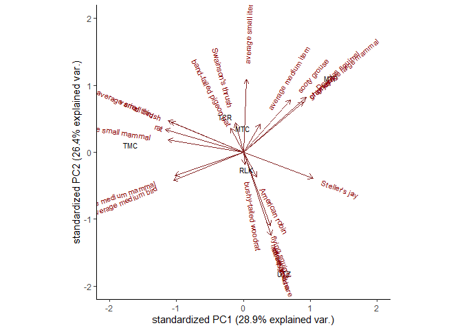
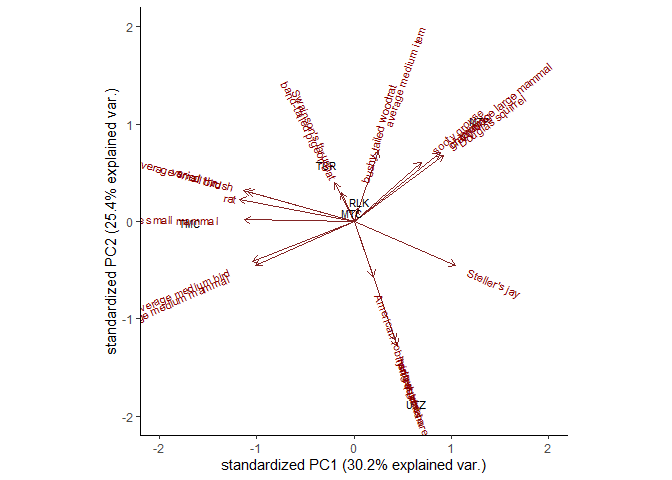
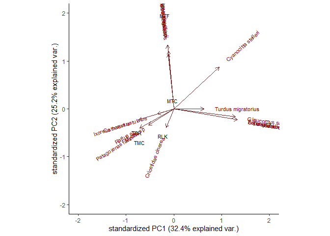
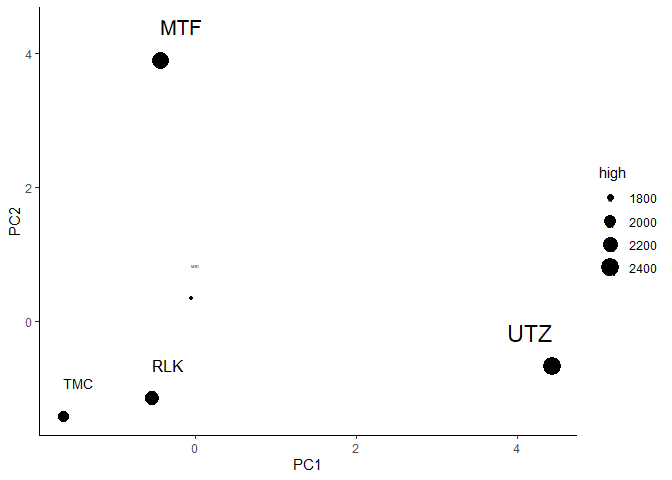
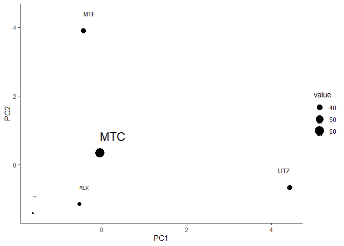
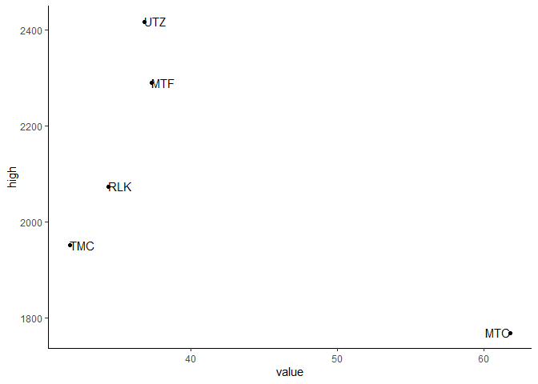

PCA
================

On the one hand, nothing may look promising because I’m using the wrong
landscape variables (also, I’ve only looked at, like, two variables).
Alternatively, I’m using the wrong response variable, ie I’m thinking
about diet the wrong way. Something to think about is using PCA.

``` r
# Load up some libraries.
library(tidyverse)
library(ggplot2)
library(ggbiplot) # This is experimental and must be installed from GitHub.
library(conflicted)
library(sf)
library(raster)
library(landscapemetrics)

# Resolve conflicts.
conflict_prefer('mutate', 'dplyr')
conflict_prefer('select', 'dplyr')
conflict_prefer('arrange', 'dplyr')
conflict_prefer('filter', 'dplyr')
conflict_prefer('summarise', 'dplyr')
conflict_prefer('summarize', 'dplyr')

# Bring in diet data.
df <- read_csv('../data/interim/camera_corrected.csv', guess_max=7000)
source('../src/prey_attributes.R')

head(items)
```

    ## # A tibble: 6 x 9
    ##   site  class family    genus     species   common         size   group     mass
    ##   <chr> <chr> <chr>     <chr>     <chr>     <chr>          <chr>  <chr>    <dbl>
    ## 1 TCR   Aves  Columbid~ Patagoie~ fasciata  band-tailed p~ Medium Large b~ 379. 
    ## 2 TCR   Aves  Columbid~ Patagoie~ fasciata  band-tailed p~ Medium Large b~ 379. 
    ## 3 TCR   Aves  Columbid~ Patagoie~ fasciata  band-tailed p~ Medium Large b~ 379. 
    ## 4 MTF   Aves  Corvidae  Cyanocit~ stelleri  Steller's jay  Medium Medium ~ 128  
    ## 5 UTZ   Aves  Corvidae  Cyanocit~ stelleri  Steller's jay  Medium Medium ~ 128  
    ## 6 MTF   Aves  Corvidae  Perisore~ canadens~ gray jay       Medium Medium ~  70.2

This dataset still has that random *Tamiasciurus* sp. (I should really
fix that permanently) so I’ll deal with that.

``` r
items <- items %>% mutate(common=case_when(
  genus == 'Tamiasciurus' & species == 'sp' ~ 'Douglas squirrel',
  TRUE ~ common
))
```

I’m using common because I don’t have any duplicate common names and it
let’s me gracefully include things that are only identified to family or
class.

Next I need to rearrange the data so it’s summarized by site, which is
basically the same as what I did for diversity and similarity analyses.

``` r
# Twist and reorganize the data.
by.site <- items %>% group_by(site, common) %>% 
  mutate(count=n()) %>% 
  select(site, common, count) %>% 
  distinct() %>%
  pivot_wider(names_from=common, values_from=count, values_fill=list(count=0))

# Look at it.
by.site
```

    ## # A tibble: 6 x 24
    ## # Groups:   site [6]
    ##   site  `band-tailed pi~ `Steller's jay` `gray jay` `ruffed grouse`
    ##   <chr>            <int>           <int>      <int>           <int>
    ## 1 TCR                  3               0          0               0
    ## 2 MTF                  0               1          2               0
    ## 3 UTZ                  0               1          0               1
    ## 4 MTC                  0               0          0               0
    ## 5 TMC                  0               0          0               0
    ## 6 RLK                  0               0          0               0
    ## # ... with 19 more variables: `sooty grouse` <int>, `average small bird` <int>,
    ## #   `average medium bird` <int>, `Swainson's thrush` <int>, `varied
    ## #   thrush` <int>, `American robin` <int>, `snowshoe hare` <int>, rat <int>,
    ## #   `bushy-tailed woodrat` <int>, `flying squirrel` <int>, chipmunk <int>,
    ## #   `Douglas squirrel` <int>, `red squirrel` <int>, `average large
    ## #   mammal` <int>, `average medium mammal` <int>, `average small mammal` <int>,
    ## #   bat <int>, `average medium item` <int>, `average small item` <int>

Then actually run the PCA. `prcomp()` wants numerical-only data so I
have to make my site names into rownames.

``` r
# Convert site names to row names.
by.site <- by.site %>% column_to_rownames(var='site')

# Make the PCA.
diet.pca <- prcomp(by.site, center=TRUE, scale=TRUE)

# How'd it come out?
summary(diet.pca)
```

    ## Importance of components:
    ##                           PC1    PC2    PC3    PC4     PC5       PC6
    ## Standard deviation     2.5779 2.4650 2.0297 1.9776 1.49914 7.074e-16
    ## Proportion of Variance 0.2889 0.2642 0.1791 0.1700 0.09771 0.000e+00
    ## Cumulative Proportion  0.2889 0.5531 0.7322 0.9023 1.00000 1.000e+00

``` r
str(diet.pca)
```

    ## List of 5
    ##  $ sdev    : num [1:6] 2.58 2.46 2.03 1.98 1.5 ...
    ##  $ rotation: num [1:23, 1:6] -0.0528 0.289 0.2493 0.1162 0.1961 ...
    ##   ..- attr(*, "dimnames")=List of 2
    ##   .. ..$ : chr [1:23] "band-tailed pigeon" "Steller's jay" "gray jay" "ruffed grouse" ...
    ##   .. ..$ : chr [1:6] "PC1" "PC2" "PC3" "PC4" ...
    ##  $ center  : Named num [1:23] 0.5 0.333 0.333 0.167 0.333 ...
    ##   ..- attr(*, "names")= chr [1:23] "band-tailed pigeon" "Steller's jay" "gray jay" "ruffed grouse" ...
    ##  $ scale   : Named num [1:23] 1.225 0.516 0.816 0.408 0.516 ...
    ##   ..- attr(*, "names")= chr [1:23] "band-tailed pigeon" "Steller's jay" "gray jay" "ruffed grouse" ...
    ##  $ x       : num [1:6, 1:6] -0.717 3.382 1.576 -0.017 -4.333 ...
    ##   ..- attr(*, "dimnames")=List of 2
    ##   .. ..$ : chr [1:6] "TCR" "MTF" "UTZ" "MTC" ...
    ##   .. ..$ : chr [1:6] "PC1" "PC2" "PC3" "PC4" ...
    ##  - attr(*, "class")= chr "prcomp"

I have this weird feeling I’m doing it wrong and that there should be
more than 6 principal components, but aside from the strange number this
seems to match all the examples I see online.

Maybe graphing it will help.

``` r
ggbiplot(diet.pca, labels=rownames(by.site)) +
  xlim(-2, 2) +
  ylim(-2, 2) +
  theme_classic()
```

<!-- -->

Well, that’s not easy to read, and it doesn’t seem to show a ton,
anyhow. There seems to be a slight left-right split with UTZ being a bit
of an outlier.

You know, it actually doesn’t make much sense to include unidentified
items, like “average small item.” Does it make a difference if I drop
those and run it again?

``` r
# Remove unidentified items.
by.site.2 <- by.site %>% select(-`average small item`, `average medium item`)

# Make a new PCA.
diet.pca.2 <- prcomp(by.site.2, center=TRUE, scale=TRUE)

# Plot the new PCA.
ggbiplot(diet.pca.2, labels=rownames(by.site)) +
  xlim(-2, 2) +
  ylim(-2, 2) +
  theme_classic()
```

<!-- -->

Well, that did make a slight difference. But it didn’t make a clearer
pattern–except perhaps that UTZ remains a bit of an oddball.

One last way of slicing it: using only identified items:

``` r
# Fix that pesky squirrel.
items <- items %>% mutate(species=case_when(
  genus == 'Tamiasciurus' & species == 'sp' ~ 'douglasii',
  TRUE ~ species
))

# Select only items identified at least to genus.
to.genus <- items %>% filter(genus != 'Unknown') %>% 
  group_by(site, genus, species) %>% 
  mutate(count=n()) %>% 
  select(site, genus, species, count) %>% 
  unite(name, 2:3, sep=' ') %>% 
  distinct() %>%
  pivot_wider(names_from=name, values_from=count, values_fill=list(count=0))

# Make site names row names.
to.genus <- to.genus %>% column_to_rownames(var='site')

# Make the PCA.
genus.pca <- prcomp(to.genus, center=TRUE, scale=TRUE)

# Check it out.
ggbiplot(genus.pca, labels=rownames(to.genus)) +
  xlim(-2, 2) +
  ylim(-2, 2) +
  theme_classic()
```

<!-- -->

That looks… more like what a PCA should look like. It’s roughly the same
pattern as before, but more clear: Steller’s jays are doing their own
weird thing; UTZ is off in it’s red-squirrel-and-flying-squirrel corner;
RLK, TMC, and MTC are all kind of similar. The main difference is that
TMC is more clearly doing it’s own thing, just like UTZ, albeit in a
different direction. But although it’s prettier to look at, I’m not sure
it’s actually *better*.

``` r
summary(genus.pca)
```

    ## Importance of components:
    ##                           PC1    PC2    PC3    PC4    PC5       PC6
    ## Standard deviation     2.2771 2.0070 1.6564 1.4503 1.3928 4.643e-16
    ## Proportion of Variance 0.3241 0.2518 0.1715 0.1315 0.1212 0.000e+00
    ## Cumulative Proportion  0.3241 0.5758 0.7473 0.8788 1.0000 1.000e+00

The first two PCs explain 32% and 25% of the variance, respectively (so
a total of 57%), whereas the original PCA (with all items) explains 29%
and 26% (55%) and the second PCA (with items identified to class)
explains 30% and 25% (also 55%). So, yes, using only items identified to
genus does result in a slightly tighter fit, but not by much.

I’d like to get a closer look at which species wind up where.

``` r
pca.species <- genus.pca$rotation[,1:2] %>% data.frame()

pca.species %>% arrange(PC1)
```

    ##                                 PC1           PC2
    ## Ixoreus naevius         -0.23079274 -0.0814862801
    ## Rattus sp               -0.22625221 -0.1441196410
    ## Myotis sp               -0.16707515 -0.1228626450
    ## Patagoienas fasciata    -0.16707515 -0.1228626450
    ## Catharus ustulatus      -0.10743282 -0.0376149767
    ## Cricetidae cinerea      -0.05019194 -0.1399930873
    ## Neotamias sp            -0.04174953  0.4747863495
    ## Perisoreus canadensis   -0.04174953  0.4747863495
    ## Dendragapus fulignosus  -0.03712361  0.4078333756
    ## Tamiasciurus douglasii  -0.03568536  0.4290661952
    ## Turdus migratorius       0.19924637  0.0004192948
    ## Cyanocitta stelleri      0.29804553  0.3110672838
    ## Glaucomys sabrinus       0.40611726 -0.0593060337
    ## Lepus americanus         0.41875062 -0.0813139005
    ## Tamiasciurus hudsonicus  0.41875062 -0.0813139005
    ## Bonasa umbellus          0.41875062 -0.0813139005

And arranged by the other axis:

``` r
pca.species %>% arrange(PC2)
```

    ##                                 PC1           PC2
    ## Rattus sp               -0.22625221 -0.1441196410
    ## Cricetidae cinerea      -0.05019194 -0.1399930873
    ## Patagoienas fasciata    -0.16707515 -0.1228626450
    ## Myotis sp               -0.16707515 -0.1228626450
    ## Ixoreus naevius         -0.23079274 -0.0814862801
    ## Lepus americanus         0.41875062 -0.0813139005
    ## Tamiasciurus hudsonicus  0.41875062 -0.0813139005
    ## Bonasa umbellus          0.41875062 -0.0813139005
    ## Glaucomys sabrinus       0.40611726 -0.0593060337
    ## Catharus ustulatus      -0.10743282 -0.0376149767
    ## Turdus migratorius       0.19924637  0.0004192948
    ## Cyanocitta stelleri      0.29804553  0.3110672838
    ## Dendragapus fulignosus  -0.03712361  0.4078333756
    ## Tamiasciurus douglasii  -0.03568536  0.4290661952
    ## Neotamias sp            -0.04174953  0.4747863495
    ## Perisoreus canadensis   -0.04174953  0.4747863495

It’s hard to imagine what these axes are capturing.

Since the foraging HSI basically just represents structure (maturity or
not), that could be a place to start looking, though it would fail to
capture interesting features like natural gaps, water, etc.

  - \-10 = saltwater
  - \-2 = freshwater (lakes, ponds), glacier
  - \-1 = rivers
  - 0 = non-habitat land (cities, etc.)
  - 1 = low
  - 2 = moderate
  - 3 = high

<!-- end list -->

``` r
# Import habitat HSI shapefile
f.hsi <- st_read('../data/external/foraging_sc.shp')

# Set raster extent based on HSI shapefile.
ext <- extent(f.hsi)

# Make an empty raster to populate with values.
r <- raster(ext, res=c(100, 100))

# Populate BEC polygon data onto empty raster grid.
r.f.hsi <- rasterize(f.hsi, r, 'gridcode')

# Save the raster image.
writeRaster(r.f.hsi, '../data/processed/foraging_sc.tif', format='GTiff')
```

That took foreeeeeeeeeeever\!

If picking up later, load up the raster and keep going.

``` r
# Import the raster.
r.f.hsi <- raster('../data/processed/foraging_sc.tif')

# Define levels for the raster.
f.hsi.levels <- data.frame(ID=c(-10, -2, -1, 0, 1, 2, 3), 
                           class.name=c('ocean', 'freshwater', 'river', 'nil', 'low', 'moderate', 'high'))

# Add the levels to the raster.
levels(r.f.hsi) <- f.hsi.levels
```

Just as a quick thing to try, I’ll see if the amount of high-quality
habitat means anything, and if the degree of fragmentation means
anything. Again, because the HSI is based on VRI data and the TCR site’s
VRI is all weird, I have to drop it from the analysis.

``` r
# Import nests and calculate centroids.
sites <- read_csv('../data/processed/the_big_list_of_nests.csv') %>% 
  group_by(name) %>% 
  mutate_at(c('lat', 'lon'), mean) %>% 
  mutate_at(vars(starts_with('status')), max) %>% 
  mutate_at(c('telemetry', 'cameras', 'remains'), max) %>% 
  dplyr::select(-nest, -NOTES) %>% 
  distinct() %>% 
  filter(cameras > 0)

# Drop TCR, ungroup.
sites <- sites %>% filter(site != 'TCR') %>% 
  ungroup()

# Make site table a spatial object and make it UTMs.
sites.sf <- ungroup(sites) %>% st_as_sf(coords=c('lon', 'lat')) %>%
  st_set_crs('+proj=longlat +ellps=WGS84 +datum=WGS84 +no_defs') %>%
  st_transform("+proj=utm +zone=10 +datum=WGS84 +units=m +no_defs")

# Convert approximate homerange area in ha to radius in m
a.hr.ha <- 3700
r.hr.m <- sqrt(a.hr.ha*10000/pi)

# Calculate area per class per site.
class.area <- sample_lsm(r.f.hsi, y=sites.sf, size=r.hr.m, what='lsm_c_ca', 
           shape='circle') %>% 
  # Amend class number with habitat class name.
  left_join(data.frame(levels(r.f.hsi)), by=c('class'='ID')) %>% 
# Reorganize by site.  
  pivot_wider(id_cols=plot_id, names_from=class.name, values_from=value, 
              values_fill=list(value=0))

# Amend with site names.
class.area <- dplyr::select(sites, site) %>% rownames_to_column() %>% 
  mutate(rowname=as.integer(rowname)) %>% 
  right_join(class.area, by=c('rowname'='plot_id'))

class.area
```

    ## # A tibble: 5 x 9
    ##   rowname site  freshwater   nil   low moderate  high ocean river
    ##     <int> <chr>      <dbl> <dbl> <dbl>    <dbl> <dbl> <dbl> <dbl>
    ## 1       1 MTF           34     7   845      519  2290     0     0
    ## 2       2 MTC           50   253  1012      606  1769     0     0
    ## 3       3 RLK          814     0   340      232  2074   236     0
    ## 4       4 TMC            2    17   516     1208  1951     0     0
    ## 5       5 UTZ            2    15   949      305  2418     0     9

Again, super interesting to see the breakdown here. Ruby Lake takes the
cake for ocean and freshwater. Obviously the model isn’t good at
capturing smaller rivers, because I know several of these sites have
rivers flowing through them. TMC has the most decent habitat overall,
but Utzilus has the most high habitat… though Ruby Lake might be the
best site overall, considering that it has no nil habitat and little low
habitat. Basically everything that’s not water is good forest.

Now put everything in one table and start modelling.

``` r
# Join PCA and HSI data together.
class.area <- genus.pca$x[,1:2] %>% data.frame() %>% rownames_to_column(var='site') %>%
  right_join(class.area)

# Plot it.
ggplot(class.area, aes(x=PC1, y=PC2, label=site, size=high)) +
  geom_point() +
  geom_text(hjust='inward', nudge_y = 0.5) +
  theme_classic()
```

<!-- -->

Again, not promising. Tornberg & Colpaert used PC1 as a fixed factor and
territory as a random factor in a mixed-effects model. Since I only have
one observation per territory, I don’t think there’s any need for that.

``` r
# Make the model.
PC1.x.class <- lm(PC1 ~ high, data=class.area)

# Look at it.
summary(PC1.x.class)
```

    ## 
    ## Call:
    ## lm(formula = PC1 ~ high, data = class.area)
    ## 
    ## Residuals:
    ##       1       2       3       4       5 
    ## -1.9208  2.1934  1.5581 -1.1024 -0.7282 
    ## 
    ## Coefficients:
    ##               Estimate Std. Error t value Pr(>|t|)
    ## (Intercept) -12.112491   8.364249  -1.448    0.243
    ## high          0.005935   0.003958   1.499    0.231
    ## 
    ## Residual standard error: 2.055 on 3 degrees of freedom
    ## Multiple R-squared:  0.4284, Adjusted R-squared:  0.2379 
    ## F-statistic: 2.248 on 1 and 3 DF,  p-value: 0.2307

Unsurprisingly, it doesn’t look like much. Now let’s try fragmentation,
which is not something I’ve done with landscapemetrics before. I’m going
with `ED` which is edge density. Because all my landscapes are the same
size this is really the same as total edge.

``` r
# Calculate edge.
landscape.edge <- sample_lsm(r.f.hsi, y=sites.sf, size=r.hr.m, what='lsm_l_ed', 
           shape='circle')

# Amend with site names.
landscape.edge <- landscape.edge %>% mutate(site=sites$site)

# Add PCA data.
landscape.edge <- genus.pca$x[,1:2] %>% data.frame() %>% rownames_to_column(var='site') %>%
  right_join(landscape.edge)

# Look at it.
landscape.edge
```

    ##   site         PC1        PC2 layer     level class id metric    value plot_id
    ## 1  MTF -0.44187622  3.9039752     1 landscape    NA NA     ed 37.29364       1
    ## 2  UTZ  4.43204853 -0.6686112     1 landscape    NA NA     ed 36.80368       5
    ## 3  MTC -0.05512707  0.3378384     1 landscape    NA NA     ed 61.81572       2
    ## 4  TMC -1.63549454 -1.4118466     1 landscape    NA NA     ed 31.75420       4
    ## 5  RLK -0.53123055 -1.1511063     1 landscape    NA NA     ed 34.33442       3
    ##   percentage_inside
    ## 1          99.93194
    ## 2         100.01307
    ## 3          99.79671
    ## 4          99.90489
    ## 5          99.95898

``` r
# Plot it.
ggplot(landscape.edge, aes(x=PC1, y=PC2, label=site, size=value)) +
  geom_point() +
  geom_text(hjust='inward', nudge_y = 0.5) +
  theme_classic()
```

<!-- -->

That’s actually kind of interesting… but I’ll come back to that in a
sec. First\! The model:

``` r
# Make the model.
PC1.x.edge <- lm(PC1 ~ value, data=landscape.edge)

# Look at it.
summary(PC1.x.edge)
```

    ## 
    ## Call:
    ## lm(formula = PC1 ~ value, data = landscape.edge)
    ## 
    ## Residuals:
    ##       1       2       3       4       5 
    ## -0.7871  4.0882 -0.4671 -1.9656 -0.8684 
    ## 
    ## Coefficients:
    ##             Estimate Std. Error t value Pr(>|t|)
    ## (Intercept) 0.243607   4.671762   0.052    0.962
    ## value       0.002724   0.111653   0.024    0.982
    ## 
    ## Residual standard error: 2.718 on 3 degrees of freedom
    ## Multiple R-squared:  0.0001984,  Adjusted R-squared:  -0.3331 
    ## F-statistic: 0.0005953 on 1 and 3 DF,  p-value: 0.9821

Again, nothing interesting. But I thought I might have spotted something
between high habitat and edge.

``` r
# Stuff everything into one (very messy) object.
all.metrics <- right_join(class.area, landscape.edge)

# Have a look.
ggplot(all.metrics, aes(x=value, y=high, label=site)) +
  geom_point() +
  geom_text(hjust='inward', nudge_y = 0.5) +
  theme_classic()
```

<!-- -->

Soooooo this seems to indicate that as the density of edges increases,
so does the amount of high quality habitat. Which is weird. But it’s
also only five sites, and I know RLK is going to throw things off
because of all that water. But still.
