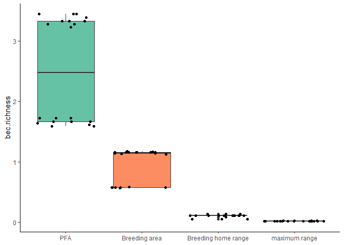

NW PLN
================

# Setup

### Sites

<table class="table" style="margin-left: auto; margin-right: auto;">

<thead>

<tr>

<th style="text-align:right;">

year

</th>

<th style="text-align:left;">

method

</th>

<th style="text-align:right;">

number of sites

</th>

</tr>

</thead>

<tbody>

<tr>

<td style="text-align:right;">

2019

</td>

<td style="text-align:left;">

camera + remains

</td>

<td style="text-align:right;">

6

</td>

</tr>

<tr>

<td style="text-align:right;">

2019

</td>

<td style="text-align:left;">

remains only

</td>

<td style="text-align:right;">

6

</td>

</tr>

<tr>

<td style="text-align:right;">

2020

</td>

<td style="text-align:left;">

camera + remains

</td>

<td style="text-align:right;">

8

</td>

</tr>

</tbody>

</table>

(But remember that the number of remains-only sites is still
incomplete.)

### Scale

<table class="table" style="margin-left: auto; margin-right: auto;">

<thead>

<tr>

<th style="text-align:left;">

size

</th>

<th style="text-align:right;">

area

</th>

<th style="text-align:right;">

radius

</th>

</tr>

</thead>

<tbody>

<tr>

<td style="text-align:left;">

PFA

</td>

<td style="text-align:right;">

60.00

</td>

<td style="text-align:right;">

437.0194

</td>

</tr>

<tr>

<td style="text-align:left;">

breeding area

</td>

<td style="text-align:right;">

175.00

</td>

<td style="text-align:right;">

746.3527

</td>

</tr>

<tr>

<td style="text-align:left;">

breeding home range

</td>

<td style="text-align:right;">

3800.00

</td>

<td style="text-align:right;">

3477.8982

</td>

</tr>

<tr>

<td style="text-align:left;">

maximum range

</td>

<td style="text-align:right;">

32902.97

</td>

<td style="text-align:right;">

10233.9342

</td>

</tr>

</tbody>

</table>

#### **Where do these numbers come from?**

McClaren et al. (2005) uses 95% adaptive kernel estimates from 12
fledglings at 12 different nests over 2 years (6 per year) to estimate
the PFA size on Vancouver Island to be **59.2** +/- 16.1 **ha** (which I
round to 60 ha).

McClaren et al. (2015) generated PFA-sized buffers around known nests
and calculted the total area covered within each territory to get a 90th
percentile estimate of **175.2 ha** (which I round to 175 ha).

McClaren et al. (2015) gives the size of the breeding season home range
to be 3700 ha on Vancouver Island in one location and as 3745 ha in
another, but provides citations for neither number. Combing through all
of the references in that section yields Daust et al. 2010 (a workshop
proceedings) which gives the number 3800 ha, not 3700. Daust’s 3800 ha
citation points back to McClaren (he says 2003, but it appears to
actually be the 2005 report). Daust says this number comes from
inter-nest spacing of 7km; the actual number is **6.9** +/ 0.7 **km**.
This is the mean nearest-neighbor distance from 16 nest areas (territory
centroids, I think) from 9 years of data from the Woss research area on
Vancouver Island. According to my math, a radius of 3.5 km gives me an
area of 38.48 km^2, which does indeed produce an area of 3848 ha, very
close to Daust’s 3800 but a bit off from McClaren’s 3700.

#### **Who else has used this nested scales method?**

Finn et al. (2002) uses the nest area (39 ha), PFA (177 ha), and home
range (1886 ha) as scales for landscape analysis. McGrath et al. (2003)
uses a scale of 10, 30, 60, 83, 120, 150, and 170 ha which includes nest
area, nest stand, and several different conceptualizations of PFAs.
Bruggerman et al. (2014) also used nested scales around nests but I need
to double-check their radii.

# Response variables

### Diet variables

<!-- -->

#### **Where do these numbers come from?**

Diet diversity calculated with Simpson’s Diversity Index using items
from both cameras and remains that were identified to genus or species.
**N = 13 sites** with an average of **36.6153846 items** per site.

Proportion squirrel calculated for **N = 13 sites** as the mass of items
from both cameras and remains that were identified to the genus
*Tamiasciurus* divided by the total mass delivered to the nest.

#### **Who else has used these diet quantification methods?**

Lewis et al (2006) used a modified form of the Simpson’s index and
standardized the value to account for different numbers of prey
categories between sites. Miller et al (2014) used an inverse Simpson’s
diversity index using only items identified to genus or species.

Miller et al (2014) used propotion of biomass that was mammalian out of
total biomass. Lewis et al (2006) went a slightly different route and
used the number of items that were birds or mammals.

<!-- -->

So far there doesn’t appear to be a drastic difference in diversity
between the two methods, but there is a dramatic difference in
proportion of squirrel biomass. But note the small and very different
sample sizes and that there is currently almost no overlap between
camera and remains-only sites. This wrinkle may iron out later.

Lewis et al (2004) tested for differences between methods using a linear
regression to test for differences in counts between prey categories
(ie, avian and mammalian) and also used Morisita’s index of similarity
to test for differences in prey species.

### Productivity

<!-- -->

Currently productivity information is only available for the 6 camera
sites from 2019. Productivty will (hopefully) be available for the 2020
camera sites as well, making a total of **14 sites** with productivity
data.

Miller et al (2014) and Rogers et al (2006) both use productivity with
diet. Salafsky et al (2007) uses productivity with prey abundance.

### Occupancy

<!-- -->

No one seems to have used occupancy as a response variable for diet.
Finn et al (2002) does use occupancy as a response for landscape, but
classifies sites binomially as occupied or unoccupied. Due to the nature
of my data, almost all sites are, by default, “occupied” under Finn’s
definition. At any rate, their method doesn’t account for differing
habitat quality.

**How to actually use occupancy?** Finn’s yes/no classification seems
unhelpful. Percent occupied (n years occupied/n years surveyed) seems to
give too much weight to sites with only one years of surveys. **Maybe
percent occupied given at least some number of surveys?**

# Predictor variables

### Forest type

<!-- -->

<!-- -->

<!-- -->

#### **Where do these numbers come from?**

Dominant forest type is simply the forest type with the greatest area at
each given scale. Forest type diversity is calculated using Simpson’s
diversity index. Forest type richness is just the number of different
forest types present at each scale (*there is obviously something very
wrong with the richness data at the breeding home range scale*). This is
calculated for all sites from both methods **(N = 20)** so the number of
sites will increase as I finish processing remains.

#### **Who else has used these landscape variables?**

None, kind of. Lewis et al (2006) compared diet between “habitat types”
(hemlock- vs spruce-dominated stands). Salafsky et al (2007) examines
goshawk productivity and prey abundance between “forest types” (mixed
conifer vs ponderosa pine). These are all based strictly on what forest
type the nest is located in, not the overall type present in the
landscape. None have used diversity or richness of forest types.

**Would it simplify things to collapse dominant forest types into a few
categories?** (ie, western hemlock/mountain hemlock/douglas fir or maybe
something weird like dry/moist/ver moist or maritime/submaritime.) **And
does it really make sense to consider dominant forest type at different
scales?** Again, would it simplify things to only consider the forest
type of the nest stand?

### Landcover

<!-- -->

I won’t be using the amount of any particular class, but this visualizes
what the classes are and how they’re distributed. There are two
additional classes that are present in the landcover data but aren’t
present in any of the current sites: alpine and wetland. This is
currently calculated only using the 2019 camera sites (**n = 14 sites**)
because that’s the landcover data I currently have prepared, but will
later be calculated using the full site set (**n = 20 + unprocessed
remains sites**).

<!-- -->

<!-- -->

<!-- -->

<!-- -->

#### **Where do these numbers come from?**

Diversity of landcover classes is calculated using Simpson’s diversity
index. Edge density is just edge density (all edges/landscape area \*
1000) (so it’s directly comparable between different sizes).
Interspersion is the interspersion and juxtaposition index, which is not
as sensitive to fragmentation as the contagion index. (**IJI requires at
least 3 classes to calculate, which is not always possible at the
smaller landscape scales. I converted these missing values to 0, which
may be very, very wrong.**) Amount of mature cover is the area of land
covered by mature and old growth conifer forest. (**Should this be
scaled by making it proportion of land covered by mature forest?**)

#### **Who else has used these landscape metrics?**

Finn et al (2002) used proportion of all landcover classes, along with
patch size, patch density, core size, edge density, patch shape, patch
richness, dominance index, and contrast. That’s a lot of things. McGrath
et al (2003) used contrast-weighted edge density (for structural stage),
contrast-weighted edge density (for canopy cover), mean nearest
neighbor, Simpson’s evenness (which would be equivalent to Finn et al’s
dominance index), and contagion.

Lots more NOGO landscape studies but I haven’t had a chance to add them
here. NSPOW would also be a useful comparison.

**Canopy cover may also be included but until I have my complete site
set I can’t determine whether I have sufficient data coverage to include
it.**

### Habitat suitability index

<!-- -->

<!-- -->

<!-- -->

#### **Where do these numbers come from?**

Amount suitable habitat is the area of land considered to be “moderate”
or “high” quality habitat. (**Again, should this be scaled as
proportion?**) Edge density is edge density, interspersion is the
interspersion and juxtaposition index just as for landcover (**with the
same sketchy decision to make NAs 0s**). HSI metrics are calculate with
the full site set, which is **n = 20 + unprocessed remains sites**.

#### **Who else has used these landscape metrics?**

These are really just the same as are being used for landcover classes.
Amount suitable habitat has been used in BC with this particular model
for model validation-y things. There’s probably more useful ideas from
looking at other modelling studies rather than treating this so much
like landcover.

### Geographic position

<!-- -->

Most NOGO studies have been over too small an area to incorporate
lat/lon and this is probably too small an area, too. But some NSPOW
papers (Zabel et al 1995? and others?) have noted a difference in diet
over latitude. Longitude in this case is a coarse measure of
“interiorness” which may be better captured by a different variable.

**Transition zone/coastal zone may do much better as a measure of
“interiorness”/“coastalness” but I need to check on
definitions/mapping because those are currently a bit unclear.**

    ## # A tibble: 20 x 2
    ##    nest     year
    ##    <chr>   <dbl>
    ##  1 BKH2019  2019
    ##  2 DGC2019  2019
    ##  3 MPT2019  2019
    ##  4 MTC2019  2019
    ##  5 MTF2019  2019
    ##  6 PCR2019  2019
    ##  7 PNC2019  2019
    ##  8 RLK2019  2019
    ##  9 TCR2019  2019
    ## 10 TMC2019  2019
    ## 11 UTZ2019  2019
    ## 12 WRA2019  2019
    ## 13 FMT2020  2020
    ## 14 GOW2020  2020
    ## 15 GRV2020  2020
    ## 16 MTF2020  2020
    ## 17 PCR2020  2020
    ## 18 PNC2020  2020
    ## 19 RLK2020  2020
    ## 20 SVT2020  2020

<!-- -->

This plot show correlation for all landscape sized but only for the 2019
camera sites (since the other sites are currently missing landcover
data).

# Models

### Diet diversity models

  - diet diversity \~ forest type diversity
  - diet diversity \~ forest type richness
  - diet diversity \~ dominant forest type
  - diet diversity \~ land cover diversity
  - diet diversity \~ land cover interspersion
  - diet diversity \~ land cover edge density
  - diet diversity \~ HSI edge density
  - diet diversity \~ HSI interspersion
  - diet diversity \~ year (null)

Not modeled:

  - \~ amount mature forest
  - \~ amound suitable habitat
  - \~ geographic position (lat/lon)

<!-- end list -->

    ## $`~ forest type diversity breeding area`
    ## # A tibble: 1 x 6
    ##   r.squared adj.r.squared sigma statistic p.value    df
    ##       <dbl>         <dbl> <dbl>     <dbl>   <dbl> <int>
    ## 1     0.351         0.304 0.156      7.56  0.0157     2
    ## 
    ## $`~ forest type diversity breeding home range`
    ## # A tibble: 1 x 6
    ##   r.squared adj.r.squared sigma statistic p.value    df
    ##       <dbl>         <dbl> <dbl>     <dbl>   <dbl> <int>
    ## 1     0.399         0.356 0.151      9.29 0.00868     2
    ## 
    ## $`~ forest type diversity maximum range`
    ## # A tibble: 1 x 6
    ##   r.squared adj.r.squared sigma statistic p.value    df
    ##       <dbl>         <dbl> <dbl>     <dbl>   <dbl> <int>
    ## 1     0.476         0.438 0.141      12.7 0.00312     2
    ## 
    ## $`~ forest type diversity PFA`
    ## # A tibble: 1 x 6
    ##   r.squared adj.r.squared sigma statistic p.value    df
    ##       <dbl>         <dbl> <dbl>     <dbl>   <dbl> <int>
    ## 1    0.0820        0.0165 0.186      1.25   0.282     2

    ## $`~ forest type richness: breeding area`
    ## # A tibble: 1 x 6
    ##   r.squared adj.r.squared sigma statistic p.value    df
    ##       <dbl>         <dbl> <dbl>     <dbl>   <dbl> <int>
    ## 1     0.370         0.324 0.154      8.20  0.0125     2
    ## 
    ## $`~ forest type richness: breeding home range`
    ## # A tibble: 1 x 6
    ##   r.squared adj.r.squared sigma statistic p.value    df
    ##       <dbl>         <dbl> <dbl>     <dbl>   <dbl> <int>
    ## 1     0.531         0.497 0.133      15.8 0.00137     2
    ## 
    ## $`~ forest type richness: maximum range`
    ## # A tibble: 1 x 6
    ##   r.squared adj.r.squared sigma statistic p.value    df
    ##       <dbl>         <dbl> <dbl>     <dbl>   <dbl> <int>
    ## 1     0.408         0.366 0.149      9.64 0.00775     2
    ## 
    ## $`~ forest type richness: PFA`
    ## # A tibble: 1 x 6
    ##   r.squared adj.r.squared sigma statistic p.value    df
    ##       <dbl>         <dbl> <dbl>     <dbl>   <dbl> <int>
    ## 1     0.268         0.216 0.166      5.12  0.0401     2

    ## $`breeding area`
    ## # A tibble: 1 x 11
    ##   r.squared adj.r.squared sigma statistic p.value    df logLik   AIC   BIC
    ##       <dbl>         <dbl> <dbl>     <dbl>   <dbl> <int>  <dbl> <dbl> <dbl>
    ## 1     0.491         0.306 0.156      2.66  0.0899     5   10.0 -7.99 -3.36
    ## # ... with 2 more variables: deviance <dbl>, df.residual <int>
    ## 
    ## $`breeding home range`
    ## # A tibble: 1 x 11
    ##   r.squared adj.r.squared sigma statistic p.value    df logLik   AIC   BIC
    ##       <dbl>         <dbl> <dbl>     <dbl>   <dbl> <int>  <dbl> <dbl> <dbl>
    ## 1     0.574         0.361 0.150      2.70  0.0853     6   11.4 -8.84 -3.43
    ## # ... with 2 more variables: deviance <dbl>, df.residual <int>
    ## 
    ## $`maximum range`
    ## # A tibble: 1 x 11
    ##   r.squared adj.r.squared  sigma statistic p.value    df logLik   AIC   BIC
    ##       <dbl>         <dbl>  <dbl>     <dbl>   <dbl> <int>  <dbl> <dbl> <dbl>
    ## 1     0.834         0.723 0.0988      7.52 0.00417     7   18.9 -21.9 -15.7
    ## # ... with 2 more variables: deviance <dbl>, df.residual <int>
    ## 
    ## $PFA
    ## # A tibble: 1 x 11
    ##   r.squared adj.r.squared sigma statistic p.value    df logLik   AIC   BIC
    ##       <dbl>         <dbl> <dbl>     <dbl>   <dbl> <int>  <dbl> <dbl> <dbl>
    ## 1     0.491         0.306 0.156      2.66  0.0899     5   10.0 -7.99 -3.36
    ## # ... with 2 more variables: deviance <dbl>, df.residual <int>

    ## $`~ land cover diversity: breeding area`
    ## # A tibble: 1 x 6
    ##   r.squared adj.r.squared sigma statistic p.value    df
    ##       <dbl>         <dbl> <dbl>     <dbl>   <dbl> <int>
    ## 1    0.0136        -0.233 0.227    0.0551   0.826     2
    ## 
    ## $`~ land cover diversity: breeding home range`
    ## # A tibble: 1 x 6
    ##   r.squared adj.r.squared sigma statistic p.value    df
    ##       <dbl>         <dbl> <dbl>     <dbl>   <dbl> <int>
    ## 1     0.156       -0.0552 0.210     0.738   0.439     2
    ## 
    ## $`~ land cover diversity: maximum range`
    ## # A tibble: 1 x 6
    ##   r.squared adj.r.squared sigma statistic p.value    df
    ##       <dbl>         <dbl> <dbl>     <dbl>   <dbl> <int>
    ## 1     0.298         0.123 0.191      1.70   0.262     2
    ## 
    ## $`~ land cover diversity: PFA`
    ## # A tibble: 1 x 6
    ##   r.squared adj.r.squared sigma statistic p.value    df
    ##       <dbl>         <dbl> <dbl>     <dbl>   <dbl> <int>
    ## 1    0.0137        -0.233 0.227    0.0555   0.825     2

    ## $`~ landcover edge density: breeding area`
    ## # A tibble: 1 x 6
    ##   r.squared adj.r.squared sigma statistic p.value    df
    ##       <dbl>         <dbl> <dbl>     <dbl>   <dbl> <int>
    ## 1 0.0000418        -0.250 0.228  0.000167   0.990     2
    ## 
    ## $`~ landcover edge density: breeding home range`
    ## # A tibble: 1 x 6
    ##   r.squared adj.r.squared sigma statistic p.value    df
    ##       <dbl>         <dbl> <dbl>     <dbl>   <dbl> <int>
    ## 1    0.0473        -0.191 0.223     0.199   0.679     2
    ## 
    ## $`~ landcover edge density: maximum range`
    ## # A tibble: 1 x 6
    ##   r.squared adj.r.squared sigma statistic p.value    df
    ##       <dbl>         <dbl> <dbl>     <dbl>   <dbl> <int>
    ## 1     0.135       -0.0807 0.212     0.627   0.473     2
    ## 
    ## $`~ landcover edge density: PFA`
    ## # A tibble: 1 x 6
    ##   r.squared adj.r.squared sigma statistic p.value    df
    ##       <dbl>         <dbl> <dbl>     <dbl>   <dbl> <int>
    ## 1   0.00539        -0.243 0.228    0.0217   0.890     2

    ## $`~ landcover interspersion: breeding area`
    ## # A tibble: 1 x 6
    ##   r.squared adj.r.squared sigma statistic p.value    df
    ##       <dbl>         <dbl> <dbl>     <dbl>   <dbl> <int>
    ## 1     0.278        0.0974 0.194      1.54   0.283     2
    ## 
    ## $`~ landcover interspersion: breeding home range`
    ## # A tibble: 1 x 6
    ##   r.squared adj.r.squared sigma statistic p.value    df
    ##       <dbl>         <dbl> <dbl>     <dbl>   <dbl> <int>
    ## 1     0.321         0.152 0.188      1.89   0.241     2
    ## 
    ## $`~ landcover interspersion: maximum range`
    ## # A tibble: 1 x 6
    ##   r.squared adj.r.squared sigma statistic p.value    df
    ##       <dbl>         <dbl> <dbl>     <dbl>   <dbl> <int>
    ## 1     0.163       -0.0458 0.209     0.781   0.427     2
    ## 
    ## $`~ landcover interspersion: PFA`
    ## # A tibble: 1 x 6
    ##   r.squared adj.r.squared sigma statistic p.value    df
    ##       <dbl>         <dbl> <dbl>     <dbl>   <dbl> <int>
    ## 1     0.666         0.583 0.132      7.98  0.0476     2

    ## $`~ HSI edge density: breeding area`
    ## # A tibble: 1 x 6
    ##   r.squared adj.r.squared sigma statistic p.value    df
    ##       <dbl>         <dbl> <dbl>     <dbl>   <dbl> <int>
    ## 1    0.0852        0.0198 0.186      1.30   0.273     2
    ## 
    ## $`~ HSI edge density: breeding home range`
    ## # A tibble: 1 x 6
    ##   r.squared adj.r.squared sigma statistic p.value    df
    ##       <dbl>         <dbl> <dbl>     <dbl>   <dbl> <int>
    ## 1   0.00518       -0.0659 0.194    0.0729   0.791     2
    ## 
    ## $`~ HSI edge density: maximum range`
    ## # A tibble: 1 x 6
    ##   r.squared adj.r.squared sigma statistic p.value    df
    ##       <dbl>         <dbl> <dbl>     <dbl>   <dbl> <int>
    ## 1     0.202         0.145 0.173      3.54  0.0808     2
    ## 
    ## $`~ HSI edge density: PFA`
    ## # A tibble: 1 x 6
    ##   r.squared adj.r.squared sigma statistic p.value    df
    ##       <dbl>         <dbl> <dbl>     <dbl>   <dbl> <int>
    ## 1     0.158        0.0974 0.178      2.62   0.128     2

    ## $`~ HSI interspersion: breeding area`
    ## # A tibble: 1 x 6
    ##   r.squared adj.r.squared sigma statistic p.value    df
    ##       <dbl>         <dbl> <dbl>     <dbl>   <dbl> <int>
    ## 1     0.286         0.235 0.164      5.62  0.0327     2
    ## 
    ## $`~ HSI interspersion: breeding home range`
    ## # A tibble: 1 x 6
    ##   r.squared adj.r.squared sigma statistic p.value    df
    ##       <dbl>         <dbl> <dbl>     <dbl>   <dbl> <int>
    ## 1     0.210         0.154 0.173      3.72  0.0741     2
    ## 
    ## $`~ HSI interspersion: maximum range`
    ## # A tibble: 1 x 6
    ##   r.squared adj.r.squared sigma statistic p.value    df
    ##       <dbl>         <dbl> <dbl>     <dbl>   <dbl> <int>
    ## 1    0.0578      -0.00948 0.188     0.859   0.370     2
    ## 
    ## $`~ HSI interspersion: PFA`
    ## # A tibble: 1 x 6
    ##   r.squared adj.r.squared sigma statistic p.value    df
    ##       <dbl>         <dbl> <dbl>     <dbl>   <dbl> <int>
    ## 1     0.211         0.155 0.172      3.74  0.0734     2

    ## $`~ year: breeding area`
    ## # A tibble: 1 x 6
    ##   r.squared adj.r.squared sigma statistic p.value    df
    ##       <dbl>         <dbl> <dbl>     <dbl>   <dbl> <int>
    ## 1    0.0104       -0.0603 0.193     0.147   0.707     2
    ## 
    ## $`~ year: breeding home range`
    ## # A tibble: 1 x 6
    ##   r.squared adj.r.squared sigma statistic p.value    df
    ##       <dbl>         <dbl> <dbl>     <dbl>   <dbl> <int>
    ## 1    0.0104       -0.0603 0.193     0.147   0.707     2
    ## 
    ## $`~ year: maximum range`
    ## # A tibble: 1 x 6
    ##   r.squared adj.r.squared sigma statistic p.value    df
    ##       <dbl>         <dbl> <dbl>     <dbl>   <dbl> <int>
    ## 1    0.0104       -0.0603 0.193     0.147   0.707     2
    ## 
    ## $`~ year: PFA`
    ## # A tibble: 1 x 6
    ##   r.squared adj.r.squared sigma statistic p.value    df
    ##       <dbl>         <dbl> <dbl>     <dbl>   <dbl> <int>
    ## 1    0.0104       -0.0603 0.193     0.147   0.707     2

    ## 
    ## Model selection based on AICc:
    ## 
    ##                                                K   AICc Delta_AICc AICcWt
    ## ~ forest type richness: breeding home range    3 -13.28       0.00   0.50
    ## ~ forest type diversity maximum range          3 -11.50       1.78   0.20
    ## ~ forest type richness: maximum range          3  -9.56       3.72   0.08
    ## ~ forest type diversity breeding home range    3  -9.32       3.96   0.07
    ## ~ forest type richness: breeding area          3  -8.56       4.73   0.05
    ## ~ forest type diversity breeding area          3  -8.08       5.20   0.04
    ## ~ HSI interspersion: breeding area             3  -6.58       6.71   0.02
    ## ~ forest type richness: PFA                    3  -6.17       7.12   0.01
    ## ~ HSI interspersion: PFA                       3  -4.97       8.31   0.01
    ## ~ HSI interspersion: breeding home range       3  -4.95       8.33   0.01
    ## ~ HSI edge density: maximum range              3  -4.79       8.50   0.01
    ## ~ HSI edge density: PFA                        3  -3.92       9.36   0.00
    ## ~ HSI edge density: breeding area              3  -2.60      10.68   0.00
    ## ~ forest type diversity PFA                    3  -2.55      10.74   0.00
    ## ~ HSI interspersion: maximum range             3  -2.13      11.15   0.00
    ## ~ HSI edge density: breeding home range        3  -1.26      12.02   0.00
    ## ~ landcover interspersion: PFA                 3   8.29      21.58   0.00
    ## ~ landcover interspersion: breeding home range 3  12.55      25.83   0.00
    ## ~ land cover diversity: maximum range          3  12.75      26.03   0.00
    ## ~ landcover interspersion: breeding area       3  12.92      26.20   0.00
    ## ~ landcover interspersion: maximum range       3  13.80      27.09   0.00
    ## ~ land cover diversity: breeding home range    3  13.86      27.14   0.00
    ## ~ landcover edge density: maximum range        3  14.00      27.28   0.00
    ## ~ landcover edge density: breeding home range  3  14.58      27.87   0.00
    ## ~ land cover diversity: PFA                    3  14.79      28.08   0.00
    ## ~ land cover diversity: breeding area          3  14.79      28.08   0.00
    ## ~ landcover edge density: PFA                  3  14.84      28.13   0.00
    ## ~ landcover edge density: breeding area        3  14.87      28.16   0.00
    ##                                                Cum.Wt    LL
    ## ~ forest type richness: breeding home range      0.50 10.64
    ## ~ forest type diversity maximum range            0.70  9.75
    ## ~ forest type richness: maximum range            0.78  8.78
    ## ~ forest type diversity breeding home range      0.85  8.66
    ## ~ forest type richness: breeding area            0.90  8.28
    ## ~ forest type diversity breeding area            0.93  8.04
    ## ~ HSI interspersion: breeding area               0.95  7.29
    ## ~ forest type richness: PFA                      0.96  7.08
    ## ~ HSI interspersion: PFA                         0.97  6.49
    ## ~ HSI interspersion: breeding home range         0.98  6.48
    ## ~ HSI edge density: maximum range                0.99  6.39
    ## ~ HSI edge density: PFA                          0.99  5.96
    ## ~ HSI edge density: breeding area                0.99  5.30
    ## ~ forest type diversity PFA                      1.00  5.27
    ## ~ HSI interspersion: maximum range               1.00  5.07
    ## ~ HSI edge density: breeding home range          1.00  4.63
    ## ~ landcover interspersion: PFA                   1.00  4.85
    ## ~ landcover interspersion: breeding home range   1.00  2.73
    ## ~ land cover diversity: maximum range            1.00  2.63
    ## ~ landcover interspersion: breeding area         1.00  2.54
    ## ~ landcover interspersion: maximum range         1.00  2.10
    ## ~ land cover diversity: breeding home range      1.00  2.07
    ## ~ landcover edge density: maximum range          1.00  2.00
    ## ~ landcover edge density: breeding home range    1.00  1.71
    ## ~ land cover diversity: PFA                      1.00  1.60
    ## ~ land cover diversity: breeding area            1.00  1.60
    ## ~ landcover edge density: PFA                    1.00  1.58
    ## ~ landcover edge density: breeding area          1.00  1.56

### Squirrel biomass models

  - proportion squirrel \~ dominant forest type
  - proportion squirrel \~ landcover diversity
  - proportion squirrel \~ landcover edge density
  - proportion squirrel \~ landcover interspersion
  - proportion squirrel \~ amount mature forest
  - proportion squirrel \~ amount suitable habitat
  - proportion squirrel \~ HSI edge density
  - proportion squirrel \~ HSI interspersion
  - proportion squirrel \~ year (null)

Not modeled:

  - \~ forest type diversity/richness
  - \~ geographic position (lat/lon)

<!-- end list -->

    ## 
    ## Call:
    ## lm(formula = proportion.squirrel ~ dominant.bec, data = data)
    ## 
    ## Coefficients:
    ##        (Intercept)   dominant.becCWHdm  dominant.becCWHds1  dominant.becCWHms1  
    ##            0.76044            -0.06948            -0.22325            -0.28792  
    ## dominant.becCWHxm1   dominant.becIDFww  
    ##           -0.23597            -0.04298

    ## $`~ dominant forest type: breeding area`
    ## # A tibble: 1 x 11
    ##   r.squared adj.r.squared sigma statistic p.value    df logLik   AIC   BIC
    ##       <dbl>         <dbl> <dbl>     <dbl>   <dbl> <int>  <dbl> <dbl> <dbl>
    ## 1     0.144        -0.369 0.302     0.281   0.838     4  0.662  8.68  9.66
    ## # ... with 2 more variables: deviance <dbl>, df.residual <int>
    ## 
    ## $`~ dominant forest type: breeding home range`
    ## # A tibble: 1 x 11
    ##   r.squared adj.r.squared sigma statistic p.value    df logLik   AIC   BIC
    ##       <dbl>         <dbl> <dbl>     <dbl>   <dbl> <int>  <dbl> <dbl> <dbl>
    ## 1     0.290        -0.136 0.275     0.680   0.601     4   1.50  7.00  7.99
    ## # ... with 2 more variables: deviance <dbl>, df.residual <int>
    ## 
    ## $`~ dominant forest type: maximum range`
    ## # A tibble: 1 x 11
    ##   r.squared adj.r.squared sigma statistic p.value    df logLik   AIC   BIC
    ##       <dbl>         <dbl> <dbl>     <dbl>   <dbl> <int>  <dbl> <dbl> <dbl>
    ## 1     0.261        -0.477 0.313     0.354   0.831     5   1.32  9.35  10.5
    ## # ... with 2 more variables: deviance <dbl>, df.residual <int>
    ## 
    ## $`~ dominant forest type: PFA`
    ## # A tibble: 1 x 11
    ##   r.squared adj.r.squared sigma statistic p.value    df logLik   AIC   BIC
    ##       <dbl>         <dbl> <dbl>     <dbl>   <dbl> <int>  <dbl> <dbl> <dbl>
    ## 1     0.144        -0.369 0.302     0.281   0.838     4  0.662  8.68  9.66
    ## # ... with 2 more variables: deviance <dbl>, df.residual <int>

    ## $`~ landcover diversity: breeding area`
    ## # A tibble: 1 x 6
    ##   r.squared adj.r.squared  sigma statistic p.value    df
    ##       <dbl>         <dbl>  <dbl>     <dbl>   <dbl> <int>
    ## 1     0.398         0.247 0.0973      2.64   0.179     2
    ## 
    ## $`~ landcover diversity: breeding home range`
    ## # A tibble: 1 x 6
    ##   r.squared adj.r.squared  sigma statistic p.value    df
    ##       <dbl>         <dbl>  <dbl>     <dbl>   <dbl> <int>
    ## 1     0.870         0.838 0.0452      26.8 0.00663     2
    ## 
    ## $`~ landcover diversity: maximum range`
    ## # A tibble: 1 x 6
    ##   r.squared adj.r.squared  sigma statistic p.value    df
    ##       <dbl>         <dbl>  <dbl>     <dbl>   <dbl> <int>
    ## 1     0.440         0.300 0.0938      3.14   0.151     2
    ## 
    ## $`~ landcover diversity: PFA`
    ## # A tibble: 1 x 6
    ##   r.squared adj.r.squared sigma statistic p.value    df
    ##       <dbl>         <dbl> <dbl>     <dbl>   <dbl> <int>
    ## 1     0.258        0.0725 0.108      1.39   0.304     2

    ## $`~ landcover edge density: breeding area`
    ## # A tibble: 1 x 6
    ##   r.squared adj.r.squared sigma statistic p.value    df
    ##       <dbl>         <dbl> <dbl>     <dbl>   <dbl> <int>
    ## 1     0.253        0.0668 0.108      1.36   0.309     2
    ## 
    ## $`~ landcover edge density: breeding home range`
    ## # A tibble: 1 x 6
    ##   r.squared adj.r.squared sigma statistic p.value    df
    ##       <dbl>         <dbl> <dbl>     <dbl>   <dbl> <int>
    ## 1    0.0127        -0.234 0.125    0.0516   0.831     2
    ## 
    ## $`~ landcover edge density: maximum range`
    ## # A tibble: 1 x 6
    ##   r.squared adj.r.squared sigma statistic p.value    df
    ##       <dbl>         <dbl> <dbl>     <dbl>   <dbl> <int>
    ## 1    0.0207        -0.224 0.124    0.0845   0.786     2
    ## 
    ## $`~ landcover edge density: PFA`
    ## # A tibble: 1 x 6
    ##   r.squared adj.r.squared sigma statistic p.value    df
    ##       <dbl>         <dbl> <dbl>     <dbl>   <dbl> <int>
    ## 1     0.171       -0.0363 0.114     0.825   0.415     2

    ## $`~ landcover interspersion: breeding area`
    ## # A tibble: 1 x 6
    ##   r.squared adj.r.squared  sigma statistic  p.value    df
    ##       <dbl>         <dbl>  <dbl>     <dbl>    <dbl> <int>
    ## 1     0.958         0.948 0.0256      91.9 0.000662     2
    ## 
    ## $`~ landcover interspersion: breeding home range`
    ## # A tibble: 1 x 6
    ##   r.squared adj.r.squared  sigma statistic p.value    df
    ##       <dbl>         <dbl>  <dbl>     <dbl>   <dbl> <int>
    ## 1     0.712         0.640 0.0673      9.88  0.0348     2
    ## 
    ## $`~ landcover interspersion: maximum range`
    ## # A tibble: 1 x 6
    ##   r.squared adj.r.squared  sigma statistic p.value    df
    ##       <dbl>         <dbl>  <dbl>     <dbl>   <dbl> <int>
    ## 1     0.561         0.451 0.0831      5.11  0.0867     2
    ## 
    ## $`~ landcover interspersion: PFA`
    ## # A tibble: 1 x 6
    ##   r.squared adj.r.squared  sigma statistic p.value    df
    ##       <dbl>         <dbl>  <dbl>     <dbl>   <dbl> <int>
    ## 1     0.509         0.386 0.0878      4.15   0.111     2

    ## $`~ amount mature forest cover: breeding area`
    ## # A tibble: 1 x 6
    ##   r.squared adj.r.squared sigma statistic p.value    df
    ##       <dbl>         <dbl> <dbl>     <dbl>   <dbl> <int>
    ## 1     0.129       -0.0886 0.117     0.593   0.484     2
    ## 
    ## $`~ amount mature forest cover: breeding home range`
    ## # A tibble: 1 x 6
    ##   r.squared adj.r.squared sigma statistic p.value    df
    ##       <dbl>         <dbl> <dbl>     <dbl>   <dbl> <int>
    ## 1     0.352         0.190 0.101      2.17   0.215     2
    ## 
    ## $`~ amount mature forest cover: maximum range`
    ## # A tibble: 1 x 6
    ##   r.squared adj.r.squared sigma statistic p.value    df
    ##       <dbl>         <dbl> <dbl>     <dbl>   <dbl> <int>
    ## 1     0.363         0.204 0.100      2.28   0.206     2
    ## 
    ## $`~ amount mature forest cover: PFA`
    ## # A tibble: 1 x 6
    ##   r.squared adj.r.squared sigma statistic p.value    df
    ##       <dbl>         <dbl> <dbl>     <dbl>   <dbl> <int>
    ## 1    0.0985        -0.127 0.119     0.437   0.545     2

    ## $`~ amount suitable habitat: breeding area`
    ## # A tibble: 1 x 6
    ##   r.squared adj.r.squared sigma statistic p.value    df
    ##       <dbl>         <dbl> <dbl>     <dbl>   <dbl> <int>
    ## 1    0.0850       -0.0457 0.264     0.650   0.447     2
    ## 
    ## $`~ amount suitable habitat: breeding home range`
    ## # A tibble: 1 x 6
    ##   r.squared adj.r.squared sigma statistic p.value    df
    ##       <dbl>         <dbl> <dbl>     <dbl>   <dbl> <int>
    ## 1    0.0852       -0.0455 0.264     0.652   0.446     2
    ## 
    ## $`~ amount suitable habitat: maximum range`
    ## # A tibble: 1 x 6
    ##   r.squared adj.r.squared sigma statistic p.value    df
    ##       <dbl>         <dbl> <dbl>     <dbl>   <dbl> <int>
    ## 1     0.116       -0.0104 0.259     0.918   0.370     2
    ## 
    ## $`~ amount suitable habitat: PFA`
    ## # A tibble: 1 x 6
    ##   r.squared adj.r.squared sigma statistic p.value    df
    ##       <dbl>         <dbl> <dbl>     <dbl>   <dbl> <int>
    ## 1    0.0321        -0.106 0.271     0.232   0.645     2

    ## $`~ hsi edge density: breeding area`
    ## # A tibble: 1 x 6
    ##   r.squared adj.r.squared sigma statistic p.value    df
    ##       <dbl>         <dbl> <dbl>     <dbl>   <dbl> <int>
    ## 1   0.00646        -0.135 0.275    0.0455   0.837     2
    ## 
    ## $`~ hsi edge density: breeding home range`
    ## # A tibble: 1 x 6
    ##   r.squared adj.r.squared sigma statistic p.value    df
    ##       <dbl>         <dbl> <dbl>     <dbl>   <dbl> <int>
    ## 1    0.0224        -0.117 0.272     0.160   0.701     2
    ## 
    ## $`~ hsi edge density: maximum range`
    ## # A tibble: 1 x 6
    ##   r.squared adj.r.squared sigma statistic p.value    df
    ##       <dbl>         <dbl> <dbl>     <dbl>   <dbl> <int>
    ## 1    0.0819       -0.0492 0.264     0.625   0.455     2
    ## 
    ## $`~ hsi edge density: PFA`
    ## # A tibble: 1 x 6
    ##   r.squared adj.r.squared sigma statistic p.value    df
    ##       <dbl>         <dbl> <dbl>     <dbl>   <dbl> <int>
    ## 1    0.0172        -0.123 0.273     0.122   0.737     2

    ## $`~ amount suitable habitat: breeding area`
    ## # A tibble: 1 x 6
    ##   r.squared adj.r.squared sigma statistic p.value    df
    ##       <dbl>         <dbl> <dbl>     <dbl>   <dbl> <int>
    ## 1     0.266         0.162 0.236      2.54   0.155     2
    ## 
    ## $`~ amount suitable habitat: breeding home range`
    ## # A tibble: 1 x 6
    ##   r.squared adj.r.squared sigma statistic p.value    df
    ##       <dbl>         <dbl> <dbl>     <dbl>   <dbl> <int>
    ## 1    0.0323        -0.106 0.271     0.234   0.643     2
    ## 
    ## $`~ amount suitable habitat: maximum range`
    ## # A tibble: 1 x 6
    ##   r.squared adj.r.squared sigma statistic p.value    df
    ##       <dbl>         <dbl> <dbl>     <dbl>   <dbl> <int>
    ## 1    0.0434       -0.0933 0.270     0.318   0.591     2
    ## 
    ## $`~ amount suitable habitat: PFA`
    ## # A tibble: 1 x 6
    ##   r.squared adj.r.squared sigma statistic p.value    df
    ##       <dbl>         <dbl> <dbl>     <dbl>   <dbl> <int>
    ## 1     0.210        0.0968 0.245      1.86   0.215     2

    ## 
    ## Model selection based on AICc:
    ## 
    ##                                                   K   AICc Delta_AICc AICcWt
    ## ~ landcover interspersion: breeding area          3 -11.38       0.00   0.96
    ## ~ landcover diversity: breeding home range        3  -4.56       6.82   0.03
    ## ~ landcover interspersion: breeding home range    3   0.22      11.60   0.00
    ## ~ landcover interspersion: maximum range          3   2.74      14.12   0.00
    ## ~ landcover interspersion: PFA                    3   3.41      14.79   0.00
    ## ~ landcover diversity: maximum range              3   4.20      15.58   0.00
    ## ~ landcover diversity: breeding area              3   4.63      16.02   0.00
    ## ~ amount mature forest cover: maximum range       3   4.97      16.35   0.00
    ## ~ amount mature forest cover: breeding home range 3   5.08      16.46   0.00
    ## ~ landcover diversity: PFA                        3   5.89      17.27   0.00
    ## ~ landcover edge density: breeding area           3   5.92      17.31   0.00
    ## ~ landcover edge density: PFA                     3   6.55      17.94   0.00
    ## ~ amount mature forest cover: breeding area       3   6.85      18.23   0.00
    ## ~ amount mature forest cover: PFA                 3   7.06      18.44   0.00
    ## ~ landcover edge density: maximum range           3   7.55      18.93   0.00
    ## ~ landcover edge density: breeding home range     3   7.60      18.98   0.00
    ## ~ amount suitable habitat: breeding area          3   8.09      19.47   0.00
    ## ~ amount suitable habitat: PFA                    3   8.76      20.14   0.00
    ## ~ amount suitable habitat: maximum range          3   9.77      21.15   0.00
    ## ~ amount suitable habitat: breeding home range    3  10.08      21.46   0.00
    ## ~ amount suitable habitat: breeding area          3  10.08      21.46   0.00
    ## ~ hsi edge density: maximum range                 3  10.11      21.49   0.00
    ## ~ amount suitable habitat: maximum range          3  10.48      21.86   0.00
    ## ~ amount suitable habitat: breeding home range    3  10.58      21.96   0.00
    ## ~ amount suitable habitat: PFA                    3  10.58      21.97   0.00
    ## ~ hsi edge density: breeding home range           3  10.67      22.06   0.00
    ## ~ hsi edge density: PFA                           3  10.72      22.10   0.00
    ## ~ hsi edge density: breeding area                 3  10.82      22.20   0.00
    ##                                                   Cum.Wt    LL
    ## ~ landcover interspersion: breeding area            0.96 14.69
    ## ~ landcover diversity: breeding home range          0.99 11.28
    ## ~ landcover interspersion: breeding home range      1.00  8.89
    ## ~ landcover interspersion: maximum range            1.00  7.63
    ## ~ landcover interspersion: PFA                      1.00  7.30
    ## ~ landcover diversity: maximum range                1.00  6.90
    ## ~ landcover diversity: breeding area                1.00  6.68
    ## ~ amount mature forest cover: maximum range         1.00  6.51
    ## ~ amount mature forest cover: breeding home range   1.00  6.46
    ## ~ landcover diversity: PFA                          1.00  6.06
    ## ~ landcover edge density: breeding area             1.00  6.04
    ## ~ landcover edge density: PFA                       1.00  5.72
    ## ~ amount mature forest cover: breeding area         1.00  5.58
    ## ~ amount mature forest cover: PFA                   1.00  5.47
    ## ~ landcover edge density: maximum range             1.00  5.22
    ## ~ landcover edge density: breeding home range       1.00  5.20
    ## ~ amount suitable habitat: breeding area            1.00  1.36
    ## ~ amount suitable habitat: PFA                      1.00  1.02
    ## ~ amount suitable habitat: maximum range            1.00  0.52
    ## ~ amount suitable habitat: breeding home range      1.00  0.36
    ## ~ amount suitable habitat: breeding area            1.00  0.36
    ## ~ hsi edge density: maximum range                   1.00  0.35
    ## ~ amount suitable habitat: maximum range            1.00  0.16
    ## ~ amount suitable habitat: breeding home range      1.00  0.11
    ## ~ amount suitable habitat: PFA                      1.00  0.11
    ## ~ hsi edge density: breeding home range             1.00  0.06
    ## ~ hsi edge density: PFA                             1.00  0.04
    ## ~ hsi edge density: breeding area                   1.00 -0.01

### Productivity models

  - productivity \~ diet diversity
  - productivity \~ proportion squirrel
  - productivity \~ amount suitable habitat
  - productivity \~ geographic position
  - productivity \~ year (null)

<!-- end list -->

    ## $`~ diet diversity: breeding area`
    ## # A tibble: 1 x 6
    ##   r.squared adj.r.squared sigma statistic p.value    df
    ##       <dbl>         <dbl> <dbl>     <dbl>   <dbl> <int>
    ## 1     0.420         0.276 0.879      2.90   0.164     2
    ## 
    ## $`~ diet diversity: breeding home range`
    ## # A tibble: 1 x 6
    ##   r.squared adj.r.squared sigma statistic p.value    df
    ##       <dbl>         <dbl> <dbl>     <dbl>   <dbl> <int>
    ## 1     0.420         0.276 0.879      2.90   0.164     2
    ## 
    ## $`~ diet diversity: maximum range`
    ## # A tibble: 1 x 6
    ##   r.squared adj.r.squared sigma statistic p.value    df
    ##       <dbl>         <dbl> <dbl>     <dbl>   <dbl> <int>
    ## 1     0.420         0.276 0.879      2.90   0.164     2
    ## 
    ## $`~ diet diversity: PFA`
    ## # A tibble: 1 x 6
    ##   r.squared adj.r.squared sigma statistic p.value    df
    ##       <dbl>         <dbl> <dbl>     <dbl>   <dbl> <int>
    ## 1     0.420         0.276 0.879      2.90   0.164     2

    ## $`~ proportion squirrel: breeding area`
    ## # A tibble: 1 x 6
    ##   r.squared adj.r.squared sigma statistic p.value    df
    ##       <dbl>         <dbl> <dbl>     <dbl>   <dbl> <int>
    ## 1     0.837         0.796 0.467      20.5  0.0106     2
    ## 
    ## $`~ proportion squirrel: breeding home range`
    ## # A tibble: 1 x 6
    ##   r.squared adj.r.squared sigma statistic p.value    df
    ##       <dbl>         <dbl> <dbl>     <dbl>   <dbl> <int>
    ## 1     0.837         0.796 0.467      20.5  0.0106     2
    ## 
    ## $`~ proportion squirrel: maximum range`
    ## # A tibble: 1 x 6
    ##   r.squared adj.r.squared sigma statistic p.value    df
    ##       <dbl>         <dbl> <dbl>     <dbl>   <dbl> <int>
    ## 1     0.837         0.796 0.467      20.5  0.0106     2
    ## 
    ## $`~ proportion squirrel: PFA`
    ## # A tibble: 1 x 6
    ##   r.squared adj.r.squared sigma statistic p.value    df
    ##       <dbl>         <dbl> <dbl>     <dbl>   <dbl> <int>
    ## 1     0.837         0.796 0.467      20.5  0.0106     2

    ## $`~ amount suitable habitat: breeding area`
    ## # A tibble: 1 x 6
    ##   r.squared adj.r.squared sigma statistic p.value    df
    ##       <dbl>         <dbl> <dbl>     <dbl>   <dbl> <int>
    ## 1    0.0301        -0.212  1.14     0.124   0.743     2
    ## 
    ## $`~ amount suitable habitat: breeding home range`
    ## # A tibble: 1 x 6
    ##   r.squared adj.r.squared sigma statistic p.value    df
    ##       <dbl>         <dbl> <dbl>     <dbl>   <dbl> <int>
    ## 1     0.141       -0.0742  1.07     0.655   0.464     2
    ## 
    ## $`~ amount suitable habitat: maximum range`
    ## # A tibble: 1 x 6
    ##   r.squared adj.r.squared sigma statistic p.value    df
    ##       <dbl>         <dbl> <dbl>     <dbl>   <dbl> <int>
    ## 1    0.0872        -0.141  1.10     0.382   0.570     2
    ## 
    ## $`~ amount suitable habitat: PFA`
    ## # A tibble: 1 x 6
    ##   r.squared adj.r.squared sigma statistic p.value    df
    ##       <dbl>         <dbl> <dbl>     <dbl>   <dbl> <int>
    ## 1    0.0107        -0.237  1.15    0.0431   0.846     2

    ## $`~ lat: breeding area`
    ## # A tibble: 1 x 6
    ##   r.squared adj.r.squared sigma statistic p.value    df
    ##       <dbl>         <dbl> <dbl>     <dbl>   <dbl> <int>
    ## 1    0.0151        -0.231  1.15    0.0611   0.817     2
    ## 
    ## $`~ lat: breeding home range`
    ## # A tibble: 1 x 6
    ##   r.squared adj.r.squared sigma statistic p.value    df
    ##       <dbl>         <dbl> <dbl>     <dbl>   <dbl> <int>
    ## 1    0.0151        -0.231  1.15    0.0611   0.817     2
    ## 
    ## $`~ lat: maximum range`
    ## # A tibble: 1 x 6
    ##   r.squared adj.r.squared sigma statistic p.value    df
    ##       <dbl>         <dbl> <dbl>     <dbl>   <dbl> <int>
    ## 1    0.0151        -0.231  1.15    0.0611   0.817     2
    ## 
    ## $`~ lat: PFA`
    ## # A tibble: 1 x 6
    ##   r.squared adj.r.squared sigma statistic p.value    df
    ##       <dbl>         <dbl> <dbl>     <dbl>   <dbl> <int>
    ## 1    0.0151        -0.231  1.15    0.0611   0.817     2

    ## $`~ lon: breeding area`
    ## # A tibble: 1 x 6
    ##   r.squared adj.r.squared sigma statistic p.value    df
    ##       <dbl>         <dbl> <dbl>     <dbl>   <dbl> <int>
    ## 1     0.368         0.210 0.918      2.33   0.202     2
    ## 
    ## $`~ lon: breeding home range`
    ## # A tibble: 1 x 6
    ##   r.squared adj.r.squared sigma statistic p.value    df
    ##       <dbl>         <dbl> <dbl>     <dbl>   <dbl> <int>
    ## 1     0.368         0.210 0.918      2.33   0.202     2
    ## 
    ## $`~ lon: maximum range`
    ## # A tibble: 1 x 6
    ##   r.squared adj.r.squared sigma statistic p.value    df
    ##       <dbl>         <dbl> <dbl>     <dbl>   <dbl> <int>
    ## 1     0.368         0.210 0.918      2.33   0.202     2
    ## 
    ## $`~ lon: PFA`
    ## # A tibble: 1 x 6
    ##   r.squared adj.r.squared sigma statistic p.value    df
    ##       <dbl>         <dbl> <dbl>     <dbl>   <dbl> <int>
    ## 1     0.368         0.210 0.918      2.33   0.202     2

    ## $`~ lat & lon: breeding area`
    ## # A tibble: 1 x 6
    ##   r.squared adj.r.squared sigma statistic p.value    df
    ##       <dbl>         <dbl> <dbl>     <dbl>   <dbl> <int>
    ## 1     0.747         0.368 0.821      1.97   0.354     4
    ## 
    ## $`~ lat & lon: breeding home range`
    ## # A tibble: 1 x 6
    ##   r.squared adj.r.squared sigma statistic p.value    df
    ##       <dbl>         <dbl> <dbl>     <dbl>   <dbl> <int>
    ## 1     0.747         0.368 0.821      1.97   0.354     4
    ## 
    ## $`~ lat & lon: maximum range`
    ## # A tibble: 1 x 6
    ##   r.squared adj.r.squared sigma statistic p.value    df
    ##       <dbl>         <dbl> <dbl>     <dbl>   <dbl> <int>
    ## 1     0.747         0.368 0.821      1.97   0.354     4
    ## 
    ## $`~ lat & lon: PFA`
    ## # A tibble: 1 x 6
    ##   r.squared adj.r.squared sigma statistic p.value    df
    ##       <dbl>         <dbl> <dbl>     <dbl>   <dbl> <int>
    ## 1     0.747         0.368 0.821      1.97   0.354     4

    ## 
    ## Model selection based on AICc:
    ## 
    ##                                                K  AICc Delta_AICc AICcWt Cum.Wt
    ## ~ proportion squirrel: breeding area           3 23.45       0.00   0.24   0.24
    ## ~ proportion squirrel: breeding home range     3 23.45       0.00   0.24   0.48
    ## ~ proportion squirrel: maximum range           3 23.45       0.00   0.24   0.71
    ## ~ proportion squirrel: PFA                     3 23.45       0.00   0.24   0.95
    ## ~ diet diversity: breeding area                3 31.05       7.60   0.01   0.96
    ## ~ diet diversity: breeding home range          3 31.05       7.60   0.01   0.96
    ## ~ diet diversity: maximum range                3 31.05       7.60   0.01   0.97
    ## ~ diet diversity: PFA                          3 31.05       7.60   0.01   0.97
    ## ~ lon: breeding area                           3 31.57       8.12   0.00   0.98
    ## ~ lon: breeding home range                     3 31.57       8.12   0.00   0.98
    ## ~ lon: maximum range                           3 31.57       8.12   0.00   0.99
    ## ~ lon: PFA                                     3 31.57       8.12   0.00   0.99
    ## ~ amount suitable habitat: breeding home range 3 33.41       9.96   0.00   0.99
    ## ~ amount suitable habitat: maximum range       3 33.77      10.32   0.00   0.99
    ## ~ amount suitable habitat: breeding area       3 34.14      10.69   0.00   0.99
    ## ~ lat: breeding area                           3 34.23      10.78   0.00   1.00
    ## ~ lat: breeding home range                     3 34.23      10.78   0.00   1.00
    ## ~ lat: maximum range                           3 34.23      10.78   0.00   1.00
    ## ~ lat: PFA                                     3 34.23      10.78   0.00   1.00
    ## ~ amount suitable habitat: PFA                 3 34.26      10.80   0.00   1.00
    ## ~ lat & lon: breeding area                     5   Inf        Inf   0.00   1.00
    ## ~ lat & lon: breeding home range               5   Inf        Inf   0.00   1.00
    ## ~ lat & lon: maximum range                     5   Inf        Inf   0.00   1.00
    ## ~ lat & lon: PFA                               5   Inf        Inf   0.00   1.00
    ##                                                   LL
    ## ~ proportion squirrel: breeding area           -2.73
    ## ~ proportion squirrel: breeding home range     -2.73
    ## ~ proportion squirrel: maximum range           -2.73
    ## ~ proportion squirrel: PFA                     -2.73
    ## ~ diet diversity: breeding area                -6.52
    ## ~ diet diversity: breeding home range          -6.52
    ## ~ diet diversity: maximum range                -6.52
    ## ~ diet diversity: PFA                          -6.52
    ## ~ lon: breeding area                           -6.78
    ## ~ lon: breeding home range                     -6.78
    ## ~ lon: maximum range                           -6.78
    ## ~ lon: PFA                                     -6.78
    ## ~ amount suitable habitat: breeding home range -7.71
    ## ~ amount suitable habitat: maximum range       -7.89
    ## ~ amount suitable habitat: breeding area       -8.07
    ## ~ lat: breeding area                           -8.11
    ## ~ lat: breeding home range                     -8.11
    ## ~ lat: maximum range                           -8.11
    ## ~ lat: PFA                                     -8.11
    ## ~ amount suitable habitat: PFA                 -8.13
    ## ~ lat & lon: breeding area                     -4.03
    ## ~ lat & lon: breeding home range               -4.03
    ## ~ lat & lon: maximum range                     -4.03
    ## ~ lat & lon: PFA                               -4.03

### Occupancy models
