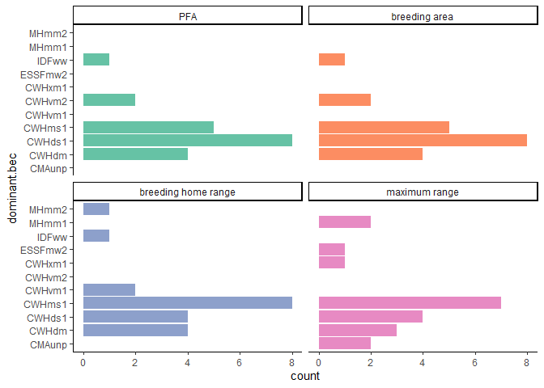

NW PLN
================

# Setup

### Sites

<table class="table" style="margin-left: auto; margin-right: auto;">

<thead>

<tr>

<th style="text-align:right;">

year

</th>

<th style="text-align:left;">

method

</th>

<th style="text-align:right;">

number of sites

</th>

</tr>

</thead>

<tbody>

<tr>

<td style="text-align:right;">

2019

</td>

<td style="text-align:left;">

camera + remains

</td>

<td style="text-align:right;">

6

</td>

</tr>

<tr>

<td style="text-align:right;">

2019

</td>

<td style="text-align:left;">

remains only

</td>

<td style="text-align:right;">

6

</td>

</tr>

<tr>

<td style="text-align:right;">

2020

</td>

<td style="text-align:left;">

camera + remains

</td>

<td style="text-align:right;">

8

</td>

</tr>

</tbody>

</table>

(But remember that the number of remains-only sites is still
incomplete.)

**Should I be switching back to a site-based (vs nest-based) approach
for at least some things?** This avoids double-counting sites that are
used in both years and is necessary for occupancy anyway.

### Scale

<table class="table" style="margin-left: auto; margin-right: auto;">

<thead>

<tr>

<th style="text-align:left;">

size

</th>

<th style="text-align:right;">

area

</th>

<th style="text-align:right;">

radius

</th>

</tr>

</thead>

<tbody>

<tr>

<td style="text-align:left;">

PFA

</td>

<td style="text-align:right;">

60.00

</td>

<td style="text-align:right;">

437.0194

</td>

</tr>

<tr>

<td style="text-align:left;">

breeding area

</td>

<td style="text-align:right;">

175.00

</td>

<td style="text-align:right;">

746.3527

</td>

</tr>

<tr>

<td style="text-align:left;">

breeding home range

</td>

<td style="text-align:right;">

3800.00

</td>

<td style="text-align:right;">

3477.8982

</td>

</tr>

<tr>

<td style="text-align:left;">

maximum range

</td>

<td style="text-align:right;">

32902.97

</td>

<td style="text-align:right;">

10233.9342

</td>

</tr>

</tbody>

</table>

#### **Where do these numbers come from?**

McClaren et al. (2005) uses 95% adaptive kernel estimates from 12
fledglings at 12 different nests over 2 years (6 per year) to estimate
the PFA size on Vancouver Island to be **59.2** +/- 16.1 **ha** (which I
round to 60 ha).

McClaren et al. (2015) generated PFA-sized buffers around known nests
and calculted the total area covered within each territory to get a 90th
percentile estimate of **175.2 ha** (which I round to 175 ha).

McClaren et al. (2015) gives the size of the breeding season home range
to be 3700 ha on Vancouver Island in one location and as 3745 ha in
another, but provides citations for neither number. Combing through all
of the references in that section yields Daust et al. 2010 (a workshop
proceedings) which gives the number 3800 ha, not 3700. Daust’s 3800 ha
citation points back to McClaren (he says 2003, but it appears to
actually be the 2005 report). Daust says this number comes from
inter-nest spacing of 7km; the actual number is **6.9** +/ 0.7 **km**.
This is the mean nearest-neighbor distance from 16 nest areas (territory
centroids, I think) from 9 years of data from the Woss research area on
Vancouver Island. According to my math, a radius of 3.5 km gives me an
area of 38.48 km^2, which does indeed produce an area of 3848 ha, very
close to Daust’s 3800 but a bit off from McClaren’s 3700.

#### **Who else has used this nested scales method?**

Finn et al. (2002) uses the nest area (39 ha), PFA (177 ha), and home
range (1886 ha) as scales for landscape analysis. McGrath et al. (2003)
uses a scale of 10, 30, 60, 83, 120, 150, and 170 ha which includes nest
area, nest stand, and several different conceptualizations of PFAs.
Bruggerman et al. (2014) also used nested scales around nests but I need
to double-check their radii. Daw & DeStefano (2001) used concentric
circles of 12, 24, 50, 120, and 170 ha, which correspond to nest
management areas for various regions or management areas for other
sensitive species. DeStefano et al (2006) used a 10-12 ha nest area,
120-240 ha PFA, and 1500-2100 ha foraging area. Donner et al (2013) use
200-m, 500-m, and 1000-m radii.

# Response variables

### Diet variables

<!-- -->

#### **Where do these numbers come from?**

Diet diversity calculated with Simpson’s Diversity Index using items
from both cameras and remains that were identified to genus or species.
**N = 15 sites** with an average of **36.6153846 items** per site.

Proportion squirrel calculated for **N = 15 sites** as the mass of items
from both cameras and remains that were identified to the genus
*Tamiasciurus* divided by the total mass delivered to the nest.

#### **Who else has used these diet quantification methods?**

Lewis et al (2006) used a modified form of the Simpson’s index and
standardized the value to account for different numbers of prey
categories between sites. Miller et al (2014) used an inverse Simpson’s
diversity index using only items identified to genus or species.

Miller et al (2014) used proportion of biomass that was mammalian out of
total biomass. Lewis et al (2006) went a slightly different route and
used the number of items that were birds or mammals.

<!-- -->

So far there doesn’t appear to be a drastic difference in diversity
between the two methods, but there is a dramatic difference in
proportion of squirrel biomass. But note the small and very different
sample sizes and that there is currently almost no overlap between
camera and remains-only sites. This wrinkle may iron out later.

Lewis et al (2004) tested for differences between methods using a linear
regression to test for differences in counts between prey categories
(ie, avian and mammalian) and also used Morisita’s index of similarity
to test for differences in prey species.

<!-- -->

### Productivity

<!-- -->

Currently productivity information is only available for the 6 camera
sites from 2019. Productivty will (hopefully) be available for the 2020
camera sites as well, making a total of **14 sites** with productivity
data.

Miller et al (2014) and Rogers et al (2006) both use productivity with
diet. Salafsky et al (2007) uses productivity with prey abundance.

### Occupancy

<!-- -->

No one seems to have used occupancy as a response variable for diet.
Finn et al (2002) does use occupancy as a response for landscape, but
classifies sites binomially as occupied or unoccupied. Due to the nature
of my data, almost all sites are, by default, “occupied” under Finn’s
definition. At any rate, their method doesn’t account for differing
habitat quality.

**How to actually use occupancy?** Finn’s yes/no classification seems
unhelpful. Percent occupied (n years occupied/n years surveyed) seems to
give too much weight to sites with only one years of surveys. **Maybe
percent occupied given at least some number of surveys?**

# Predictor variables

<table class="table" style="margin-left: auto; margin-right: auto;">

<thead>

<tr>

<th style="border-bottom:hidden" colspan="1">

</th>

<th style="border-bottom:hidden; padding-bottom:0; padding-left:3px;padding-right:3px;text-align: center; " colspan="3">

Variable

</th>

</tr>

<tr>

<th style="text-align:left;">

Metric

</th>

<th style="text-align:left;">

Forest type

</th>

<th style="text-align:left;">

Landcover

</th>

<th style="text-align:left;">

Habitat suitability

</th>

</tr>

</thead>

<tbody>

<tr grouplength="3">

<td colspan="4" style="border-bottom: 1px solid;">

<strong>Core area</strong>

</td>

</tr>

<tr>

<td style="text-align:left; padding-left: 2em;" indentlevel="1">

mean core area

</td>

<td style="text-align:left;">

</td>

<td style="text-align:left;">

x

</td>

<td style="text-align:left;">

x

</td>

</tr>

<tr>

<td style="text-align:left; padding-left: 2em;" indentlevel="1">

proportion core area (mature forest)

</td>

<td style="text-align:left;">

</td>

<td style="text-align:left;">

x

</td>

<td style="text-align:left;">

</td>

</tr>

<tr>

<td style="text-align:left; padding-left: 2em;" indentlevel="1">

proportion core area (suitable habitat)

</td>

<td style="text-align:left;">

</td>

<td style="text-align:left;">

</td>

<td style="text-align:left;">

x

</td>

</tr>

<tr grouplength="6">

<td colspan="4" style="border-bottom: 1px solid;">

<strong>Area and edge</strong>

</td>

</tr>

<tr>

<td style="text-align:left; padding-left: 2em;" indentlevel="1">

edge density

</td>

<td style="text-align:left;">

</td>

<td style="text-align:left;">

x

</td>

<td style="text-align:left;">

x

</td>

</tr>

<tr>

<td style="text-align:left; padding-left: 2em;" indentlevel="1">

edge density (suitable habitat)

</td>

<td style="text-align:left;">

</td>

<td style="text-align:left;">

</td>

<td style="text-align:left;">

x

</td>

</tr>

<tr>

<td style="text-align:left; padding-left: 2em;" indentlevel="1">

edge density (shrub and regen)

</td>

<td style="text-align:left;">

</td>

<td style="text-align:left;">

x

</td>

<td style="text-align:left;">

</td>

</tr>

<tr>

<td style="text-align:left; padding-left: 2em;" indentlevel="1">

proportion of landscape in class

</td>

<td style="text-align:left;">

</td>

<td style="text-align:left;">

x

</td>

<td style="text-align:left;">

x

</td>

</tr>

<tr>

<td style="text-align:left; padding-left: 2em;" indentlevel="1">

dominant class

</td>

<td style="text-align:left;">

x

</td>

<td style="text-align:left;">

</td>

<td style="text-align:left;">

</td>

</tr>

<tr>

<td style="text-align:left; padding-left: 2em;" indentlevel="1">

mean patch size

</td>

<td style="text-align:left;">

</td>

<td style="text-align:left;">

x

</td>

<td style="text-align:left;">

x

</td>

</tr>

<tr grouplength="8">

<td colspan="4" style="border-bottom: 1px solid;">

<strong>Aggregation</strong>

</td>

</tr>

<tr>

<td style="text-align:left; padding-left: 2em;" indentlevel="1">

cohesion (suitable habitat)

</td>

<td style="text-align:left;">

</td>

<td style="text-align:left;">

</td>

<td style="text-align:left;">

x

</td>

</tr>

<tr>

<td style="text-align:left; padding-left: 2em;" indentlevel="1">

cohesion (mature forest)

</td>

<td style="text-align:left;">

</td>

<td style="text-align:left;">

x

</td>

<td style="text-align:left;">

</td>

</tr>

<tr>

<td style="text-align:left; padding-left: 2em;" indentlevel="1">

mean nearest neighbor

</td>

<td style="text-align:left;">

</td>

<td style="text-align:left;">

x

</td>

<td style="text-align:left;">

x

</td>

</tr>

<tr>

<td style="text-align:left; padding-left: 2em;" indentlevel="1">

mean nearest neighbor (suitable habitat)

</td>

<td style="text-align:left;">

</td>

<td style="text-align:left;">

</td>

<td style="text-align:left;">

x

</td>

</tr>

<tr>

<td style="text-align:left; padding-left: 2em;" indentlevel="1">

mean nearest neighbor (mature forest)

</td>

<td style="text-align:left;">

</td>

<td style="text-align:left;">

x

</td>

<td style="text-align:left;">

</td>

</tr>

<tr>

<td style="text-align:left; padding-left: 2em;" indentlevel="1">

patch density

</td>

<td style="text-align:left;">

</td>

<td style="text-align:left;">

x

</td>

<td style="text-align:left;">

x

</td>

</tr>

<tr>

<td style="text-align:left; padding-left: 2em;" indentlevel="1">

contagion

</td>

<td style="text-align:left;">

x

</td>

<td style="text-align:left;">

x

</td>

<td style="text-align:left;">

x

</td>

</tr>

<tr>

<td style="text-align:left; padding-left: 2em;" indentlevel="1">

interspersion and juxtaposition index

</td>

<td style="text-align:left;">

x

</td>

<td style="text-align:left;">

x

</td>

<td style="text-align:left;">

x

</td>

</tr>

<tr grouplength="3">

<td colspan="4" style="border-bottom: 1px solid;">

<strong>Diversity</strong>

</td>

</tr>

<tr>

<td style="text-align:left; padding-left: 2em;" indentlevel="1">

patch richness density

</td>

<td style="text-align:left;">

x

</td>

<td style="text-align:left;">

x

</td>

<td style="text-align:left;">

x

</td>

</tr>

<tr>

<td style="text-align:left; padding-left: 2em;" indentlevel="1">

Simpson’s diversity index

</td>

<td style="text-align:left;">

x

</td>

<td style="text-align:left;">

x

</td>

<td style="text-align:left;">

x

</td>

</tr>

<tr>

<td style="text-align:left; padding-left: 2em;" indentlevel="1">

Simpson’s evenness index

</td>

<td style="text-align:left;">

x

</td>

<td style="text-align:left;">

x

</td>

<td style="text-align:left;">

x

</td>

</tr>

</tbody>

</table>

### Forest type

<!-- -->

<!-- -->

<!-- -->

<!-- -->

<!-- -->

#### **Where do these numbers come from?**

Dominant forest type is simply the forest type with the greatest area at
each given scale. Forest type diversity is calculated using Simpson’s
diversity index. Forest type richness is just the number of different
forest types present at each scale, relative to the scale area. (*there
is obviously something very wrong with the richness data*). This is
calculated for all sites from both methods **(N = 20)** so the number of
sites will increase as I finish processing remains.

#### **Who else has used these landscape variables?**

None, kind of. Lewis et al (2006) compared diet between “habitat types”
(hemlock- vs spruce-dominated stands). Salafsky et al (2007) examines
goshawk productivity and prey abundance between “forest types” (mixed
conifer vs ponderosa pine). These are all based strictly on what forest
type the nest is located in, not the overall type present in the
landscape. None have used diversity or richness of forest types.

**Would it simplify things to collapse dominant forest types into a few
categories?** (ie, western hemlock/mountain hemlock/douglas fir or maybe
something weird like dry/moist/ver moist or maritime/submaritime.) **And
does it really make sense to consider dominant forest type at different
scales?** Again, would it simplify things to only consider the forest
type of the nest stand?

### Landcover

<!-- -->

I won’t be using the amount of any particular class, but this visualizes
what the classes are and how they’re distributed. There are two
additional classes that are present in the landcover data but aren’t
present in any of the current sites: alpine and wetland. This is
calculated using all the sites with diet data so far (**n = 20 nests**).

<!-- -->

<!-- -->

<!-- -->

<!-- -->

#### **Where do these numbers come from?**

Diversity of landcover classes is calculated using Simpson’s diversity
index. Edge density is just edge density (all edges/landscape area \*
1000) (so it’s directly comparable between different sizes).
Interspersion is the interspersion and juxtaposition index, which is not
as sensitive to fragmentation as the contagion index. (**IJI requires at
least 3 classes to calculate, which is not always possible at the
smaller landscape scales. I converted these missing values to 0, which
may be very, very wrong.**) Amount of mature cover is the area of land
covered by mature and old growth conifer forest. (**Should this be
scaled by making it proportion of land covered by mature forest?**)

#### **Who else has used these landscape metrics?**

Finn et al (2002) used proportion of all landcover classes, along with
patch size, patch density, core size, edge density, patch shape, patch
richness, dominance index, and contrast. That’s a lot of things. McGrath
et al (2003) used contrast-weighted edge density (for structural stage),
contrast-weighted edge density (for canopy cover), mean nearest
neighbor, Simpson’s evenness (which would be equivalent to Finn et al’s
dominance index), and contagion.

Lots more NOGO landscape studies but I haven’t had a chance to add them
here. NSPOW would also be a useful comparison.

**Canopy cover may also be included but until I have my complete site
set I can’t determine whether I have sufficient data coverage to include
it.**

### Habitat suitability index

<!-- -->

<!-- -->

<!-- -->

#### **Where do these numbers come from?**

Amount suitable habitat is the area of land considered to be “moderate”
or “high” quality habitat. (**Again, should this be scaled as
proportion?**) Edge density is edge density, interspersion is the
interspersion and juxtaposition index just as for landcover (**with the
same sketchy decision to make NAs 0s**). HSI metrics are calculate with
the full site set, which is **n = 20 + unprocessed remains sites**.

#### **Who else has used these landscape metrics?**

These are really just the same as are being used for landcover classes.
Amount suitable habitat has been used in BC with this particular model
for model validation-y things. There’s probably more useful ideas from
looking at other modelling studies rather than treating this so much
like landcover.

### Geographic position

<!-- -->

Most NOGO studies have been over too small an area to incorporate
lat/lon and this is probably too small an area, too. But some NSPOW
papers (Zabel et al 1995? and others?) have noted a difference in diet
over latitude. Longitude in this case is a coarse measure of
“interiorness” which may be better captured by a different variable.

**Transition zone/coastal zone may do much better as a measure of
“interiorness”/“coastalness” but I need to check on
definitions/mapping because those are currently a bit unclear.**

<!-- -->

This plot show correlation for all landscape sizes (**should it be for
just one of them? The largest?**).

# Models

### Diet diversity models

  - diet diversity \~ forest type diversity
  - diet diversity \~ forest type richness
  - diet diversity \~ dominant forest type
  - diet diversity \~ land cover diversity
  - diet diversity \~ land cover interspersion
  - diet diversity \~ land cover edge density
  - diet diversity \~ HSI edge density
  - diet diversity \~ HSI interspersion
  - diet diversity \~ year (null)

Not modeled:

  - \~ amount mature forest
  - \~ amound suitable habitat
  - \~ geographic position (lat/lon)

Diet diversity \~ forest type diversity

    ## # A tibble: 4 x 7
    ##   size                r.squared adj.r.squared sigma statistic p.value    df
    ##   <chr>                   <dbl>         <dbl> <dbl>     <dbl>   <dbl> <int>
    ## 1 breeding area          0.259         0.177  0.144     3.15   0.110      2
    ## 2 breeding home range    0.303         0.225  0.140     3.91   0.0795     2
    ## 3 maximum range          0.471         0.412  0.122     8.02   0.0197     2
    ## 4 PFA                    0.0659       -0.0378 0.162     0.635  0.446      2

Diet diversity \~ forest type richness

    ## # A tibble: 4 x 7
    ##   size                r.squared adj.r.squared sigma statistic p.value    df
    ##   <chr>                   <dbl>         <dbl> <dbl>     <dbl>   <dbl> <int>
    ## 1 breeding area           0.276         0.196 0.143      3.43  0.0969     2
    ## 2 breeding home range     0.459         0.399 0.123      7.64  0.0220     2
    ## 3 maximum range           0.400         0.333 0.130      6.00  0.0368     2
    ## 4 PFA                     0.208         0.120 0.149      2.37  0.158      2

Diet diversity \~ dominant forest type

    ## # A tibble: 22 x 6
    ##    size                term               estimate std.error statistic p.value
    ##    <chr>               <chr>                 <dbl>     <dbl>     <dbl>   <dbl>
    ##  1 breeding area       (Intercept)           0.298     0.113     2.64   0.0386
    ##  2 breeding area       dominant.becCWHds1    0.210     0.138     1.52   0.180 
    ##  3 breeding area       dominant.becCWHms1    0.284     0.146     1.95   0.0987
    ##  4 breeding area       dominant.becCWHvm2    0.202     0.195     1.04   0.340 
    ##  5 breeding area       dominant.becIDFww     0.184     0.195     0.940  0.383 
    ##  6 breeding home range (Intercept)           0.298     0.106     2.81   0.0310
    ##  7 breeding home range dominant.becCWHds1    0.143     0.150     0.954  0.377 
    ##  8 breeding home range dominant.becCWHms1    0.281     0.126     2.24   0.0665
    ##  9 breeding home range dominant.becCWHvm1    0.202     0.184     1.10   0.313 
    ## 10 breeding home range dominant.becIDFww     0.184     0.184     1.00   0.356 
    ## # ... with 12 more rows

Diet diversity \~ landcover diversity

    ## # A tibble: 4 x 7
    ##   size                r.squared adj.r.squared sigma statistic p.value    df
    ##   <chr>                   <dbl>         <dbl> <dbl>     <dbl>   <dbl> <int>
    ## 1 breeding area         0.00575       -0.105  0.167    0.0520   0.825     2
    ## 2 breeding home range   0.0295        -0.0784 0.165    0.273    0.614     2
    ## 3 maximum range         0.126          0.0290 0.157    1.30     0.284     2
    ## 4 PFA                   0.0317        -0.0759 0.165    0.295    0.600     2

Diet diversity \~ landcover edge density

    ## # A tibble: 4 x 7
    ##   size                r.squared adj.r.squared sigma statistic p.value    df
    ##   <chr>                   <dbl>         <dbl> <dbl>     <dbl>   <dbl> <int>
    ## 1 breeding area         0.00124       -0.110  0.168    0.0112   0.918     2
    ## 2 breeding home range   0.0260        -0.0822 0.166    0.240    0.636     2
    ## 3 maximum range         0.130          0.0330 0.157    1.34     0.277     2
    ## 4 PFA                   0.00784       -0.102  0.167    0.0711   0.796     2

Diet diversity \~ landcover interspersion

    ## # A tibble: 4 x 7
    ##   size                r.squared adj.r.squared sigma statistic p.value    df
    ##   <chr>                   <dbl>         <dbl> <dbl>     <dbl>   <dbl> <int>
    ## 1 breeding area           0.147        0.0247 0.171      1.20   0.309     2
    ## 2 breeding home range     0.132        0.0359 0.156      1.37   0.272     2
    ## 3 maximum range           0.147        0.0523 0.155      1.55   0.244     2
    ## 4 PFA                     0.230        0.0760 0.174      1.49   0.276     2

    ## # A tibble: 4 x 7
    ##   size                r.squared adj.r.squared sigma statistic p.value    df
    ##   <chr>                   <dbl>         <dbl> <dbl>     <dbl>   <dbl> <int>
    ## 1 breeding area          0.259         0.177  0.144     3.15   0.110      2
    ## 2 breeding home range    0.303         0.225  0.140     3.91   0.0795     2
    ## 3 maximum range          0.471         0.412  0.122     8.02   0.0197     2
    ## 4 PFA                    0.0659       -0.0378 0.162     0.635  0.446      2

    ## # A tibble: 4 x 7
    ##   size                r.squared adj.r.squared  sigma statistic p.value    df
    ##   <chr>                   <dbl>         <dbl>  <dbl>     <dbl>   <dbl> <int>
    ## 1 breeding area           0.167       0.0479  0.0880     1.40   0.275      2
    ## 2 breeding home range     0.278       0.198   0.143      3.46   0.0956     2
    ## 3 maximum range           0.104       0.00410 0.159      1.04   0.334      2
    ## 4 PFA                     0.212      -0.575   0.128      0.270  0.695      2

Diet diversity \~ year (null)

    ## # A tibble: 4 x 7
    ##   size                r.squared adj.r.squared sigma statistic p.value    df
    ##   <chr>                   <dbl>         <dbl> <dbl>     <dbl>   <dbl> <int>
    ## 1 breeding area               0             0 0.159        NA      NA     1
    ## 2 breeding home range         0             0 0.159        NA      NA     1
    ## 3 maximum range               0             0 0.159        NA      NA     1
    ## 4 PFA                         0             0 0.159        NA      NA     1

    ##                                          Modnames K        AICc Delta_AICc
    ## 28                       ~ HSI interspersion: PFA 3 -25.1144536    0.00000
    ## 25             ~ HSI interspersion: breeding area 3  -9.6626189   15.45183
    ## 3           ~ forest type diversity maximum range 3  -7.8415876   17.27287
    ## 6     ~ forest type richness: breeding home range 3  -7.5972049   17.51725
    ## 7           ~ forest type richness: maximum range 3  -6.4532716   18.66118
    ## 2     ~ forest type diversity breeding home range 3  -4.8025927   20.31186
    ## 26       ~ HSI interspersion: breeding home range 3  -4.4181538   20.69630
    ## 5           ~ forest type richness: breeding area 3  -4.3907785   20.72368
    ## 1           ~ forest type diversity breeding area 3  -4.1381459   20.97631
    ## 8                     ~ forest type richness: PFA 3  -3.4061021   21.70835
    ## 23              ~ HSI edge density: maximum range 3  -3.1176800   21.99677
    ## 19       ~ landcover interspersion: maximum range 3  -2.5856300   22.52882
    ## 18 ~ landcover interspersion: breeding home range 3  -2.3965142   22.71794
    ## 15        ~ landcover edge density: maximum range 3  -2.3644006   22.75005
    ## 11          ~ land cover diversity: maximum range 3  -2.3189846   22.79547
    ## 27             ~ HSI interspersion: maximum range 3  -2.0399277   23.07453
    ## 4                     ~ forest type diversity PFA 3  -1.5862469   23.52821
    ## 12                    ~ land cover diversity: PFA 3  -1.1905411   23.92391
    ## 10    ~ land cover diversity: breeding home range 3  -1.1648670   23.94959
    ## 14  ~ landcover edge density: breeding home range 3  -1.1256445   23.98881
    ## 24                        ~ HSI edge density: PFA 3  -1.0356803   24.07877
    ## 16                  ~ landcover edge density: PFA 3  -0.9223984   24.19206
    ## 21              ~ HSI edge density: breeding area 3  -0.9002514   24.21420
    ## 9           ~ land cover diversity: breeding area 3  -0.8991953   24.21526
    ## 22        ~ HSI edge density: breeding home range 3  -0.8733212   24.24113
    ## 13        ~ landcover edge density: breeding area 3  -0.8494742   24.26498
    ## 17       ~ landcover interspersion: breeding area 3   2.3286957   27.44315
    ## 20                 ~ landcover interspersion: PFA 3   7.0514980   32.16595
    ##        ModelLik       AICcWt        LL    Cum.Wt
    ## 28 1.000000e+00 9.988522e-01  3.557227 0.9988522
    ## 25 4.412419e-04 4.407354e-04 10.231309 0.9992930
    ## 3  1.775190e-04 1.773152e-04  8.635080 0.9994703
    ## 6  1.571006e-04 1.569203e-04  8.512888 0.9996272
    ## 7  8.866982e-05 8.856804e-05  7.940922 0.9997158
    ## 2  3.884503e-05 3.880044e-05  7.115582 0.9997546
    ## 26 3.205203e-05 3.201524e-05  6.923363 0.9997866
    ## 5  3.161631e-05 3.158002e-05  6.909675 0.9998182
    ## 1  2.786459e-05 2.783261e-05  6.783359 0.9998460
    ## 8  1.932375e-05 1.930157e-05  6.417337 0.9998653
    ## 23 1.672867e-05 1.670946e-05  6.273126 0.9998820
    ## 19 1.282118e-05 1.280647e-05  6.007101 0.9998948
    ## 18 1.166439e-05 1.165100e-05  5.912543 0.9999065
    ## 15 1.147860e-05 1.146542e-05  5.896486 0.9999179
    ## 11 1.122088e-05 1.120800e-05  5.873778 0.9999291
    ## 27 9.759563e-06 9.748361e-06  5.734250 0.9999389
    ## 4  7.778840e-06 7.769911e-06  5.507409 0.9999466
    ## 12 6.382464e-06 6.375139e-06  5.309556 0.9999530
    ## 10 6.301056e-06 6.293824e-06  5.296719 0.9999593
    ## 14 6.178688e-06 6.171597e-06  5.277108 0.9999655
    ## 24 5.906916e-06 5.900136e-06  5.232126 0.9999714
    ## 16 5.581642e-06 5.575235e-06  5.175485 0.9999770
    ## 21 5.520174e-06 5.513838e-06  5.164411 0.9999825
    ## 9  5.517260e-06 5.510928e-06  5.163883 0.9999880
    ## 22 5.446343e-06 5.440092e-06  5.150946 0.9999934
    ## 13 5.381789e-06 5.375612e-06  5.139023 0.9999988
    ## 17 1.098489e-06 1.097229e-06  4.235652 0.9999999
    ## 20 1.035744e-07 1.034555e-07  3.474251 1.0000000

### Squirrel biomass models

  - proportion squirrel \~ dominant forest type
  - proportion squirrel \~ landcover diversity
  - proportion squirrel \~ landcover edge density
  - proportion squirrel \~ landcover interspersion
  - proportion squirrel \~ amount mature forest
  - proportion squirrel \~ amount suitable habitat
  - proportion squirrel \~ HSI edge density
  - proportion squirrel \~ HSI interspersion
  - proportion squirrel \~ year (null)

Not modeled:

  - \~ forest type diversity/richness
  - \~ geographic position (lat/lon)

Proportion squirrel \~ dominant forest type

    ## 
    ## Call:
    ## lm(formula = proportion.squirrel ~ dominant.bec, data = data)
    ## 
    ## Coefficients:
    ##        (Intercept)   dominant.becCWHdm  dominant.becCWHds1  dominant.becCWHms1  
    ##            0.76044            -0.06948            -0.22325            -0.28792  
    ## dominant.becCWHxm1   dominant.becIDFww  
    ##           -0.23597            -0.04298

    ## # A tibble: 8 x 7
    ##   size                term            df  sumsq meansq statistic p.value
    ##   <chr>               <chr>        <dbl>  <dbl>  <dbl>     <dbl>   <dbl>
    ## 1 breeding area       dominant.bec     3 0.0766 0.0255     0.281   0.838
    ## 2 breeding area       Residuals        5 0.455  0.0910    NA      NA    
    ## 3 breeding home range dominant.bec     3 0.154  0.0513     0.680   0.601
    ## 4 breeding home range Residuals        5 0.378  0.0755    NA      NA    
    ## 5 maximum range       dominant.bec     4 0.139  0.0347     0.354   0.831
    ## 6 maximum range       Residuals        4 0.393  0.0981    NA      NA    
    ## 7 PFA                 dominant.bec     3 0.0766 0.0255     0.281   0.838
    ## 8 PFA                 Residuals        5 0.455  0.0910    NA      NA

Proportion squirrel \~ landcover diversity

    ## # A tibble: 4 x 7
    ##   size                r.squared adj.r.squared sigma statistic p.value    df
    ##   <chr>                   <dbl>         <dbl> <dbl>     <dbl>   <dbl> <int>
    ## 1 breeding area         0.0933        -0.0362 0.262    0.720    0.424     2
    ## 2 breeding home range   0.00378       -0.139  0.275    0.0266   0.875     2
    ## 3 maximum range         0.00694       -0.135  0.275    0.0489   0.831     2
    ## 4 PFA                   0.0855        -0.0452 0.264    0.654    0.445     2

Proportion squirrel \~ landcover edge density

    ## # A tibble: 4 x 7
    ##   size                r.squared adj.r.squared sigma statistic p.value    df
    ##   <chr>                   <dbl>         <dbl> <dbl>     <dbl>   <dbl> <int>
    ## 1 breeding area         0.0123        -0.129  0.274    0.0874   0.776     2
    ## 2 breeding home range   0.00839       -0.133  0.274    0.0592   0.815     2
    ## 3 maximum range         0.104         -0.0240 0.261    0.812    0.397     2
    ## 4 PFA                   0.0437        -0.0930 0.269    0.320    0.590     2

Proportion squirrel \~ landcover interspersion

    ## # A tibble: 4 x 7
    ##   size                r.squared adj.r.squared sigma statistic p.value    df
    ##   <chr>                   <dbl>         <dbl> <dbl>     <dbl>   <dbl> <int>
    ## 1 breeding area         0.0933        -0.0362 0.262    0.720    0.424     2
    ## 2 breeding home range   0.00378       -0.139  0.275    0.0266   0.875     2
    ## 3 maximum range         0.00694       -0.135  0.275    0.0489   0.831     2
    ## 4 PFA                   0.0855        -0.0452 0.264    0.654    0.445     2

Proportion squirrel \~ amount mature cover

    ## # A tibble: 4 x 7
    ##   size                r.squared adj.r.squared sigma statistic p.value    df
    ##   <chr>                   <dbl>         <dbl> <dbl>     <dbl>   <dbl> <int>
    ## 1 breeding area        0.397          0.0960  0.345  1.32       0.370     2
    ## 2 breeding home range  0.129          0.00455 0.257  1.04       0.343     2
    ## 3 maximum range        0.120         -0.00573 0.258  0.954      0.361     2
    ## 4 PFA                  0.000439      -0.999   0.476  0.000439   0.987     2

Proportion squirrel \~ amount.suitable

    ## # A tibble: 4 x 7
    ##   size                r.squared adj.r.squared sigma statistic p.value    df
    ##   <chr>                   <dbl>         <dbl> <dbl>     <dbl>   <dbl> <int>
    ## 1 breeding area        0.000405       -0.200  0.282  0.00203    0.966     2
    ## 2 breeding home range  0.0861         -0.0444 0.263  0.660      0.443     2
    ## 3 maximum range        0.116          -0.0107 0.259  0.916      0.371     2
    ## 4 PFA                  0.000246       -0.500  0.350  0.000492   0.984     2

Proportion squirrel \~ HSI edge density

    ## # A tibble: 4 x 7
    ##   size                r.squared adj.r.squared sigma statistic p.value    df
    ##   <chr>                   <dbl>         <dbl> <dbl>     <dbl>   <dbl> <int>
    ## 1 breeding area         0.00646       -0.135  0.275    0.0455   0.837     2
    ## 2 breeding home range   0.0224        -0.117  0.272    0.160    0.701     2
    ## 3 maximum range         0.0819        -0.0492 0.264    0.625    0.455     2
    ## 4 PFA                   0.0172        -0.123  0.273    0.122    0.737     2

Proportion squirrel \~ HSI interspersion

    ## # A tibble: 4 x 7
    ##   size                r.squared adj.r.squared   sigma statistic p.value    df
    ##   <chr>                   <dbl>         <dbl>   <dbl>     <dbl>   <dbl> <int>
    ## 1 breeding area          0.354         0.225    0.243     2.74    0.158     2
    ## 2 breeding home range    0.0323       -0.106    0.271     0.234   0.643     2
    ## 3 maximum range          0.0434       -0.0933   0.270     0.318   0.591     2
    ## 4 PFA                    1           NaN      NaN       NaN     NaN         2

Proportion squirrel \~ year (null)

AIC

    ##                                             Modnames K       AICc Delta_AICc
    ## 1               ~ landcover diversity: breeding area 3   9.996202        Inf
    ## 2         ~ landcover diversity: breeding home range 3  10.843749        Inf
    ## 3               ~ landcover diversity: maximum range 3  10.815177        Inf
    ## 4                         ~ landcover diversity: PFA 3  10.073639        Inf
    ## 5            ~ landcover edge density: breeding area 3  10.766166        Inf
    ## 6      ~ landcover edge density: breeding home range 3  10.801994        Inf
    ## 7            ~ landcover edge density: maximum range 3   9.889823        Inf
    ## 8                      ~ landcover edge density: PFA 3  10.476043        Inf
    ## 9           ~ landcover interspersion: breeding area 3  14.500627        Inf
    ## 10    ~ landcover interspersion: breeding home range 3  10.700069        Inf
    ## 11          ~ landcover interspersion: maximum range 3  10.384906        Inf
    ## 12                    ~ landcover interspersion: PFA 3  17.557187        Inf
    ## 13       ~ amount mature forest cover: breeding area 3        Inf        Inf
    ## 14 ~ amount mature forest cover: breeding home range 3   9.634955        Inf
    ## 15       ~ amount mature forest cover: maximum range 3   9.727468        Inf
    ## 16                 ~ amount mature forest cover: PFA 3 -17.237551        Inf
    ## 17          ~ amount suitable habitat: breeding area 3  13.780400        Inf
    ## 18    ~ amount suitable habitat: breeding home range 3  10.067394        Inf
    ## 19          ~ amount suitable habitat: maximum range 3   9.771474        Inf
    ## 20                    ~ amount suitable habitat: PFA 3        Inf        Inf
    ## 21                 ~ hsi edge density: breeding area 3  10.819455        Inf
    ## 22           ~ hsi edge density: breeding home range 3  10.674027        Inf
    ## 23                 ~ hsi edge density: maximum range 3  10.108591        Inf
    ## 24                           ~ hsi edge density: PFA 3  10.722058        Inf
    ## 25          ~ amount suitable habitat: breeding area 3  11.693263        Inf
    ## 26    ~ amount suitable habitat: breeding home range 3  10.582171        Inf
    ## 27          ~ amount suitable habitat: maximum range 3  10.478501        Inf
    ## 28                    ~ amount suitable habitat: PFA 3       -Inf        NaN
    ##    ModelLik AICcWt            LL Cum.Wt
    ## 1         0    NaN  0.4018991134    NaN
    ## 2         0    NaN -0.0218742953    NaN
    ## 3         0    NaN -0.0075886225    NaN
    ## 4         0    NaN  0.3631803107    NaN
    ## 5         0    NaN  0.0169168451    NaN
    ## 6         0    NaN -0.0009968433    NaN
    ## 7         0    NaN  0.4550885815    NaN
    ## 8         0    NaN  0.1619782753    NaN
    ## 9         0    NaN -0.2503132983    NaN
    ## 10        0    NaN  0.0499652972    NaN
    ## 11        0    NaN  0.2075467535    NaN
    ## 12        0    NaN  0.2214065377    NaN
    ## 13        0    NaN -0.0363022759    NaN
    ## 14        0    NaN  0.5825223047    NaN
    ## 15        0    NaN  0.5362659332    NaN
    ## 16        0    NaN -0.3812246250    NaN
    ## 17        0    NaN  0.1098000983    NaN
    ## 18        0    NaN  0.3663028798    NaN
    ## 19        0    NaN  0.5142628431    NaN
    ## 20        0    NaN -0.0940610869    NaN
    ## 21        0    NaN -0.0097276880    NaN
    ## 22        0    NaN  0.0629866262    NaN
    ## 23        0    NaN  0.3457046220    NaN
    ## 24        0    NaN  0.0389709373    NaN
    ## 25        0    NaN  1.1533684682    NaN
    ## 26        0    NaN  0.1089147122    NaN
    ## 27        0    NaN  0.1607495357    NaN
    ## 28      NaN    NaN           Inf    NaN

### Productivity models

  - productivity \~ diet diversity
  - productivity \~ proportion squirrel
  - productivity \~ amount suitable habitat
  - productivity \~ geographic position
  - productivity \~ year (null)

Productivity \~ diet diversity

    ## # A tibble: 4 x 7
    ##   size                r.squared adj.r.squared sigma statistic p.value    df
    ##   <chr>                   <dbl>         <dbl> <dbl>     <dbl>   <dbl> <int>
    ## 1 breeding area           0.420         0.276 0.879      2.90   0.164     2
    ## 2 breeding home range     0.420         0.276 0.879      2.90   0.164     2
    ## 3 maximum range           0.420         0.276 0.879      2.90   0.164     2
    ## 4 PFA                     0.420         0.276 0.879      2.90   0.164     2

Productivity \~ proportion squirrel

    ## # A tibble: 4 x 7
    ##   size                r.squared adj.r.squared sigma statistic p.value    df
    ##   <chr>                   <dbl>         <dbl> <dbl>     <dbl>   <dbl> <int>
    ## 1 breeding area           0.837         0.796 0.467      20.5  0.0106     2
    ## 2 breeding home range     0.837         0.796 0.467      20.5  0.0106     2
    ## 3 maximum range           0.837         0.796 0.467      20.5  0.0106     2
    ## 4 PFA                     0.837         0.796 0.467      20.5  0.0106     2

Productivity \~ amount suitable habitat

    ## # A tibble: 4 x 7
    ##   size                r.squared adj.r.squared  sigma statistic p.value    df
    ##   <chr>                   <dbl>         <dbl>  <dbl>     <dbl>   <dbl> <int>
    ## 1 breeding area          0.0206       -0.469    1.16    0.0421   0.856     2
    ## 2 breeding home range    0.138        -0.0769   1.07    0.643    0.468     2
    ## 3 maximum range          0.0874       -0.141    1.10    0.383    0.569     2
    ## 4 PFA                    0             0      NaN      NA       NA         1

Productivity \~ latitude

    ## # A tibble: 4 x 7
    ##   size                r.squared adj.r.squared sigma statistic p.value    df
    ##   <chr>                   <dbl>         <dbl> <dbl>     <dbl>   <dbl> <int>
    ## 1 breeding area          0.0151        -0.231  1.15    0.0611   0.817     2
    ## 2 breeding home range    0.0151        -0.231  1.15    0.0611   0.817     2
    ## 3 maximum range          0.0151        -0.231  1.15    0.0611   0.817     2
    ## 4 PFA                    0.0151        -0.231  1.15    0.0611   0.817     2

Productivity \~ longitude

    ## # A tibble: 4 x 7
    ##   size                r.squared adj.r.squared sigma statistic p.value    df
    ##   <chr>                   <dbl>         <dbl> <dbl>     <dbl>   <dbl> <int>
    ## 1 breeding area           0.368         0.210 0.918      2.33   0.202     2
    ## 2 breeding home range     0.368         0.210 0.918      2.33   0.202     2
    ## 3 maximum range           0.368         0.210 0.918      2.33   0.202     2
    ## 4 PFA                     0.368         0.210 0.918      2.33   0.202     2

Productivity \~ lat & lon

    ## # A tibble: 4 x 7
    ##   size                r.squared adj.r.squared sigma statistic p.value    df
    ##   <chr>                   <dbl>         <dbl> <dbl>     <dbl>   <dbl> <int>
    ## 1 breeding area           0.747         0.368 0.821      1.97   0.354     4
    ## 2 breeding home range     0.747         0.368 0.821      1.97   0.354     4
    ## 3 maximum range           0.747         0.368 0.821      1.97   0.354     4
    ## 4 PFA                     0.747         0.368 0.821      1.97   0.354     4

Productivity \~ year

    ##                                          Modnames K     AICc Delta_AICc
    ## 1                 ~ diet diversity: breeding area 3 31.04778        Inf
    ## 2           ~ diet diversity: breeding home range 3 31.04778        Inf
    ## 3                 ~ diet diversity: maximum range 3 31.04778        Inf
    ## 4                           ~ diet diversity: PFA 3 31.04778        Inf
    ## 5            ~ proportion squirrel: breeding area 3 23.45202        Inf
    ## 6      ~ proportion squirrel: breeding home range 3 23.45202        Inf
    ## 7            ~ proportion squirrel: maximum range 3 23.45202        Inf
    ## 8                      ~ proportion squirrel: PFA 3 23.45202        Inf
    ## 9        ~ amount suitable habitat: breeding area 3      Inf        Inf
    ## 10 ~ amount suitable habitat: breeding home range 3 33.42644        Inf
    ## 11       ~ amount suitable habitat: maximum range 3 33.77189        Inf
    ## 13                           ~ lat: breeding area 3 34.22955        Inf
    ## 14                     ~ lat: breeding home range 3 34.22955        Inf
    ## 15                           ~ lat: maximum range 3 34.22955        Inf
    ## 16                                     ~ lat: PFA 3 34.22955        Inf
    ## 17                           ~ lon: breeding area 3 31.56846        Inf
    ## 18                     ~ lon: breeding home range 3 31.56846        Inf
    ## 19                           ~ lon: maximum range 3 31.56846        Inf
    ## 20                                     ~ lon: PFA 3 31.56846        Inf
    ## 21                     ~ lat & lon: breeding area 5      Inf        Inf
    ## 22               ~ lat & lon: breeding home range 5      Inf        Inf
    ## 23                     ~ lat & lon: maximum range 5      Inf        Inf
    ## 24                               ~ lat & lon: PFA 5      Inf        Inf
    ## 12                 ~ amount suitable habitat: PFA 2     -Inf        NaN
    ##    ModelLik AICcWt        LL Cum.Wt
    ## 1         0    NaN -6.523889    NaN
    ## 2         0    NaN -6.523889    NaN
    ## 3         0    NaN -6.523889    NaN
    ## 4         0    NaN -6.523889    NaN
    ## 5         0    NaN -2.726010    NaN
    ## 6         0    NaN -2.726010    NaN
    ## 7         0    NaN -2.726010    NaN
    ## 8         0    NaN -2.726010    NaN
    ## 9         0    NaN -4.884729    NaN
    ## 10        0    NaN -7.713222    NaN
    ## 11        0    NaN -7.885943    NaN
    ## 13        0    NaN -8.114774    NaN
    ## 14        0    NaN -8.114774    NaN
    ## 15        0    NaN -8.114774    NaN
    ## 16        0    NaN -8.114774    NaN
    ## 17        0    NaN -6.784229    NaN
    ## 18        0    NaN -6.784229    NaN
    ## 19        0    NaN -6.784229    NaN
    ## 20        0    NaN -6.784229    NaN
    ## 21        0    NaN -4.033307    NaN
    ## 22        0    NaN -4.033307    NaN
    ## 23        0    NaN -4.033307    NaN
    ## 24        0    NaN -4.033307    NaN
    ## 12      NaN    NaN       Inf    NaN

### Occupancy models
