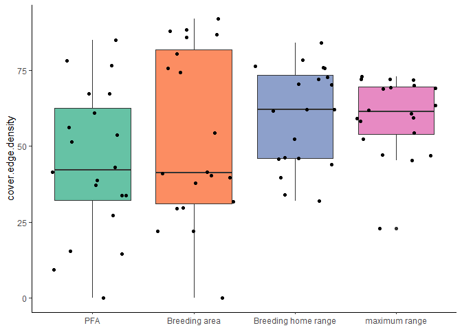
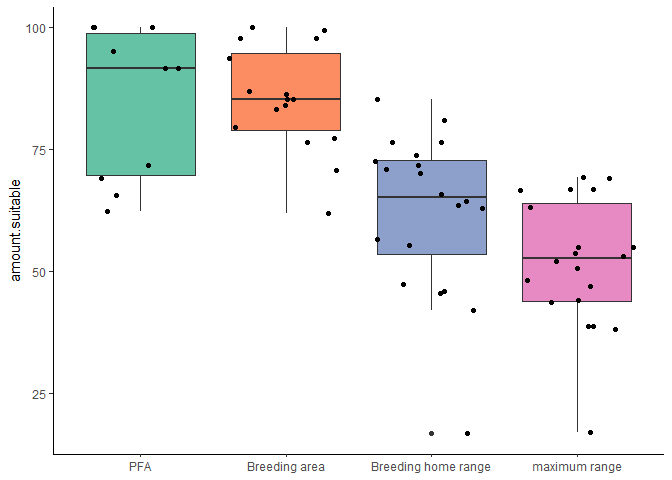

NW PLN
================

# Setup

### Sites

<table class="table" style="margin-left: auto; margin-right: auto;">

<thead>

<tr>

<th style="text-align:right;">

year

</th>

<th style="text-align:left;">

method

</th>

<th style="text-align:right;">

number of sites

</th>

</tr>

</thead>

<tbody>

<tr>

<td style="text-align:right;">

2019

</td>

<td style="text-align:left;">

camera + remains

</td>

<td style="text-align:right;">

6

</td>

</tr>

<tr>

<td style="text-align:right;">

2019

</td>

<td style="text-align:left;">

remains only

</td>

<td style="text-align:right;">

6

</td>

</tr>

<tr>

<td style="text-align:right;">

2020

</td>

<td style="text-align:left;">

camera + remains

</td>

<td style="text-align:right;">

8

</td>

</tr>

</tbody>

</table>

(But remember that the number of remains-only sites is still
incomplete.)

### Scale

<table class="table" style="margin-left: auto; margin-right: auto;">

<thead>

<tr>

<th style="text-align:left;">

size

</th>

<th style="text-align:right;">

area

</th>

<th style="text-align:right;">

radius

</th>

</tr>

</thead>

<tbody>

<tr>

<td style="text-align:left;">

PFA

</td>

<td style="text-align:right;">

60.00

</td>

<td style="text-align:right;">

437.0194

</td>

</tr>

<tr>

<td style="text-align:left;">

breeding area

</td>

<td style="text-align:right;">

175.00

</td>

<td style="text-align:right;">

746.3527

</td>

</tr>

<tr>

<td style="text-align:left;">

breeding home range

</td>

<td style="text-align:right;">

3800.00

</td>

<td style="text-align:right;">

3477.8982

</td>

</tr>

<tr>

<td style="text-align:left;">

maximum range

</td>

<td style="text-align:right;">

32902.97

</td>

<td style="text-align:right;">

10233.9342

</td>

</tr>

</tbody>

</table>

#### **Where do these numbers come from?**

McClaren et al. (2005) uses 95% adaptive kernel estimates from 12
fledglings at 12 different nests over 2 years (6 per year) to estimate
the PFA size on Vancouver Island to be **59.2** +/- 16.1 **ha** (which I
round to 60 ha).

McClaren et al. (2015) generated PFA-sized buffers around known nests
and calculted the total area covered within each territory to get a 90th
percentile estimate of **175.2 ha** (which I round to 175 ha).

McClaren et al. (2015) gives the size of the breeding season home range
to be 3700 ha on Vancouver Island in one location and as 3745 ha in
another, but provides citations for neither number. Combing through all
of the references in that section yields Daust et al. 2010 (a workshop
proceedings) which gives the number 3800 ha, not 3700. Daust’s 3800 ha
citation points back to McClaren (he says 2003, but it appears to
actually be the 2005 report). Daust says this number comes from
inter-nest spacing of 7km; the actual number is **6.9** +/ 0.7 **km**.
This is the mean nearest-neighbor distance from 16 nest areas (territory
centroids, I think) from 9 years of data from the Woss research area on
Vancouver Island. According to my math, a radius of 3.5 km gives me an
area of 38.48 km^2, which does indeed produce an area of 3848 ha, very
close to Daust’s 3800 but a bit off from McClaren’s 3700.

#### **Who else has used this nested scales method?**

Finn et al. (2002) uses the nest area (39 ha), PFA (177 ha), and home
range (1886 ha) as scales for landscape analysis. McGrath et al. (2003)
uses a scale of 10, 30, 60, 83, 120, 150, and 170 ha which includes nest
area, nest stand, and several different conceptualizations of PFAs.
Bruggerman et al. (2014) also used nested scales around nests but I need
to double-check their radii.

# Response variables

### Diet variables

<!-- -->

#### **Where do these numbers come from?**

Diet diversity calculated with Simpson’s Diversity Index using items
from both cameras and remains that were identified to genus or species.
**N = 13 sites** with an average of **36.6153846 items** per site.

Proportion squirrel calculated for **N = 13 sites** as the mass of items
from both cameras and remains that were identified to the genus
*Tamiasciurus* divided by the total mass delivered to the nest.

#### **Who else has used these diet quantification methods?**

Lewis et al (2006) used a modified form of the Simpson’s index and
standardized the value to account for different numbers of prey
categories between sites. Miller et al (2014) used an inverse Simpson’s
diversity index using only items identified to genus or species.

Miller et al (2014) used propotion of biomass that was mammalian out of
total biomass. Lewis et al (2006) went a slightly different route and
used the number of items that were birds or mammals.

<!-- -->

So far there doesn’t appear to be a drastic difference in diversity
between the two methods, but there is a dramatic difference in
proportion of squirrel biomass. But note the small and very different
sample sizes and that there is currently almost no overlap between
camera and remains-only sites. This wrinkle may iron out later.

Lewis et al (2004) tested for differences between methods using a linear
regression to test for differences in counts between prey categories
(ie, avian and mammalian) and also used Morisita’s index of similarity
to test for differences in prey species.

### Productivity

<!-- -->

Currently productivity information is only available for the 6 camera
sites from 2019. Productivty will (hopefully) be available for the 2020
camera sites as well, making a total of **14 sites** with productivity
data.

Miller et al (2014) and Rogers et al (2006) both use productivity with
diet. Salafsky et al (2007) uses productivity with prey abundance.

### Occupancy

<!-- -->

No one seems to have used occupancy as a response variable for diet.
Finn et al (2002) does use occupancy as a response for landscape, but
classifies sites binomially as occupied or unoccupied. Due to the nature
of my data, almost all sites are, by default, “occupied” under Finn’s
definition. At any rate, their method doesn’t account for differing
habitat quality.

**How to actually use occupancy?** Finn’s yes/no classification seems
unhelpful. Percent occupied (n years occupied/n years surveyed) seems to
give too much weight to sites with only one years of surveys. **Maybe
percent occupied given at least some number of surveys?**

# Predictor variables

### Forest type

<!-- -->

<!-- -->

<!-- -->

#### **Where do these numbers come from?**

Dominant forest type is simply the forest type with the greatest area at
each given scale. Forest type diversity is calculated using Simpson’s
diversity index. Forest type richness is just the number of different
forest types present at each scale (*there is obviously something very
wrong with the richness data at the breeding home range scale*). This is
calculated for all sites from both methods **(N = 20)** so the number of
sites will increase as I finish processing remains.

#### **Who else has used these landscape variables?**

None, kind of. Lewis et al (2006) compared diet between “habitat types”
(hemlock- vs spruce-dominated stands). Salafsky et al (2007) examines
goshawk productivity and prey abundance between “forest types” (mixed
conifer vs ponderosa pine). These are all based strictly on what forest
type the nest is located in, not the overall type present in the
landscape. None have used diversity or richness of forest types.

**Would it simplify things to collapse dominant forest types into a few
categories?** (ie, western hemlock/mountain hemlock/douglas fir or maybe
something weird like dry/moist/ver moist or maritime/submaritime.) **And
does it really make sense to consider dominant forest type at different
scales?** Again, would it simplify things to only consider the forest
type of the nest stand?

### Landcover

<!-- -->

I won’t be using the amount of any particular class, but this visualizes
what the classes are and how they’re distributed. There are two
additional classes that are present in the landcover data but aren’t
present in any of the current sites: alpine and wetland. This is
currently calculated only using the 2019 camera sites (**n = 6 sites**)
because that’s the landcover data I currently have prepared, but will
later be calculated using the full site set (**n = 20 + unprocessed
remains sites**).

<!-- -->

<!-- -->

<!-- -->

<!-- -->

#### **Where do these numbers come from?**

Diversity of landcover classes is calculated using Simpson’s diversity
index. Edge density is just edge density (all edges/landscape area \*
1000) (so it’s directly comparable between different sizes).
Interspersion is the interspersion and juxtaposition index, which is not
as sensitive to fragmentation as the contagion index. (**IJI requires at
least 3 classes to calculate, which is not always possible at the
smaller landscape scales. I converted these missing values to 0, which
may be very, very wrong.**) Amount of mature cover is the area of land
covered by mature and old growth conifer forest. (**Should this be
scaled by making it proportion of land covered by mature forest?**)

#### **Who else has used these landscape metrics?**

Finn et al (2002) used proportion of all landcover classes, along with
patch size, patch density, core size, edge density, patch shape, patch
richness, dominance index, and contrast. That’s a lot of things. McGrath
et al (2003) used contrast-weighted edge density (for structural stage),
contrast-weighted edge density (for canopy cover), mean nearest
neighbor, Simpson’s evenness (which would be equivalent to Finn et al’s
dominance index), and contagion.

Lots more NOGO landscape studies but I haven’t had a chance to add them
here. NSPOW would also be a useful comparison.

**Canopy cover may also be included but until I have my complete site
set I can’t determine whether I have sufficient data coverage to include
it.**

### Habitat suitability index

<!-- -->

<!-- -->

<!-- -->

#### **Where do these numbers come from?**

Amount suitable habitat is the area of land considered to be “moderate”
or “high” quality habitat. (**Again, should this be scaled as
proportion?**) Edge density is edge density, interspersion is the
interspersion and juxtaposition index just as for landcover (**with the
same sketchy decision to make NAs 0s**). HSI metrics are calculate with
the full site set, which is **n = 20 + unprocessed remains sites**.

#### **Who else has used these landscape metrics?**

These are really just the same as are being used for landcover classes.
Amount suitable habitat has been used in BC with this particular model
for model validation-y things. There’s probably more useful ideas from
looking at other modelling studies rather than treating this so much
like landcover.

### Geographic position

<!-- -->

Most NOGO studies have been over too small an area to incorporate
lat/lon and this is probably too small an area, too. But some NSPOW
papers (Zabel et al 1995? and others?) have noted a difference in diet
over latitude. Longitude in this case is a coarse measure of
“interiorness” which may be better captured by a different variable.

**Transition zone/coastal zone may do much better as a measure of
“interiorness”/“coastalness” but I need to check on
definitions/mapping because those are currently a bit unclear.**

    ## # A tibble: 20 x 2
    ##    nest     year
    ##    <chr>   <dbl>
    ##  1 BKH2019  2019
    ##  2 DGC2019  2019
    ##  3 MPT2019  2019
    ##  4 MTC2019  2019
    ##  5 MTF2019  2019
    ##  6 PCR2019  2019
    ##  7 PNC2019  2019
    ##  8 RLK2019  2019
    ##  9 TCR2019  2019
    ## 10 TMC2019  2019
    ## 11 UTZ2019  2019
    ## 12 WRA2019  2019
    ## 13 FMT2020  2020
    ## 14 GOW2020  2020
    ## 15 GRV2020  2020
    ## 16 MTF2020  2020
    ## 17 PCR2020  2020
    ## 18 PNC2020  2020
    ## 19 RLK2020  2020
    ## 20 SVT2020  2020

<!-- -->

This plot show correlation for all landscape sized but only for the 2019
camera sites (since the other sites are currently missing landcover
data).

# Models

### Diet diversity models

  - diet diversity \~ forest type diversity
  - diet diversity \~ forest type richness
  - diet diversity \~ dominant forest type
  - diet diversity \~ land cover diversity
  - diet diversity \~ land cover interspersion
  - diet diversity \~ land cover edge density
  - diet diversity \~ HSI edge density
  - diet diversity \~ HSI interspersion
  - diet diversity \~ year (null)

Not modeled:

  - \~ amount mature forest
  - \~ amound suitable habitat
  - \~ geographic position (lat/lon)

Diet diversity \~ forest type diversity

    ## # A tibble: 4 x 7
    ##   size                r.squared adj.r.squared sigma statistic p.value    df
    ##   <chr>                   <dbl>         <dbl> <dbl>     <dbl>   <dbl> <int>
    ## 1 breeding area          0.351         0.304  0.156      7.56 0.0157      2
    ## 2 breeding home range    0.399         0.356  0.151      9.29 0.00868     2
    ## 3 maximum range          0.476         0.438  0.141     12.7  0.00312     2
    ## 4 PFA                    0.0820        0.0165 0.186      1.25 0.282       2

Diet diversity \~ forest type richness

    ## # A tibble: 4 x 7
    ##   size                r.squared adj.r.squared sigma statistic p.value    df
    ##   <chr>                   <dbl>         <dbl> <dbl>     <dbl>   <dbl> <int>
    ## 1 breeding area           0.370         0.324 0.154      8.20 0.0125      2
    ## 2 breeding home range     0.531         0.497 0.133     15.8  0.00137     2
    ## 3 maximum range           0.408         0.366 0.149      9.64 0.00775     2
    ## 4 PFA                     0.268         0.216 0.166      5.12 0.0401      2

Diet diversity \~ dominant forest type

    ## # A tibble: 23 x 6
    ##    size                term               estimate std.error statistic p.value
    ##    <chr>               <chr>                 <dbl>     <dbl>     <dbl>   <dbl>
    ##  1 breeding area       (Intercept)           0.224    0.0902      2.48 0.0304 
    ##  2 breeding area       dominant.becCWHds1    0.333    0.110       3.01 0.0118 
    ##  3 breeding area       dominant.becCWHms1    0.338    0.119       2.83 0.0164 
    ##  4 breeding area       dominant.becCWHvm2    0.276    0.143       1.93 0.0791 
    ##  5 breeding area       dominant.becIDFww     0.257    0.180       1.43 0.181  
    ##  6 breeding home range (Intercept)           0.224    0.0866      2.59 0.0270 
    ##  7 breeding home range dominant.becCWHds1    0.217    0.137       1.58 0.144  
    ##  8 breeding home range dominant.becCWHms1    0.377    0.103       3.64 0.00451
    ##  9 breeding home range dominant.becCWHvm1    0.276    0.137       2.02 0.0714 
    ## 10 breeding home range dominant.becIDFww     0.257    0.173       1.49 0.168  
    ## # ... with 13 more rows

Diet diversity \~ landcover diversity

    ## # A tibble: 4 x 7
    ##   size                r.squared adj.r.squared sigma statistic p.value    df
    ##   <chr>                   <dbl>         <dbl> <dbl>     <dbl>   <dbl> <int>
    ## 1 breeding area          0.0136       -0.233  0.227    0.0551   0.826     2
    ## 2 breeding home range    0.156        -0.0552 0.210    0.738    0.439     2
    ## 3 maximum range          0.298         0.123  0.191    1.70     0.262     2
    ## 4 PFA                    0.0137       -0.233  0.227    0.0555   0.825     2

Diet diversity \~ landcover edge density

    ## # A tibble: 4 x 7
    ##   size                r.squared adj.r.squared sigma statistic p.value    df
    ##   <chr>                   <dbl>         <dbl> <dbl>     <dbl>   <dbl> <int>
    ## 1 breeding area       0.0000418       -0.250  0.228  0.000167   0.990     2
    ## 2 breeding home range 0.0473          -0.191  0.223  0.199      0.679     2
    ## 3 maximum range       0.135           -0.0807 0.212  0.627      0.473     2
    ## 4 PFA                 0.00539         -0.243  0.228  0.0217     0.890     2

Diet diversity \~ landcover interspersion

    ## # A tibble: 4 x 7
    ##   size                r.squared adj.r.squared sigma statistic p.value    df
    ##   <chr>                   <dbl>         <dbl> <dbl>     <dbl>   <dbl> <int>
    ## 1 breeding area           0.278        0.0974 0.194     1.54   0.283      2
    ## 2 breeding home range     0.321        0.152  0.188     1.89   0.241      2
    ## 3 maximum range           0.163       -0.0458 0.209     0.781  0.427      2
    ## 4 PFA                     0.666        0.583  0.132     7.98   0.0476     2

    ## # A tibble: 4 x 7
    ##   size                r.squared adj.r.squared sigma statistic p.value    df
    ##   <chr>                   <dbl>         <dbl> <dbl>     <dbl>   <dbl> <int>
    ## 1 breeding area          0.351         0.304  0.156      7.56 0.0157      2
    ## 2 breeding home range    0.399         0.356  0.151      9.29 0.00868     2
    ## 3 maximum range          0.476         0.438  0.141     12.7  0.00312     2
    ## 4 PFA                    0.0820        0.0165 0.186      1.25 0.282       2

    ## # A tibble: 4 x 7
    ##   size                r.squared adj.r.squared sigma statistic p.value    df
    ##   <chr>                   <dbl>         <dbl> <dbl>     <dbl>   <dbl> <int>
    ## 1 breeding area          0.286        0.235   0.164     5.62   0.0327     2
    ## 2 breeding home range    0.210        0.154   0.173     3.72   0.0741     2
    ## 3 maximum range          0.0578      -0.00948 0.188     0.859  0.370      2
    ## 4 PFA                    0.211        0.155   0.172     3.74   0.0734     2

Diet diversity \~ year (null)

    ## # A tibble: 4 x 7
    ##   size                r.squared adj.r.squared sigma statistic p.value    df
    ##   <chr>                   <dbl>         <dbl> <dbl>     <dbl>   <dbl> <int>
    ## 1 breeding area          0.0104       -0.0603 0.193     0.147   0.707     2
    ## 2 breeding home range    0.0104       -0.0603 0.193     0.147   0.707     2
    ## 3 maximum range          0.0104       -0.0603 0.193     0.147   0.707     2
    ## 4 PFA                    0.0104       -0.0603 0.193     0.147   0.707     2

    ##                                          Modnames K       AICc Delta_AICc
    ## 6     ~ forest type richness: breeding home range 3 -13.283855   0.000000
    ## 3           ~ forest type diversity maximum range 3 -11.504900   1.778955
    ## 7           ~ forest type richness: maximum range 3  -9.561206   3.722649
    ## 2     ~ forest type diversity breeding home range 3  -9.322972   3.960883
    ## 5           ~ forest type richness: breeding area 3  -8.557985   4.725870
    ## 1           ~ forest type diversity breeding area 3  -8.082775   5.201080
    ## 25             ~ HSI interspersion: breeding area 3  -6.575785   6.708070
    ## 8                     ~ forest type richness: PFA 3  -6.165283   7.118572
    ## 28                       ~ HSI interspersion: PFA 3  -4.970504   8.313351
    ## 26       ~ HSI interspersion: breeding home range 3  -4.952169   8.331686
    ## 23              ~ HSI edge density: maximum range 3  -4.785534   8.498321
    ## 24                        ~ HSI edge density: PFA 3  -3.921408   9.362447
    ## 21              ~ HSI edge density: breeding area 3  -2.602357  10.681498
    ## 4                     ~ forest type diversity PFA 3  -2.547670  10.736185
    ## 27             ~ HSI interspersion: maximum range 3  -2.130885  11.152970
    ## 22        ~ HSI edge density: breeding home range 3  -1.260986  12.022869
    ## 20                 ~ landcover interspersion: PFA 3   8.292436  21.576291
    ## 18 ~ landcover interspersion: breeding home range 3  12.548712  25.832567
    ## 11          ~ land cover diversity: maximum range 3  12.747947  26.031802
    ## 17       ~ landcover interspersion: breeding area 3  12.920640  26.204495
    ## 19       ~ landcover interspersion: maximum range 3  13.803934  27.087789
    ## 10    ~ land cover diversity: breeding home range 3  13.857849  27.141704
    ## 15        ~ landcover edge density: maximum range 3  14.001021  27.284876
    ## 14  ~ landcover edge density: breeding home range 3  14.583310  27.867165
    ## 12                    ~ land cover diversity: PFA 3  14.791419  28.075274
    ## 9           ~ land cover diversity: breeding area 3  14.791963  28.075818
    ## 16                  ~ landcover edge density: PFA 3  14.841668  28.125523
    ## 13        ~ landcover edge density: breeding area 3  14.873847  28.157702
    ##        ModelLik       AICcWt        LL    Cum.Wt
    ## 6  1.000000e+00 4.983625e-01 10.641928 0.4983625
    ## 3  4.108704e-01 2.047624e-01  9.752450 0.7031249
    ## 7  1.554666e-01 7.747872e-02  8.780603 0.7806037
    ## 2  1.380083e-01 6.877815e-02  8.661486 0.8493818
    ## 5  9.414351e-02 4.691760e-02  8.278993 0.8962994
    ## 1  7.423347e-02 3.699518e-02  8.041387 0.9332946
    ## 25 3.494308e-02 1.741432e-02  7.287893 0.9507089
    ## 8  2.845914e-02 1.418297e-02  7.082642 0.9648919
    ## 28 1.565953e-02 7.804125e-03  6.485252 0.9726960
    ## 26 1.551663e-02 7.732906e-03  6.476084 0.9804289
    ## 23 1.427621e-02 7.114730e-03  6.392767 0.9875436
    ## 24 9.267667e-03 4.618658e-03  5.960704 0.9921623
    ## 21 4.792281e-03 2.388293e-03  5.301179 0.9945506
    ## 4  4.663017e-03 2.323873e-03  5.273835 0.9968745
    ## 27 3.785849e-03 1.886725e-03  5.065442 0.9987612
    ## 22 2.450571e-03 1.221273e-03  4.630493 0.9999825
    ## 20 2.064276e-05 1.028758e-05  4.853782 0.9999928
    ## 18 2.457702e-06 1.224827e-06  2.725644 0.9999940
    ## 11 2.224672e-06 1.108693e-06  2.626027 0.9999951
    ## 17 2.040639e-06 1.016978e-06  2.539680 0.9999961
    ## 19 1.312083e-06 6.538930e-07  2.098033 0.9999968
    ## 10 1.277185e-06 6.365014e-07  2.071076 0.9999974
    ## 15 1.188952e-06 5.925293e-07  1.999490 0.9999980
    ## 14 8.886322e-07 4.428610e-07  1.708345 0.9999984
    ## 12 8.008142e-07 3.990958e-07  1.604291 0.9999988
    ## 9  8.005961e-07 3.989871e-07  1.604018 0.9999992
    ## 16 7.809448e-07 3.891936e-07  1.579166 0.9999996
    ## 13 7.684802e-07 3.829817e-07  1.563076 1.0000000

### Squirrel biomass models

  - proportion squirrel \~ dominant forest type
  - proportion squirrel \~ landcover diversity
  - proportion squirrel \~ landcover edge density
  - proportion squirrel \~ landcover interspersion
  - proportion squirrel \~ amount mature forest
  - proportion squirrel \~ amount suitable habitat
  - proportion squirrel \~ HSI edge density
  - proportion squirrel \~ HSI interspersion
  - proportion squirrel \~ year (null)

Not modeled:

  - \~ forest type diversity/richness
  - \~ geographic position (lat/lon)

Proportion squirrel \~ dominant forest type

    ## 
    ## Call:
    ## lm(formula = proportion.squirrel ~ dominant.bec, data = data)
    ## 
    ## Coefficients:
    ##        (Intercept)   dominant.becCWHdm  dominant.becCWHds1  dominant.becCWHms1  
    ##            0.76044            -0.06948            -0.22325            -0.28792  
    ## dominant.becCWHxm1   dominant.becIDFww  
    ##           -0.23597            -0.04298

    ## # A tibble: 8 x 7
    ##   size                term            df  sumsq meansq statistic p.value
    ##   <chr>               <chr>        <dbl>  <dbl>  <dbl>     <dbl>   <dbl>
    ## 1 breeding area       dominant.bec     3 0.0766 0.0255     0.281   0.838
    ## 2 breeding area       Residuals        5 0.455  0.0910    NA      NA    
    ## 3 breeding home range dominant.bec     3 0.154  0.0513     0.680   0.601
    ## 4 breeding home range Residuals        5 0.378  0.0755    NA      NA    
    ## 5 maximum range       dominant.bec     4 0.139  0.0347     0.354   0.831
    ## 6 maximum range       Residuals        4 0.393  0.0981    NA      NA    
    ## 7 PFA                 dominant.bec     3 0.0766 0.0255     0.281   0.838
    ## 8 PFA                 Residuals        5 0.455  0.0910    NA      NA

Proportion squirrel \~ landcover diversity

    ## # A tibble: 4 x 7
    ##   size                r.squared adj.r.squared  sigma statistic p.value    df
    ##   <chr>                   <dbl>         <dbl>  <dbl>     <dbl>   <dbl> <int>
    ## 1 breeding area           0.398        0.247  0.0973      2.64 0.179       2
    ## 2 breeding home range     0.870        0.838  0.0452     26.8  0.00663     2
    ## 3 maximum range           0.440        0.300  0.0938      3.14 0.151       2
    ## 4 PFA                     0.258        0.0725 0.108       1.39 0.304       2

Proportion squirrel \~ landcover edge density

    ## # A tibble: 4 x 7
    ##   size                r.squared adj.r.squared sigma statistic p.value    df
    ##   <chr>                   <dbl>         <dbl> <dbl>     <dbl>   <dbl> <int>
    ## 1 breeding area          0.253         0.0668 0.108    1.36     0.309     2
    ## 2 breeding home range    0.0127       -0.234  0.125    0.0516   0.831     2
    ## 3 maximum range          0.0207       -0.224  0.124    0.0845   0.786     2
    ## 4 PFA                    0.171        -0.0363 0.114    0.825    0.415     2

Proportion squirrel \~ landcover interspersion

    ## # A tibble: 4 x 7
    ##   size                r.squared adj.r.squared  sigma statistic p.value    df
    ##   <chr>                   <dbl>         <dbl>  <dbl>     <dbl>   <dbl> <int>
    ## 1 breeding area           0.398        0.247  0.0973      2.64 0.179       2
    ## 2 breeding home range     0.870        0.838  0.0452     26.8  0.00663     2
    ## 3 maximum range           0.440        0.300  0.0938      3.14 0.151       2
    ## 4 PFA                     0.258        0.0725 0.108       1.39 0.304       2

Proportion squirrel \~ amount mature cover

    ## # A tibble: 4 x 7
    ##   size                r.squared adj.r.squared sigma statistic p.value    df
    ##   <chr>                   <dbl>         <dbl> <dbl>     <dbl>   <dbl> <int>
    ## 1 breeding area          0.129        -0.0886 0.117     0.593   0.484     2
    ## 2 breeding home range    0.352         0.190  0.101     2.17    0.215     2
    ## 3 maximum range          0.363         0.204  0.100     2.28    0.206     2
    ## 4 PFA                    0.0985       -0.127  0.119     0.437   0.545     2

Proportion squirrel \~ amount.suitable

    ## # A tibble: 4 x 7
    ##   size                r.squared adj.r.squared sigma statistic p.value    df
    ##   <chr>                   <dbl>         <dbl> <dbl>     <dbl>   <dbl> <int>
    ## 1 breeding area          0.0850       -0.0457 0.264     0.650   0.447     2
    ## 2 breeding home range    0.0852       -0.0455 0.264     0.652   0.446     2
    ## 3 maximum range          0.116        -0.0104 0.259     0.918   0.370     2
    ## 4 PFA                    0.0321       -0.106  0.271     0.232   0.645     2

Proportion squirrel \~ HSI edge density

    ## # A tibble: 4 x 7
    ##   size                r.squared adj.r.squared sigma statistic p.value    df
    ##   <chr>                   <dbl>         <dbl> <dbl>     <dbl>   <dbl> <int>
    ## 1 breeding area         0.00646       -0.135  0.275    0.0455   0.837     2
    ## 2 breeding home range   0.0224        -0.117  0.272    0.160    0.701     2
    ## 3 maximum range         0.0819        -0.0492 0.264    0.625    0.455     2
    ## 4 PFA                   0.0172        -0.123  0.273    0.122    0.737     2

Proportion squirrel \~ HSI interspersion

    ## # A tibble: 4 x 7
    ##   size                r.squared adj.r.squared sigma statistic p.value    df
    ##   <chr>                   <dbl>         <dbl> <dbl>     <dbl>   <dbl> <int>
    ## 1 breeding area          0.266         0.162  0.236     2.54    0.155     2
    ## 2 breeding home range    0.0323       -0.106  0.271     0.234   0.643     2
    ## 3 maximum range          0.0434       -0.0933 0.270     0.318   0.591     2
    ## 4 PFA                    0.210         0.0968 0.245     1.86    0.215     2

Proportion squirrel \~ year (null)

AIC

    ##                                             Modnames K        AICc Delta_AICc
    ## 9           ~ landcover interspersion: breeding area 3 -11.3812226   0.000000
    ## 2         ~ landcover diversity: breeding home range 3  -4.5640576   6.817165
    ## 10    ~ landcover interspersion: breeding home range 3   0.2155405  11.596763
    ## 11          ~ landcover interspersion: maximum range 3   2.7431804  14.124403
    ## 12                    ~ landcover interspersion: PFA 3   3.4088025  14.790025
    ## 3               ~ landcover diversity: maximum range 3   4.2002981  15.581521
    ## 1               ~ landcover diversity: breeding area 3   4.6347066  16.015929
    ## 15       ~ amount mature forest cover: maximum range 3   4.9732892  16.354512
    ## 14 ~ amount mature forest cover: breeding home range 3   5.0778561  16.459079
    ## 4                         ~ landcover diversity: PFA 3   5.8884823  17.269705
    ## 5            ~ landcover edge density: breeding area 3   5.9248110  17.306034
    ## 8                      ~ landcover edge density: PFA 3   6.5541483  17.935371
    ## 13       ~ amount mature forest cover: breeding area 3   6.8494910  18.230714
    ## 16                 ~ amount mature forest cover: PFA 3   7.0566286  18.437851
    ## 7            ~ landcover edge density: maximum range 3   7.5533439  18.934566
    ## 6      ~ landcover edge density: breeding home range 3   7.6018706  18.983093
    ## 25          ~ amount suitable habitat: breeding area 3   8.0895870  19.470810
    ## 28                    ~ amount suitable habitat: PFA 3   8.7596403  20.140863
    ## 19          ~ amount suitable habitat: maximum range 3   9.7692933  21.150516
    ## 18    ~ amount suitable habitat: breeding home range 3  10.0762245  21.457447
    ## 17          ~ amount suitable habitat: breeding area 3  10.0784727  21.459695
    ## 23                 ~ hsi edge density: maximum range 3  10.1085908  21.489813
    ## 27          ~ amount suitable habitat: maximum range 3  10.4785009  21.859724
    ## 26    ~ amount suitable habitat: breeding home range 3  10.5821706  21.963393
    ## 20                    ~ amount suitable habitat: PFA 3  10.5845841  21.965807
    ## 22           ~ hsi edge density: breeding home range 3  10.6740267  22.055249
    ## 24                           ~ hsi edge density: PFA 3  10.7220581  22.103281
    ## 21                 ~ hsi edge density: breeding area 3  10.8194554  22.200678
    ##        ModelLik       AICcWt           LL    Cum.Wt
    ## 9  1.000000e+00 9.615209e-01 14.690611316 0.9615209
    ## 2  3.308807e-02 3.181487e-02 11.282028823 0.9933358
    ## 10 3.032459e-03 2.915772e-03  8.892229736 0.9962516
    ## 11 8.568896e-04 8.239172e-04  7.628409813 0.9970755
    ## 12 6.143090e-04 5.906709e-04  7.295598760 0.9976662
    ## 3  4.135383e-04 3.976258e-04  6.899850975 0.9980638
    ## 1  3.328014e-04 3.199955e-04  6.682646687 0.9983838
    ## 15 2.809719e-04 2.701604e-04  6.513355417 0.9986539
    ## 14 2.666591e-04 2.563983e-04  6.461071960 0.9989103
    ## 4  1.777998e-04 1.709582e-04  6.055758827 0.9990813
    ## 5  1.745993e-04 1.678809e-04  6.037594478 0.9992492
    ## 8  1.274629e-04 1.225582e-04  5.722925833 0.9993717
    ## 13 1.099641e-04 1.057328e-04  5.575254476 0.9994775
    ## 16 9.914515e-05 9.533013e-05  5.471685682 0.9995728
    ## 7  7.734124e-05 7.436522e-05  5.223328071 0.9996472
    ## 6  7.548726e-05 7.258258e-05  5.199064686 0.9997197
    ## 25 5.915172e-05 5.687562e-05  1.355206477 0.9997766
    ## 28 4.231235e-05 4.068421e-05  1.020179850 0.9998173
    ## 19 2.554017e-05 2.455741e-05  0.515353331 0.9998419
    ## 18 2.190658e-05 2.106363e-05  0.361887771 0.9998629
    ## 17 2.188197e-05 2.103997e-05  0.360763633 0.9998840
    ## 23 2.155491e-05 2.072550e-05  0.345704622 0.9999047
    ## 27 1.791519e-05 1.722583e-05  0.160749536 0.9999219
    ## 26 1.701021e-05 1.635568e-05  0.108914712 0.9999383
    ## 20 1.698970e-05 1.633595e-05  0.107707971 0.9999546
    ## 22 1.624664e-05 1.562148e-05  0.062986626 0.9999702
    ## 24 1.586111e-05 1.525079e-05  0.038970937 0.9999855
    ## 21 1.510720e-05 1.452589e-05 -0.009727688 1.0000000

### Productivity models

  - productivity \~ diet diversity
  - productivity \~ proportion squirrel
  - productivity \~ amount suitable habitat
  - productivity \~ geographic position
  - productivity \~ year (null)

Productivity \~ diet diversity

    ## # A tibble: 4 x 7
    ##   size                r.squared adj.r.squared sigma statistic p.value    df
    ##   <chr>                   <dbl>         <dbl> <dbl>     <dbl>   <dbl> <int>
    ## 1 breeding area           0.420         0.276 0.879      2.90   0.164     2
    ## 2 breeding home range     0.420         0.276 0.879      2.90   0.164     2
    ## 3 maximum range           0.420         0.276 0.879      2.90   0.164     2
    ## 4 PFA                     0.420         0.276 0.879      2.90   0.164     2

Productivity \~ proportion squirrel

    ## # A tibble: 4 x 7
    ##   size                r.squared adj.r.squared sigma statistic p.value    df
    ##   <chr>                   <dbl>         <dbl> <dbl>     <dbl>   <dbl> <int>
    ## 1 breeding area           0.837         0.796 0.467      20.5  0.0106     2
    ## 2 breeding home range     0.837         0.796 0.467      20.5  0.0106     2
    ## 3 maximum range           0.837         0.796 0.467      20.5  0.0106     2
    ## 4 PFA                     0.837         0.796 0.467      20.5  0.0106     2

Productivity \~ amount suitable habitat

    ## # A tibble: 4 x 7
    ##   size                r.squared adj.r.squared sigma statistic p.value    df
    ##   <chr>                   <dbl>         <dbl> <dbl>     <dbl>   <dbl> <int>
    ## 1 breeding area          0.0301       -0.212   1.14    0.124    0.743     2
    ## 2 breeding home range    0.141        -0.0742  1.07    0.655    0.464     2
    ## 3 maximum range          0.0872       -0.141   1.10    0.382    0.570     2
    ## 4 PFA                    0.0107       -0.237   1.15    0.0431   0.846     2

Productivity \~ latitude

    ## # A tibble: 4 x 7
    ##   size                r.squared adj.r.squared sigma statistic p.value    df
    ##   <chr>                   <dbl>         <dbl> <dbl>     <dbl>   <dbl> <int>
    ## 1 breeding area          0.0151        -0.231  1.15    0.0611   0.817     2
    ## 2 breeding home range    0.0151        -0.231  1.15    0.0611   0.817     2
    ## 3 maximum range          0.0151        -0.231  1.15    0.0611   0.817     2
    ## 4 PFA                    0.0151        -0.231  1.15    0.0611   0.817     2

Productivity \~ longitude

    ## # A tibble: 4 x 7
    ##   size                r.squared adj.r.squared sigma statistic p.value    df
    ##   <chr>                   <dbl>         <dbl> <dbl>     <dbl>   <dbl> <int>
    ## 1 breeding area           0.368         0.210 0.918      2.33   0.202     2
    ## 2 breeding home range     0.368         0.210 0.918      2.33   0.202     2
    ## 3 maximum range           0.368         0.210 0.918      2.33   0.202     2
    ## 4 PFA                     0.368         0.210 0.918      2.33   0.202     2

Productivity \~ lat & lon

    ## # A tibble: 4 x 7
    ##   size                r.squared adj.r.squared sigma statistic p.value    df
    ##   <chr>                   <dbl>         <dbl> <dbl>     <dbl>   <dbl> <int>
    ## 1 breeding area           0.747         0.368 0.821      1.97   0.354     4
    ## 2 breeding home range     0.747         0.368 0.821      1.97   0.354     4
    ## 3 maximum range           0.747         0.368 0.821      1.97   0.354     4
    ## 4 PFA                     0.747         0.368 0.821      1.97   0.354     4

Productivity \~ year

    ##                                          Modnames K     AICc Delta_AICc
    ## 5            ~ proportion squirrel: breeding area 3 23.45202   0.000000
    ## 6      ~ proportion squirrel: breeding home range 3 23.45202   0.000000
    ## 7            ~ proportion squirrel: maximum range 3 23.45202   0.000000
    ## 8                      ~ proportion squirrel: PFA 3 23.45202   0.000000
    ## 1                 ~ diet diversity: breeding area 3 31.04778   7.595760
    ## 2           ~ diet diversity: breeding home range 3 31.04778   7.595760
    ## 3                 ~ diet diversity: maximum range 3 31.04778   7.595760
    ## 4                           ~ diet diversity: PFA 3 31.04778   7.595760
    ## 17                           ~ lon: breeding area 3 31.56846   8.116439
    ## 18                     ~ lon: breeding home range 3 31.56846   8.116439
    ## 19                           ~ lon: maximum range 3 31.56846   8.116439
    ## 20                                     ~ lon: PFA 3 31.56846   8.116439
    ## 10 ~ amount suitable habitat: breeding home range 3 33.41127   9.959248
    ## 11       ~ amount suitable habitat: maximum range 3 33.77299  10.320974
    ## 9        ~ amount suitable habitat: breeding area 3 34.13743  10.685413
    ## 13                           ~ lat: breeding area 3 34.22955  10.777528
    ## 14                     ~ lat: breeding home range 3 34.22955  10.777528
    ## 15                           ~ lat: maximum range 3 34.22955  10.777528
    ## 16                                     ~ lat: PFA 3 34.22955  10.777528
    ## 12                 ~ amount suitable habitat: PFA 3 34.25629  10.804274
    ## 21                     ~ lat & lon: breeding area 5      Inf        Inf
    ## 22               ~ lat & lon: breeding home range 5      Inf        Inf
    ## 23                     ~ lat & lon: maximum range 5      Inf        Inf
    ## 24                               ~ lat & lon: PFA 5      Inf        Inf
    ##       ModelLik      AICcWt        LL    Cum.Wt
    ## 5  1.000000000 0.238153760 -2.726010 0.2381538
    ## 6  1.000000000 0.238153760 -2.726010 0.4763075
    ## 7  1.000000000 0.238153760 -2.726010 0.7144613
    ## 8  1.000000000 0.238153760 -2.726010 0.9526150
    ## 1  0.022418254 0.005338991 -6.523889 0.9579540
    ## 2  0.022418254 0.005338991 -6.523889 0.9632930
    ## 3  0.022418254 0.005338991 -6.523889 0.9686320
    ## 4  0.022418254 0.005338991 -6.523889 0.9739710
    ## 17 0.017279762 0.004115240 -6.784229 0.9780862
    ## 18 0.017279762 0.004115240 -6.784229 0.9822015
    ## 19 0.017279762 0.004115240 -6.784229 0.9863167
    ## 20 0.017279762 0.004115240 -6.784229 0.9904320
    ## 10 0.006876646 0.001637699 -7.705634 0.9920697
    ## 11 0.005738904 0.001366742 -7.886497 0.9934364
    ## 9  0.004782909 0.001139068 -8.068716 0.9945755
    ## 13 0.004567616 0.001087795 -8.114774 0.9956633
    ## 14 0.004567616 0.001087795 -8.114774 0.9967511
    ## 15 0.004567616 0.001087795 -8.114774 0.9978389
    ## 16 0.004567616 0.001087795 -8.114774 0.9989267
    ## 12 0.004506940 0.001073345 -8.128147 1.0000000
    ## 21 0.000000000 0.000000000 -4.033307 1.0000000
    ## 22 0.000000000 0.000000000 -4.033307 1.0000000
    ## 23 0.000000000 0.000000000 -4.033307 1.0000000
    ## 24 0.000000000 0.000000000 -4.033307 1.0000000

### Occupancy models
