Exploring variables
================

Since the univariate models run with the new-and-improved data set
turned up new but not improved results, I’m going to dig deeper into the
data to see what went wrong.

``` r
# Import conflict settings.
source('../src/conflicted.R')

# Load some libraries.
library(tidyverse)
library(ggplot2)
library(raster)
library(sf)
library(landscapemetrics)
library(knitr)
library(kableExtra)
library(GGally)
library(broom)
library(QuantPsyc)

# Load in the processed data from last time.
data <- read_csv('../data/processed/landscape_metrics_index.csv')

# Remove problematic TCR.
data <- data %>% filter(site != 'TCR')

# Also load in the reconstructed data set.
original.data <- read_csv('../data/processed/landscape_metrics_full.csv')

# Read in occupancy data.
occupancy <- read_csv('../data/processed/occupancy_sc.csv')

# Calcuate the original occupancy set.
original.occupancy <- occupancy %>% 
  select(-status.2020) %>% 
  pivot_longer(-c(site, name), names_to='year', values_to='status') %>%
  filter(status > 0) %>% 
  group_by(site, status) %>% 
  add_tally() %>% 
  distinct(site, status, .keep_all=TRUE) %>% 
  select(-year) %>% 
  pivot_wider(names_from=status, values_from=n, values_fill=0) %>% 
  ungroup() %>% rowwise(site, name) %>% 
  mutate(years.surveyed=sum(c(`3`, `2`, `1`)),
         years.detect=sum(c(`3`, `2`)),
         years.no.detect=years.surveyed-years.detect,
         quality.index=years.detect/years.surveyed) %>% 
  select(site, name, years.surveyed, years.detect, years.no.detect, quality.index) %>% 
  filter(years.surveyed > 1)

# Join to habitat variables.
original.data <- original.data %>% select(-c(years.surveyed, years.detect, years.no.detect, quality.index)) %>% 
  left_join(original.occupancy) %>% drop_na(years.surveyed)

# Remove problematic TCR.
original.data <- original.data %>% filter(site != 'TCR')
```

# The data sets

I don’t have the “original” data set I first used to run the preliminary
analysis which turned up such a promising number of significant
variables. I have reconstructed it by dropping all 2020 data, which
gives similar but slightly different results to the original data set.

Original data set:

  - 2020 data for some sites
  - includes 0s
  - excludes onesies
  - Excludes TCR for VRI-based metrics

Reconstructed data set:

  - no 2020 data
  - includes 0s
  - excludes onesies
  - excludes TCR entirely

Refined (new) data set:

  - 2020 data for all sites
  - excludes 0s
  - excludes onesies
  - excludes TCR entirely

<!-- end list -->

``` r
# Make the models so we can have some p-values. THESE ARE WITH NEW DATA.
occupancy.by.bec.diversity <- data %>% 
  split(.$size) %>% 
  map(~glm(cbind(years.detect, years.no.detect) ~ bec.diversity, data=.x, 
           family=binomial(logit)))

occupancy.by.proportion.cover.mature <- data %>% 
  split(.$size) %>% 
  map(~glm(cbind(years.detect, years.no.detect) ~ proportion.cover.mature, data=.x, 
           family=binomial(logit)))

occupancy.by.cover.edge.density <- data %>% 
  split(.$size) %>% 
  map(~glm(cbind(years.detect, years.no.detect) ~ cover.edge.density, data=.x, 
           family=binomial(logit)))

occupancy.by.cover.contagion <- data %>% 
  split(.$size) %>% 
  map(~glm(cbind(years.detect, years.no.detect) ~ cover.contagion, data=.x, 
           family=binomial(logit)))

occupancy.by.cover.diversity <- data %>% 
  split(.$size) %>% 
  map(~glm(cbind(years.detect, years.no.detect) ~ cover.diversity, data=.x, 
           family=binomial(logit)))

occupancy.by.cover.richness <- data %>% 
  split(.$size) %>% 
  map(~glm(cbind(years.detect, years.no.detect) ~ cover.richness, data=.x, 
           family=binomial(logit)))

occupancy.by.cover.evenness <- data %>% 
  split(.$size) %>% 
  map(~glm(cbind(years.detect, years.no.detect) ~ cover.evenness, data=.x, 
           family=binomial(logit)))

occupancy.by.gap.edge.density <- data %>% 
  split(.$size) %>% 
  map(~glm(cbind(years.detect, years.no.detect) ~ gap.edge.density, data=.x, 
           family=binomial(logit)))

occupancy.by.canopy.cover <- data %>% 
  split(.$size) %>% 
  map(~glm(cbind(years.detect, years.no.detect) ~ canopy.high, data=.x, 
           family=binomial(logit)))

occupancy.by.hsi.edge.density <- data %>% 
  split(.$size) %>% 
  map(~glm(cbind(years.detect, years.no.detect) ~ hsi.edge.density, data=.x, 
           family=binomial(logit)))

occupancy.by.hsi.contagion <- data %>% 
  split(.$size) %>% 
  map(~glm(cbind(years.detect, years.no.detect) ~ hsi.contagion, data=.x, 
           family=binomial(logit)))

occupancy.by.proportion.suitable <- data %>% 
  split(.$size) %>% 
  map(~glm(cbind(years.detect, years.no.detect) ~ proportion.suitable, data=.x, 
           family=binomial(logit))) 

occupancy.by.suitable.edge.density <- data %>% 
  split(.$size) %>% 
  map(~glm(cbind(years.detect, years.no.detect) ~ suitable.edge.density, data=.x, 
           family=binomial(logit)))

# Bind it all together.
occupancy.models <- c(occupancy.by.bec.diversity, 
          occupancy.by.proportion.cover.mature,
          occupancy.by.cover.edge.density,
          occupancy.by.cover.contagion,
          occupancy.by.cover.diversity,
          occupancy.by.cover.evenness,
          occupancy.by.cover.richness,
          occupancy.by.gap.edge.density,
          occupancy.by.canopy.cover,
          occupancy.by.hsi.edge.density,
          occupancy.by.hsi.contagion,
          occupancy.by.proportion.suitable,
          occupancy.by.suitable.edge.density)


# Make the models so we can have some p-values. THESE ARE WITH RECONSTRUCTED DATA
original.by.bec.diversity <- original.data %>% 
  split(.$size) %>% 
  map(~glm(cbind(years.detect, years.no.detect) ~ bec.diversity, data=.x, 
           family=binomial(logit)))

original.by.proportion.cover.mature <- original.data %>% 
  split(.$size) %>% 
  map(~glm(cbind(years.detect, years.no.detect) ~ proportion.cover.mature, data=.x, 
           family=binomial(logit)))

original.by.cover.edge.density <- original.data %>% 
  split(.$size) %>% 
  map(~glm(cbind(years.detect, years.no.detect) ~ cover.edge.density, data=.x, 
           family=binomial(logit)))

original.by.cover.contagion <- original.data %>% 
  split(.$size) %>% 
  map(~glm(cbind(years.detect, years.no.detect) ~ cover.contagion, data=.x, 
           family=binomial(logit)))

original.by.cover.diversity <- original.data %>% 
  split(.$size) %>% 
  map(~glm(cbind(years.detect, years.no.detect) ~ cover.diversity, data=.x, 
           family=binomial(logit)))

original.by.cover.richness <- original.data %>% 
  split(.$size) %>% 
  map(~glm(cbind(years.detect, years.no.detect) ~ cover.richness, data=.x, 
           family=binomial(logit)))

original.by.cover.evenness <- original.data %>% 
  split(.$size) %>% 
  map(~glm(cbind(years.detect, years.no.detect) ~ cover.evenness, data=.x, 
           family=binomial(logit)))

original.by.gap.edge.density <- original.data %>% 
  split(.$size) %>% 
  map(~glm(cbind(years.detect, years.no.detect) ~ gap.edge.density, data=.x, 
           family=binomial(logit)))

original.by.canopy.cover <- original.data %>% 
  split(.$size) %>% 
  map(~glm(cbind(years.detect, years.no.detect) ~ canopy.high, data=.x, 
           family=binomial(logit)))

original.by.hsi.edge.density <- original.data %>% 
  split(.$size) %>% 
  map(~glm(cbind(years.detect, years.no.detect) ~ hsi.edge.density, data=.x, 
           family=binomial(logit)))

original.by.hsi.contagion <- original.data %>% 
  split(.$size) %>% 
  map(~glm(cbind(years.detect, years.no.detect) ~ hsi.contagion, data=.x, 
           family=binomial(logit)))

original.by.proportion.suitable <- original.data %>% 
  split(.$size) %>% 
  map(~glm(cbind(years.detect, years.no.detect) ~ proportion.suitable, data=.x, 
           family=binomial(logit))) 

original.by.suitable.edge.density <- original.data %>% 
  split(.$size) %>% 
  map(~glm(cbind(years.detect, years.no.detect) ~ suitable.edge.density, data=.x, 
           family=binomial(logit)))

# Bind it all together.
original.occupancy.models <- c(original.by.bec.diversity, 
          original.by.proportion.cover.mature,
          original.by.cover.edge.density,
          original.by.cover.contagion,
          original.by.cover.diversity,
          original.by.cover.evenness,
          original.by.cover.richness,
          original.by.gap.edge.density,
          original.by.canopy.cover,
          original.by.hsi.edge.density,
          original.by.hsi.contagion,
          original.by.proportion.suitable,
          original.by.suitable.edge.density)
```

## New data set

Note that this *new* new data set is slightly different than the *old*
new data set in that it excludes the site TCR, which should never have
been included due to known corruption of the VRI data for that site.
This makes the results *even more depressing*. (For example, suitable
edge density is no longer significant at the maximum range.)

Significant terms and p-values for new data set:

``` r
# Get the p-values.
occupancy.models %>% map(tidy) %>% 
  bind_rows(.id='size') %>% 
  mutate(sig=round(p.value, digits=2)) %>% 
  mutate(sig=case_when(
    p.value < 0.05 ~ paste(as.character(sig), '*'),
    TRUE ~  paste(as.character(sig))
  )) %>% 
  filter(term != '(Intercept)') %>% 
  select(size, sig, term) %>% 
  filter(sig <= 0.2) %>% 
  pivot_wider(names_from=size, values_from=sig) %>% 
  select(term, PFA, `breeding area`, everything()) %>% 
  kable() %>% kable_styling(bootstrap_options=c('striped'))
```

<table class="table table-striped" style="margin-left: auto; margin-right: auto;">

<thead>

<tr>

<th style="text-align:left;">

term

</th>

<th style="text-align:left;">

PFA

</th>

<th style="text-align:left;">

breeding area

</th>

<th style="text-align:left;">

home range

</th>

<th style="text-align:left;">

maximum range

</th>

</tr>

</thead>

<tbody>

<tr>

<td style="text-align:left;">

bec.diversity

</td>

<td style="text-align:left;">

0.14

</td>

<td style="text-align:left;">

NA

</td>

<td style="text-align:left;">

NA

</td>

<td style="text-align:left;">

NA

</td>

</tr>

<tr>

<td style="text-align:left;">

cover.edge.density

</td>

<td style="text-align:left;">

NA

</td>

<td style="text-align:left;">

0.19

</td>

<td style="text-align:left;">

NA

</td>

<td style="text-align:left;">

NA

</td>

</tr>

<tr>

<td style="text-align:left;">

cover.contagion

</td>

<td style="text-align:left;">

NA

</td>

<td style="text-align:left;">

NA

</td>

<td style="text-align:left;">

0.15

</td>

<td style="text-align:left;">

NA

</td>

</tr>

<tr>

<td style="text-align:left;">

gap.edge.density

</td>

<td style="text-align:left;">

0.04 \*

</td>

<td style="text-align:left;">

0.03 \*

</td>

<td style="text-align:left;">

NA

</td>

<td style="text-align:left;">

NA

</td>

</tr>

<tr>

<td style="text-align:left;">

suitable.edge.density

</td>

<td style="text-align:left;">

NA

</td>

<td style="text-align:left;">

NA

</td>

<td style="text-align:left;">

NA

</td>

<td style="text-align:left;">

0.17

</td>

</tr>

</tbody>

</table>

Standardized effect sizes of significant terms in new data set:

``` r
# Get the significant terms and their standardized effect sizes.
new.sig <- occupancy.models %>% map(tidy) %>% 
  bind_rows(.id='size') %>% 
  filter(p.value >= 0.05) %>% 
  filter(term != '(Intercept)')

occupancy.models %>% 
  map(lm.beta) %>% 
  bind_rows(.id='size') %>% 
  pivot_longer(!size, names_to='term', values_to='coef') %>%
  drop_na() %>% 
  anti_join(new.sig, by=c('size', 'term')) %>% 
  pivot_wider(names_from=size, values_from=coef) %>% 
  select(term, PFA, `breeding area`, everything()) %>% 
  kable() %>% kable_styling(bootstrap_options=c('striped'))
```

<table class="table table-striped" style="margin-left: auto; margin-right: auto;">

<thead>

<tr>

<th style="text-align:left;">

term

</th>

<th style="text-align:right;">

PFA

</th>

<th style="text-align:right;">

breeding area

</th>

</tr>

</thead>

<tbody>

<tr>

<td style="text-align:left;">

gap.edge.density

</td>

<td style="text-align:right;">

\-0.2397493

</td>

<td style="text-align:right;">

\-0.2585485

</td>

</tr>

</tbody>

</table>

## Reconstructed data set

Significant terms and p-values for the reconstructed data set.

``` r
# Get the p-values.
original.occupancy.models %>% map(tidy) %>% 
  bind_rows(.id='size') %>% 
  mutate(sig=round(p.value, digits=2)) %>% 
  mutate(sig=case_when(
    p.value <= 0.05 ~ paste(as.character(sig), '*'),
    TRUE ~  paste(as.character(sig))
  )) %>% 
  filter(term != '(Intercept)') %>% 
  select(size, sig, term) %>% 
  filter(sig <= 0.1) %>% 
  pivot_wider(names_from=size, values_from=sig) %>% 
  select(term, PFA, `breeding area`, everything()) %>% 
  kable() %>% kable_styling(bootstrap_options=c('striped'))
```

<table class="table table-striped" style="margin-left: auto; margin-right: auto;">

<thead>

<tr>

<th style="text-align:left;">

term

</th>

<th style="text-align:left;">

PFA

</th>

<th style="text-align:left;">

breeding area

</th>

<th style="text-align:left;">

home range

</th>

<th style="text-align:left;">

maximum range

</th>

</tr>

</thead>

<tbody>

<tr>

<td style="text-align:left;">

proportion.cover.mature

</td>

<td style="text-align:left;">

0.02 \*

</td>

<td style="text-align:left;">

NA

</td>

<td style="text-align:left;">

NA

</td>

<td style="text-align:left;">

NA

</td>

</tr>

<tr>

<td style="text-align:left;">

cover.contagion

</td>

<td style="text-align:left;">

NA

</td>

<td style="text-align:left;">

NA

</td>

<td style="text-align:left;">

0.02 \*

</td>

<td style="text-align:left;">

0.08

</td>

</tr>

<tr>

<td style="text-align:left;">

cover.diversity

</td>

<td style="text-align:left;">

NA

</td>

<td style="text-align:left;">

NA

</td>

<td style="text-align:left;">

0.01 \*

</td>

<td style="text-align:left;">

0.04 \*

</td>

</tr>

<tr>

<td style="text-align:left;">

cover.evenness

</td>

<td style="text-align:left;">

NA

</td>

<td style="text-align:left;">

NA

</td>

<td style="text-align:left;">

0.01 \*

</td>

<td style="text-align:left;">

0.04 \*

</td>

</tr>

<tr>

<td style="text-align:left;">

cover.richness

</td>

<td style="text-align:left;">

NA

</td>

<td style="text-align:left;">

NA

</td>

<td style="text-align:left;">

0.05

</td>

<td style="text-align:left;">

NA

</td>

</tr>

<tr>

<td style="text-align:left;">

gap.edge.density

</td>

<td style="text-align:left;">

0 \*

</td>

<td style="text-align:left;">

0 \*

</td>

<td style="text-align:left;">

0.04 \*

</td>

<td style="text-align:left;">

0.03 \*

</td>

</tr>

<tr>

<td style="text-align:left;">

proportion.suitable

</td>

<td style="text-align:left;">

0 \*

</td>

<td style="text-align:left;">

0.03 \*

</td>

<td style="text-align:left;">

0.06

</td>

<td style="text-align:left;">

NA

</td>

</tr>

<tr>

<td style="text-align:left;">

suitable.edge.density

</td>

<td style="text-align:left;">

0.01 \*

</td>

<td style="text-align:left;">

0.04 \*

</td>

<td style="text-align:left;">

NA

</td>

<td style="text-align:left;">

NA

</td>

</tr>

</tbody>

</table>

Standardized effect sizes for significant terms of reconstructed data
set.

``` r
old.sig <- original.occupancy.models %>% map(tidy) %>% 
  bind_rows(.id='size') %>% 
  filter(p.value >= 0.05) %>% 
  filter(term != '(Intercept)')

original.occupancy.models %>% 
  map(lm.beta) %>% 
  bind_rows(.id='size') %>% 
  pivot_longer(!size, names_to='term', values_to='coef') %>%
  drop_na() %>% 
  anti_join(old.sig, by=c('size', 'term')) %>% 
  pivot_wider(names_from=size, values_from=coef) %>% 
  select(term, PFA, `breeding area`, everything()) %>% 
  kable() %>% kable_styling(bootstrap_options=c('striped'))
```

<table class="table table-striped" style="margin-left: auto; margin-right: auto;">

<thead>

<tr>

<th style="text-align:left;">

term

</th>

<th style="text-align:right;">

PFA

</th>

<th style="text-align:right;">

breeding area

</th>

<th style="text-align:right;">

home range

</th>

<th style="text-align:right;">

maximum range

</th>

</tr>

</thead>

<tbody>

<tr>

<td style="text-align:left;">

proportion.cover.mature

</td>

<td style="text-align:right;">

0.2873792

</td>

<td style="text-align:right;">

NA

</td>

<td style="text-align:right;">

NA

</td>

<td style="text-align:right;">

NA

</td>

</tr>

<tr>

<td style="text-align:left;">

cover.contagion

</td>

<td style="text-align:right;">

NA

</td>

<td style="text-align:right;">

NA

</td>

<td style="text-align:right;">

\-0.3157548

</td>

<td style="text-align:right;">

NA

</td>

</tr>

<tr>

<td style="text-align:left;">

cover.diversity

</td>

<td style="text-align:right;">

NA

</td>

<td style="text-align:right;">

NA

</td>

<td style="text-align:right;">

0.4931514

</td>

<td style="text-align:right;">

0.3809501

</td>

</tr>

<tr>

<td style="text-align:left;">

cover.evenness

</td>

<td style="text-align:right;">

NA

</td>

<td style="text-align:right;">

NA

</td>

<td style="text-align:right;">

0.4948199

</td>

<td style="text-align:right;">

0.3797858

</td>

</tr>

<tr>

<td style="text-align:left;">

gap.edge.density

</td>

<td style="text-align:right;">

\-0.3837663

</td>

<td style="text-align:right;">

\-0.3920752

</td>

<td style="text-align:right;">

\-0.2485863

</td>

<td style="text-align:right;">

\-0.2748142

</td>

</tr>

<tr>

<td style="text-align:left;">

proportion.suitable

</td>

<td style="text-align:right;">

0.3792335

</td>

<td style="text-align:right;">

0.2780623

</td>

<td style="text-align:right;">

NA

</td>

<td style="text-align:right;">

NA

</td>

</tr>

<tr>

<td style="text-align:left;">

suitable.edge.density

</td>

<td style="text-align:right;">

\-0.3560954

</td>

<td style="text-align:right;">

\-0.2567702

</td>

<td style="text-align:right;">

NA

</td>

<td style="text-align:right;">

NA

</td>

</tr>

</tbody>

</table>

# Occupancy & Effort

Starting with survey effort: how many years are sites surveyed?

``` r
ggplot(data) +
  geom_histogram(aes(x=years.surveyed), binwidth=1, color='white', fill='darkolivegreen3') +
  labs(title='New dataset') +
  theme_classic()
```

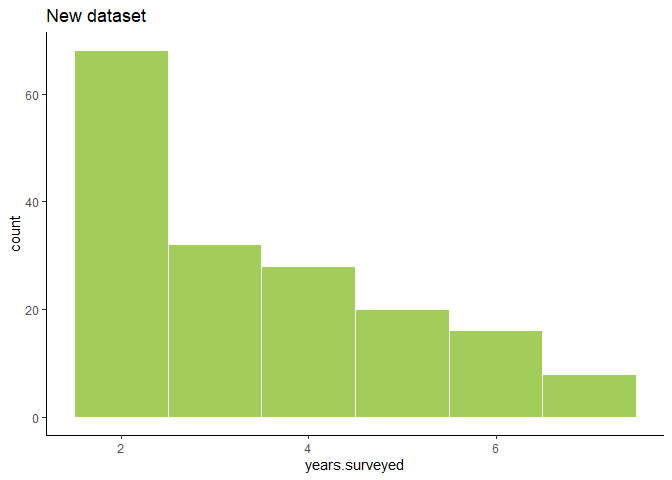<!-- -->

``` r
ggplot(original.data) +
  geom_histogram(aes(x=years.surveyed), binwidth=1, color='white', fill='coral3') +
  labs(title='Reconstructed dataset') +
  theme_classic()
```

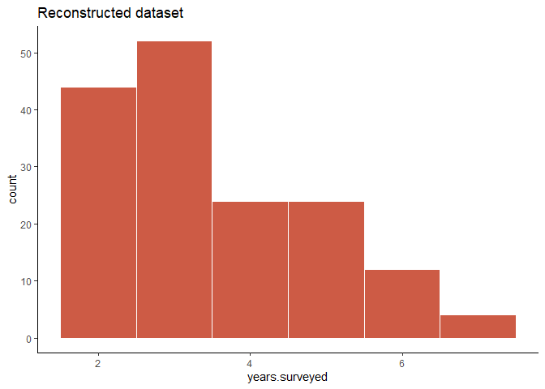<!-- -->

And territory quality. This isn’t directly used in the models.

``` r
ggplot(data, aes(x=years.detect, y=years.no.detect)) +
  geom_point(color='darkolivegreen3', position='jitter') +
  xlim(0, 6) +
  labs(title='New dataset') +
  theme_classic()
```

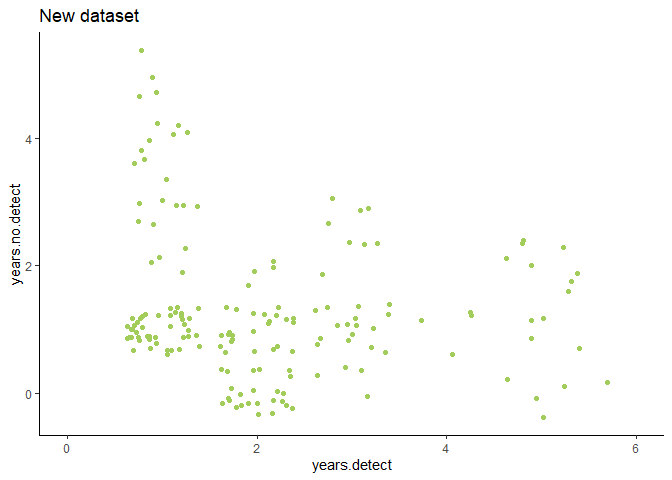<!-- -->

``` r
ggplot(original.data, aes(x=years.detect, y=years.no.detect)) +
  geom_point(color='coral3', position='jitter') +
  labs(title='Reconstructed dataset') +
  xlim(0, 6) +
  theme_classic()
```

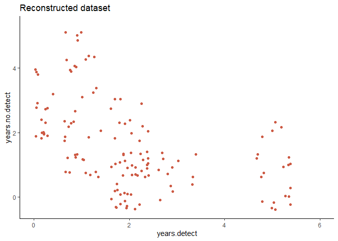<!-- -->

# Habitat variables

The variables that showed as significant in the reconstructed analysis
are:

  - Proportion mature forest cover
  - Landcover contagion
  - Landcover diversity
  - Landcover evenness
  - Landcover richness
  - Gap edge density
  - Proportion suitable habitat
  - Suitable habitat edge density

so I’ll just focus on those. The other variables are dead to me.

``` r
vars <- data %>% select(bec.diversity, cover.diversity, cover.evenness, cover.richness, gap.edge.density, proportion.suitable, suitable.edge.density) %>% names()
```

## Proportion suitable

The strangest thing that popped up in the new version is that the amount
of suitable foraging habitat (as defined by the f-HSI) was extremely
nonsignificant.

``` r
# Bring in a list of nests and calculate a centroid for each territory.
centroids <- read_csv('../data/processed/sc_nests.csv') %>% 
  group_by(site) %>% 
  mutate(mean.x=mean(xcoord), mean.y=mean(ycoord)) %>% 
  distinct(site, name, mean.x, mean.y)

# Make it spatial.
centroids.sf <- centroids %>% rename(xcoord=mean.x, ycoord=mean.y)

centroids.sf <- centroids.sf %>% st_as_sf(coords=c('xcoord', 'ycoord')) %>% 
  st_set_crs('+proj=utm +zone=10 +datum=WGS84 +units=m +no_defs')

# Define some radii.
hr <- 3477.8982
mr <- 7046.7256

# Load suitable habitat raster.
r.suitable <- raster('../data/processed/foraging_sc_suitable.tif')

# Define levels.
suitable.levels <- data.frame(ID=c(0, 4), 
                              class.name=c('unsuitable', 'suitable'))

# Add to the raster.
levels(r.suitable) <- suitable.levels

# Pull one site.
gmt <- centroids.sf %>% filter(site == 'GMT')

# Convert to polygon with max range radius.
gmt.mr <- st_buffer(gmt$geometry, mr) %>% st_sf()

# Also make a smaller one with home range radius.
gmt.hr <- st_buffer(gmt$geometry, hr) %>% st_sf()

# Crop raster to larger extent.
gmt.suitable <- crop(r.suitable, gmt.mr)

# Plot it.
raster::as.data.frame(gmt.suitable, xy=TRUE) %>% 
  ggplot() +
  geom_raster(aes(x=x, y=y, fill=foraging_sc_suitable_class.name)) +
  geom_sf(data=gmt.hr, fill=NA) +
  labs(title='Granite Mountain suitable habitat (home range)') +
  theme_void()
```

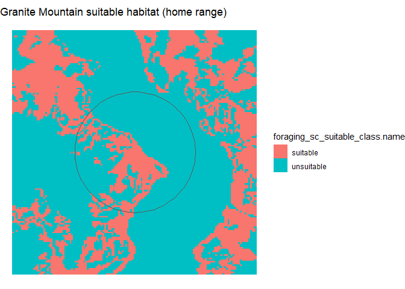<!-- -->
This is Granite Mountain at the home range scale, where the proportion
suitable is 23.3605478.

Here’s how it’s distributed in the new and reconstructed data set:

``` r
ggplot(transform(data,
                 size=factor(size, levels=c('PFA', 'breeding area', 'home range', 'maximum range')))) +
  geom_histogram(aes(x=proportion.suitable), binwidth=10, color='white', fill='darkolivegreen3') +
  facet_wrap(~size) +
  labs(title='New dataset') +
  theme_classic()
```

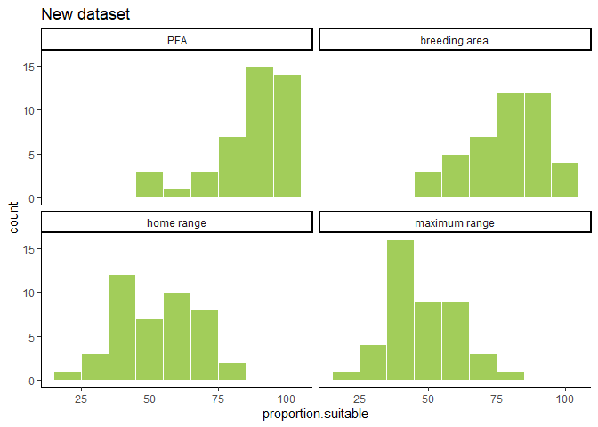<!-- -->

``` r
ggplot(transform(original.data,
                 size=factor(size, levels=c('PFA', 'breeding area', 'home range', 'maximum range')))) +
  geom_histogram(aes(x=proportion.suitable), binwidth=10, color='white', fill='coral3') +
  facet_wrap(~size) +
  labs(title='Reconstructed dataset') +
  theme_classic()
```

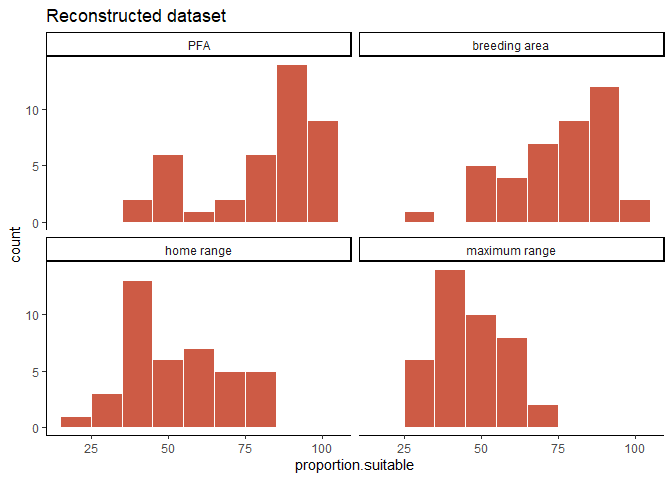<!-- -->

That is… not even a little bit the pattern I was expecting. I really
thought it would be straight across–this is quite a lot of variation.

What’s that weird 0 doing in the breeding area?

``` r
data %>% filter(proportion.suitable < 10 & size == 'breeding area')
```

    ## # A tibble: 0 x 29
    ## # ... with 29 variables: site <chr>, name <chr>, radius <dbl>, size <chr>,
    ## #   bec.diversity <dbl>, bec.inside <dbl>, suitable.inside <dbl>,
    ## #   suitable.edge.density <dbl>, proportion.suitable <dbl>,
    ## #   landcover.inside <dbl>, proportion.cover.mature <dbl>,
    ## #   cover.edge.density <dbl>, cover.contagion <dbl>, cover.diversity <dbl>,
    ## #   cover.evenness <dbl>, cover.richness <dbl>, hsi.inside <dbl>,
    ## #   hsi.edge.density <dbl>, hsi.contagion <dbl>, gap.edge.density <dbl>,
    ## #   gap.inside <dbl>, canopy.inside <dbl>, canopy.none <dbl>,
    ## #   canopy.moderate <dbl>, canopy.high <dbl>, years.surveyed <dbl>,
    ## #   years.detect <dbl>, years.no.detect <dbl>, quality.index <dbl>

Oh, it’s effing Turbid Creek, which can’t be used because the VRI data
is all screwed up for that site.

And models:

### New data set

``` r
occupancy.by.proportion.suitable %>% map(tidy)
```

    ## $`breeding area`
    ## # A tibble: 2 x 5
    ##   term                estimate std.error statistic p.value
    ##   <chr>                  <dbl>     <dbl>     <dbl>   <dbl>
    ## 1 (Intercept)          -0.262     1.01      -0.259   0.795
    ## 2 proportion.suitable   0.0104    0.0130     0.800   0.424
    ## 
    ## $`home range`
    ## # A tibble: 2 x 5
    ##   term                  estimate std.error statistic p.value
    ##   <chr>                    <dbl>     <dbl>     <dbl>   <dbl>
    ## 1 (Intercept)          0.541        0.671    0.806     0.420
    ## 2 proportion.suitable -0.0000978    0.0126  -0.00778   0.994
    ## 
    ## $`maximum range`
    ## # A tibble: 2 x 5
    ##   term                estimate std.error statistic p.value
    ##   <chr>                  <dbl>     <dbl>     <dbl>   <dbl>
    ## 1 (Intercept)          0.626      0.719      0.870   0.384
    ## 2 proportion.suitable -0.00193    0.0150    -0.129   0.898
    ## 
    ## $PFA
    ## # A tibble: 2 x 5
    ##   term                estimate std.error statistic p.value
    ##   <chr>                  <dbl>     <dbl>     <dbl>   <dbl>
    ## 1 (Intercept)          0.423      1.06       0.398   0.691
    ## 2 proportion.suitable  0.00132    0.0123     0.108   0.914

### Reconstructed data set

``` r
original.by.proportion.suitable %>% map(tidy)
```

    ## $`breeding area`
    ## # A tibble: 2 x 5
    ##   term                estimate std.error statistic p.value
    ##   <chr>                  <dbl>     <dbl>     <dbl>   <dbl>
    ## 1 (Intercept)          -1.94      0.902      -2.15  0.0315
    ## 2 proportion.suitable   0.0259    0.0119      2.17  0.0304
    ## 
    ## $`home range`
    ## # A tibble: 2 x 5
    ##   term                estimate std.error statistic p.value
    ##   <chr>                  <dbl>     <dbl>     <dbl>   <dbl>
    ## 1 (Intercept)           1.11      0.637       1.74  0.0817
    ## 2 proportion.suitable  -0.0222    0.0120     -1.85  0.0644
    ## 
    ## $`maximum range`
    ## # A tibble: 2 x 5
    ##   term                estimate std.error statistic p.value
    ##   <chr>                  <dbl>     <dbl>     <dbl>   <dbl>
    ## 1 (Intercept)           0.817     0.745       1.10   0.273
    ## 2 proportion.suitable  -0.0187    0.0160     -1.16   0.244
    ## 
    ## $PFA
    ## # A tibble: 2 x 5
    ##   term                estimate std.error statistic p.value
    ##   <chr>                  <dbl>     <dbl>     <dbl>   <dbl>
    ## 1 (Intercept)          -2.46      0.845      -2.91 0.00359
    ## 2 proportion.suitable   0.0303    0.0102      2.97 0.00300

## Landcover diversity

``` r
# Load landcover raster.
r.landcover <- raster('../data/processed/vri_sc_all-sites.tif')

# Define levels.
landcover.levels <- data.frame(ID=0:11, class.name=
                                 c('undefined', 'rock', 'ocean', 'freshwater',
                                   'alpine', 'wetland',
                                   'shrub', 'deciduous', 'regen',
                                   'young', 'mature', 'old'))

# Add to the raster.
levels(r.landcover) <- landcover.levels

# Crop raster to larger extent.
gmt.landcover <- crop(r.landcover, gmt.mr)

# Plot it.
raster::as.data.frame(gmt.landcover, xy=TRUE) %>% 
  ggplot() +
  geom_raster(aes(x=x, y=y, fill=vri_sc_all.sites_class.name)) +
  geom_sf(data=gmt.hr, fill=NA) +
  labs(title='Granite Mountain landcover (home range)') +
  theme_void()
```

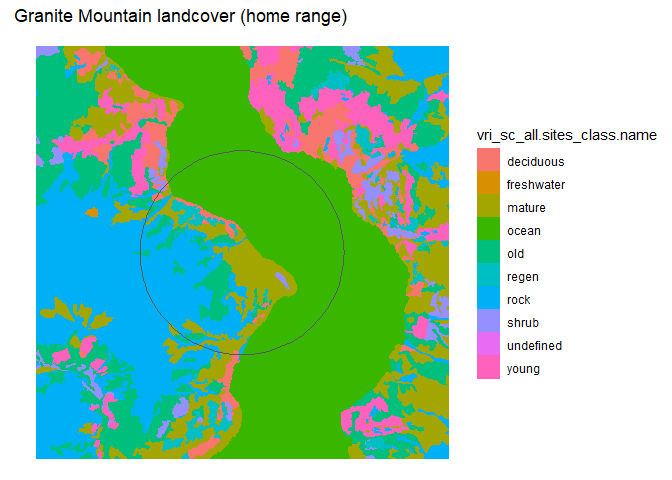<!-- -->

Again, this is Granite Mountain, with a diversity score of 0.6550494. It
also has a richness of 0.1843381.

You can see how the pattern matches the suitable habitat raster, which
makes sense because they’re both derived from the VRI.

``` r
ggplot(transform(data,
                 size=factor(size, levels=c('PFA', 'breeding area', 'home range', 'maximum range')))) +
  geom_histogram(aes(x=cover.diversity), binwidth=0.1, color='white', fill='darkolivegreen3') +
  facet_wrap(~size) +
  labs(title='New dataset - Landcover diversity') +
  theme_classic()
```

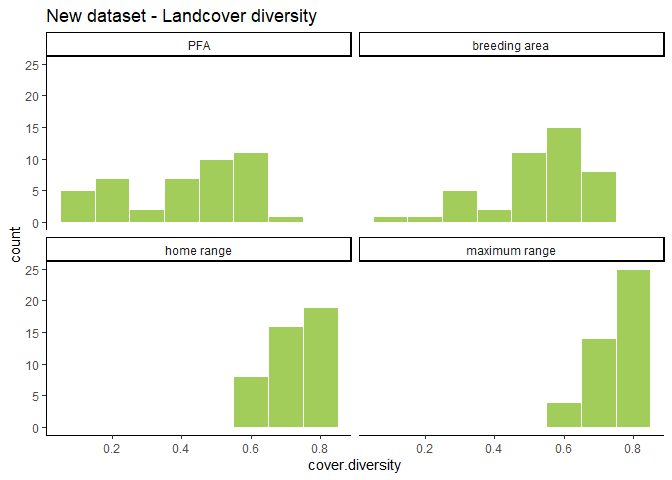<!-- -->

``` r
ggplot(transform(original.data,
                 size=factor(size, levels=c('PFA', 'breeding area', 'home range', 'maximum range')))) +
  geom_histogram(aes(x=cover.diversity), binwidth=0.1, color='white', fill='coral3') +
  facet_wrap(~size) +
  labs(title='Reconstructed dataset - Landcover diversity') +
  theme_classic()
```

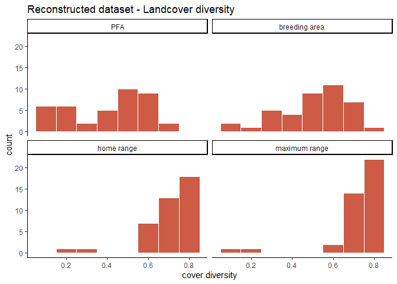<!-- -->

Models:

### New data set

``` r
occupancy.by.cover.diversity %>% map(tidy)
```

    ## $`breeding area`
    ## # A tibble: 2 x 5
    ##   term            estimate std.error statistic p.value
    ##   <chr>              <dbl>     <dbl>     <dbl>   <dbl>
    ## 1 (Intercept)       0.580      0.678    0.856    0.392
    ## 2 cover.diversity  -0.0828     1.23    -0.0672   0.946
    ## 
    ## $`home range`
    ## # A tibble: 2 x 5
    ##   term            estimate std.error statistic p.value
    ##   <chr>              <dbl>     <dbl>     <dbl>   <dbl>
    ## 1 (Intercept)         2.27      1.96     1.16    0.245
    ## 2 cover.diversity    -2.37      2.66    -0.893   0.372
    ## 
    ## $`maximum range`
    ## # A tibble: 2 x 5
    ##   term            estimate std.error statistic p.value
    ##   <chr>              <dbl>     <dbl>     <dbl>   <dbl>
    ## 1 (Intercept)         1.55      2.20     0.705   0.481
    ## 2 cover.diversity    -1.35      2.91    -0.463   0.643
    ## 
    ## $PFA
    ## # A tibble: 2 x 5
    ##   term            estimate std.error statistic p.value
    ##   <chr>              <dbl>     <dbl>     <dbl>   <dbl>
    ## 1 (Intercept)       0.562      0.442    1.27     0.204
    ## 2 cover.diversity  -0.0621     0.979   -0.0634   0.949

### Reconstructed data set

``` r
original.by.cover.diversity %>% map(tidy)
```

    ## $`breeding area`
    ## # A tibble: 2 x 5
    ##   term            estimate std.error statistic p.value
    ##   <chr>              <dbl>     <dbl>     <dbl>   <dbl>
    ## 1 (Intercept)       0.0725     0.629     0.115   0.908
    ## 2 cover.diversity  -0.192      1.15     -0.167   0.867
    ## 
    ## $`home range`
    ## # A tibble: 2 x 5
    ##   term            estimate std.error statistic p.value
    ##   <chr>              <dbl>     <dbl>     <dbl>   <dbl>
    ## 1 (Intercept)        -3.98      1.47     -2.70 0.00693
    ## 2 cover.diversity     5.56      2.03      2.74 0.00619
    ## 
    ## $`maximum range`
    ## # A tibble: 2 x 5
    ##   term            estimate std.error statistic p.value
    ##   <chr>              <dbl>     <dbl>     <dbl>   <dbl>
    ## 1 (Intercept)        -2.82      1.36     -2.07  0.0384
    ## 2 cover.diversity     3.79      1.81      2.10  0.0359
    ## 
    ## $PFA
    ## # A tibble: 2 x 5
    ##   term            estimate std.error statistic p.value
    ##   <chr>              <dbl>     <dbl>     <dbl>   <dbl>
    ## 1 (Intercept)        0.576     0.445      1.29   0.195
    ## 2 cover.diversity   -1.41      0.954     -1.47   0.141

## Landcover evenness

``` r
ggplot(transform(data,
                 size=factor(size, levels=c('PFA', 'breeding area', 'home range', 'maximum range')))) +
  geom_histogram(aes(x=cover.evenness), binwidth=0.1, color='white', fill='darkolivegreen3') +
  facet_wrap(~size) +
  labs(title='New dataset - Landcover evenness') +
  ylim(0, 25) +
  theme_classic()
```

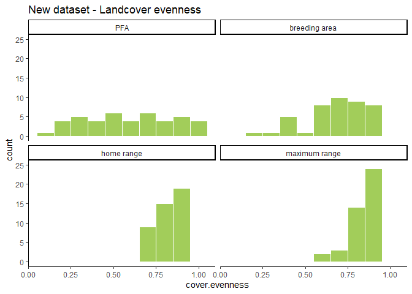<!-- -->

``` r
ggplot(transform(original.data,
                 size=factor(size, levels=c('PFA', 'breeding area', 'home range', 'maximum range')))) +
  geom_histogram(aes(x=cover.evenness), binwidth=0.1, color='white', fill='coral3') +
  facet_wrap(~size) +
  labs(title='Reconstructed dataset - Landcover evenness') +
  ylim(0, 25) +
  theme_classic()
```

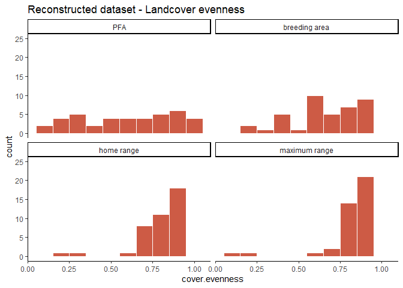<!-- -->

### New data set

``` r
occupancy.by.cover.evenness %>% map(tidy)
```

    ## $`breeding area`
    ## # A tibble: 2 x 5
    ##   term           estimate std.error statistic p.value
    ##   <chr>             <dbl>     <dbl>     <dbl>   <dbl>
    ## 1 (Intercept)      0.476      0.680    0.701    0.484
    ## 2 cover.evenness   0.0868     0.958    0.0907   0.928
    ## 
    ## $`home range`
    ## # A tibble: 2 x 5
    ##   term           estimate std.error statistic p.value
    ##   <chr>             <dbl>     <dbl>     <dbl>   <dbl>
    ## 1 (Intercept)        2.60      2.04      1.27   0.203
    ## 2 cover.evenness    -2.48      2.44     -1.02   0.309
    ## 
    ## $`maximum range`
    ## # A tibble: 2 x 5
    ##   term           estimate std.error statistic p.value
    ##   <chr>             <dbl>     <dbl>     <dbl>   <dbl>
    ## 1 (Intercept)        1.57      2.22     0.709   0.478
    ## 2 cover.evenness    -1.22      2.61    -0.469   0.639
    ## 
    ## $PFA
    ## # A tibble: 2 x 5
    ##   term           estimate std.error statistic p.value
    ##   <chr>             <dbl>     <dbl>     <dbl>   <dbl>
    ## 1 (Intercept)       0.599     0.448     1.34    0.182
    ## 2 cover.evenness   -0.104     0.689    -0.152   0.880

### Reconstructed data set

``` r
original.by.cover.evenness %>% map(tidy)
```

    ## $`breeding area`
    ## # A tibble: 2 x 5
    ##   term           estimate std.error statistic p.value
    ##   <chr>             <dbl>     <dbl>     <dbl>   <dbl>
    ## 1 (Intercept)    -0.00693     0.647   -0.0107   0.991
    ## 2 cover.evenness -0.0317      0.914   -0.0347   0.972
    ## 
    ## $`home range`
    ## # A tibble: 2 x 5
    ##   term           estimate std.error statistic p.value
    ##   <chr>             <dbl>     <dbl>     <dbl>   <dbl>
    ## 1 (Intercept)       -4.12      1.54     -2.68 0.00726
    ## 2 cover.evenness     5.07      1.86      2.72 0.00652
    ## 
    ## $`maximum range`
    ## # A tibble: 2 x 5
    ##   term           estimate std.error statistic p.value
    ##   <chr>             <dbl>     <dbl>     <dbl>   <dbl>
    ## 1 (Intercept)       -2.82      1.37     -2.06  0.0394
    ## 2 cover.evenness     3.37      1.62      2.09  0.0369
    ## 
    ## $PFA
    ## # A tibble: 2 x 5
    ##   term           estimate std.error statistic p.value
    ##   <chr>             <dbl>     <dbl>     <dbl>   <dbl>
    ## 1 (Intercept)       0.590     0.450      1.31   0.190
    ## 2 cover.evenness   -0.985     0.662     -1.49   0.137

## Landcover richness

``` r
ggplot(transform(data,
                 size=factor(size, levels=c('PFA', 'breeding area', 'home range', 'maximum range')))) +
  geom_histogram(aes(x=cover.richness), binwidth=0.5, color='white', fill='darkolivegreen3') +
  facet_wrap(~size) +
  labs(title='New dataset - Landcover richness') +
  ylim(0, 45) +
  theme_classic()
```

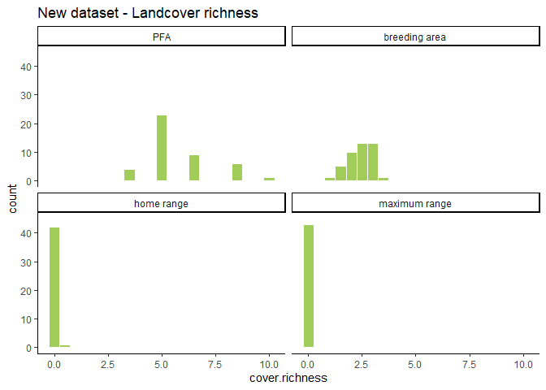<!-- -->

``` r
ggplot(transform(original.data,
                 size=factor(size, levels=c('PFA', 'breeding area', 'home range', 'maximum range')))) +
  geom_histogram(aes(x=cover.richness), binwidth=0.5, color='white', fill='coral3') +
  facet_wrap(~size) +
  labs(title='Reconstructed dataset - Landcover richness') +
  ylim(0, 45) +
  theme_classic()
```

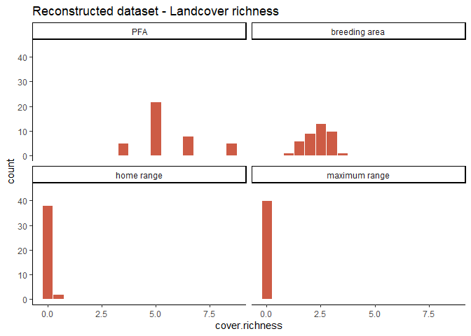<!-- -->

### New data set

``` r
occupancy.by.cover.richness %>% map(tidy)
```

    ## $`breeding area`
    ## # A tibble: 2 x 5
    ##   term           estimate std.error statistic p.value
    ##   <chr>             <dbl>     <dbl>     <dbl>   <dbl>
    ## 1 (Intercept)       0.778     0.730     1.07    0.287
    ## 2 cover.richness   -0.101     0.297    -0.341   0.733
    ## 
    ## $`home range`
    ## # A tibble: 2 x 5
    ##   term           estimate std.error statistic p.value
    ##   <chr>             <dbl>     <dbl>     <dbl>   <dbl>
    ## 1 (Intercept)       -1.40      2.45    -0.572   0.567
    ## 2 cover.richness     8.85     11.2      0.791   0.429
    ## 
    ## $`maximum range`
    ## # A tibble: 2 x 5
    ##   term           estimate std.error statistic p.value
    ##   <chr>             <dbl>     <dbl>     <dbl>   <dbl>
    ## 1 (Intercept)       0.639      1.90    0.337    0.736
    ## 2 cover.richness   -1.78      32.6    -0.0544   0.957
    ## 
    ## $PFA
    ## # A tibble: 2 x 5
    ##   term           estimate std.error statistic p.value
    ##   <chr>             <dbl>     <dbl>     <dbl>   <dbl>
    ## 1 (Intercept)      0.106      0.687     0.154   0.878
    ## 2 cover.richness   0.0752     0.117     0.644   0.519

### Reconstructed data set

``` r
original.by.cover.richness %>% map(tidy)
```

    ## $`breeding area`
    ## # A tibble: 2 x 5
    ##   term           estimate std.error statistic p.value
    ##   <chr>             <dbl>     <dbl>     <dbl>   <dbl>
    ## 1 (Intercept)     -0.148      0.709    -0.208   0.835
    ## 2 cover.richness   0.0507     0.293     0.173   0.863
    ## 
    ## $`home range`
    ## # A tibble: 2 x 5
    ##   term           estimate std.error statistic p.value
    ##   <chr>             <dbl>     <dbl>     <dbl>   <dbl>
    ## 1 (Intercept)       -3.70      1.91     -1.93  0.0531
    ## 2 cover.richness    16.9       8.76      1.93  0.0537
    ## 
    ## $`maximum range`
    ## # A tibble: 2 x 5
    ##   term           estimate std.error statistic p.value
    ##   <chr>             <dbl>     <dbl>     <dbl>   <dbl>
    ## 1 (Intercept)       -1.39      1.88    -0.741   0.458
    ## 2 cover.richness    23.5      32.2      0.729   0.466
    ## 
    ## $PFA
    ## # A tibble: 2 x 5
    ##   term           estimate std.error statistic p.value
    ##   <chr>             <dbl>     <dbl>     <dbl>   <dbl>
    ## 1 (Intercept)      0.243      0.676     0.360   0.719
    ## 2 cover.richness  -0.0482     0.116    -0.415   0.678

## Landcover contagion

``` r
ggplot(transform(data,
                 size=factor(size, levels=c('PFA', 'breeding area', 'home range', 'maximum range')))) +
  geom_histogram(aes(x=cover.contagion), binwidth=5, color='white', fill='darkolivegreen3') +
  facet_wrap(~size) +
  labs(title='New dataset - Landcover contagion') +
  ylim(0, 20) +
  theme_classic()
```

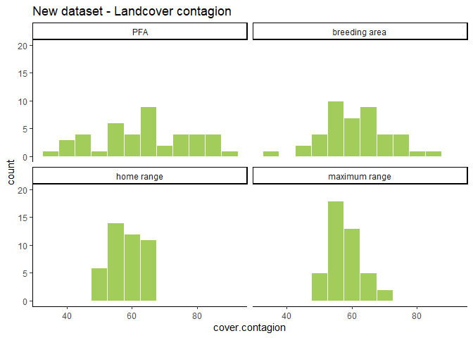<!-- -->

``` r
ggplot(transform(original.data,
                 size=factor(size, levels=c('PFA', 'breeding area', 'home range', 'maximum range')))) +
  geom_histogram(aes(x=cover.contagion), binwidth=5, color='white', fill='coral3') +
  facet_wrap(~size) +
  labs(title='Reconstructed dataset - Landcover contagion') +
  ylim(0, 20) +
  theme_classic()
```

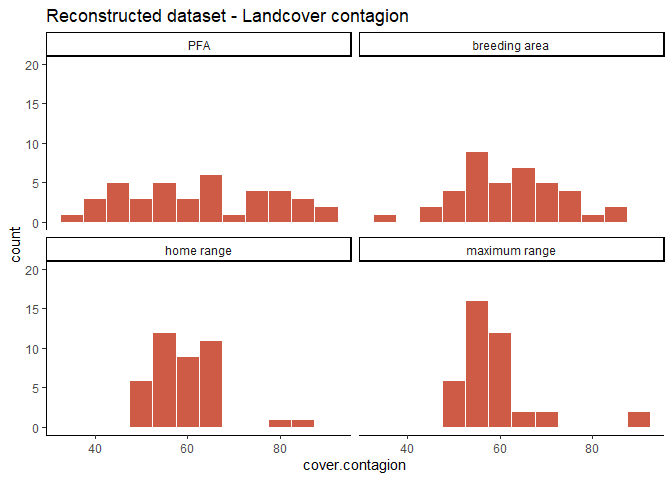<!-- -->

### New data set

``` r
occupancy.by.cover.contagion %>% map(tidy)
```

    ## $`breeding area`
    ## # A tibble: 2 x 5
    ##   term            estimate std.error statistic p.value
    ##   <chr>              <dbl>     <dbl>     <dbl>   <dbl>
    ## 1 (Intercept)      0.258      1.04       0.248   0.805
    ## 2 cover.contagion  0.00465    0.0172     0.270   0.787
    ## 
    ## $`home range`
    ## # A tibble: 2 x 5
    ##   term            estimate std.error statistic p.value
    ##   <chr>              <dbl>     <dbl>     <dbl>   <dbl>
    ## 1 (Intercept)      -2.56      2.13       -1.20   0.230
    ## 2 cover.contagion   0.0538    0.0370      1.45   0.146
    ## 
    ## $`maximum range`
    ## # A tibble: 2 x 5
    ##   term            estimate std.error statistic p.value
    ##   <chr>              <dbl>     <dbl>     <dbl>   <dbl>
    ## 1 (Intercept)      -0.694     2.21      -0.315   0.753
    ## 2 cover.contagion   0.0214    0.0383     0.559   0.576
    ## 
    ## $PFA
    ## # A tibble: 2 x 5
    ##   term            estimate std.error statistic p.value
    ##   <chr>              <dbl>     <dbl>     <dbl>   <dbl>
    ## 1 (Intercept)      0.218      0.787      0.277   0.782
    ## 2 cover.contagion  0.00511    0.0124     0.413   0.680

### Reconstructed data set

``` r
original.by.cover.contagion %>% map(tidy)
```

    ## $`breeding area`
    ## # A tibble: 2 x 5
    ##   term            estimate std.error statistic p.value
    ##   <chr>              <dbl>     <dbl>     <dbl>   <dbl>
    ## 1 (Intercept)     -0.345      1.00      -0.344   0.731
    ## 2 cover.contagion  0.00527    0.0165     0.320   0.749
    ## 
    ## $`home range`
    ## # A tibble: 2 x 5
    ##   term            estimate std.error statistic p.value
    ##   <chr>              <dbl>     <dbl>     <dbl>   <dbl>
    ## 1 (Intercept)       3.76      1.64        2.30  0.0216
    ## 2 cover.contagion  -0.0642    0.0277     -2.32  0.0206
    ## 
    ## $`maximum range`
    ## # A tibble: 2 x 5
    ##   term            estimate std.error statistic p.value
    ##   <chr>              <dbl>     <dbl>     <dbl>   <dbl>
    ## 1 (Intercept)       2.53      1.44        1.76  0.0792
    ## 2 cover.contagion  -0.0435    0.0245     -1.78  0.0755
    ## 
    ## $PFA
    ## # A tibble: 2 x 5
    ##   term            estimate std.error statistic p.value
    ##   <chr>              <dbl>     <dbl>     <dbl>   <dbl>
    ## 1 (Intercept)      -1.05      0.737      -1.42   0.156
    ## 2 cover.contagion   0.0168    0.0118      1.42   0.156

## Gap edge density

``` r
# Load gap raster.
r.gaps <- raster('../data/processed/gaps_sc_100.tif')

# Define levels.
gap.levels <- data.frame(ID=0:1, class.name=
                           c('undefined', 'gap'))

# Add to the raster.
levels(r.gaps) <- gap.levels

# Clip raster to larger extent.
gmt.gaps <- crop(r.gaps, gmt.mr)

# Plot it.
raster::as.data.frame(gmt.gaps, xy=TRUE) %>% 
  ggplot() +
  geom_raster(aes(x=x, y=y, fill=gaps_sc_100_class.name)) +
  geom_sf(data=gmt.hr, fill=NA) +
  labs(title='Granite Mountain gaps (home range)') +
  theme_void()
```

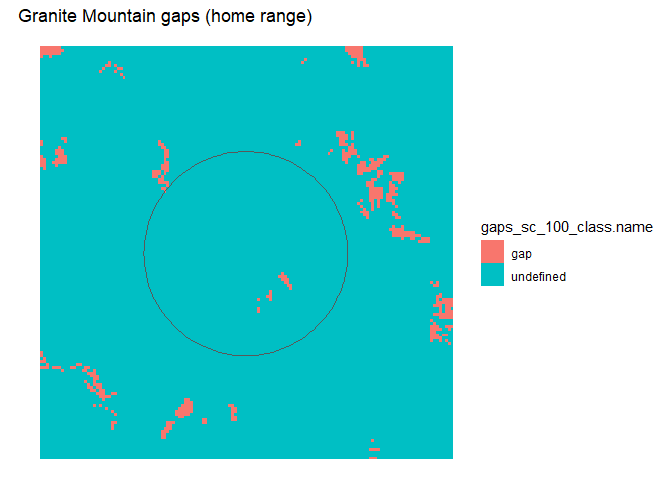<!-- -->

Here again is Granite Mountain, with a pretty low gap edge density of
1.1591149. It’s measuring the perimeter of all the gaps, and then
controlling for the size of the plot.

Compare to Mount Currie:

``` r
# Pull out another site.
mtc <- centroids.sf %>% filter(site == 'MTC')

# Make a maximum range polygon.
mtc.mr <- st_buffer(mtc$geometry, mr) %>% st_sf()

# And a home range polygon.
mtc.hr <- st_buffer(mtc$geometry, hr) %>% st_sf()

# Clip raster to larger extent.
mtc.gaps <- crop(r.gaps, mtc.mr)

# Plot it.
raster::as.data.frame(mtc.gaps, xy=TRUE) %>% 
  ggplot() +
  geom_raster(aes(x=x, y=y, fill=gaps_sc_100_class.name)) +
  geom_sf(data=mtc.hr, fill=NA) + 
  labs(title='Mount Currie gaps (home range)') +
  theme_void()
```

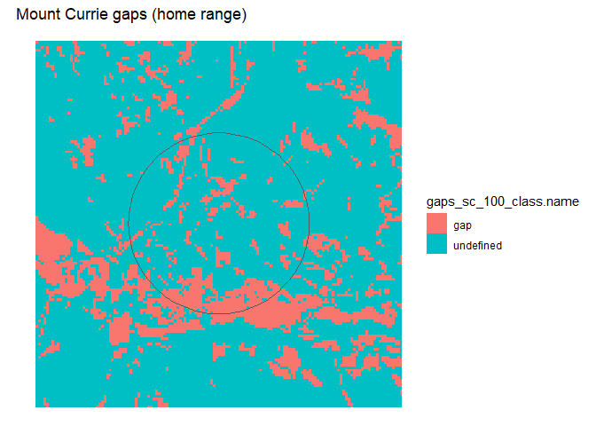<!-- -->

The edge density here is 28.4923564. But when we jump up to the maximum
range the number goes *down* to 4.1492978 even though there’s more total
edge because it’s corrected for the landscape area (density, not
absolute value).

``` r
# Plot it.
raster::as.data.frame(mtc.gaps, xy=TRUE) %>% 
  ggplot() +
  geom_raster(aes(x=x, y=y, fill=gaps_sc_100_class.name)) +
  geom_sf(data=mtc.mr, fill=NA) +
  labs(title='Mount Currie gaps (maximum range)') +
  theme_void()
```

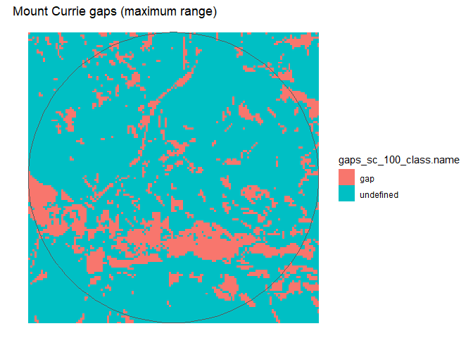<!-- -->

``` r
ggplot(transform(data,
                 size=factor(size, levels=c('PFA', 'breeding area', 'home range', 'maximum range')))) +
  geom_histogram(aes(x=gap.edge.density), binwidth=5, color='white', fill='darkolivegreen3') +
  facet_wrap(~size) +
  labs(title='New dataset - Gap edge density') +
  theme_classic()
```

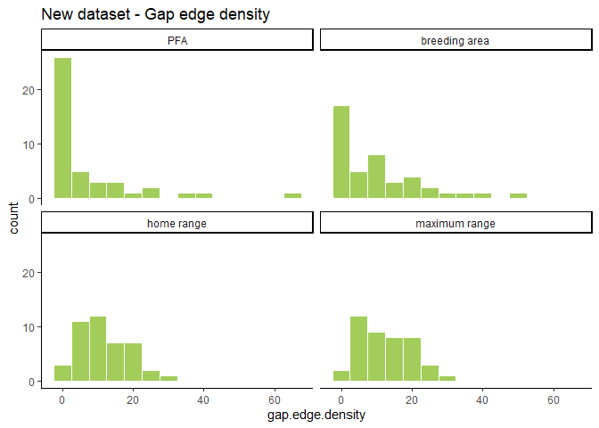<!-- -->

``` r
ggplot(transform(original.data,
                 size=factor(size, levels=c('PFA', 'breeding area', 'home range', 'maximum range')))) +
  geom_histogram(aes(x=gap.edge.density), binwidth=5, color='white', fill='coral3') +
  facet_wrap(~size) +
  labs(title='Original dataset - Gap edge density') +
  theme_classic()
```

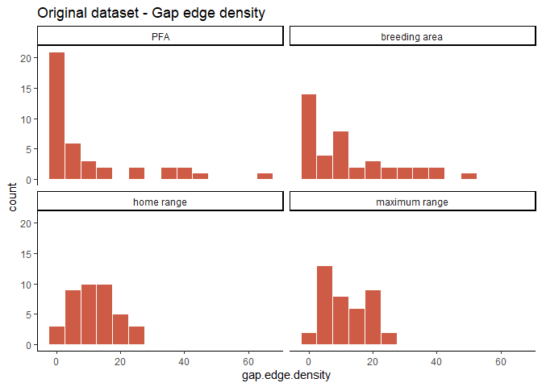<!-- -->

### New data set

``` r
occupancy.by.gap.edge.density %>% map(tidy)
```

    ## $`breeding area`
    ## # A tibble: 2 x 5
    ##   term             estimate std.error statistic  p.value
    ##   <chr>               <dbl>     <dbl>     <dbl>    <dbl>
    ## 1 (Intercept)        0.877     0.234       3.75 0.000178
    ## 2 gap.edge.density  -0.0287    0.0130     -2.21 0.0268  
    ## 
    ## $`home range`
    ## # A tibble: 2 x 5
    ##   term             estimate std.error statistic p.value
    ##   <chr>               <dbl>     <dbl>     <dbl>   <dbl>
    ## 1 (Intercept)        0.695     0.338      2.06   0.0395
    ## 2 gap.edge.density  -0.0136    0.0248    -0.548  0.583 
    ## 
    ## $`maximum range`
    ## # A tibble: 2 x 5
    ##   term             estimate std.error statistic p.value
    ##   <chr>               <dbl>     <dbl>     <dbl>   <dbl>
    ## 1 (Intercept)        0.743     0.353      2.10   0.0354
    ## 2 gap.edge.density  -0.0171    0.0254    -0.673  0.501 
    ## 
    ## $PFA
    ## # A tibble: 2 x 5
    ##   term             estimate std.error statistic  p.value
    ##   <chr>               <dbl>     <dbl>     <dbl>    <dbl>
    ## 1 (Intercept)        0.755     0.203       3.71 0.000206
    ## 2 gap.edge.density  -0.0244    0.0119     -2.05 0.0403

### Reconstructed data set

``` r
original.by.gap.edge.density %>% map(tidy)
```

    ## $`breeding area`
    ## # A tibble: 2 x 5
    ##   term             estimate std.error statistic p.value
    ##   <chr>               <dbl>     <dbl>     <dbl>   <dbl>
    ## 1 (Intercept)        0.520     0.242       2.15 0.0319 
    ## 2 gap.edge.density  -0.0417    0.0133     -3.12 0.00179
    ## 
    ## $`home range`
    ## # A tibble: 2 x 5
    ##   term             estimate std.error statistic p.value
    ##   <chr>               <dbl>     <dbl>     <dbl>   <dbl>
    ## 1 (Intercept)        0.616     0.359       1.72  0.0860
    ## 2 gap.edge.density  -0.0540    0.0265     -2.04  0.0417
    ## 
    ## $`maximum range`
    ## # A tibble: 2 x 5
    ##   term             estimate std.error statistic p.value
    ##   <chr>               <dbl>     <dbl>     <dbl>   <dbl>
    ## 1 (Intercept)        0.678     0.361       1.88  0.0600
    ## 2 gap.edge.density  -0.0610    0.0275     -2.22  0.0266
    ## 
    ## $PFA
    ## # A tibble: 2 x 5
    ##   term             estimate std.error statistic p.value
    ##   <chr>               <dbl>     <dbl>     <dbl>   <dbl>
    ## 1 (Intercept)        0.345     0.209       1.65 0.0981 
    ## 2 gap.edge.density  -0.0350    0.0119     -2.95 0.00315

## Suitable habitat edge density

As a reminder, suitable habitat looks like this:

``` r
# Plot it.
raster::as.data.frame(gmt.suitable, xy=TRUE) %>% 
  ggplot() +
  geom_raster(aes(x=x, y=y, fill=foraging_sc_suitable_class.name)) +
  geom_sf(data=gmt.hr, fill=NA) +
  labs(title='Granite Mountain suitable habitat (home range)') +
  theme_void()
```

<!-- -->

So edge density is the length of the perimeter of suitable habitat
divided by the area being sampled. For comparison, this is the HSI:

``` r
# Load suitable habitat raster.
r.hsi <- raster('../data/processed/foraging_sc.tif')

# Define levels.
hsi.levels <- data.frame(ID=c(-10, -2, -1, 0, 1, 2, 3), 
                         class.name=c('ocean', 'freshwater', 'river', 
                                      'nil', 'low', 'moderate', 'high'))

# Add to the raster.
levels(r.hsi) <- hsi.levels

# Clip raster to larger extent.
gmt.hsi <- crop(r.hsi, gmt.mr)

# Plot it.
raster::as.data.frame(gmt.hsi, xy=TRUE) %>% 
  ggplot() +
  geom_raster(aes(x=x, y=y, fill=foraging_sc_class.name)) +
  geom_sf(data=gmt.hr, fill=NA) +
  labs(title='Granite Mountain HSI (home range)') +
  theme_void()
```

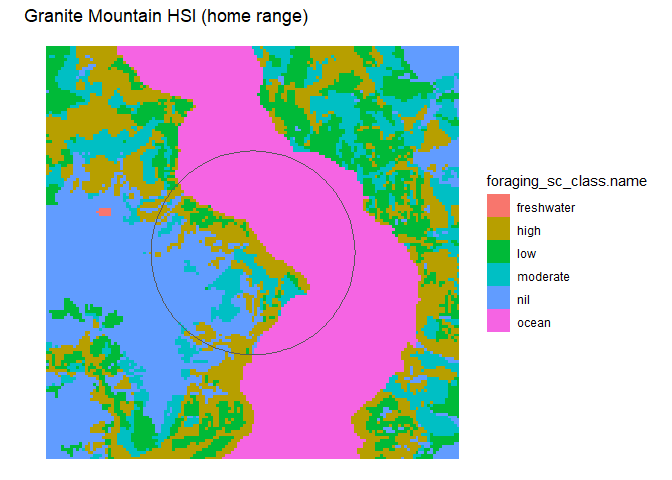<!-- -->

HSI edge density is the length of the perimeter of *all classes* divided
by the area being sampled. So that includes the border between high and
moderate habitat, and between ocean and other classes, etc. Whereas
suitable habitat edge density *only* includes the border between good
habitat and everything else.

``` r
ggplot(transform(data,
                 size=factor(size, levels=c('PFA', 'breeding area', 'home range', 'maximum range')))) +
  geom_histogram(aes(x=suitable.edge.density), binwidth=5, color='white', fill='darkolivegreen3') +
  facet_wrap(~size) +
  labs(title='New dataset - Suitable habitat edge density') +
  ylim(0, 20) +
  theme_classic()
```

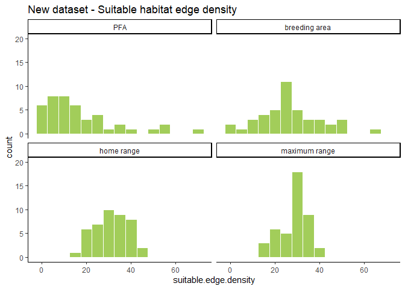<!-- -->

``` r
ggplot(transform(original.data,
                 size=factor(size, levels=c('PFA', 'breeding area', 'home range', 'maximum range')))) +
  geom_histogram(aes(x=suitable.edge.density), binwidth=5, color='white', fill='coral3') +
  facet_wrap(~size) +
  labs(title='Reconstructed dataset - Suitable habitat edge density') +
  ylim(0, 20) +
  theme_classic()
```

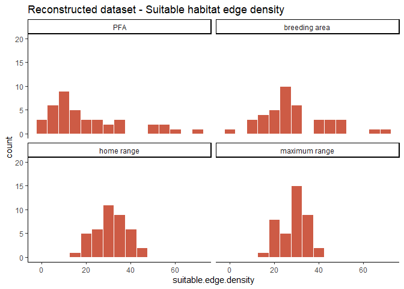<!-- -->

### New data set

``` r
occupancy.by.suitable.edge.density %>% map(tidy)
```

    ## $`breeding area`
    ## # A tibble: 2 x 5
    ##   term                  estimate std.error statistic p.value
    ##   <chr>                    <dbl>     <dbl>     <dbl>   <dbl>
    ## 1 (Intercept)            0.789      0.401      1.96   0.0495
    ## 2 suitable.edge.density -0.00898    0.0128    -0.699  0.484 
    ## 
    ## $`home range`
    ## # A tibble: 2 x 5
    ##   term                  estimate std.error statistic p.value
    ##   <chr>                    <dbl>     <dbl>     <dbl>   <dbl>
    ## 1 (Intercept)             1.13      0.786      1.44    0.150
    ## 2 suitable.edge.density  -0.0186    0.0238    -0.780   0.435
    ## 
    ## $`maximum range`
    ## # A tibble: 2 x 5
    ##   term                  estimate std.error statistic p.value
    ##   <chr>                    <dbl>     <dbl>     <dbl>   <dbl>
    ## 1 (Intercept)             1.78      0.929       1.91  0.0558
    ## 2 suitable.edge.density  -0.0422    0.0308     -1.37  0.171 
    ## 
    ## $PFA
    ## # A tibble: 2 x 5
    ##   term                  estimate std.error statistic p.value
    ##   <chr>                    <dbl>     <dbl>     <dbl>   <dbl>
    ## 1 (Intercept)            0.647      0.249      2.60  0.00943
    ## 2 suitable.edge.density -0.00634    0.0103    -0.615 0.539

### Reconstructed data set

``` r
original.by.suitable.edge.density %>% map(tidy)
```

    ## $`breeding area`
    ## # A tibble: 2 x 5
    ##   term                  estimate std.error statistic p.value
    ##   <chr>                    <dbl>     <dbl>     <dbl>   <dbl>
    ## 1 (Intercept)             0.738     0.413       1.79  0.0742
    ## 2 suitable.edge.density  -0.0255    0.0126     -2.02  0.0431
    ## 
    ## $`home range`
    ## # A tibble: 2 x 5
    ##   term                  estimate std.error statistic p.value
    ##   <chr>                    <dbl>     <dbl>     <dbl>   <dbl>
    ## 1 (Intercept)            -0.351     0.783     -0.448   0.654
    ## 2 suitable.edge.density   0.0101    0.0241     0.421   0.674
    ## 
    ## $`maximum range`
    ## # A tibble: 2 x 5
    ##   term                  estimate std.error statistic p.value
    ##   <chr>                    <dbl>     <dbl>     <dbl>   <dbl>
    ## 1 (Intercept)             0.547     0.921      0.594   0.553
    ## 2 suitable.edge.density  -0.0197    0.0310    -0.635   0.525
    ## 
    ## $PFA
    ## # A tibble: 2 x 5
    ##   term                  estimate std.error statistic p.value
    ##   <chr>                    <dbl>     <dbl>     <dbl>   <dbl>
    ## 1 (Intercept)             0.566     0.270       2.10 0.0359 
    ## 2 suitable.edge.density  -0.0285    0.0103     -2.78 0.00552

## Proportion mature cover

Compare to suitable habitat above.

``` r
# Load mature cover raster.
r.older <- raster('../data/processed/older_sc_100.tif')

# Define levels.
older.levels <- data.frame(ID=0:1, class.name=
                             c('undefined', 'older'))

# Add to the raster.
levels(r.older) <- older.levels

# Clip raster to larger extent.
gmt.older <- crop(r.older, gmt.mr)

# Plot it.
raster::as.data.frame(gmt.older, xy=TRUE) %>% 
  ggplot() +
  geom_raster(aes(x=x, y=y, fill=older_sc_100_class.name)) +
  geom_sf(data=gmt.hr, fill=NA) +
  labs(title='Granite Mountain older forest cover (home range)') +
  theme_void()
```

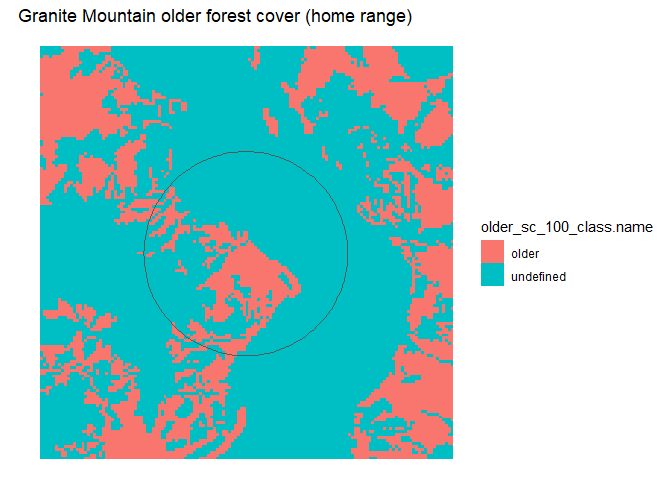<!-- -->

It looks basically the same, for obvious reasons.

``` r
ggplot(transform(data,
                 size=factor(size, levels=c('PFA', 'breeding area', 'home range', 'maximum range')))) +
  geom_histogram(aes(x=proportion.cover.mature), binwidth=5, color='white', fill='darkolivegreen3') +
  facet_wrap(~size) +
  labs(title='New dataset - Proportion mature forest cover') +
  ylim(0, 10) +
  theme_classic()
```

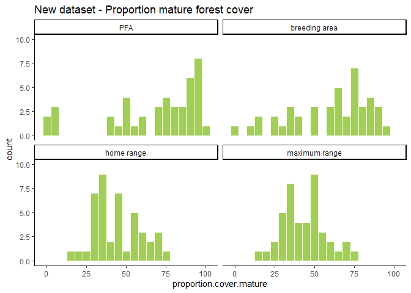<!-- -->

``` r
ggplot(transform(original.data,
                 size=factor(size, levels=c('PFA', 'breeding area', 'home range', 'maximum range')))) +
  geom_histogram(aes(x=proportion.cover.mature), binwidth=5, color='white', fill='coral3') +
  facet_wrap(~size) +
  labs(title='Reconstructed dataset - Proportion mature forest cover') +
  ylim(0, 10) +
  theme_classic()
```

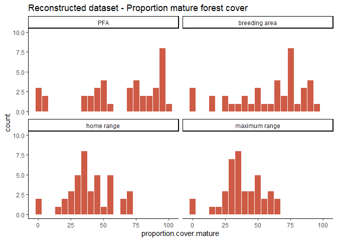<!-- -->

### New data set

``` r
occupancy.by.proportion.cover.mature %>% map(tidy)
```

    ## $`breeding area`
    ## # A tibble: 2 x 5
    ##   term                    estimate std.error statistic p.value
    ##   <chr>                      <dbl>     <dbl>     <dbl>   <dbl>
    ## 1 (Intercept)             0.480      0.417       1.15    0.250
    ## 2 proportion.cover.mature 0.000971   0.00657     0.148   0.883
    ## 
    ## $`home range`
    ## # A tibble: 2 x 5
    ##   term                    estimate std.error statistic p.value
    ##   <chr>                      <dbl>     <dbl>     <dbl>   <dbl>
    ## 1 (Intercept)              0.232      0.502      0.463   0.644
    ## 2 proportion.cover.mature  0.00720    0.0113     0.638   0.523
    ## 
    ## $`maximum range`
    ## # A tibble: 2 x 5
    ##   term                    estimate std.error statistic p.value
    ##   <chr>                      <dbl>     <dbl>     <dbl>   <dbl>
    ## 1 (Intercept)              0.185      0.564      0.328   0.743
    ## 2 proportion.cover.mature  0.00858    0.0132     0.650   0.515
    ## 
    ## $PFA
    ## # A tibble: 2 x 5
    ##   term                    estimate std.error statistic p.value
    ##   <chr>                      <dbl>     <dbl>     <dbl>   <dbl>
    ## 1 (Intercept)             0.492      0.420       1.17    0.241
    ## 2 proportion.cover.mature 0.000665   0.00586     0.114   0.910

### Reconstructed data set

``` r
original.by.proportion.cover.mature %>% map(tidy)
```

    ## $`breeding area`
    ## # A tibble: 2 x 5
    ##   term                    estimate std.error statistic p.value
    ##   <chr>                      <dbl>     <dbl>     <dbl>   <dbl>
    ## 1 (Intercept)              -0.590    0.391       -1.51   0.131
    ## 2 proportion.cover.mature   0.0101   0.00629      1.60   0.109
    ## 
    ## $`home range`
    ## # A tibble: 2 x 5
    ##   term                    estimate std.error statistic p.value
    ##   <chr>                      <dbl>     <dbl>     <dbl>   <dbl>
    ## 1 (Intercept)              -0.464    0.419       -1.11   0.268
    ## 2 proportion.cover.mature   0.0112   0.00984      1.14   0.255
    ## 
    ## $`maximum range`
    ## # A tibble: 2 x 5
    ##   term                    estimate std.error statistic p.value
    ##   <chr>                      <dbl>     <dbl>     <dbl>   <dbl>
    ## 1 (Intercept)              -0.687     0.471      -1.46   0.145
    ## 2 proportion.cover.mature   0.0175    0.0117      1.50   0.133
    ## 
    ## $PFA
    ## # A tibble: 2 x 5
    ##   term                    estimate std.error statistic p.value
    ##   <chr>                      <dbl>     <dbl>     <dbl>   <dbl>
    ## 1 (Intercept)              -0.862    0.401       -2.15  0.0315
    ## 2 proportion.cover.mature   0.0137   0.00591      2.33  0.0201

# Correlation

First off, there are three variables that are likely to be very, very
highly correlated, and it would be nice if I could just scratch two of
them off right away.

``` r
cover.vars <- data %>% select(cover.diversity, cover.evenness, cover.richness) %>% names()

data %>% select(site, size, cover.vars) %>% 
  pivot_longer(!c(site, size), names_to='variable', values_to='value') %>% 
  mutate(var=paste(size, variable)) %>% 
  select(site, value, var) %>% 
  pivot_wider(names_from=var, values_from=value) %>% 
  select(-site) %>% 
  ggcorr(method=c('pairwise', 'pearson'), nbreaks=5, hjust=1, layout.exp=5)
```

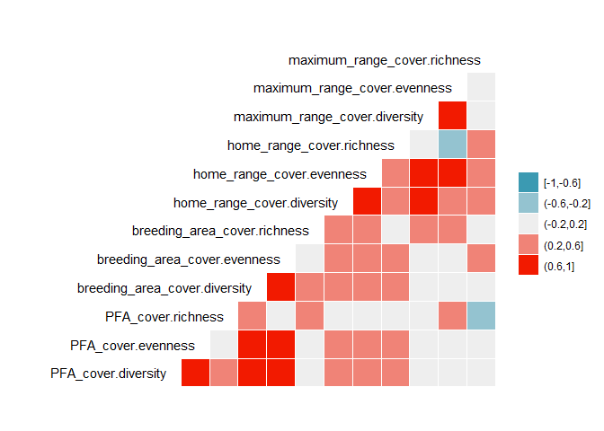<!-- -->

Kind of interesting. The variables at the most distant sizes (maximum
range and PFA) are least correlated, which makes sense. Closer sizes
tend to be more correlated, also not surprising. Diversity is always
correlated with evenness and richness within each size, but not
necessarily across sizes.

It’s not definitive, but I feel good enough about this to toss richness
and evennes and keep just diversity.

``` r
# Shape the data into a correlation-ready format.
vars <- data %>% select(proportion.cover.mature, cover.diversity, cover.contagion, gap.edge.density, proportion.suitable, suitable.edge.density) %>% 
  names()

data %>% select(site, size, vars) %>% 
  pivot_longer(!c(site, size), names_to='variable', values_to='value') %>% 
  mutate(var=paste(size, variable)) %>% 
  select(site, value, var) %>% 
  pivot_wider(names_from=var, values_from=value) %>% 
  select(-site) %>% 
  ggcorr(method=c('pairwise', 'pearson'), nbreaks=5, hjust=1, layout.exp=5)
```

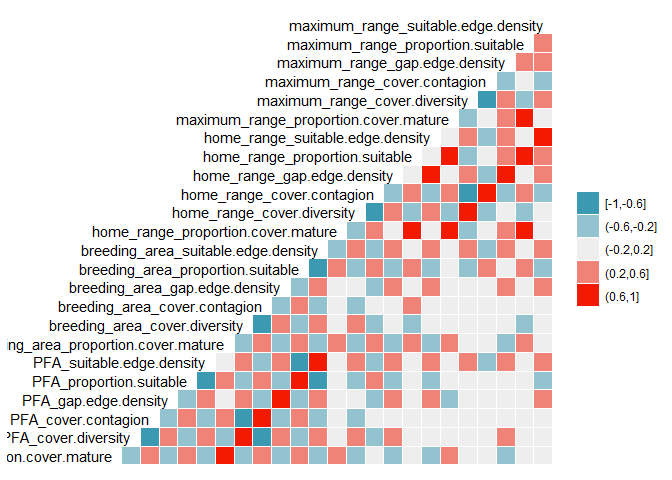<!-- -->

Well, that’s pretty unreadable, but there’s nothing I can do about that.

Something super strange–if I’m reading this right, that diagonal band of
red shows that each variable is strongly correlated with its match in
the next size radius, but *only* between PFA x breeding area and home
range x maximum range, and *not* between breeding area x home range or
between any of the more widely-separated sizes.
