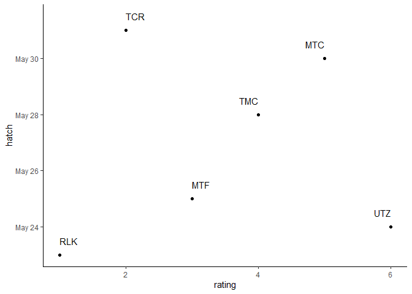
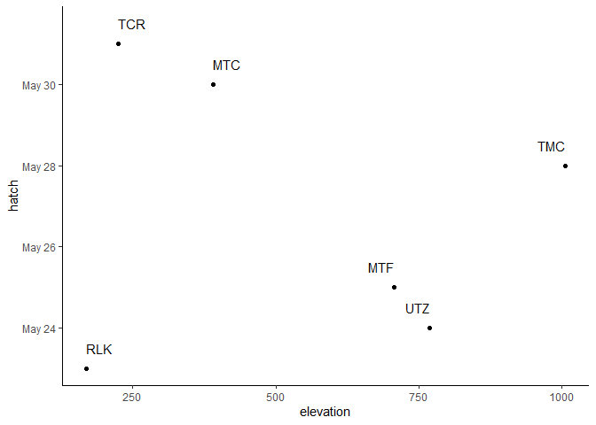
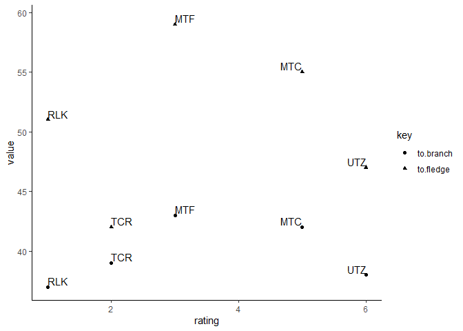
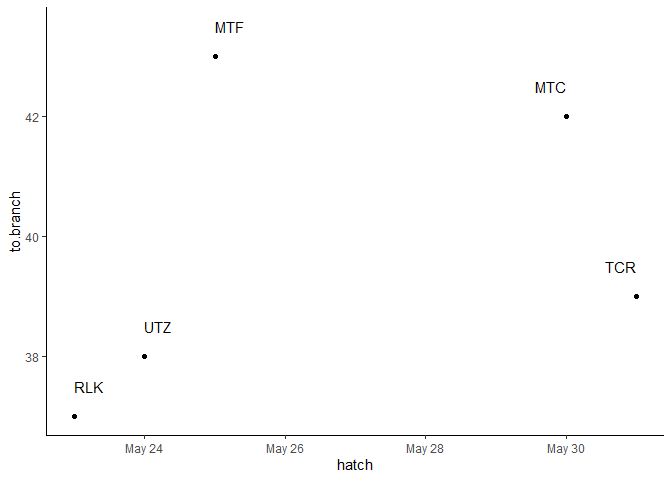

Timing & productivity
================

We quantified the diet of breeding goshawks using digital trail cameras at 6 nests during 2019. Nest were selected for camera instllation based on timing of discovery, ease of access, and the presence of suitable trees. Each camera was installed in a tree adjacent to the nest tree, approximately five meters away and slightly above the nest itself. Cameras (Reconyx, UltraFire and HyperFire models) were programmed to take three photos when triggered by motion, and an additional one photo every hour. Installation took place during the early nestling phase (approximately early May) and cameras were left in place until after fledging (approximately September).

Chicks were aged from photos taken shortly after camera installation using a pictoral guide (Boal 1994). Hatch date and lay date were calculated from this date using known breeding chronology (Boal 1994, McClaren et al. 2015). Due to the camera's limited field of view, fledge date was defined as the first day the chicks spent entirely out of the nest. Productivity was defined as the number of chicks that successfully voluntarily left the nest. <!-- Does this need citation at all? And an explanation of why it's different from others' definitions?)-->

``` r
# Load up some libraries.
library('tidyverse')
library('lubridate')
library('ggplot2')
library('knitr')
library('kableExtra')

# Import the data.
cameras <- read.csv('../data/raw/productivity_2019.csv', stringsAsFactors=FALSE)

# Do the date conversion thing.
cameras <- cameras %>% mutate(date=ymd(date), branch=ymd(branch), fledge=ymd(fledge))

# Calculate the hatch date based on age.
# date is the date the camera was installed.
# age is how old the chicks were when it was intstalled.
cameras <- cameras %>% mutate(age=days(age)) %>% mutate(hatch=date-age)
```

The average hatch date was:

``` r
mean(cameras$hatch)
```

    ## [1] "2019-05-26"

So May 26 was about when all these chicks hatched. But there was fair bit of variation, wasn't there?

``` r
range(cameras$hatch)
```

    ## [1] "2019-05-23" "2019-05-31"

That's quite the range! Is there anything that really jumps out to explain that difference? If I categorize the birds on a gradient from coastal to transition, what does that look like? This is just an informal way to categorize them based on roughly how coastal they are.

``` r
# What order are the sites in?
cameras$site
```

    ## [1] "TCR" "MTC" "UTZ" "TMC" "MTF" "RLK"

``` r
# Rate them by interior-ness, 1=coastal, 6=transition.
rating <- c(2, 5, 6, 4, 3, 1)

# Add to the data frame.
cameras <- add_column(cameras, rating=rating)

# Graph it.
ggplot(cameras, aes(x=rating, y=hatch, label=site)) +
  geom_point() +
  geom_text(hjust='inward', nudge_y = 0.5) +
  theme_classic()
```



Ok, that's actually pretty interesting. Aside from Turbid and Utzilus, this makes a really nice line. Who knows what's happening at Utzilus, it's a really weird site. Turbid seems like a very normal site, but...

So this could be a coast-interior gradient, but this could also be plain old elevation. So my next step is to get elevation for the nests.

``` r
# Enter elevation.
elevation <- c(225, 391, 769, 1006, 707, 169)

# Add to data frame.
cameras <- add_column(cameras, elevation=elevation)

# Graph it.
ggplot(cameras, aes(x=elevation, y=hatch, label=site)) +
  geom_point() +
  geom_text(hjust='inward', nudge_y = 0.5) +
  theme_classic()
```



Doesn't seem to be much pattern there at all. Of course, there could be some kind of interaction between coastalness and elevation. Or I could look at something more sophisticated, like average temperatures or something, but I think I'll leave that for now.

The next thing is to look at length of chick-rearing stage: how long it took to get from hatch to branch and from hatch to fledge.

``` r
# Calculate time to branching and time to  fledging.
cameras <- cameras %>% mutate(to.branch=branch-hatch, to.fledge=fledge-hatch)

# Plot it.
cameras %>% dplyr::select(site, rating, to.branch, to.fledge) %>% 
  gather(key, value, -site, -rating, na.rm=TRUE) %>%
  mutate(key=as.factor(key)) %>%
  ggplot(aes(x=rating, y=value, label=site, group=key)) +
  geom_point(aes(shape=key)) +
  geom_text(hjust='inward', nudge_y = 0.5) +
  theme_classic()
```



Interesting that they all follow the same pattern except Turbid Creek. But considering how much the fledge date, based on my definition, depends on camera placement rather than actual bird behavior, I'm not sure it really means anything at all. Since McClaren et al. (2002) define fledglings as the number of young within the nest 1 week before fledging (a bit of a recursive definition, but they also provide the more helpful definition of 32-40 days), my "branching" might be more meaningful.

``` r
# How old are chicks at branching?
as.numeric(cameras$to.branch)
```

    ## [1] 39 42 38 NA 43 37

So yes, it looks like my "branching" is equivalent to McClaren's "fledging" (though not with Boal's!).

Incidentally, McClaren et al. (2005) speculates on a connection between hatch date and fledge date, with earlier laying potentially indicating better conditions, which results in younger age at dispersal. I don't have dispersal per se, but I could look quickly at fledging.

``` r
ggplot(cameras, aes(x=hatch, y=to.branch, label=site)) +
  geom_point() +
  geom_text(hjust='inward', nudge_y = 0.5) +
  theme_classic()
```



Well... maybe if you squint... I guess I'll have to wait for more data and see if that changes anything.

The next step would be calculating lay dates. Here's the problem. McClaren et al. (2015) provides several sources for breeding chronology, two of which are also McClaren (McClaren 2005 and McClaren et al. 2005). The et al. deals with PFAs and describes fledgling dispersal but nothing about incubation length. Likewise the McClaren 2005 report doesn't contain any data about incubation. She writes:

> Laying dates can be determined either by visiting known nests within goshawk nest areas during a two-week period between late April and early May and observing when incubation begins, or by back-dating from hatching or fledging dates recorded at active goshawk nests.

All well and good, but there's no data on how long the incubation period is, let alone mention of collection such data. (Also, how is one supposed to back-date from hatching to get laying if one doesn't know how long incubation lasts?) Nevertheless, inclubation is stated as lasting for 30-32 days. Inverson et al. (1996) is also cited, but they give the number as 29-32 days. The final ciation is Beebe (1974), also cited by Iverson et al., so I must assume this is the original source of the number. It is, frustratingly, available at the university library--currently closed due to the pandemic, and so completely unavailable to me.

Regardless, using the median of 30 days of incubation, that puts lay dates as:

``` r
cameras <- cameras %>% mutate(lay=hatch-days(30))

cameras$lay
```

    ## [1] "2019-05-01" "2019-04-30" "2019-04-24" "2019-04-28" "2019-04-25"
    ## [6] "2019-04-23"

And I think that's all there is to do here, except to summarize and compare.

``` r
cameras %>% dplyr::select(site, hatch, to.branch, n_fledge) %>%
  arrange(hatch) %>%
  kable(col.names=c('Site', 'Hatch date', 't to fledge', 'n fledged')) %>%
  kable_styling(full_width=FALSE)
```

<table class="table" style="width: auto !important; margin-left: auto; margin-right: auto;">
<thead>
<tr>
<th style="text-align:left;">
Site
</th>
<th style="text-align:left;">
Hatch date
</th>
<th style="text-align:left;">
t to fledge
</th>
<th style="text-align:right;">
n fledged
</th>
</tr>
</thead>
<tbody>
<tr>
<td style="text-align:left;">
RLK
</td>
<td style="text-align:left;">
2019-05-23
</td>
<td style="text-align:left;">
37 days
</td>
<td style="text-align:right;">
3
</td>
</tr>
<tr>
<td style="text-align:left;">
UTZ
</td>
<td style="text-align:left;">
2019-05-24
</td>
<td style="text-align:left;">
38 days
</td>
<td style="text-align:right;">
2
</td>
</tr>
<tr>
<td style="text-align:left;">
MTF
</td>
<td style="text-align:left;">
2019-05-25
</td>
<td style="text-align:left;">
43 days
</td>
<td style="text-align:right;">
2
</td>
</tr>
<tr>
<td style="text-align:left;">
TMC
</td>
<td style="text-align:left;">
2019-05-28
</td>
<td style="text-align:left;">
NA
</td>
<td style="text-align:right;">
0
</td>
</tr>
<tr>
<td style="text-align:left;">
MTC
</td>
<td style="text-align:left;">
2019-05-30
</td>
<td style="text-align:left;">
42 days
</td>
<td style="text-align:right;">
1
</td>
</tr>
<tr>
<td style="text-align:left;">
TCR
</td>
<td style="text-align:left;">
2019-05-31
</td>
<td style="text-align:left;">
39 days
</td>
<td style="text-align:right;">
2
</td>
</tr>
</tbody>
</table>
McClaren et al. (2005) gives the median day of hatching as 29 May and the median fledge date as 7 July. My median hatch date is 25 May which is pretty close, and likewise my fledge date is 6 July.
