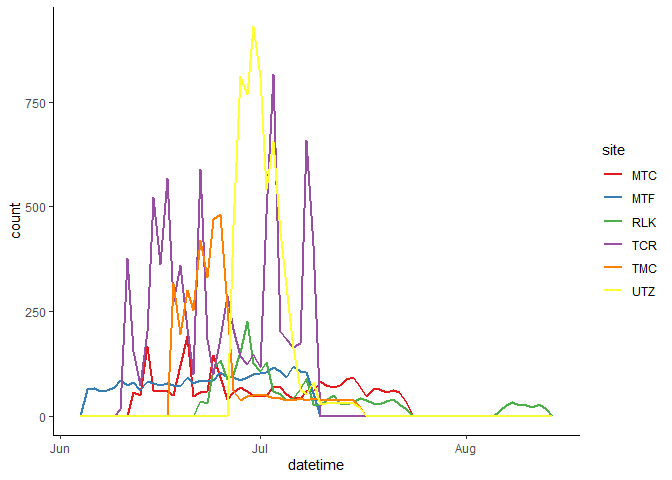
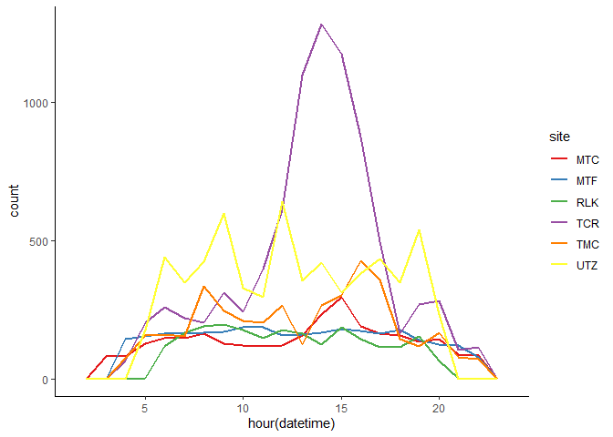
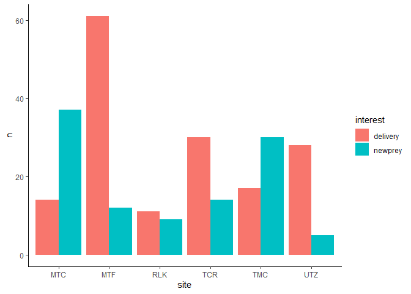
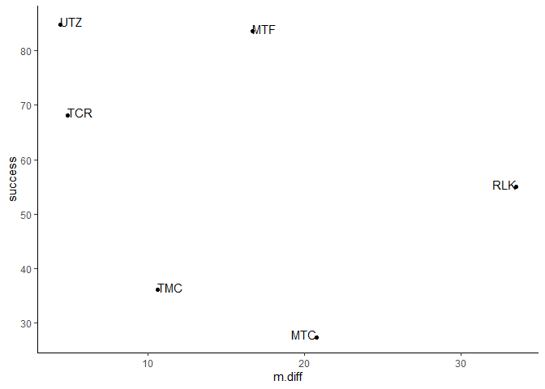

Data
================

Now that I have my preliminary data nice and clean, I need to see what the data actually consist of.

``` r
# Load up some libraries.
library('tidyverse')
library('lubridate')
library('ggplot2')
library('knitr')
library('kableExtra')

# Import the squeaky clean data.
df <- read.csv('../data/interim/camera_data.csv', stringsAsFactors=FALSE)
```

Let's start with:

-   How many photos/per site
-   Number of days for which there are useful photos
-   What schedule the photos were taken on
-   How many prey items recorded
-   How many deliveries recorded & how many presumably missed

``` r
# How many photos, period?
df %>% group_by(site) %>% summarize(photos=n())
```

    ## # A tibble: 6 x 2
    ##   site  photos
    ##   <chr>  <int>
    ## 1 MTC     2873
    ## 2 MTF     2968
    ## 3 RLK     2238
    ## 4 TCR     8376
    ## 5 TMC     3848
    ## 6 UTZ     6274

Obviously Turbid Creek was overactive! But otherwise around 3000 photos seems pretty typical. Of course, most of these photos don't show anything useful, just ugly raptor babies hopping around. So how many of them actually record prey or a delivery?

``` r
n.prey <- df %>% filter(interest %in% c('delivery', 'newprey')) %>% group_by(site) %>% summarize(prey=n())

n.prey
```

    ## # A tibble: 6 x 2
    ##   site   prey
    ##   <chr> <int>
    ## 1 MTC      51
    ## 2 MTF      73
    ## 3 RLK      20
    ## 4 TCR      44
    ## 5 TMC      47
    ## 6 UTZ      33

Well, those are depressingly smaller numbers. Additionally, the cameras were recording for a different number of days. On the front end, that depends on when we were able to install the camera. On the back end, that depends on when the chicks fledged, since although the cameras stayed up until the fall activitiy obviously dropped off rapidly after the chicks left the nest. However, the chicks continued to return to the nest for some time and the adults often continued to deliver food.

``` r
# Do the datetime thing.
df <- df %>% mutate(datetime=parse_date_time(datetime, 
                       orders=c('%Y-%m-%d %H:%M:%S', '%Y/%m/%d %H:%M:%S')))

# Calculate days.
timespan <- df %>% filter(interest %in% c('delivery', 'newprey')) %>% group_by(site) %>% 
  summarize(first=min(datetime), last=max(datetime)) %>%
  mutate(first=date(first), last=date(last)) %>%
  mutate(days=difftime(last, first))

timespan
```

    ## # A tibble: 6 x 4
    ##   site  first      last       days   
    ##   <chr> <date>     <date>     <drtn> 
    ## 1 MTC   2019-06-11 2019-07-21 40 days
    ## 2 MTF   2019-06-04 2019-07-08 34 days
    ## 3 RLK   2019-06-22 2019-07-15 23 days
    ## 4 TCR   2019-06-10 2019-07-08 28 days
    ## 5 TMC   2019-06-17 2019-07-02 15 days
    ## 6 UTZ   2019-06-26 2019-07-08 12 days

It's important to note that at this points there is still a week or two missing from both Mt. Ford (MTF) and Turbid Creek (TCR). So those last dates aren't quite accurate--but they'll do for now. Now, I can do a little more digging, here.

``` r
# Photos per day?
bind_cols(timespan, n.prey) %>%
  mutate(days=as.numeric(days), per.day=prey/days)
```

    ## # A tibble: 6 x 7
    ##   site  first      last        days site1  prey per.day
    ##   <chr> <date>     <date>     <dbl> <chr> <int>   <dbl>
    ## 1 MTC   2019-06-11 2019-07-21    40 MTC      51   1.27 
    ## 2 MTF   2019-06-04 2019-07-08    34 MTF      73   2.15 
    ## 3 RLK   2019-06-22 2019-07-15    23 RLK      20   0.870
    ## 4 TCR   2019-06-10 2019-07-08    28 TCR      44   1.57 
    ## 5 TMC   2019-06-17 2019-07-02    15 TMC      47   3.13 
    ## 6 UTZ   2019-06-26 2019-07-08    12 UTZ      33   2.75

So Twenty-mile Creek was the best at capturing prey, and Ruby Lake the worst--which makes sense, because TMC had by far the best camera angle and RLK by far the worst. Which really highlights how important a good view into the nest is.

Now let's look at when and how often the photos themselves were taken.

``` r
diff <- df %>%
  arrange(site, datetime) %>%
  group_by(site) %>%
  mutate(diff=datetime-lag(datetime), diff.min=as.numeric(diff, units='mins')) %>%
  mutate(diff.min=replace_na(diff.min, 0)) %>%
  summarize(m.diff=mean(diff.min))

diff
```

    ## # A tibble: 6 x 2
    ##   site  m.diff
    ##   <chr>  <dbl>
    ## 1 MTC    20.8 
    ## 2 MTF    16.7 
    ## 3 RLK    33.5 
    ## 4 TCR     4.89
    ## 5 TMC    10.6 
    ## 6 UTZ     4.42

Obviously some of them were mostly just taking timed photos--MTC, for examble, is just under 30 minutes, which means it was only triggering occasionally to drag down the average. On the flip side, TCR and UTZ were triggering like mad.

Maybe a few graphs to help illustrate:

``` r
library('RColorBrewer')

# By day.
ggplot(df, aes(x=datetime, color=site)) +
  geom_freqpoly(binwidth=86400, size=1) +
  scale_color_brewer(palette='Set1') +
  theme_classic()
```



``` r
# By hour.
ggplot(df, aes(x=hour(datetime), color=site)) +
  geom_freqpoly(binwidth=1, size=1) +
  scale_color_brewer(palette='Set1') +
  theme_classic()
```



I think that's enough about the photo triggering itself. Now let's move on to the captures. To start with, I already saw how many captures there are for each site. How many were deliveries, and how many were missed deliveries?

``` r
df %>% filter(interest %in% c('delivery', 'newprey')) %>%
  group_by(site, interest) %>%
  summarize(n=n()) %>%
  ggplot(aes(fill=interest, x=site, y=n)) +
  geom_bar(position='dodge', stat='identity') +
  theme_classic()
```



"Delivery" refers to a delivery that was "caught in the act", where the bird was actually observed as it arrived at the nest. "Newprey," on the other hand, refers to a delivery that happened between camera triggers and was inferred by the presence of a new prey item in the nest. So it looks like Mt. Ford actually triggered most accurately. Mt. Currie, unsuprisingly, was most inaccurate, which makes sense since it was essentially just going off its timer.

Is there a way to figure out how many deliveries I'm missing? The obvious thing to do is calculate deliveries/total captures (or, inversely, new prey/total captures). But that assumes that total captures accurately represents total deliveries--a big assumption, when you look at the different numbers of captures/day. But it's a starting point and honestly the best thing I can think of right now.

``` r
success <- df %>% filter(interest %in% c('delivery', 'newprey')) %>%
  group_by(site, interest) %>%
  summarize(n=n()) %>%
  spread(interest, n) %>%
  mutate(total=delivery+newprey, success=delivery/total*100)

success
```

    ## # A tibble: 6 x 5
    ## # Groups:   site [6]
    ##   site  delivery newprey total success
    ##   <chr>    <int>   <int> <int>   <dbl>
    ## 1 MTC         14      37    51    27.5
    ## 2 MTF         61      12    73    83.6
    ## 3 RLK         11       9    20    55. 
    ## 4 TCR         30      14    44    68.2
    ## 5 TMC         17      30    47    36.2
    ## 6 UTZ         28       5    33    84.8

So the accuracy of catching deliveries looks not bad (average is 59.20219) but with quite a lot of variation (SD is 24.0333886).

Is there a relationship between mean time between photos (in other words, how often the camera triggered) and what proportion of deliveries were successfully captured?

``` r
bind_cols(success, diff) %>%
  ggplot(aes(x=m.diff, y=success, label=site)) +
  geom_point() +
  geom_text(hjust='inward', nudge_y = 0.5) +
  theme_classic()
```



Sure doesn't look like it. Which is odd, because I really would have thought a camera that triggered more often would catch more deliveries! I wonder if it's something different, like trigger sensitivity or speed or something (or some combination of both).
