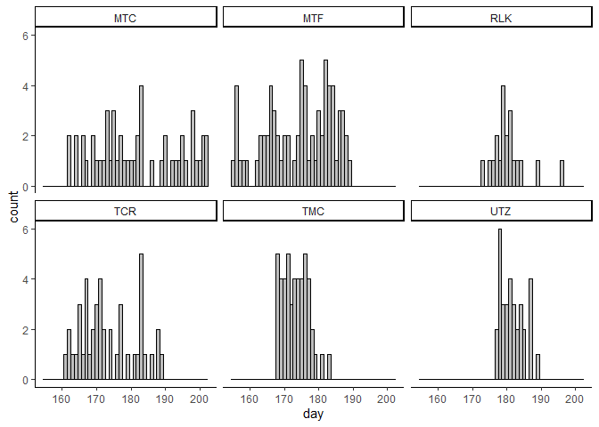
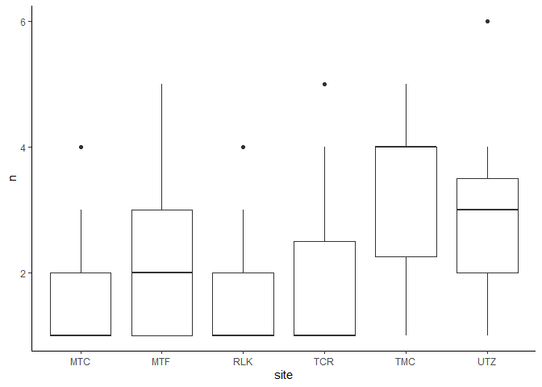
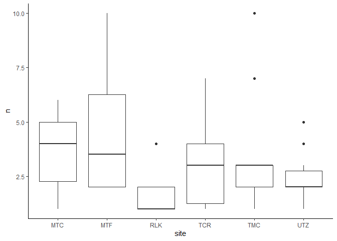
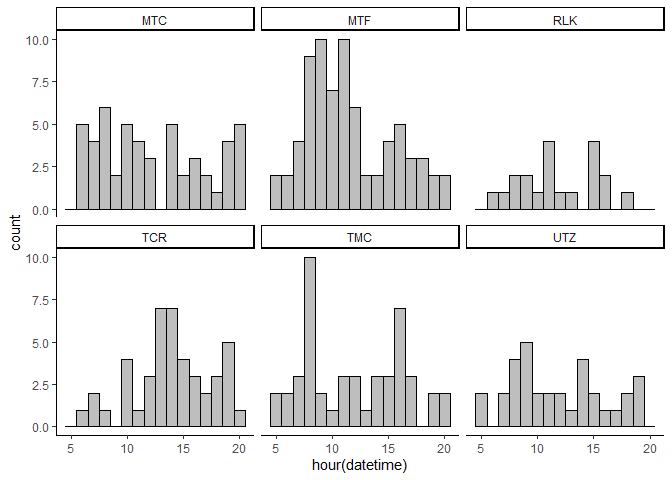
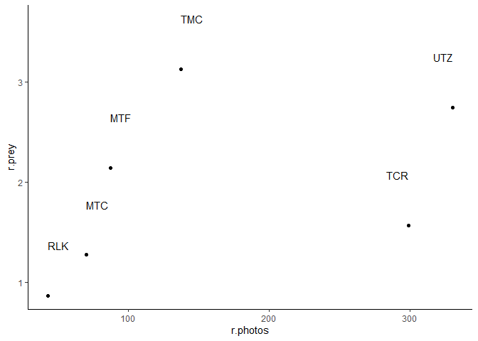

Deliveries
================

Now that I've looked at the data itself, let's look at what it tells me about what's being delivered and how. I'll start with:

-   Timing of deliveries & new prey
-   What gets identified & what doesn't
-   Who delivers food (male or female)
-   What's getting eaten and where

``` r
# Load up some libraries.
library('tidyverse')
library('lubridate')
library('ggplot2')
library('knitr')
library('kableExtra')

# Import the data.
df <- read.csv('../data/interim/camera_data.csv', stringsAsFactors=FALSE)

df <- df %>% mutate(datetime=parse_date_time(datetime, 
                       orders=c('%Y-%m-%d %H:%M:%S', '%Y/%m/%d %H:%M:%S')))
```

First thing is to look at is number of daily deliveries.

``` r
df %>% mutate(day=yday(datetime)) %>%
  filter(interest %in% c('delivery', 'newprey')) %>%
  ggplot(aes(x=day)) +
  geom_histogram(binwidth=1, color='black', fill='gray') +
  theme_classic() +
  facet_wrap(vars(site))
```



What's intesting here is that all of the sites have some number of days when no food was brough to the nest whatsoever. I could visualize this another way...

``` r
df %>% mutate(day=yday(datetime), site=as.factor(site)) %>%
  filter(interest %in% c('delivery', 'newprey')) %>%
  group_by(site, day) %>%
  summarize(n=n()) %>%
  ggplot(aes(x=site, y=n)) +
  geom_boxplot() +
  theme_classic()
```



The problem is that this is in no way controlled for sampling effort. The variable efficacy of each camera at capturing prey items (whether delivered or appearing) means that these numbers aren't "real."

I don't know what affects a camera's efficiency. It doesn't appear to be number of pictures taken, since I checked that last time. So I can't treat this like a time or distance sampled problem. But I could I treat each camera as an individual observer, and pretend like some cameras are like good field techs and some cameras are like bad field techs?

Maybe I'll come back to that. I'm not sure how important it is that I know exactly how many items were delivered per day.

The next this to look at is timing of deliveries. I can make the exact same graph as above, but by hour instead of day.

``` r
df %>% mutate(hour=hour(datetime), site=as.factor(site)) %>%
  filter(interest %in% c('delivery', 'newprey')) %>%
  group_by(site, hour) %>%
  summarize(n=n()) %>%
  ggplot(aes(x=site, y=n)) +
  geom_boxplot() +
  theme_classic()
```



Though again, I don't know that this means anything since I have no way to control for bias.

And what time of day gets the most deliveries?

``` r
df %>% mutate(hour=hour(datetime), site=as.factor(site)) %>%
  filter(interest %in% c('delivery', 'newprey')) %>%
  ggplot(aes(x=hour(datetime))) +
  geom_histogram(binwidth=1, color='black', fill='gray') +
  theme_classic() +
  facet_wrap(vars(site))
```



So maybe a peak around 10 am, but nothing obvious. Again, this is muddled by the uneven triggering behavior of the cameras.

Maybe a fast thing to check would be not captures ~ mean(trigger rate) but rather captures ~ photos/day--similar, but slightly different measures.

``` r
# Calculate captures of prey per day.
captures <- df %>% filter(interest %in% c('delivery', 'newprey')) %>%
  group_by(site) %>%
  summarize(n.prey=n(), f.prey=min(datetime), l.prey=max(datetime)) %>%
  mutate(f.prey=date(f.prey), l.prey=date(l.prey)) %>%
  mutate(d.prey=difftime(l.prey, f.prey))

# Calculate photos taken per day.
photos <- df %>% group_by(site) %>%
  summarize(n.photos=n(), f.photos=min(datetime), l.photos=max(datetime)) %>%
  mutate(f.photos=date(f.photos), l.photos=date(l.photos)) %>%
  mutate(d.photos=difftime(l.photos, f.photos))

# Bind, calculate rates, and graph.
bind_cols(photos, captures) %>%
  mutate(r.photos=n.photos/as.numeric(d.photos), r.prey=n.prey/as.numeric(d.prey)) %>%
  ggplot(aes(x=r.photos, y=r.prey, label=site)) +
  geom_point() +
  geom_text(hjust='inward', nudge_y = 0.5) +
  theme_classic()
```



Ok, that's a much stronger relationship. But can I use this to correct for missing captures??
