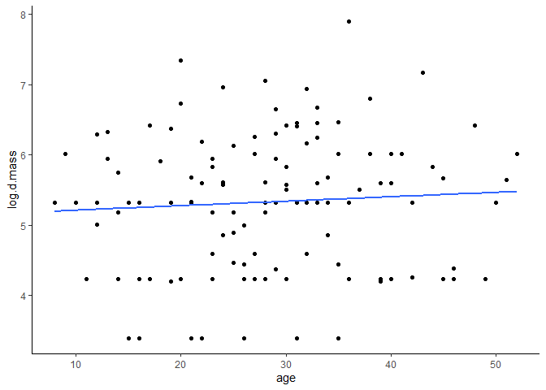

Delivery predictors
================

I want to see if brood size or brood age has any impact on the biomass of prey deliveries, or the proportion of bird:mammal delivered to the nest.

This is going to involve a lot of data wrangling! My first step is to get a table of each day for each site, with the mass delivered, the age of the chicks, and how many chicks were present. I already have a lot of that done.

Rogers and Smithers both state they log-transform their biomass data. Rogers just says they used the natural log on their biomass, and that's it. Smithers says they use log (10, I assume) of the *daily* biomass per nest and then adding 1 (why??). I think I'll go with ln (which is apparently the default for `log()` in R).

``` r
# Load up some libraries.
library('tidyverse')
library('lubridate')
library('ggplot2')
library('knitr')
library('kableExtra')

# Import the data.
df <- read.csv('../data/interim/camera_corrected.csv', stringsAsFactors=FALSE)

# Do the datetime thing.
df <- df %>% mutate(datetime=parse_date_time(datetime, 
                       orders=c('%Y-%m-%d %H:%M:%S', '%Y/%m/%d %H:%M:%S')))

source('../src/prey_attributes_date.R')

mass.for.model <- items.alt %>% mutate(date=date(datetime)) %>% 
  group_by(site, date) %>% 
  mutate(d.mass=sum(mass), log.d.mass=log(d.mass)) %>% 
  pivot_wider(names_from=class, values_from=mass, values_fill=list(mass=0)) %>% 
  mutate(Aves=sum(Aves), Mammalia=sum(Mammalia), Unknown=sum(Unknown)) %>% 
  arrange(site, date) %>% 
  dplyr::select(site, date, Aves, Mammalia, Unknown, d.mass, log.d.mass) %>% 
  distinct() %>% 
  mutate(p.mammal=Mammalia/d.mass)
```

That gets me a table of the total biomass and proportion of mammalian biomass per site per day. I did not fill in zero-delivery days with zeroes, because I'm worried that will screw things up, especially with the proportions. Of course, *not* have zero-filled days might screw things up with the amount, so who knows.

Next is to get chick age and number of chicks. I took a stab at number of chicks and it turned out way harder than I thought. So I'll try working on age for a bit.

I have a newly updated dataset with improved hatch date estimates.

``` r
# Import data.
nests <- read.csv('../data/raw/camera_nests_2019.csv', stringsAsFactors=FALSE)

# Do the datetime thing.
nests <- nests %>% mutate(est_hatch=ymd(est_hatch))

# Table with date and age for each site.
age <- nests %>% dplyr::select(site, est_hatch) %>% 
  mutate(fledge=est_hatch + 99) %>% 
  pivot_longer(cols=2:3) %>% 
  group_by(site) %>% 
  complete(nesting(site), value=seq(min(value), max(value), by='day')) %>% 
  mutate(age=seq(1:100), date=value) %>% 
  dplyr::select(site, date, age)

# Now graft them together.
mass.for.model <- left_join(mass.for.model, age) %>% 
  mutate(age=as.numeric(age))
```

That was... actually pretty easy. I don't have brood size sorted, yet, but I can start modelling age now. I can start easy with log(daily mass) ~ chick age. Miller does this with a linear model (year as fixed effect), Rogers also uses a linear model, and Smithers Uses an ANOVA (why??).

``` r
mass <- lm(log.d.mass ~ age, data=mass.for.model)

summary(mass)
```

    ## 
    ## Call:
    ## lm(formula = log.d.mass ~ age, data = mass.for.model)
    ## 
    ## Residuals:
    ##      Min       1Q   Median       3Q      Max 
    ## -1.97416 -0.89621  0.06733  0.65014  2.51857 
    ## 
    ## Coefficients:
    ##             Estimate Std. Error t value Pr(>|t|)    
    ## (Intercept) 5.146996   0.270864  19.002   <2e-16 ***
    ## age         0.006333   0.008975   0.706    0.482    
    ## ---
    ## Signif. codes:  0 '***' 0.001 '**' 0.01 '*' 0.05 '.' 0.1 ' ' 1
    ## 
    ## Residual standard error: 0.978 on 117 degrees of freedom
    ## Multiple R-squared:  0.004238,   Adjusted R-squared:  -0.004272 
    ## F-statistic: 0.498 on 1 and 117 DF,  p-value: 0.4818

Let's plot it.

``` r
ggplot(mass.for.model, aes(x=age, y=log.d.mass)) +
  geom_point() +
  theme_classic() +
  geom_smooth(method='lm', formula=y ~ x, se=FALSE)
```



Yeah, so basically a straight line. Which makes total sense because the coefficient is 0.006, so every day the chicks age, the parents bring them a fraction of a gram more food.
