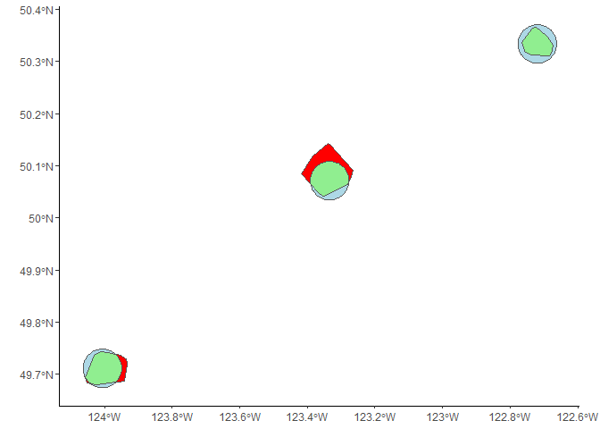

Better MCPs
================

I made MCPs earlier, but using all of my available telemetry data. But now I want to limit that down to just the breeding season. I also fixed a projection error with my telemetry data that probably won't change anything because it was for HAR08 who never went anywhere anyway, but it means I have a "new" data set.

``` r
# Load up some libraries
library('tidyverse')
library('lubridate')
library('ggplot2')
library('adehabitatHR')
library('sf')

# Load up the 'new' telemetry data.
df <- read.csv('../data/processed/telemetry_2018-2019.csv', stringsAsFactors=FALSE) %>% 
  drop_na('lat')

# Do the datetime thing.
df$date <- ymd(df$date)

# I previously defined nestling and fledgling stages.
breeding.2019 <- interval(ymd(20190511), ymd(20190901))
breeding.2018 <- interval(ymd(20180511), ymd(20180901))

# Filter out the breeding season points.
breeding <- df %>% filter(date %within% breeding.2018 | breeding.2019)

# Make it a spatial object, transform to UTM so area makes sense.
breeding <- st_as_sf(breeding, coords=c('lon', 'lat')) %>%
  st_set_crs('+proj=longlat +ellps=WGS84 +datum=WGS84 +no_defs') %>%
  st_transform("+proj=utm +zone=10 +datum=WGS84 +units=m +no_defs")

# Make some 95% MCPs.
mcp.95 <- breeding %>%
  dplyr::select(id, geometry) %>%
  as_Spatial() %>%
  mcp(percent=95, unin='m', unout='ha')
```

Of course, I have a bunch of camera sites that don't have telemetry. So I need another way to estimate home range for these sites. So I'll use the average 95% MCP to create circles centered around those nests. I'll use telemetry from HAR09 (2019 MTC male), HAR04 (2019 RLK female), HAR05 (2019 SKA male), and HAR07 (2018 TCR male). HAR04 is a female and so kind of doesn't fit, but she moved around a lot, acting a lot more like a male than other females, so I'll include her.

``` r
mean.area <- breeding %>% filter(id %in% 
                                   c('HAR09', 'HAR04', 'HAR05', 'HAR07')) %>% 
  dplyr::select(id, geometry) %>%
  as_Spatial() %>%
  mcp.area(percent=95, unin='m', unout='ha', plotit=FALSE) %>% 
  pivot_longer(cols=1:4) %>% 
  summarize(mean(value))

mean.area
```

    ## # A tibble: 1 x 1
    ##   `mean(value)`
    ##           <dbl>
    ## 1         5340.

Now bring in the nest locations and draw a circle around each.

``` r
nests <- read.csv('../data/raw/camera_nests_2019.csv', stringsAsFactors=FALSE)

# Make it a spatial object, transform to UTM so area makes sense.
nests.sf <- st_as_sf(nests, coords=c('lon', 'lat')) %>%
  st_set_crs('+proj=longlat +ellps=WGS84 +datum=WGS84 +no_defs') %>%
  st_transform("+proj=utm +zone=10 +datum=WGS84 +units=m +no_defs")

# Buffers are defined using radius. I have area.

# 5339.703 ha -> km2
area.km <- mean.area/100
# 53.39703 km2

# Area -> radius (km2)
radius <- sqrt(area.km/pi)
# 4.122718 km

# Km -> m
radius <- radius*1000
# 4122.718 m

# Now draw the buffers.
buffers <- st_buffer(nests.sf, dist=as.numeric(radius))
```

I'm interested to see how well these "ideal" (or "fake") home ranges compare to the real ones. I have circles and MCPs for TCR (HAR07), RLK (HAR04), and MTC (HAR09). HAR08 (2019 TCR female) and HAR10 (2019 MTC female) are basically useless because they hardly ever use the nest, and we don't have data back from HAR09 (2019 UTZ female) yet. And HAR05 (2019 SKA male) didn't have a camera.

``` r
# Set CRS for the MCPs, convert to a sf object.
mcp.95 <- st_as_sf(mcp.95) %>% 
  st_set_crs("+proj=utm +zone=10 +datum=WGS84 +units=m +no_defs")

# Stick the relevant sites in their own objects.
int.buff <- buffers %>% filter(site %in% c('TCR', 'RLK', 'MTC'))
int.mcp <- mcp.95 %>% filter(id %in% c('HAR07', 'HAR04', 'HAR09'))

# Find the intersection.
intersections <- st_intersection(int.buff, int.mcp)

# What percent of the "true" MCP is included in the "ideal" circle?
round(st_area(intersections)/st_area(int.mcp)*100)
```

    ## Units: [1]
    ## [1]  86  60 100

The last site is MTC, so it looks like that MCP is actually smaller than "ideal" circle. Generally, the circles seem to be about the right size it's just that the MCPs are off-center of the nest.

``` r
ggplot() +
  geom_sf(data=int.mcp, fill='red') +
  geom_sf(data=int.buff, fill='lightblue') +
  geom_sf(data=intersections, fill='lightgreen') +
  theme_classic()
```



So we know the circles aren't perfect, but that's to be expected. Hopefully they're good enought!

Now I need a single object which contains all the circles and MCPs I need for landscape composition. So that's the circles for TMC, UTZ, and MTF, and the MCPs for RLK, MTC, and TCR.

``` r
# Extract the relevant buffers.
l.buff <- buffers %>% filter(site %in% c('TMC', 'UTZ', 'MTF')) %>% 
  dplyr::select(site, geometry)

# Extract the relevant MCPs and rename to sites.
l.mcp <- mcp.95 %>% filter(id %in% c('HAR04', 'HAR09', 'HAR07')) %>% 
  mutate(id=as.character(id),
         site=case_when(
    id == 'HAR04' ~ 'RLK',
    id == 'HAR09' ~ 'MTC',
    id == 'HAR07' ~ 'TCR',
    TRUE ~ id
  )) %>% 
  dplyr::select(site, geometry)

# And bind them together.
landscapes <- rbind(l.buff, l.mcp)

# Export to shapefile for use in QGIS.
#st_write(landscapes, '../data/interim/camera_homerange_2019.shp')
```
