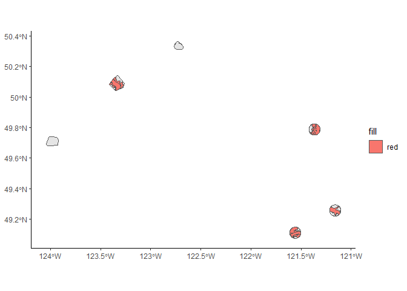
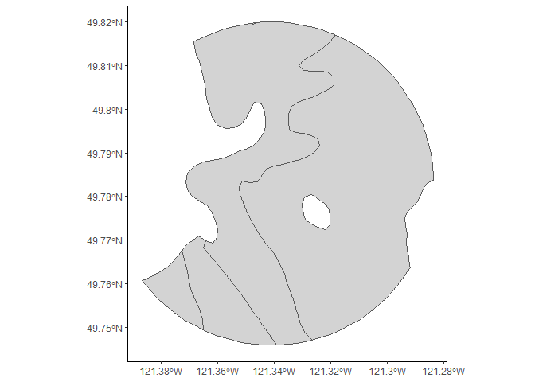

BEC zones
================

According to NGRT 2008, there are two "regions" within coastal BC, with regards to goshawk management. The *transition zone* is the drier variants of the Coastal Western Hemlock biogeoclimatic zone on the coastal mainland and may be an area where the coastal *laingi* subspecies and interior *atricapillus* subspecies may overlap. Bascially, this is an area where the models built for Vancouver Island and the coast may start breaking down because it is more similar to the interior.

These subzones are CWHds1 and CWHms1.

Currently, sites are considered either transitional or coastal, either-or. I want to look at how well that division captures the forest types present in these sites.

I have a couple of shapefiles I can use for this:

-   The homeranges I previously calculated, either from telemetry or averages.
-   BEC zone data (clipped to make a reasonable size)

``` r
# Load up some libraries.
library('tidyverse')
library('ggplot2')
library('sf')

hr <- st_read('../data/interim/camera_homerange_2019.shp')
```

    ## Reading layer `camera_homerange_2019' from data source `C:\Users\Gwyn\sfuvault\productivity-occupancy\data\interim\camera_homerange_2019.shp' using driver `ESRI Shapefile'
    ## Simple feature collection with 6 features and 1 field
    ## geometry type:  POLYGON
    ## dimension:      XY
    ## bbox:           xmin: 423674.5 ymin: 5436318 xmax: 638750.7 ymax: 5579993
    ## CRS:            32610

``` r
bec <- st_read('../data/interim/homerange_BEC_2019.shp')
```

    ## Reading layer `homerange_BEC_2019' from data source `C:\Users\Gwyn\sfuvault\productivity-occupancy\data\interim\homerange_BEC_2019.shp' using driver `ESRI Shapefile'
    ## Simple feature collection with 32 features and 21 fields
    ## geometry type:  MULTIPOLYGON
    ## dimension:      XY
    ## bbox:           xmin: 423674.5 ymin: 5436318 xmax: 638750.7 ymax: 5579993
    ## CRS:            32610

``` r
#tz <- st_read('../data/processed/new_transition_zone.shp')

bec %>% data.frame() %>% 
  transmute(abbr=MAP_LABEL, name=ZONE_NAME, sub=SUBZONE_NA) %>% 
  dplyr::select(abbr, name, sub) %>% 
  distinct()
```

    ##       abbr                              name                           sub
    ## 1    IDFww              Interior Douglas-fir                      Wet Warm
    ## 2   CWHds1           Coastal Western Hemlock               Dry Submaritime
    ## 3   CWHms1           Coastal Western Hemlock             Moist Submaritime
    ## 4  ESSFmw1 Engelmann Spruce -- Subalpine Fir                    Moist Warm
    ## 5   CMAunp   Coastal Mountain-heather Alpine Undifferentiated and Parkland
    ## 6   IMAunp  Interior Mountain-heather Alpine Undifferentiated and Parkland
    ## 7    MHmm2                  Mountain Hemlock                Moist Maritime
    ## 8    CWHdm           Coastal Western Hemlock                  Dry Maritime
    ## 9   CWHvm2           Coastal Western Hemlock             Very Wet Maritime
    ## 10  CWHxm1           Coastal Western Hemlock             Very Dry Maritime

So CWHds1 is here, but no CWHmm1. And IDFww is interior douglas-fir, which isn't even considered "transitional" because it's technically full interior habitat type. But it's present in my "coastal" sites. And it makes no sense to me that something labelled "very dry" doesn't count as transition.

``` r
# Pull out the transitional variants.
tz <- bec %>% filter(MAP_LABEL %in% c('CWHds1', 'CWHms1'))

# Plot it.
ggplot() +
  geom_sf(data=hr) +
  geom_sf(data=tz, aes(fill='red')) +
  theme_classic()
```



So how much overlap is there, actually, between these sites and tranzition-types?

``` r
# Pull out UTZ site to start.
utz <- hr %>% filter(site == 'UTZ')

# Calculate the overlap.
st_intersection(utz, tz) %>% 
  st_area() %>% sum() / st_area(utz) * 100
```

    ## 75.1727 [1]

``` r
# Plot the overlap.
st_intersection(utz, tz) %>% 
  ggplot() +
  geom_sf(fill='lightgrey') +
  theme_classic()
```



Cool. And then just do it for the rest, I guess. I'm sure there's a fancy way to automate this but for the life of my I can't figure it out so I guess I'll do it the hard way.

``` r
tmc <- hr %>% filter(site == 'TMC')

tz.tmc <- st_intersection(tmc, tz) %>% 
  st_area() %>% as.numeric() %>% 
  data.frame() %>% 
  rename(int=1) %>% 
  mutate(t.area=as.numeric(st_area(tmc)), 
         tz.per=round(int/t.area*100, digits=2), site='TMC')

tcr <- hr %>% filter(site == 'TCR')

tz.tcr <- st_intersection(tcr, tz) %>% 
  st_area() %>% as.numeric() %>% 
  data.frame() %>% 
  rename(int=1) %>% 
  mutate(t.area=as.numeric(st_area(tcr)), 
         tz.per=round(int/t.area*100, digits=2), site='TCR')

mtc <- hr %>% filter(site == 'MTC')

tz.mtc <- st_intersection(mtc, tz) %>% 
  st_area() %>% as.numeric() %>% 
  data.frame() %>% 
  rename(int=1) %>% 
  mutate(t.area=as.numeric(st_area(mtc)), 
         tz.per=round(int/t.area*100, digits=2), site='MTC')

mtf <- hr %>% filter(site == 'MTF')

tz.mtf <- st_intersection(mtf, tz) %>% 
  st_area() %>% as.numeric() %>% 
  data.frame() %>% 
  rename(int=1) %>% 
  mutate(t.area=as.numeric(st_area(mtf)), 
         tz.per=round(int/t.area*100, digits=2), site='MTF')

tz.utz <- st_intersection(utz, tz) %>% 
  st_area() %>% as.numeric() %>% 
  data.frame() %>% 
  rename(int=1) %>% 
  mutate(t.area=as.numeric(st_area(utz)), 
         tz.per=round(int/t.area*100, digits=2), site='UTZ')

# RLK is odd bc it's 0% transition.
rlk <- hr %>% filter(site == 'RLK')

tz.rlk <- data.frame(
  int=0, t.area=as.numeric(st_area(rlk)), tz.per=0, site=as.character('RLK')
)

# Make a nice table.
tz.index <- bind_rows(tz.mtc, tz.mtf, tz.tcr, tz.tmc, tz.rlk, tz.utz) %>%
  group_by(site) %>% 
  summarize(area=mean(t.area), 
            tz.intersect=sum(int), percent.tz=sum(tz.per))

# What are the official zones?
data.frame(
  site=c('MTC', 'MTF', 'RLK', 'TCR', 'TMC', 'UTZ'),
  official.zone=c('U', 'TZ', 'CS', 'TZ', 'U', 'TZ')
) %>% 
  full_join(tz.index)
```

    ##   site official.zone     area tz.intersect percent.tz
    ## 1  MTC             U 28452664     765960.2       2.69
    ## 2  MTF            TZ 53372634   44923278.3      84.16
    ## 3  RLK            CS 49110718          0.0       0.00
    ## 4  TCR            TZ 72600273   51206064.9      70.53
    ## 5  TMC             U 53372634   26877696.1      50.36
    ## 6  UTZ            TZ 53372634   40121650.1      75.17

That looks nice. It shows the range of transition-ness, and how MTF, at 84% transition-type habitat, is considered equivalent to TMC, with only 50% transition-type habitat.
