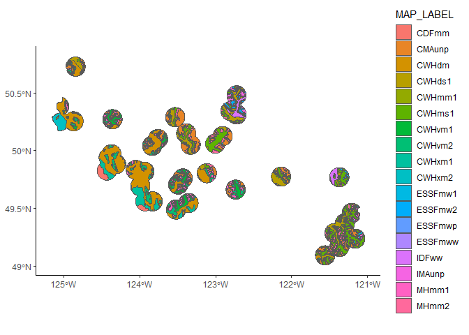
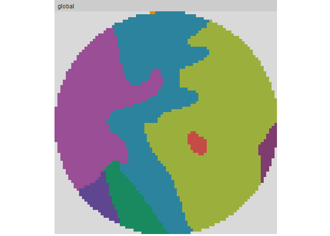
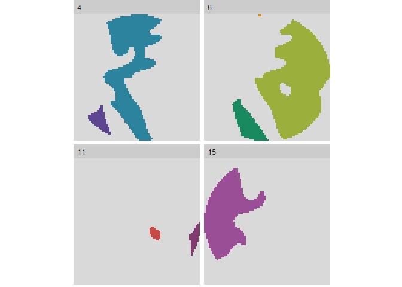

Rasterizing stuff
================

I have a shapefile of BEC zones (forest types, basically) that I've clipped to my annual homerange estimates. It looks like this:

``` r
# Load up some libraries.
library('sf')
library('ggplot2')
library('raster')
library('tidyverse')
library('rgdal')
library('landscapemetrics')

# Load in the data.
bec <- st_read('../data/processed/BEC_annual-homerange_clipped.shp')
```

    ## Reading layer `BEC_annual-homerange_clipped' from data source `C:\Users\Gwyn\sfuvault\productivity-occupancy\data\processed\BEC_annual-homerange_clipped.shp' using driver `ESRI Shapefile'
    ## Simple feature collection with 234 features and 21 fields
    ## geometry type:  MULTIPOLYGON
    ## dimension:      XY
    ## bbox:           xmin: 342073.1 ymin: 5431194 xmax: 643787.8 ymax: 5631755
    ## CRS:            32610

``` r
ggplot() +
  geom_sf(data=bec, aes(fill=MAP_LABEL)) +
  theme_classic()
```



Pretty cool. But what I need to do is rasterize it.

``` r
# Set raster extent based on BEC shapefile.
ext <- extent(bec)

# Make an empty raster to populate with values.
r <- raster(ext, res=c(100, 100))

# Populate BEC polygon data onto empty raster grid.
r.bec <- rasterize(bec, r, 'MAP_LABEL')
```

And that's great, but I have no idea what numerical values were mapped to which categorical forest type. Supposedly, the raster value is the same as the interger displatyed by `levels()` and I can add that to the raster.

``` r
# Get the categories from the original shapefile.
bec.levels <- data.frame(levels(bec[["MAP_LABEL"]])) %>% 
  rownames_to_column() %>% 
  rename(ID=1, map_label=2) %>% 
  mutate(ID=as.numeric(ID))

# Add them to the raster.
# levels(r.bec) <- bec.levels

# Save the raster image.
# writeRaster(r.bec, '../data/interim/bec_raster_SC.tif', format='GTiff')
```

That... seems to have worked. But it's too big to play with. I'll bring in the smaller BEC layer I made earlier to start with.

``` r
# Load homerange data.
hr <- st_read('../data/interim/camera_homerange_2019.shp')
```

    ## Reading layer `camera_homerange_2019' from data source `C:\Users\Gwyn\sfuvault\productivity-occupancy\data\interim\camera_homerange_2019.shp' using driver `ESRI Shapefile'
    ## Simple feature collection with 6 features and 1 field
    ## geometry type:  POLYGON
    ## dimension:      XY
    ## bbox:           xmin: 423674.5 ymin: 5436318 xmax: 638750.7 ymax: 5579993
    ## CRS:            32610

``` r
# Pull out one site as a toy.
utz.hr <- hr %>% filter(site == 'UTZ')

# Clip the BEC poly to the UTZ homerange.
utz.bec <- st_intersection(utz.hr, bec)

# Set raster extent based on UTZ homerange.
utz.ext <- extent(utz.bec)

# Make an empty raster to populate with values.
utz.empty <- raster(utz.ext, res=c(100, 100))

# Populate BEC polygon data onto empty raster grid.
utz.r <- rasterize(utz.bec, utz.empty, 'MAP_LABEL')
```

There's a R package that duplicates most of the function of FRAGSTATS, `landscapemetrics`.

``` r
show_patches(utz.r, labels=FALSE)
```



That shows all of the patches in the landsape. And I can break them apart like this:

``` r
show_patches(utz.r, class='all', labels=FALSE)
```



which is pretty cool. Let's start with something very basic: patch area.

``` r
lsm_p_area(utz.r)
```

    ## # A tibble: 8 x 6
    ##   layer level class    id metric value
    ##   <int> <chr> <int> <int> <chr>  <dbl>
    ## 1     1 patch     4     1 area     131
    ## 2     1 patch     4     2 area    1430
    ## 3     1 patch     6     3 area     287
    ## 4     1 patch     6     4 area    2161
    ## 5     1 patch     6     5 area       2
    ## 6     1 patch    11     6 area      45
    ## 7     1 patch    11     7 area      82
    ## 8     1 patch    15     8 area    1198

So as small as 2 ha and as large as 2161. And what's the class area?

``` r
# Mean patch size per class, total class area.
calculate_lsm(utz.r, what=c('lsm_c_np', 'lsm_c_area_mn', 'lsm_c_ca')) %>% 
  pivot_wider(id_cols=class, names_from=metric, values_from=value) %>% 
  left_join(bec.levels, by=c('class'='ID'))
```

    ## # A tibble: 4 x 5
    ##   class area_mn    ca    np map_label
    ##   <dbl>   <dbl> <dbl> <dbl> <fct>    
    ## 1     4   780.   1561     2 CWHds1   
    ## 2     6   817.   2450     3 CWHms1   
    ## 3    11    63.5   127     2 ESSFmw1  
    ## 4    15  1198    1198     1 IDFww

So mostly big chunks of western hemlock with a some smaller patches of Englemann sprice and one big block of interior Douglas-fir.
