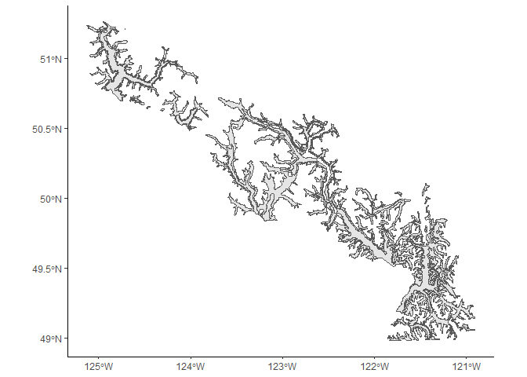
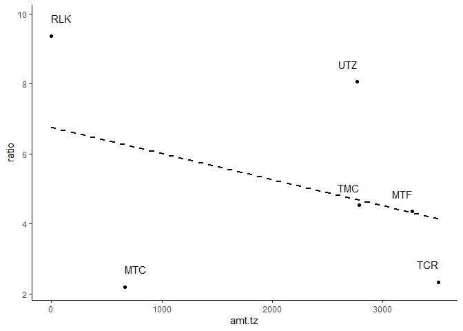
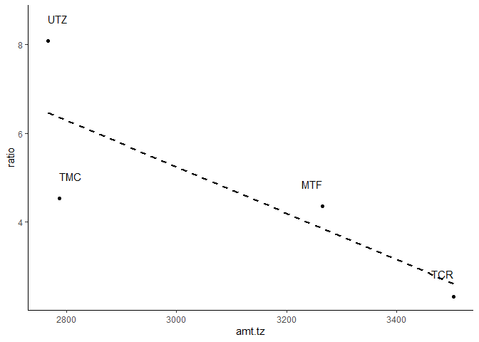

Mammals and zones
================

Unsurprisingly, since they were very silly models, my last set of models didn't turn up anything. Here's a slightly more realistic idea:

The proportion of mammal to bird biomass in the diet is affected by the amount of transition zone-type habitats within a territory.

``` r
# Load some libraries.
library(tidyverse)
library(landscapemetrics)
library(raster)
library(sf)

# Bring in diet data.
df <- read_csv('../data/interim/camera_corrected.csv')
source('../src/prey_attributes.R')

head(items)
```

    ## # A tibble: 6 x 9
    ##   site  class family    genus     species   common         size   group     mass
    ##   <chr> <chr> <chr>     <chr>     <chr>     <chr>          <chr>  <chr>    <dbl>
    ## 1 TCR   Aves  Columbid… Patagoie… fasciata  band-tailed p… Medium Large b… 379. 
    ## 2 TCR   Aves  Columbid… Patagoie… fasciata  band-tailed p… Medium Large b… 379. 
    ## 3 TCR   Aves  Columbid… Patagoie… fasciata  band-tailed p… Medium Large b… 379. 
    ## 4 MTF   Aves  Corvidae  Cyanocit… stelleri  Steller's jay  Medium Medium … 128  
    ## 5 UTZ   Aves  Corvidae  Cyanocit… stelleri  Steller's jay  Medium Medium … 128  
    ## 6 MTF   Aves  Corvidae  Perisore… canadens… gray jay       Medium Medium …  70.2

``` r
# Calculate proportion of mammal biomass per site.
mammal.mass <- items %>% mutate(mass=as.numeric(mass)) %>% 
  group_by(site) %>% 
  mutate(total=sum(mass)) %>% 
  filter(class == 'Mammalia') %>% 
  mutate(amount.ml=sum(mass), prop.ml=amount.ml/total) %>% 
  dplyr::select(site, prop.ml) %>% distinct()

mammal.mass
```

    ## # A tibble: 6 x 2
    ## # Groups:   site [6]
    ##   site  prop.ml
    ##   <chr>   <dbl>
    ## 1 UTZ     0.868
    ## 2 MTC     0.583
    ## 3 MTF     0.700
    ## 4 TCR     0.595
    ## 5 TMC     0.711
    ## 6 RLK     0.538

``` r
# Calculate proportion of mammal biomass per site.
avian.mass <- items %>% mutate(mass=as.numeric(mass)) %>% 
  group_by(site) %>% 
  mutate(total=sum(mass)) %>% 
  filter(class == 'Aves') %>% 
  mutate(amount.av=sum(mass), prop.av=amount.av/total) %>% 
  dplyr::select(site, prop.av) %>% distinct()

avian.mass
```

    ## # A tibble: 6 x 2
    ## # Groups:   site [6]
    ##   site  prop.av
    ##   <chr>   <dbl>
    ## 1 TCR    0.255 
    ## 2 MTF    0.161 
    ## 3 UTZ    0.108 
    ## 4 MTC    0.264 
    ## 5 TMC    0.157 
    ## 6 RLK    0.0574

Since some items were not identified to class, the proportion of avian biomass is not simply the inverse of mammalian biomass.

Next step is to pull in the landscape data. Last time I used all the BEC zones, but I do have a simpler shapefile that delineates just the transition zone.

``` r
# Import transition zone shapefile.
tz <- st_read('../data/processed/new_transition_zone.shp')
```

    ## Reading layer `new_transition_zone' from data source `C:\Users\Gwyn\sfuvault\productivity-occupancy\data\processed\new_transition_zone.shp' using driver `ESRI Shapefile'
    ## Simple feature collection with 36 features and 23 fields
    ## geometry type:  MULTIPOLYGON
    ## dimension:      XY
    ## bbox:           xmin: 343952.3 ymin: 5428110 xmax: 653480.1 ymax: 5682236
    ## CRS:            32610

``` r
# Look at it.
ggplot() +
  geom_sf(data=tz) +
  theme_classic()
```



Then rasterize it.

``` r
# Set raster extent based on tz shapefile.
ext <- extent(tz)

# Make an empty raster to populate with values.
r <- raster(ext, res=c(100, 100))

# Populate BEC polygon data onto empty raster grid.
r.tz <- rasterize(tz, r, 'MAP_LABEL')
```

...and wait. (This takes a bit.)

Then save it for later.

``` r
# Get labels from the original shapefile.
tz.levels <- data.frame(levels(tz[["MAP_LABEL"]])) %>% 
  rownames_to_column() %>% 
  rename(ID=1, map_label=2) %>% 
  mutate(ID=as.numeric(ID))

# Add them to the raster.
levels(r.tz) <- tz.levels

# Save the raster image.
# writeRaster(r.tz, '../data/interim/tz_raster_SC.tif', format='GTiff')
```

Then get the nest locations, calculate territory centroids, and extract the proportion of transition zone-types for each.

``` r
# Import data and get centroids for camera nests.
sites <- read_csv('../data/processed/the_big_list_of_nests.csv') %>% 
  group_by(name) %>% 
  mutate_at(c('lat', 'lon'), mean) %>% 
  mutate_at(vars(starts_with('status')), max) %>% 
  mutate_at(c('telemetry', 'cameras', 'remains'), max) %>% 
  dplyr::select(-nest, -NOTES) %>% 
  distinct() %>% 
  filter(cameras > 0)

# Make site table a spatial object and make it UTMs.
sites.sf <- st_as_sf(sites, coords=c('lon', 'lat')) %>%
  st_set_crs('+proj=longlat +ellps=WGS84 +datum=WGS84 +no_defs') %>%
  st_transform("+proj=utm +zone=10 +datum=WGS84 +units=m +no_defs")

# Convert approximate homerange area in ha to radius in m
a.hr.ha <- 3700
r.hr.m <- sqrt(a.hr.ha*10000/pi)
```

Mind you, I recently learned that the nest locations I have contain a lot of errors, so obviously that needs to get fixed before I go on to my final analysis.

``` r
# Calculate area per class per site.
class.area <- sample_lsm(r.tz, y=sites.sf, size=r.hr.m, what='lsm_c_ca', 
           shape='circle') %>% 
  # Amend class number with BEC name.
  left_join(data.frame(levels(r.tz)), by=c('class'='ID')) %>% 
# Reorganize by site.  
  pivot_wider(id_cols=plot_id, names_from=map_label, values_from=value, 
              values_fill=list(value=0))

# Amend with site names.
class.area <- dplyr::select(sites, site) %>% rownames_to_column() %>% 
  mutate(rowname=as.integer(rowname)) %>% 
  right_join(class.area, by=c('rowname'='plot_id'))

class.area
```

    ## # A tibble: 6 x 6
    ## # Groups:   name [6]
    ##   rowname name              site  CWHds1 CWHms1  `NA`
    ##     <int> <chr>             <chr>  <dbl>  <dbl> <dbl>
    ## 1       1 Mount Ford        MTF     1377   1888     0
    ## 2       2 Mt Currie         MTC      566     98     0
    ## 3       3 Ruby Lake         RLK        0      0    NA
    ## 4       4 Turbid Creek      TCR     2103   1400     0
    ## 5       5 Twenty Mile Creek TMC        0   2787     0
    ## 6       6 Utzilus           UTZ     1201   1566     0

Now add the diet data to this.

``` r
# Join everything together.
ml.tz <- left_join(mammal.mass, avian.mass) %>% 
  left_join(class.area)

# Do some cleaning.
ml.tz <- ml.tz %>% mutate(amt.tz=CWHds1 + CWHms1, ratio=prop.ml/prop.av) %>% 
  dplyr::select(site, name, prop.ml, prop.av, ratio, amt.tz)

ml.tz
```

    ## # A tibble: 6 x 6
    ## # Groups:   site [6]
    ##   site  name              prop.ml prop.av ratio amt.tz
    ##   <chr> <chr>               <dbl>   <dbl> <dbl>  <dbl>
    ## 1 UTZ   Utzilus             0.868  0.108   8.07   2767
    ## 2 MTC   Mt Currie           0.583  0.264   2.20    664
    ## 3 MTF   Mount Ford          0.700  0.161   4.36   3265
    ## 4 TCR   Turbid Creek        0.595  0.255   2.33   3503
    ## 5 TMC   Twenty Mile Creek   0.711  0.157   4.53   2787
    ## 6 RLK   Ruby Lake           0.538  0.0574  9.37      0

Take a look at the pattern.

``` r
# Plot it.
ggplot(ml.tz, aes(x=amt.tz, y=ratio, label=site)) +
  geom_point() +
  geom_text(hjust='inward', nudge_y = 0.5) +
  geom_smooth(method='lm', se=FALSE, color='black', linetype='dashed') +
  theme_classic()
```



Well that doesn't look promising.

``` r
# Make the model.
ratio.x.tz <- lm(ratio ~ amt.tz, data=ml.tz)

# Look at it.
summary(ratio.x.tz)
```

    ## 
    ## Call:
    ## lm(formula = ratio ~ amt.tz, data = ml.tz)
    ## 
    ## Residuals:
    ##        1        2        3        4        5        6 
    ##  3.37175 -4.06317  0.03472 -1.81002 -0.14515  2.61187 
    ## 
    ## Coefficients:
    ##               Estimate Std. Error t value Pr(>|t|)  
    ## (Intercept)  6.7623895  2.3970942   2.821   0.0478 *
    ## amt.tz      -0.0007473  0.0009427  -0.793   0.4723  
    ## ---
    ## Signif. codes:  0 '***' 0.001 '**' 0.01 '*' 0.05 '.' 0.1 ' ' 1
    ## 
    ## Residual standard error: 3.082 on 4 degrees of freedom
    ## Multiple R-squared:  0.1358, Adjusted R-squared:  -0.08029 
    ## F-statistic: 0.6284 on 1 and 4 DF,  p-value: 0.4723

Yeah, no, really not promising.

So this is totes cheating and drops my down to n = 4 which is meaningless, but what happens if I look at the transition zone sites alone?

``` r
# Pick just the sites with more than 1000 ha of tz-type habitats.
tz.ml.tz <- ml.tz %>% filter(amt.tz > 1000)

# Plot it.
ggplot(tz.ml.tz, aes(x=amt.tz, y=ratio, label=site)) +
  geom_point() +
  geom_text(hjust='inward', nudge_y = 0.5) +
  geom_smooth(method='lm', se=FALSE, color='black', linetype='dashed') +
  theme_classic()
```



``` r
# And model it.
lm(ratio ~ amt.tz, data=tz.ml.tz) %>% summary()
```

    ## 
    ## Call:
    ## lm(formula = ratio ~ amt.tz, data = tz.ml.tz)
    ## 
    ## Residuals:
    ##       1       2       3       4 
    ##  1.6089  0.4958 -0.2861 -1.8187 
    ## 
    ## Coefficients:
    ##              Estimate Std. Error t value Pr(>|t|)
    ## (Intercept) 20.881943   8.669925   2.409    0.138
    ## amt.tz      -0.005213   0.002800  -1.862    0.204
    ## 
    ## Residual standard error: 1.764 on 2 degrees of freedom
    ## Multiple R-squared:  0.6341, Adjusted R-squared:  0.4512 
    ## F-statistic: 3.467 on 1 and 2 DF,  p-value: 0.2037

So it makes a much prettier line but still doesn't make a pretty p value or anything. But it's something to think about for later, when I have a little more data, that there is a (v slim) possibility of different patterns.
