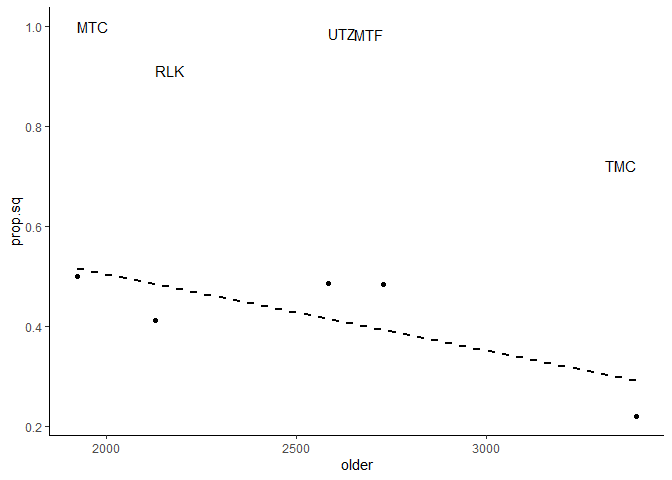

Edge species
================

Sooooo nothing with BEC zones has been promising so far. Let’s try
something else. Let’s switch to VRI data and see if amount of mature/old
growth forest is related to amount of squirrel in the diet, since
squirrels like old forests.

``` r
# Load some libraries.
library(tidyverse)
library(landscapemetrics)
library(raster)
library(sf)
library(AICcmodavg)
library(MuMIn)

# Bring in diet data.
df <- read_csv('../data/interim/camera_corrected.csv', guess_max=7000)
# I had some trouble with readr so I increased the number of rows used to guess.

source('../src/prey_attributes.R')

head(items)
```

    ## # A tibble: 6 x 9
    ##   site  class family    genus     species   common         size   group     mass
    ##   <chr> <chr> <chr>     <chr>     <chr>     <chr>          <chr>  <chr>    <dbl>
    ## 1 TCR   Aves  Columbid~ Patagoie~ fasciata  band-tailed p~ Medium Large b~ 379. 
    ## 2 TCR   Aves  Columbid~ Patagoie~ fasciata  band-tailed p~ Medium Large b~ 379. 
    ## 3 TCR   Aves  Columbid~ Patagoie~ fasciata  band-tailed p~ Medium Large b~ 379. 
    ## 4 MTF   Aves  Corvidae  Cyanocit~ stelleri  Steller's jay  Medium Medium ~ 128  
    ## 5 UTZ   Aves  Corvidae  Cyanocit~ stelleri  Steller's jay  Medium Medium ~ 128  
    ## 6 MTF   Aves  Corvidae  Perisore~ canadens~ gray jay       Medium Medium ~  70.2

``` r
# Calculate proportion of diet made up of squirrel at each site.
sq.mass <- items %>% mutate(mass=as.numeric(mass)) %>% 
  group_by(site) %>% 
  mutate(total=sum(mass)) %>% 
  filter(genus == 'Tamiasciurus') %>% 
  mutate(amount.sq=sum(mass), prop.sq=amount.sq/total) %>% 
  dplyr::select(site, prop.sq) %>% distinct()

sq.mass
```

    ## # A tibble: 6 x 2
    ## # Groups:   site [6]
    ##   site  prop.sq
    ##   <chr>   <dbl>
    ## 1 MTC     0.499
    ## 2 MTF     0.483
    ## 3 RLK     0.412
    ## 4 TCR     0.505
    ## 5 TMC     0.221
    ## 6 UTZ     0.485

That’s remarkably consistent.

The next step is to get the amount of mature forest for each of these
sites. Unfortunately, the VRI data for Turbid Creek is useless so that
drops me down to five sites. But I can pull in the VRI for the others…

``` r
# Import transition zone shapefile.
vri <- st_read('../data/external/VRI_camera-sites_2019.shp')
```

    ## Reading layer `VRI_camera-sites_2019' from data source `C:\Users\gwync\sfuvault\productivity-occupancy\data\external\VRI_camera-sites_2019.shp' using driver `ESRI Shapefile'
    ## Simple feature collection with 13321 features and 188 fields
    ## geometry type:  POLYGON
    ## dimension:      XY
    ## bbox:           xmin: 413289.1 ymin: 5428268 xmax: 645675.7 ymax: 5589928
    ## projected CRS:  WGS 84 / UTM zone 10N

Then I need to rasterize it. Which means first I need to break it down
into classes so I can assign a raster value. Unfortunately there’s no
single field in the VRI data that works for classification. I can break
this into:

  - Water (1)
  - Land (unvegetated) (2)
  - Vegetated (not forest) (3)
  - Deciduous (4)
  - Coniferous (regen, young, medium, and old) (5, 6, 7, 8)

<!-- end list -->

``` r
# Assign to classes.
# Regen/young/mature/old ages come from Zharikov et al. 2007
vri.class <- vri %>% mutate(hab.class=case_when(
  # Non-vegetated and water
  BCLCS_LV_1 == 'N' & BCLCS_LV_2 == 'W' ~ 1, 
  # Non-vegetated and not water
  BCLCS_LV_1 == 'N' & BCLCS_LV_2 != 'W' ~ 2, 
  # Vegetated and not trees
  BCLCS_LV_1 == 'V' & BCLCS_LV_2 == 'N' ~ 3,
  # Vegetated and mixed or deciduous trees
  BCLCS_LV_1 == 'V' & BCLCS_LV_4 %in% c('TB', 'TM') ~ 4,
  # Vegetated and coniferous trees
  BCLCS_LV_4 == 'TC' & PROJ_AGE_1 < 20 ~ 5,
  BCLCS_LV_4 == 'TC' & PROJ_AGE_1 >= 20 & PROJ_AGE_1 < 60 ~ 6,
  BCLCS_LV_4 == 'TC' & PROJ_AGE_1 >= 60 & PROJ_AGE_1 < 140 ~ 7,
  BCLCS_LV_4 == 'TC' & PROJ_AGE_1 >= 140 ~ 8,
  TRUE ~ 0
))

# See how it turned out.
vri.class %>% group_by(hab.class) %>% summarise(n())
```

    ## Simple feature collection with 9 features and 2 fields
    ## geometry type:  MULTIPOLYGON
    ## dimension:      XY
    ## bbox:           xmin: 413289.1 ymin: 5428268 xmax: 645675.7 ymax: 5589928
    ## projected CRS:  WGS 84 / UTM zone 10N
    ## # A tibble: 9 x 3
    ##   hab.class `n()`                                                       geometry
    ##       <dbl> <int>                                             <MULTIPOLYGON [m]>
    ## 1         0     4 (((600606.1 5446779, 600603.2 5446770, 600598.8 5446745, 6005~
    ## 2         1   161 (((614194.3 5436681, 614183 5436695, 614169 5436710, 614159 5~
    ## 3         2   225 (((602680.3 5431700, 602685.3 5431704, 602707.6 5431707, 6027~
    ## 4         3  1941 (((603601.2 5430599, 603602.8 5430598, 603614.9 5430601, 6036~
    ## 5         4   914 (((430627.7 5500706, 430626.3 5500707, 430566.1 5500733, 4305~
    ## 6         5   369 (((605749.1 5431176, 605748.7 5431176, 605727.5 5431183, 6057~
    ## 7         6  1194 (((605201.4 5431331, 605186.1 5431325, 605163.5 5431312, 6051~
    ## 8         7  3517 (((633582.3 5448838, 633545.9 5448848, 633524.2 5448851, 6334~
    ## 9         8  4996 (((603528.6 5431226, 603518.8 5431251, 603525.7 5431266, 6035~

A little investigating shows that the 4 polygons classed as 0 are
unclassified in the VRI or conifer polygons with unknown ages, so that
seems fine.

``` r
# Set raster extent based on tz shapefile.
ext <- extent(vri)

# Make an empty raster to populate with values.
r <- raster(ext, res=c(100, 100))

# Populate BEC polygon data onto empty raster grid.
r.vri <- rasterize(vri.class, r, 'hab.class')

# Create labels for raster.
vri.levels <- data.frame(ID=0:8, class.name=c('undefined', 'water', 'land', 'unforested', 'deciduous', 'regen', 'young', 'mature', 'old'))

# Add them to the raster.
levels(r.vri) <- vri.levels

# Save the raster image.
writeRaster(r.vri, '../data/interim/vri_camera-sites_2019.tif', format='GTiff')
```

If picking up later, load up the raster and keep going.

``` r
# Import the raster.
r.vri <- raster('../data/interim/vri_camera-sites_2019.tif')

# Import nests and calculate centroids.
sites <- read_csv('../data/processed/the_big_list_of_nests.csv') %>% 
  group_by(name) %>% 
  mutate_at(c('lat', 'lon'), mean) %>% 
  mutate_at(vars(starts_with('status')), max) %>% 
  mutate_at(c('telemetry', 'cameras', 'remains'), max) %>% 
  dplyr::select(-nest, -NOTES) %>% 
  distinct() %>% 
  filter(cameras > 0)

# Drop TCR, ungroup.
sites <- sites %>% filter(site != 'TCR') %>% 
  ungroup()

# Make site table a spatial object and make it UTMs.
sites.sf <- ungroup(sites) %>% st_as_sf(coords=c('lon', 'lat')) %>%
  st_set_crs('+proj=longlat +ellps=WGS84 +datum=WGS84 +no_defs') %>%
  st_transform("+proj=utm +zone=10 +datum=WGS84 +units=m +no_defs")

# Convert approximate homerange area in ha to radius in m
a.hr.ha <- 3700
r.hr.m <- sqrt(a.hr.ha*10000/pi)

# Calculate area per class per site.
class.area <- sample_lsm(r.vri, y=sites.sf, size=r.hr.m, what='lsm_c_ca', 
           shape='circle') %>% 
  # Amend class number with habitat class name.
  left_join(data.frame(levels(r.vri)), by=c('class'='ID')) %>% 
# Reorganize by site.  
  pivot_wider(id_cols=plot_id, names_from=category, values_from=value, 
              values_fill=list(value=0))

# Amend with site names.
class.area <- dplyr::select(sites, site) %>% rownames_to_column() %>% 
  mutate(rowname=as.integer(rowname)) %>% 
  right_join(class.area, by=c('rowname'='plot_id'))

class.area
```

    ## # A tibble: 5 x 11
    ##   rowname site  water unforested deciduous regen young mature   old  land
    ##     <int> <chr> <dbl>      <dbl>     <dbl> <dbl> <dbl>  <dbl> <dbl> <dbl>
    ## 1       1 MTF      30        244       243   192   255   1233  1496     0
    ## 2       2 MTC      54        726       538    44   383   1138   786    35
    ## 3       3 RLK    1059         66        89    49   304   1389   741     0
    ## 4       4 TMC       1        252         8     8    33    492  2904     0
    ## 5       5 UTZ       1        352       167    43   535    296  2288    13
    ## # ... with 1 more variable: undefined <dbl>

Ok that looks good so far. Obviously Ruby Lake is the one with all the
water. Otherwise, there seems to be a fair bit of variability regarding
the different cover types.

I have two age classes that might be relevant to squirrels: mature and
old. So amount of squirrel might be related to mature *or* old, or it
might be related to mature *and* old. (Or, more likely, it is related to
neither.)

``` r
# Join VRi and diet data together.
sq.vri <- sq.mass %>% filter(site != 'TCR') %>% left_join(class.area)

# Sum mature and old forest classes
sq.vri <- sq.vri %>% mutate(older=sum(mature, old))

sq.vri
```

    ## # A tibble: 5 x 13
    ## # Groups:   site [5]
    ##   site  prop.sq rowname water unforested deciduous regen young mature   old
    ##   <chr>   <dbl>   <int> <dbl>      <dbl>     <dbl> <dbl> <dbl>  <dbl> <dbl>
    ## 1 MTC     0.499       2    54        726       538    44   383   1138   786
    ## 2 MTF     0.483       1    30        244       243   192   255   1233  1496
    ## 3 RLK     0.412       3  1059         66        89    49   304   1389   741
    ## 4 TMC     0.221       4     1        252         8     8    33    492  2904
    ## 5 UTZ     0.485       5     1        352       167    43   535    296  2288
    ## # ... with 3 more variables: land <dbl>, undefined <dbl>, older <dbl>

``` r
# Plot it.
ggplot(sq.vri, aes(x=older, y=prop.sq, label=site)) +
  geom_point() +
  geom_text(hjust='inward', nudge_y = 0.5) +
  geom_smooth(method='lm', se=FALSE, color='black', linetype='dashed') +
  theme_classic()
```

<!-- -->

Shocking\! There’s actually kind of almost a little bit of a pattern. So
here are my models:

``` r
# Proportion of squirrel biomass is function of amount of mature forest.
sq.x.mature <- lm(prop.sq ~ mature, data=sq.vri)

# Proportion of squirrel biomass is function of amount of old forest.
sq.x.old <- lm(prop.sq ~ old, data=sq.vri)

# Proportion of squirrel biomass if function of total older forest.
sq.x.older <- lm(prop.sq ~ older, data=sq.vri)

# Do the AIC thing.
models <- list(sq.x.mature, sq.x.old, sq.x.older)
modnames <- c('mature', 'old', 'older')

aictab(models, modnames=modnames)
```

    ## 
    ## Model selection based on AICc:
    ## 
    ##        K  AICc Delta_AICc AICcWt Cum.Wt   LL
    ## older  3 17.40       0.00   0.62   0.62 6.30
    ## old    3 19.00       1.61   0.28   0.89 5.50
    ## mature 3 20.93       3.53   0.11   1.00 4.54

``` r
# And the R2 thing.
summary(sq.x.mature)$r.squared
```

    ## [1] 0.1190584

``` r
summary(sq.x.old)$r.squared
```

    ## [1] 0.4006557

``` r
summary(sq.x.older)$r.squared
```

    ## [1] 0.5652464

Which does not look promising. But the other option is to look at core
area, assuming squirrels avoid edge. The problem here is that I should
combine both old and mature forest into a single category, so that edge
between them doesn’t count, and that probably requires remaking my
raster.
