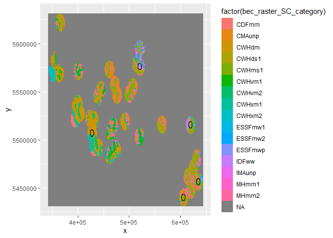

R Notebook
================

I’ve run into a small problem with my BEC raster–some classes don’t seem
to be showing up properly in the analysis.

``` r
# Load up some libraries.
library(tidyverse)
library(sf)
library(raster)
library(landscapemetrics)

# Import nests and calculate centroids.
cam.sites <- read_csv('../data/processed/the_big_list_of_nests.csv') %>% 
  group_by(name) %>% 
  mutate_at(c('lat', 'lon'), mean) %>% 
  mutate_at(vars(starts_with('status')), max) %>% 
  mutate_at(c('telemetry', 'cameras', 'remains'), max) %>% 
  dplyr::select(-nest, -NOTES) %>% 
  distinct() %>% 
  filter(cameras > 0)

# Drop TCR, ungroup.
cam.sites <- cam.sites %>% filter(site != 'TCR') %>% 
  ungroup() %>% 
  rownames_to_column(var='plot_id') %>% 
  mutate(plot_id=as.integer(plot_id))

# Make site table a spatial object and make it UTMs.
cam.sites.sf <- ungroup(cam.sites) %>% st_as_sf(coords=c('lon', 'lat')) %>%
  st_set_crs('+proj=longlat +ellps=WGS84 +datum=WGS84 +no_defs') %>%
  st_transform("+proj=utm +zone=10 +datum=WGS84 +units=m +no_defs")

# Convert approximate homerange area in ha to radius in m
a.hr.ha <- 3700
r.hr.m <- sqrt(a.hr.ha*10000/pi)

# Import the BEC raster.
r.bec <- raster('../data/interim/bec_raster_SC.tif')
```

That’s just the basics. So far, so good. What are the levels on the BEC
raster, as it stands?

``` r
levels(r.bec)
```

    ## [[1]]
    ##    ID category
    ## 1   0         
    ## 2   1    CDFmm
    ## 3   2   CMAunp
    ## 4   3    CWHdm
    ## 5   4   CWHds1
    ## 6   5   CWHmm1
    ## 7   6   CWHms1
    ## 8   7   CWHvm1
    ## 9   8   CWHvm2
    ## 10  9   CWHxm1
    ## 11 10   CWHxm2
    ## 12 11  ESSFmw1
    ## 13 12  ESSFmw2
    ## 14 13  ESSFmwp
    ## 15 14  ESSFmww
    ## 16 15    IDFww
    ## 17 16   IMAunp
    ## 18 17    MHmm1
    ## 19 18    MHmm2

Ah, so it already has levels assigned. I tried to re-assign them. What
did I try to re-assign them to?

``` r
# Import the original shapefile.
shp.bec <- st_read('../data/processed/BEC_annual-homerange_clipped.shp')
```

    ## Reading layer `BEC_annual-homerange_clipped' from data source `C:\Users\gwync\sfuvault\productivity-occupancy\data\processed\BEC_annual-homerange_clipped.shp' using driver `ESRI Shapefile'
    ## Simple feature collection with 234 features and 21 fields
    ## geometry type:  MULTIPOLYGON
    ## dimension:      XY
    ## bbox:           xmin: 342073.1 ymin: 5431194 xmax: 643787.8 ymax: 5631755
    ## projected CRS:  WGS 84 / UTM zone 10N

``` r
# Get BEC levels.
bec.levels <- data.frame((shp.bec[["MAP_LABEL"]])) %>% 
  rownames_to_column() %>% 
  rename(ID=1, map_label=2) %>% 
  mutate(ID=as.numeric(ID))

bec.levels
```

    ##      ID map_label
    ## 1     1     IDFww
    ## 2     2    CWHds1
    ## 3     3    CWHms1
    ## 4     4    CWHms1
    ## 5     5    CWHms1
    ## 6     6    CWHms1
    ## 7     7   ESSFmw2
    ## 8     8   ESSFmw2
    ## 9     9   ESSFmw2
    ## 10   10   ESSFmw2
    ## 11   11   ESSFmw2
    ## 12   12    IMAunp
    ## 13   13    IMAunp
    ## 14   14    IMAunp
    ## 15   15    IMAunp
    ## 16   16    IMAunp
    ## 17   17     MHmm2
    ## 18   18     MHmm2
    ## 19   19     MHmm1
    ## 20   20     MHmm1
    ## 21   21    CMAunp
    ## 22   22    CMAunp
    ## 23   23    CWHds1
    ## 24   24     CWHdm
    ## 25   25    CWHvm2
    ## 26   26    CWHvm2
    ## 27   27    CWHvm2
    ## 28   28     MHmm2
    ## 29   29     MHmm1
    ## 30   30     MHmm1
    ## 31   31    CMAunp
    ## 32   32    CMAunp
    ## 33   33    CMAunp
    ## 34   34    CMAunp
    ## 35   35    CMAunp
    ## 36   36    CMAunp
    ## 37   37    CWHvm1
    ## 38   38    CWHvm1
    ## 39   39    CWHvm1
    ## 40   40    CWHvm2
    ## 41   41    CWHvm1
    ## 42   42    IMAunp
    ## 43   43    IMAunp
    ## 44   44    CMAunp
    ## 45   45    CMAunp
    ## 46   46    CMAunp
    ## 47   47    CMAunp
    ## 48   48    CWHds1
    ## 49   49    CWHms1
    ## 50   50   ESSFmww
    ## 51   51   ESSFmwp
    ## 52   52   ESSFmwp
    ## 53   53   ESSFmwp
    ## 54   54   ESSFmw1
    ## 55   55     MHmm2
    ## 56   56     MHmm2
    ## 57   57     MHmm2
    ## 58   58     MHmm2
    ## 59   59    CWHds1
    ## 60   60    CMAunp
    ## 61   61    CMAunp
    ## 62   62     MHmm2
    ## 63   63     MHmm2
    ## 64   64    CMAunp
    ## 65   65    CMAunp
    ## 66   66     MHmm2
    ## 67   67     MHmm2
    ## 68   68     MHmm1
    ## 69   69     MHmm1
    ## 70   70     CDFmm
    ## 71   71    CWHvm2
    ## 72   72    CWHvm2
    ## 73   73    CWHxm1
    ## 74   74    CMAunp
    ## 75   75    CMAunp
    ## 76   76    CMAunp
    ## 77   77    CMAunp
    ## 78   78    CMAunp
    ## 79   79    CMAunp
    ## 80   80    CMAunp
    ## 81   81    CMAunp
    ## 82   82    CMAunp
    ## 83   83    CWHds1
    ## 84   84    CWHvm2
    ## 85   85    CWHvm2
    ## 86   86    CWHms1
    ## 87   87     MHmm2
    ## 88   88     MHmm2
    ## 89   89     MHmm2
    ## 90   90     MHmm2
    ## 91   91     MHmm2
    ## 92   92     MHmm1
    ## 93   93     MHmm1
    ## 94   94    CMAunp
    ## 95   95    CMAunp
    ## 96   96    CMAunp
    ## 97   97    CWHvm2
    ## 98   98    CWHvm2
    ## 99   99    CWHvm1
    ## 100 100     MHmm1
    ## 101 101     MHmm1
    ## 102 102     MHmm1
    ## 103 103    CWHvm2
    ## 104 104    CWHvm2
    ## 105 105     MHmm1
    ## 106 106     MHmm1
    ## 107 107    CWHds1
    ## 108 108    CWHvm1
    ## 109 109    CMAunp
    ## 110 110    CMAunp
    ## 111 111    CWHvm1
    ## 112 112    CWHms1
    ## 113 113    CWHms1
    ## 114 114    CWHvm2
    ## 115 115    CWHvm2
    ## 116 116     MHmm2
    ## 117 117     MHmm2
    ## 118 118    CWHvm2
    ## 119 119    CMAunp
    ## 120 120   ESSFmw2
    ## 121 121    CWHmm1
    ## 122 122    CWHvm1
    ## 123 123    CWHvm1
    ## 124 124    CWHvm1
    ## 125 125    CWHvm2
    ## 126 126    CWHvm2
    ## 127 127    CWHxm2
    ## 128 128    CMAunp
    ## 129 129    CWHvm2
    ## 130 130    CWHvm2
    ## 131 131    CWHvm1
    ## 132 132     MHmm1
    ## 133 133     MHmm1
    ## 134 134     MHmm1
    ## 135 135     MHmm1
    ## 136 136     MHmm1
    ## 137 137     MHmm1
    ## 138 138    CWHvm2
    ## 139 139    CMAunp
    ## 140 140   ESSFmw2
    ## 141 141   ESSFmw2
    ## 142 142   ESSFmw2
    ## 143 143     MHmm2
    ## 144 144     MHmm2
    ## 145 145    CMAunp
    ## 146 146    CMAunp
    ## 147 147    CMAunp
    ## 148 148    CMAunp
    ## 149 149    CMAunp
    ## 150 150    CMAunp
    ## 151 151    CMAunp
    ## 152 152    CMAunp
    ## 153 153    CMAunp
    ## 154 154   ESSFmw1
    ## 155 155   ESSFmw1
    ## 156 156     MHmm2
    ## 157 157     MHmm2
    ## 158 158     MHmm2
    ## 159 159    CMAunp
    ## 160 160    CMAunp
    ## 161 161    CWHvm1
    ## 162 162    CWHvm1
    ## 163 163    CWHvm1
    ## 164 164     MHmm1
    ## 165 165     MHmm1
    ## 166 166    CWHvm2
    ## 167 167    CMAunp
    ## 168 168    CMAunp
    ## 169 169    CMAunp
    ## 170 170    CMAunp
    ## 171 171    CMAunp
    ## 172 172    CMAunp
    ## 173 173    CMAunp
    ## 174 174    CMAunp
    ## 175 175    CMAunp
    ## 176 176    CMAunp
    ## 177 177    CMAunp
    ## 178 178    CMAunp
    ## 179 179    CMAunp
    ## 180 180    CMAunp
    ## 181 181    CWHvm1
    ## 182 182    CMAunp
    ## 183 183    CWHvm1
    ## 184 184    CWHvm1
    ## 185 185     MHmm1
    ## 186 186    CMAunp
    ## 187 187    CMAunp
    ## 188 188    CWHvm1
    ## 189 189    CMAunp
    ## 190 190    CMAunp
    ## 191 191    CMAunp
    ## 192 192    CWHvm1
    ## 193 193     MHmm1
    ## 194 194    CMAunp
    ## 195 195    CMAunp
    ## 196 196    CMAunp
    ## 197 197     MHmm2
    ## 198 198    CWHvm2
    ## 199 199    CWHvm1
    ## 200 200    CMAunp
    ## 201 201     MHmm1
    ## 202 202    CWHvm2
    ## 203 203    CWHvm2
    ## 204 204    CMAunp
    ## 205 205    IMAunp
    ## 206 206    CMAunp
    ## 207 207    CMAunp
    ## 208 208   ESSFmw1
    ## 209 209    IMAunp
    ## 210 210    IMAunp
    ## 211 211    IMAunp
    ## 212 212    IMAunp
    ## 213 213    IMAunp
    ## 214 214     MHmm2
    ## 215 215    IMAunp
    ## 216 216    IMAunp
    ## 217 217     IDFww
    ## 218 218    CWHds1
    ## 219 219    CWHds1
    ## 220 220    CWHms1
    ## 221 221   ESSFmwp
    ## 222 222   ESSFmw1
    ## 223 223   ESSFmw1
    ## 224 224   ESSFmw1
    ## 225 225   ESSFmw1
    ## 226 226   ESSFmw1
    ## 227 227     MHmm2
    ## 228 228     MHmm2
    ## 229 229     MHmm1
    ## 230 230    CMAunp
    ## 231 231    CWHvm1
    ## 232 232    CWHvm2
    ## 233 233    CWHvm1
    ## 234 234    CWHvm2

Verrrryyy different. The question is, which ones are right?

``` r
# Build sample.
my.plots <- data.frame(construct_buffer(coords=cam.sites.sf, shape='circle',
                                            size=r.hr.m, return_sp=FALSE))

# Make the graph.
bec.plot <- raster::as.data.frame(r.bec, xy=TRUE) %>% 
  ggplot() +
  geom_raster(aes(x=x, y=y, fill=factor(bec_raster_SC_category)))

# Add sample polygons.
bec.plot +
  geom_polygon(data=my.plots, aes(x = my.plots[, 1],
                                  y = my.plots[, 2],
                                  group = my.plots[, 3]),
                                  col = "black", fill = NA)
```

<!-- -->

That’s with the built-in levels. What about the levels I added?

``` r
bad.bec <- r.bec

levels(bad.bec) <- bec.levels

bad.plot <- raster::as.data.frame(bad.bec, xy=TRUE) %>% 
  ggplot() +
  geom_raster(aes(x=x, y=y, fill=factor(bec_raster_SC_map_label)))

# Add sample polygons.
bad.plot +
  geom_polygon(data=my.plots, aes(x = my.plots[, 1],
                                  y = my.plots[, 2],
                                  group = my.plots[, 3]),
                                  col = "black", fill = NA)
```

<!-- -->

So it looks like adding levels was a mistake. But can I get a closer
look?

``` r
# Pull out a toy known to be a problem.
utz.coord <- cam.sites.sf %>% filter(site == 'UTZ')

utz.plot <- data.frame(construct_buffer(coords=utz.coord, shape='circle',
                                            size=r.hr.m, return_sp=FALSE))

# Get bounding coordinates for site.
utzxmin <- st_bbox(utz.coord)[1] - r.hr.m
utzymin <- st_bbox(utz.coord)[2] - r.hr.m
utzxmax <- st_bbox(utz.coord)[3] + r.hr.m
utzymax <- st_bbox(utz.coord)[4] + r.hr.m

# Add to graph.
bec.plot +
  geom_polygon(data=utz.plot, aes(x = utz.plot[, 1],
                                  y = utz.plot[, 2],
                                  group = utz.plot[, 3]),
                                  col = "black", fill = NA) +
  xlim(utzxmin, utzxmax) +
  ylim(utzymin, utzymax)
```

<!-- -->

And with the added labels…

``` r
# Using bad bec.
bad.plot +
  geom_polygon(data=utz.plot, aes(x = utz.plot[, 1],
                                  y = utz.plot[, 2],
                                  group = utz.plot[, 3]),
                                  col = "black", fill = NA) +
  xlim(utzxmin, utzxmax) +
  ylim(utzymin, utzymax)
```

<!-- -->

Ohhhhhh super different. So that really is where the problem is.

As long as I’m here, can I figure out a way to plot all of my sites
together?

``` r
# Site 1
bec.plot +
  geom_polygon(data=my.plots, aes(x = my.plots[, 1],
                                  y = my.plots[, 2],
                                  group = my.plots[, 3]),
                                  col = "black", fill = NA) +
  xlim(st_bbox(cam.sites.sf[1, ])[1] - r.hr.m, st_bbox(cam.sites.sf[1, ])[3] + r.hr.m) +
  ylim(st_bbox(cam.sites.sf[1, ])[2] - r.hr.m, st_bbox(cam.sites.sf[1, ])[4] + r.hr.m) +
  theme_classic() + labs(title='MTF')
```

<!-- -->

``` r
# Site 2
bec.plot +
  geom_polygon(data=my.plots, aes(x = my.plots[, 1],
                                  y = my.plots[, 2],
                                  group = my.plots[, 3]),
                                  col = "black", fill = NA) +
  xlim(st_bbox(cam.sites.sf[2, ])[1] - r.hr.m, st_bbox(cam.sites.sf[2, ])[3] + r.hr.m) +
  ylim(st_bbox(cam.sites.sf[2, ])[2] - r.hr.m, st_bbox(cam.sites.sf[2, ])[4] + r.hr.m) +
  theme_classic() + labs(title='MTC')
```

<!-- -->

``` r
# Site 3
bec.plot +
  geom_polygon(data=my.plots, aes(x = my.plots[, 1],
                                  y = my.plots[, 2],
                                  group = my.plots[, 3]),
                                  col = "black", fill = NA) +
  xlim(st_bbox(cam.sites.sf[3, ])[1] - r.hr.m, st_bbox(cam.sites.sf[3, ])[3] + r.hr.m) +
  ylim(st_bbox(cam.sites.sf[3, ])[2] - r.hr.m, st_bbox(cam.sites.sf[3, ])[4] + r.hr.m) +
  theme_classic() + labs(title='RLK')
```

<!-- -->

``` r
# Site 4
bec.plot +
  geom_polygon(data=my.plots, aes(x = my.plots[, 1],
                                  y = my.plots[, 2],
                                  group = my.plots[, 3]),
                                  col = "black", fill = NA) +
  xlim(st_bbox(cam.sites.sf[4, ])[1] - r.hr.m, st_bbox(cam.sites.sf[4, ])[3] + r.hr.m) +
  ylim(st_bbox(cam.sites.sf[4, ])[2] - r.hr.m, st_bbox(cam.sites.sf[4, ])[4] + r.hr.m) +
  theme_classic() + labs(title='TMC')
```

<!-- -->

``` r
# Site 5
bec.plot +
  geom_polygon(data=my.plots, aes(x = my.plots[, 1],
                                  y = my.plots[, 2],
                                  group = my.plots[, 3]),
                                  col = "black", fill = NA) +
  xlim(st_bbox(cam.sites.sf[5, ])[1] - r.hr.m, st_bbox(cam.sites.sf[5, ])[3] + r.hr.m) +
  ylim(st_bbox(cam.sites.sf[5, ])[2] - r.hr.m, st_bbox(cam.sites.sf[5, ])[4] + r.hr.m) +
  theme_classic() + labs(title='UTZ')
```

<!-- -->
