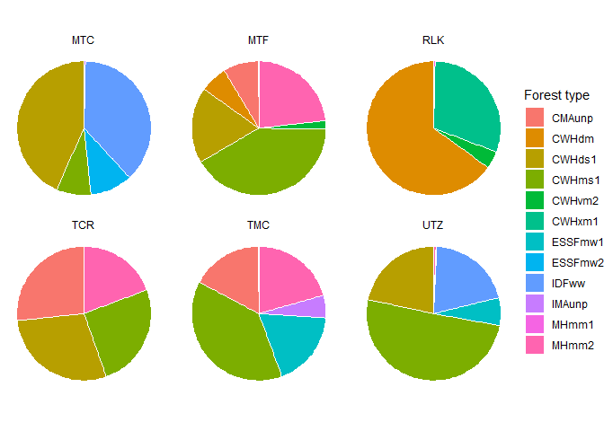
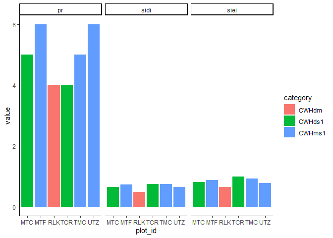
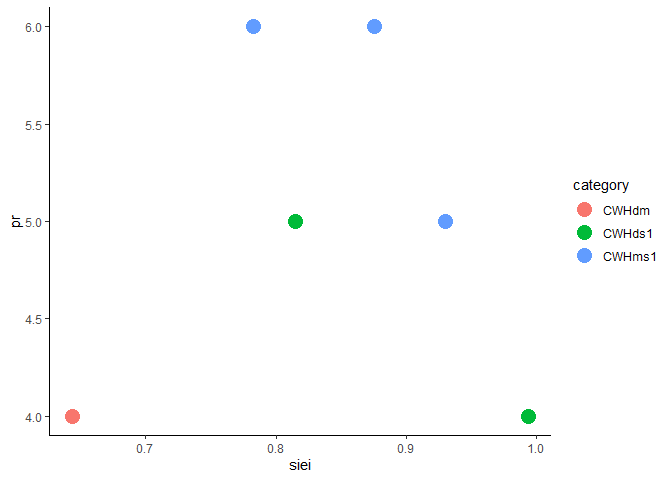

BEC models
================

BEC zones capture the large-scale ecosystem type. For predictor
variables, it makes sense to stick to very simple metrics: dominant
forest type, dominance, richness, diversity.

I stopped using my nest centroid approach to defining sample centers
because it was brought to my attention that not all nest locations in
the nest database I was using are either accurate or necessarily real
nests. So instead I’ll just use the active nest as the central sampling
point. Which is too bad because it loses some of the sense of a
“territory,” but good because it avoids the difficulty around treating
a territory as a static, eternal entity.

``` r
# Import conflict settings.
source('../src/conflicted.R')

# Load some libraries.
library(tidyverse)
library(modelr)
library(broom)
library(raster)
library(sf)
library(landscapemetrics)
library(vegan)
library(AICcmodavg)

# Import raster data for BEC zones.
r.bec <- raster('../data/interim/bec_raster_SC.tif')

# Import 2019 camera sites. Keep TCR because BEC data for that area is fine.
sites <- read_csv('../data/raw/camera_nests_2019.csv')

# Make site table a spatial object and make it UTMs.
sites.sf <-sites %>% st_as_sf(coords=c('lon', 'lat')) %>%
  st_set_crs('+proj=longlat +ellps=WGS84 +datum=WGS84 +no_defs') %>%
  st_transform("+proj=utm +zone=10 +datum=WGS84 +units=m +no_defs")
```

Now to agonize over sample sizes. I already thought about the breeding
season home range from Vancouver Island, described in McClaren et
al. (2015) as about **3700 ha**. For a smaller scale, the PFA makes
sense. The median from McClaren et al. (2005) is *60 ha.* The core
breeding area is about **175 ha** on Vancouver Island, and this is also
about the size of a WHA (200 ha), so that’s a good number. There’s no
point in using the nest area because it’s so small and also because I’m
only using single nests (a nest area being the area surrounding all
nests). There also doesn’t seem to be any point in using annual home
range, because that’s far larger than the area the birds are actually
using during the breeding season.

I’ll throw in something a bit random, which is the average maximum
distance from the nest traveled by the tagged birds.

``` r
# Pick some sample sizes (in ha).
ls <- data.frame(
  size=c('PFA', 'breeding area', 'breeding home range'),
  area=c(60, 175, 3700)
  )

# Convert approximate homerange area in ha to radius in m
ls <- ls %>% mutate(radius=sqrt(area*10000/pi))

# Average max distance traveled by tagged birds (measured in QGIS)
max <- c(
  6863, # HAR10
  4889, # HAR09
  11368, # HAR07
  87, # HAR08
  7920, # HAR04
  8207 # HAR07
) %>% 
  mean() %>% 
  data.frame(size='max range', area=NA, radius=.)

# Add to the sample sizes.
ls <- bind_rows(ls, max)

# Get BEC levels.
bec.levels <- levels(r.bec) %>% data.frame()

# Make a vector of the site names.
abbr <- sites.sf$site
```

That’s all the prep bits done. Now to analyze my landscape.

``` r
# What to run?
metrics <- c('lsm_c_ca', 'lsm_l_pr', 'lsm_l_sidi', 'lsm_l_siei')

# Make a function to do the calculations and formatting.
calc.bec.metrics <- function(x) {
  sample_lsm(r.bec, y=sites.sf, size=x, plot_id=abbr, shape='circle', what=metrics) %>% 
    left_join(bec.levels, by=c('class'='ID')) %>% 
    group_by(plot_id, metric) %>% 
    top_n(1, value) %>% ungroup() %>%  
    fill(category) %>% 
    filter(level == 'landscape') %>% 
    pivot_wider(names_from=metric, values_from=value) %>% 
    mutate(ls.size=x)
}

# Run the function for each sample size.
bec.ls.metrics <- map_df(ls$radius, calc.bec.metrics)

# Let's keep class area, just to look at.
bec.class.area <- sample_lsm(r.bec, y=sites.sf, size=ls$radius[4], plot_id=abbr, shape='circle', what=metrics) %>% 
  left_join(bec.levels, by=c('class'='ID'))
  
# Graph class area.
bec.class.area %>% filter(level == 'class') %>% 
ggplot(aes(x='', y=value, fill=as.factor(category))) +
  geom_bar(stat='identity', width=1, color='white') +
  facet_wrap(~plot_id) +
  labs(fill='Forest type') +
  coord_polar('y', start=0) +
  theme_void()
```

<!-- -->

``` r
# Graph other metrics.
bec.class.area %>% group_by(plot_id, metric) %>% 
  top_n(1, value) %>% ungroup() %>%  
  fill(category) %>% 
  filter(level == 'landscape') %>% 
  ggplot(aes(x=plot_id, y=value, fill=category)) +
  geom_bar(position='dodge', stat='identity') +
  theme_classic() +
  facet_wrap(~metric)
```

<!-- -->

``` r
# Another way to look at it.
bec.class.area %>% group_by(plot_id, metric) %>% 
  top_n(1, value) %>% ungroup() %>%  
  fill(category) %>% 
  filter(level == 'landscape') %>% 
  pivot_wider(names_from=metric, values_from=value) %>% 
  ggplot(aes(x=siei, y=pr, color=category)) +
  geom_point(size=5) +
  theme_classic()
```

<!-- -->

That’s predictor variables. What about, you know, the response variable?

One big issue: what to do with all the unidentified items? For example,
I can calculate proportion mammalian biomass as mammal/total or
mammal/identified to class.

Does it actually make a difference?

``` r
# Bring in diet data.
df <- read_csv('../data/interim/camera_corrected.csv', guess_max=7000)
source('../src/prey_attributes.R')

# Fix the stupid squirrel situation.
items <- items %>% mutate(common=case_when(
  genus == 'Tamiasciurus' & species == 'sp' ~ 'Douglas squirrel',
  TRUE ~ common
))

items <- items %>% mutate(species=case_when(
  genus == 'Tamiasciurus' & species == 'sp' ~ 'douglasii',
  TRUE ~ species
))

# Calculate biomass using all items.
mammal.mass <- items %>% mutate(mass=as.numeric(mass)) %>% 
  group_by(site) %>% 
  mutate(total=sum(mass)) %>% 
  filter(class == 'Mammalia') %>% 
  mutate(amount.ml=sum(mass), prop.ml=amount.ml/total) %>% 
  dplyr::select(site, prop.ml) %>% distinct()

# Calculate biomass using only species identified to class.
mammal.mass.2 <- items %>% filter(class != 'Unknown') %>% 
  mutate(mass=as.numeric(mass)) %>% 
  group_by(site) %>% 
  mutate(total=sum(mass)) %>% 
  filter(class == 'Mammalia') %>% 
  mutate(amount.ml=sum(mass), prop.ml=amount.ml/total) %>% 
  dplyr::select(site, prop.ml) %>% distinct()

mammal.mass
```

    ## # A tibble: 6 x 2
    ## # Groups:   site [6]
    ##   site  prop.ml
    ##   <chr>   <dbl>
    ## 1 UTZ     0.868
    ## 2 MTC     0.583
    ## 3 MTF     0.700
    ## 4 TCR     0.595
    ## 5 TMC     0.711
    ## 6 RLK     0.538

``` r
mammal.mass.2
```

    ## # A tibble: 6 x 2
    ## # Groups:   site [6]
    ##   site  prop.ml
    ##   <chr>   <dbl>
    ## 1 UTZ     0.890
    ## 2 MTC     0.688
    ## 3 MTF     0.813
    ## 4 TCR     0.700
    ## 5 TMC     0.819
    ## 6 RLK     0.904

Yeah, that makes a pretty big difference. But I guess it doesn’t really
make sense to drop unidentified items, does it?

``` r
# Calculate proportion of squirrel biomass.
squirrel.mass <- items %>% mutate(mass=as.numeric(mass)) %>% 
  group_by(site) %>% 
  mutate(total=sum(mass)) %>% 
  filter(genus == 'Tamiasciurus') %>% 
  mutate(amount.sq=sum(mass), prop.sq=amount.sq/total) %>% 
  select(site, prop.sq) %>% distinct()

squirrel.mass
```

    ## # A tibble: 6 x 2
    ## # Groups:   site [6]
    ##   site  prop.sq
    ##   <chr>   <dbl>
    ## 1 MTC     0.499
    ## 2 MTF     0.483
    ## 3 RLK     0.412
    ## 4 TCR     0.505
    ## 5 TMC     0.221
    ## 6 UTZ     0.485

``` r
# Calculate richness.
diet.rich <- items %>% filter(genus != 'Unknown') %>% 
  group_by(site) %>% 
  distinct(genus, species, .keep_all=TRUE) %>% 
  summarise(n.sp=n())

diet.rich
```

    ## # A tibble: 6 x 2
    ##   site   n.sp
    ##   <chr> <int>
    ## 1 MTC       7
    ## 2 MTF       7
    ## 3 RLK       2
    ## 4 TCR       6
    ## 5 TMC       3
    ## 6 UTZ       7

``` r
# Use just items identified to genus and twist to a wide format.
items.wide <- items %>% filter(genus != 'Unknown') %>% 
  group_by(site, genus, species) %>% 
  mutate(count=n()) %>% 
  dplyr::select(site, genus, species, count) %>% 
  unite(name, 2:3, sep=' ') %>% 
  distinct() %>% 
  pivot_wider(names_from=name, values_from=count,
                         values_fill=list(count = 0))

# Calculate diversity.
diet.simp <- plyr::ddply(items.wide, ~site, function(x) {
           data.frame(simpson=diversity(x[-1], index='simpson'))
   })

diet.simp
```

    ##   site   simpson
    ## 1  MTC 0.5798611
    ## 2  MTF 0.5432526
    ## 3  RLK 0.2448980
    ## 4  TCR 0.5763889
    ## 5  TMC 0.6505190
    ## 6  UTZ 0.7159763

``` r
# Calculate PCA.
items.wide.rownames <- items.wide %>% column_to_rownames(var='site')

# Make the PCA.
diet.pca <- prcomp(items.wide.rownames, center=TRUE, scale=TRUE)

# Join all the diet data together in one great frankenframe.
diet.data <- diet.pca$x[,1:2] %>% data.frame() %>% rownames_to_column(var='site') %>%
  right_join(squirrel.mass) %>% right_join(mammal.mass) %>% 
  right_join(diet.rich) %>% right_join(diet.simp)

# And join on it on to the landscape data for each sample size, and nest it.
bec.and.diet <- right_join(bec.ls.metrics, diet.data, by=c('plot_id'='site')) %>% 
  right_join(ls, by=c('ls.size'='radius')) %>% 
  group_by(size) %>% 
  nest()
```

And finally, actually make the models.

``` r
# The diversity of the diet is determined by the diversity of forest types in which birds can hunt.
# H: Each forest type supports a different set of prey species, so more of more forest types means more kinds prey species. Assumes (I think) that birds hunt in proportion to forest type availability.
diversity.by.diversity <- function(df){
  lm(simpson ~ sidi, data=df)
  }

# The richness of the diet is determined by the richness of forest types in which birds can hunt.
# H: Basically same as above, just a slightly simpler way of calculating things.
richness.by.richness <- function(df){
  lm(n.sp ~ pr, data=df)
  }

# The diversity of the diet is determined by the richness of forest types in which birds can hunt.
# H: again, basically the same. Found this by accident, idek know wtf is happening!!

diversity.by.richness <- function(df){
  lm(simpson ~ pr, data=df)
  }

## The next two assume I use the PCA approach.

# The diet signature is determined by the dominant forest type.
# H: Birds forage in forest types according to their availability, with different each forest type providing a different set of prey species.
pc1.by.forest <- function(df){
  lm(PC1 ~ category, data=df)
  }

# Same as above, but the degree of forest dominance influences the strength of the diet signal.
pc1.by.dominance <- function(df){
lm(PC1 ~ category + sidi, data=df)
  }

# The ratio of mammal:bird biomass is determined by the dominant forest type.
# H: Mammals are higher quality prey than birds, and mammals are more common in certain forest types.
mammal.by.forest <- function(df){
lm(prop.ml ~ category, data=df)
  }

# The proportion of squirrel biomass is determined by the dominant forest type.
# H: Same as above, just with squirrels as a major component of the diet.
squirrel.by.forest <- function(df){
lm(prop.sq ~ category, data=df)
  }
```

And run the models on the data.

``` r
bec.models <- bec.and.diet %>% 
  mutate(m_div.x.div=map(data, diversity.by.diversity),
         m_rich.x.rich=map(data, richness.by.richness),
         m_div.x.rich=map(data, diversity.by.richness),
         m_pc1.x.for=map(data, pc1.by.forest),
         m_pc1.x.dom=map(data, pc1.by.dominance),
         m_mm.x.for=map(data, mammal.by.forest),
         m_sq.x.for=map(data, squirrel.by.forest)
         )
```

For most of these I have to stop here for now, because the other models
for these response variables come from a different data set (VRI, HSI),
but I can look at some basic stuff and a few AICs.

``` r
# Diet diversity ~ forest type diversity.
bec.models %>% 
  mutate(glance=map(m_div.x.div, glance)) %>% 
  unnest(glance) %>% 
  select(!c(starts_with('m_'), data))
```

    ## # A tibble: 4 x 12
    ## # Groups:   size [4]
    ##   size  r.squared adj.r.squared sigma statistic p.value    df logLik    AIC
    ##   <chr>     <dbl>         <dbl> <dbl>     <dbl>   <dbl> <int>  <dbl>  <dbl>
    ## 1 PFA       0.180       -0.0244 0.165     0.881  0.401      2   3.53 -1.05 
    ## 2 bree~     0.157       -0.0532 0.167     0.748  0.436      2   3.44 -0.885
    ## 3 bree~     0.230        0.0376 0.160     1.20   0.336      2   3.71 -1.43 
    ## 4 max ~     0.589        0.486  0.117     5.73   0.0749     2   5.59 -5.19 
    ## # ... with 3 more variables: BIC <dbl>, deviance <dbl>, df.residual <int>

Please pay close attention to that shockingly small (relatively
speaking) p-value of 0.07\!\! R-squared isn’t too shabby, either\!

``` r
# Diet richness ~ forest type richness.
bec.models %>% 
  mutate(glance=map(m_rich.x.rich, glance)) %>% 
  unnest(glance) %>% 
  select(!c(starts_with('m_'), data))
```

    ## # A tibble: 4 x 12
    ## # Groups:   size [4]
    ##   size  r.squared adj.r.squared sigma statistic p.value    df logLik   AIC   BIC
    ##   <chr>     <dbl>         <dbl> <dbl>     <dbl>   <dbl> <int>  <dbl> <dbl> <dbl>
    ## 1 PFA     0.329           0.161  2.06    1.96     0.234     2  -11.6  29.3  28.7
    ## 2 bree~   0.329           0.161  2.06    1.96     0.234     2  -11.6  29.3  28.7
    ## 3 bree~   0.00718        -0.241  2.51    0.0289   0.873     2  -12.8  31.6  31.0
    ## 4 max ~   0.355           0.194  2.02    2.20     0.212     2  -11.5  29.0  28.4
    ## # ... with 2 more variables: deviance <dbl>, df.residual <int>

``` r
# Diet diversity ~ forest type richness.
bec.models %>% 
  mutate(glance=map(m_div.x.rich, glance)) %>% 
  unnest(glance) %>% 
  select(!c(starts_with('m_'), data))
```

    ## # A tibble: 4 x 12
    ## # Groups:   size [4]
    ##   size  r.squared adj.r.squared sigma statistic p.value    df logLik    AIC
    ##   <chr>     <dbl>         <dbl> <dbl>     <dbl>   <dbl> <int>  <dbl>  <dbl>
    ## 1 PFA       0.137       -0.0785 0.169     0.636  0.470      2   3.37 -0.742
    ## 2 bree~     0.137       -0.0785 0.169     0.636  0.470      2   3.37 -0.742
    ## 3 bree~     0.660        0.575  0.106     7.76   0.0495     2   6.16 -6.33 
    ## 4 max ~     0.362        0.203  0.145     2.27   0.206      2   4.28 -2.56 
    ## # ... with 3 more variables: BIC <dbl>, deviance <dbl>, df.residual <int>

``` r
# Proportion mammal ~ forest type.
bec.models %>% 
  mutate(glance=map(m_mm.x.for, glance)) %>% 
  unnest(glance) %>% 
  select(!c(starts_with('m_'), data))
```

    ## # A tibble: 4 x 12
    ## # Groups:   size [4]
    ##   size  r.squared adj.r.squared  sigma statistic p.value    df logLik   AIC
    ##   <chr>     <dbl>         <dbl>  <dbl>     <dbl>   <dbl> <int>  <dbl> <dbl>
    ## 1 PFA       0.754         0.386 0.0942      2.05   0.345     4   8.96 -7.92
    ## 2 bree~     0.754         0.386 0.0942      2.05   0.345     4   8.96 -7.92
    ## 3 bree~     0.757         0.392 0.0937      2.07   0.342     4   8.99 -7.98
    ## 4 max ~     0.756         0.593 0.0767      4.64   0.121     3   8.98 -9.95
    ## # ... with 3 more variables: BIC <dbl>, deviance <dbl>, df.residual <int>

``` r
# Proportion squirrel ~ forest type.
bec.models %>% 
  mutate(glance=map(m_sq.x.for, glance)) %>% 
  unnest(glance) %>% 
  select(!c(starts_with('m_'), data))
```

    ## # A tibble: 4 x 12
    ## # Groups:   size [4]
    ##   size  r.squared adj.r.squared sigma statistic p.value    df logLik   AIC   BIC
    ##   <chr>     <dbl>         <dbl> <dbl>     <dbl>   <dbl> <int>  <dbl> <dbl> <dbl>
    ## 1 PFA       0.416        -0.459 0.133     0.475   0.731     4   6.91 -3.82 -4.86
    ## 2 bree~     0.416        -0.459 0.133     0.475   0.731     4   6.91 -3.82 -4.86
    ## 3 bree~     0.232        -0.920 0.152     0.202   0.888     4   6.09 -2.17 -3.21
    ## 4 max ~     0.232        -0.280 0.124     0.453   0.673     3   6.09 -4.17 -5.00
    ## # ... with 2 more variables: deviance <dbl>, df.residual <int>

Oh\! A p-value that’s actually significant\! It’s a miracle. And a
better r-squared. But so weird that it’s at a different scale.

And a quick look at the PCA models…

``` r
bec.models %>% 
  mutate(glance=map(m_pc1.x.for, glance)) %>% 
  unnest(glance) %>% 
  select(!c(starts_with('m_'), data))
```

    ## # A tibble: 4 x 12
    ## # Groups:   size [4]
    ##   size  r.squared adj.r.squared sigma statistic p.value    df logLik   AIC   BIC
    ##   <chr>     <dbl>         <dbl> <dbl>     <dbl>   <dbl> <int>  <dbl> <dbl> <dbl>
    ## 1 PFA       0.256        -0.860  3.11     0.229   0.870     4  -12.0  34.0  33.0
    ## 2 bree~     0.256        -0.860  3.11     0.229   0.870     4  -12.0  34.0  33.0
    ## 3 bree~     0.203        -0.993  3.21     0.170   0.909     4  -12.2  34.4  33.4
    ## 4 max ~     0.146        -0.423  2.72     0.257   0.789     3  -12.4  32.9  32.0
    ## # ... with 2 more variables: deviance <dbl>, df.residual <int>

``` r
bec.models %>% 
  mutate(glance=map(m_pc1.x.dom, glance)) %>% 
  unnest(glance) %>% 
  select(!c(starts_with('m_'), data))
```

    ## # A tibble: 4 x 12
    ## # Groups:   size [4]
    ##   size  r.squared adj.r.squared sigma statistic p.value    df logLik   AIC   BIC
    ##   <chr>     <dbl>         <dbl> <dbl>     <dbl>   <dbl> <int>  <dbl> <dbl> <dbl>
    ## 1 PFA       0.875         0.377 1.80       1.76   0.508     5  -6.66  25.3  24.1
    ## 2 bree~     0.827         0.136 2.12       1.20   0.587     5  -7.64  27.3  26.0
    ## 3 bree~     0.967         0.834 0.929      7.27   0.271     5  -2.69  17.4  16.1
    ## 4 max ~     0.806         0.515 1.59       2.77   0.277     4  -7.99  26.0  24.9
    ## # ... with 2 more variables: deviance <dbl>, df.residual <int>

``` r
aictab(c(bec.models$m_pc1.x.for, bec.models$m_pc1.x.dom))
```

    ## 
    ## Model selection based on AICc:
    ## 
    ##      K   AICc Delta_AICc AICcWt Cum.Wt     LL
    ## Mod7 6 -66.61       0.00   0.97   0.97  -2.69
    ## Mod5 6 -58.69       7.93   0.02   0.99  -6.66
    ## Mod6 6 -56.73       9.88   0.01   1.00  -7.64
    ## Mod4 4  72.86     139.47   0.00   1.00 -12.43
    ## Mod1 5    Inf        Inf   0.00   1.00 -12.02
    ## Mod2 5    Inf        Inf   0.00   1.00 -12.02
    ## Mod3 5    Inf        Inf   0.00   1.00 -12.22
    ## Mod8 5    Inf        Inf   0.00   1.00  -7.99

I can’t figure out how to add models names to this, but Mod7 ought to be
forest type \* dominance at the breeding home range scale. That one’s
got a beautiful r squared (0.97) but a lousy p-value.
