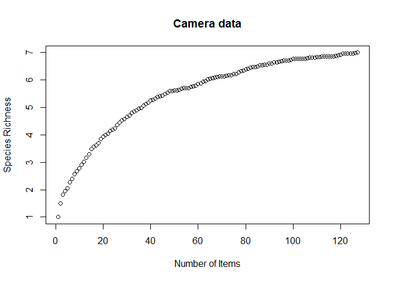
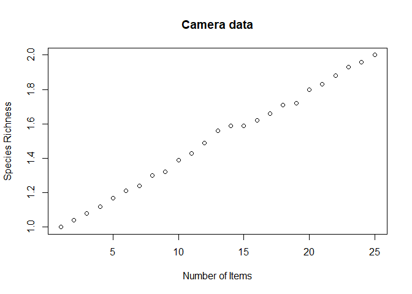

Species accumulation curves
================

So I ran my univariate models with the camera data, which was nice and
all. But that means I have new work to do:

1.  Add missing models are re-run.
      - Prerequisites:
          - choose canopy cover categories
          - make canopy cover rasters
          - ~~make older forest rasters~~
2.  Fix some stuff I’ve been doing wrong.
      - remake landcover rasters at 100m scale
      - rerun diet breakdown with counts Next steps:
      - compare counts and biomass breakdowns
3.  Run the models also for physical specimen data.
      - Prerequisites:
          - finish cleaning physical data
          - determine if there’s a cutoff for sample size
      - Next steps:
          - compare results from camera and physical data
4.  Compare diet between coastal and transition zones.
      - Prerequisites:
          - assign each site to cs or tz
      - Next steps:
          - compare results from camera and physical data

I’m going to start with the sample sizes.

``` r
# Import conflict settings.
source('../src/conflicted.R')

# Load some libraries.
library(tidyverse)
library(lubridate)
library(vegan)

# Bring in data.
source('../src/prey_attributes_revised.R')
```

I want to know how many items need to be identified before I’ve
identified all the items I’m going to identify. In other words, how many
IDs are needed to give me a pretty complete picture of species richness.
For the entire study area, I can trick `vegan` into doing this with
`specaccum()` if I treat every item like a site.

``` r
fakecamera <- diet.items %>% filter(binomial != 'Unidentified item') %>% 
  mutate(count=1, index=1:nrow(.)) %>%
  dplyr::select(index, binomial, count) %>%
  pivot_wider(names_from=binomial, values_from=count,
              values_fill=list(count = 0))

cameraaccum <- specaccum(fakecamera[, -1], method="random", permutations=100)

plot(cameraaccum$sites, cameraaccum$richness,
     xlab="Number of Items",
     ylab="Species Richness",
     main="Camera and physical data")
```

<!-- -->

Which is a bit depressing to look at. But of course it’s also a bit
misleading, because more species are present in the study area than are
present at each site.

``` r
fakecamera.sites <- diet.items %>% filter(binomial != 'Unidentified item' & method == 'camera') %>% 
  mutate(count=1, index=1:nrow(.)) %>%
  dplyr::select(site, index, binomial, count) %>%
  pivot_wider(names_from=binomial, values_from=count,
              values_fill=list(count = 0))

fake.sites <- fakecamera.sites %>% group_by(site) %>% 
  group_map(~specaccum(.x[3:17], method="random", permutations=100))

fake.sites %>% map(~plot(.$sites, .$richness,
              xlab="Number of Items",
              ylab="Species Richness",
              main="Camera data"))
```

<!-- --><!-- --><!-- --><!-- --><!-- --><!-- -->

    ## [[1]]
    ## NULL
    ## 
    ## [[2]]
    ## NULL
    ## 
    ## [[3]]
    ## NULL
    ## 
    ## [[4]]
    ## NULL
    ## 
    ## [[5]]
    ## NULL
    ## 
    ## [[6]]
    ## NULL

Ok, that’s absolutely fascinating. There’s a lot more variation here
than I was expecting. Eyeballing it, it does look like at around 50
items things start to level off, generally. Which is a problem, because
I doubt most remains sites have 50 items\!

Garcia-Salgado 2015 uses a minimum of 15 pellets (which is ridiculous)
and 20 remains or camera items. So I have an excuse to use much smaller
numbers than 50, but I’m not sure how confident I am in it.

Here’s how many things I have from the physical data:

``` r
diet.items %>% filter(binomial != 'Unidentified item' & method == 'remains') %>% 
  group_by(site) %>% 
  summarize(n.items=n())
```

    ## # A tibble: 14 x 2
    ##    site  n.items
    ##    <chr>   <int>
    ##  1 BKH         4
    ##  2 DGC         2
    ##  3 GMT         1
    ##  4 MPT        10
    ##  5 MTC         2
    ##  6 MTF         6
    ##  7 PCR         7
    ##  8 PNC         2
    ##  9 PTL         4
    ## 10 RLK        11
    ## 11 TCR         2
    ## 12 TMC         2
    ## 13 UTZ        11
    ## 14 WRA         3

So even with Garcia-Salgado’s very permissive definition of “complete
picture of diet” I can’t do diversity and overlap-type things with these
data. Of course, the total number of things is much higher:

``` r
diet.items %>% filter(class != 'U' & method == 'remains') %>%
  group_by(site) %>% 
  summarize(n.items=n())
```

    ## # A tibble: 19 x 2
    ##    site  n.items
    ##    <chr>   <int>
    ##  1 BKH         5
    ##  2 COM         1
    ##  3 DCR         1
    ##  4 DGC         4
    ##  5 GMT         1
    ##  6 HKO         2
    ##  7 MPT        14
    ##  8 MTC         3
    ##  9 MTF        11
    ## 10 PCR        20
    ## 11 PNC         2
    ## 12 PTL        21
    ## 13 RLK        17
    ## 14 SKA         5
    ## 15 TCR         4
    ## 16 TMC         3
    ## 17 UTZ        14
    ## 18 WRA         8
    ## 19 <NA>        1

Oh jeez, even this is terrible. More sites, but only 2 sites make the
cut. So I don’t think even doing the basic mammal:avian biomass things
are an option. It looks like the only way I can use this is by pooling
it for tz/cs analyses.
