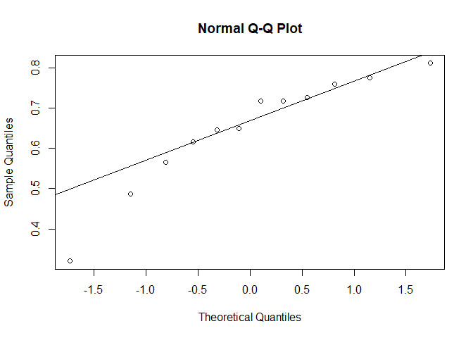

Diet, revisited
================

1.  Add missing models are re-run.
      - Prerequisites:
          - ~~choose canopy cover categories~~
          - ~~make canopy cover rasters~~
          - ~~make older forest rasters~~
2.  Fix some stuff I’ve been doing wrong.
      - remake landcover rasters at 100m scale
      - rerun diet breakdown with counts Next steps:
      - compare counts and biomass breakdowns
3.  Run the models also for physical specimen data.
      - Prerequisites:
          - finish cleaning physical data
          - determine if there’s a cutoff for sample size
      - Next steps:
          - compare results from camera and physical data
4.  Compare diet between coastal and transition zones.
      - Prerequisites:
          - assign each site to cs or tz
      - Next steps:
          - compare results from camera and physical data

<!-- end list -->

``` r
# Import conflict settings.
source('../src/conflicted.R')

# Load some libraries.
library(tidyverse)
library(lubridate)
library(vegan)
library(ggplot2)

# Bring in data.
source('../src/prey_attributes_revised.R')
```

Compare biomass and counts for cameras.

``` r
# Calculate biomass and counts for mammalian prey.
proportion.mammal.cameras <- diet.items %>% 
  filter(method == 'camera') %>% 
  group_by(nest) %>% 
  mutate(total.mass=sum(mass), total.count=n()) %>% 
  filter(class == 'Mammalia') %>% 
  mutate(mass.mm=sum(mass), count.mm=n(), 
         prop.mm.mass=mass.mm/total.mass, prop.mm.count=count.mm/total.count) %>% 
  select(nest, prop.mm.mass, prop.mm.count) %>% distinct() %>% 
  pivot_longer(!nest, names_to='metric', values_to='value')

# Also in wide format.
proportion.mammal.cameras.wide <- proportion.mammal.cameras %>% 
  pivot_wider(names_from=metric, values_from=value)

proportion.mammal.cameras.wide
```

    ## # A tibble: 6 x 3
    ## # Groups:   nest [6]
    ##   nest    prop.mm.mass prop.mm.count
    ##   <chr>          <dbl>         <dbl>
    ## 1 UTZ2019        0.912         0.87 
    ## 2 MTC2019        0.775         0.623
    ## 3 MTF2019        0.845         0.797
    ## 4 TCR2019        0.847         0.677
    ## 5 TMC2019        0.757         0.48 
    ## 6 RLK2019        0.835         0.676

``` r
# Look at the distribution.
qqnorm(proportion.mammal.cameras$value)
qqline(proportion.mammal.cameras$value)
```

<!-- -->

``` r
# Check for normality.
shapiro.test(proportion.mammal.cameras$value)
```

    ## 
    ##  Shapiro-Wilk normality test
    ## 
    ## data:  proportion.mammal.cameras$value
    ## W = 0.91973, p-value = 0.2837

So…. sort of normal-ish? I’ll give it a shot. Is there is a significant
difference between using counts or biomass?

``` r
# Run a t-test.
t.test(proportion.mammal.cameras.wide$prop.mm.mass, proportion.mammal.cameras.wide$prop.mm.count)
```

    ## 
    ##  Welch Two Sample t-test
    ## 
    ## data:  proportion.mammal.cameras.wide$prop.mm.mass and proportion.mammal.cameras.wide$prop.mm.count
    ## t = 2.3517, df = 6.6443, p-value = 0.05286
    ## alternative hypothesis: true difference in means is not equal to 0
    ## 95 percent confidence interval:
    ##  -0.002333406  0.285256720
    ## sample estimates:
    ## mean of x mean of y 
    ## 0.8286182 0.6871566

So the two methods (biomass vs. counts) do give slightly different
results. Which is interesting, because Lewis says they don’t. Generally,
counts are more widely reported.

``` r
# Do the same with proportion avian biomass/counts.

# Calculate biomass and counts for mammalian prey.
proportion.avian.cameras <- diet.items %>% 
  filter(method == 'camera') %>% 
  group_by(nest) %>% 
  mutate(total.mass=sum(mass), total.count=n()) %>% 
  filter(class == 'Aves') %>% 
  mutate(mass.av=sum(mass), count.av=n(), 
         prop.av.mass=mass.av/total.mass, prop.av.count=count.av/total.count) %>% 
  select(nest, prop.av.mass, prop.av.count) %>% distinct() 

proportion.avian.cameras
```

    ## # A tibble: 6 x 3
    ## # Groups:   nest [6]
    ##   nest    prop.av.mass prop.av.count
    ##   <chr>          <dbl>         <dbl>
    ## 1 TCR2019       0.124          0.215
    ## 2 MTF2019       0.130          0.105
    ## 3 UTZ2019       0.0837         0.1  
    ## 4 MTC2019       0.200          0.264
    ## 5 TMC2019       0.210          0.4  
    ## 6 RLK2019       0.0622         0.108

``` r
# Also in long format.
proportion.avian.cameras.long <- proportion.avian.cameras %>% 
  pivot_longer(!nest, names_to='metric', values_to='value')

# Look at the distribution.
qqnorm(proportion.avian.cameras.long$value)
qqline(proportion.avian.cameras.long$value)
```

<!-- -->

``` r
# Check for normality.
shapiro.test(proportion.avian.cameras.long$value)
```

    ## 
    ##  Shapiro-Wilk normality test
    ## 
    ## data:  proportion.avian.cameras.long$value
    ## W = 0.86707, p-value = 0.06

``` r
# Run a t-test.
t.test(proportion.avian.cameras$prop.av.mass, proportion.avian.cameras$prop.av.count)
```

    ## 
    ##  Welch Two Sample t-test
    ## 
    ## data:  proportion.avian.cameras$prop.av.mass and proportion.avian.cameras$prop.av.count
    ## t = -1.1671, df = 7.3447, p-value = 0.2797
    ## alternative hypothesis: true difference in means is not equal to 0
    ## 95 percent confidence interval:
    ##  -0.19190225  0.06426404
    ## sample estimates:
    ## mean of x mean of y 
    ## 0.1348822 0.1987013

Same result here: means not equal. Finally, proprtion squirrel.

``` r
# Do the same with proportion avian biomass/counts.

# Calculate biomass and counts for mammalian prey.
proportion.squirrel.cameras <- diet.items %>% 
  filter(method == 'camera') %>% 
  group_by(nest) %>% 
  mutate(total.mass=sum(mass), total.count=n()) %>% 
  filter(genus == 'Tamiasciurus') %>% 
  mutate(mass.sq=sum(mass), count.sq=n(), 
         prop.sq.mass=mass.sq/total.mass, prop.sq.count=count.sq/total.count) %>% 
  select(nest, prop.sq.mass, prop.sq.count) %>% distinct() 

proportion.squirrel.cameras
```

    ## # A tibble: 6 x 3
    ## # Groups:   nest [6]
    ##   nest    prop.sq.mass prop.sq.count
    ##   <chr>          <dbl>         <dbl>
    ## 1 MTC2019        0.717         0.566
    ## 2 MTF2019        0.717         0.615
    ## 3 RLK2019        0.776         0.649
    ## 4 TCR2019        0.811         0.645
    ## 5 TMC2019        0.487         0.32 
    ## 6 UTZ2019        0.727         0.76

``` r
# Also in long format.
proportion.squirrel.cameras.long <- proportion.squirrel.cameras %>% 
  pivot_longer(!nest, names_to='metric', values_to='value')

# Look at the distribution.
qqnorm(proportion.squirrel.cameras.long$value)
qqline(proportion.squirrel.cameras.long$value)
```

<!-- -->

``` r
# Check for normality.
shapiro.test(proportion.squirrel.cameras.long$value)
```

    ## 
    ##  Shapiro-Wilk normality test
    ## 
    ## data:  proportion.squirrel.cameras.long$value
    ## W = 0.89802, p-value = 0.1496

``` r
# Run a t-test.
t.test(proportion.squirrel.cameras$prop.sq.mass, proportion.squirrel.cameras$prop.sq.count)
```

    ## 
    ##  Welch Two Sample t-test
    ## 
    ## data:  proportion.squirrel.cameras$prop.sq.mass and proportion.squirrel.cameras$prop.sq.count
    ## t = 1.4883, df = 9.3722, p-value = 0.1695
    ## alternative hypothesis: true difference in means is not equal to 0
    ## 95 percent confidence interval:
    ##  -0.05788184  0.28452027
    ## sample estimates:
    ## mean of x mean of y 
    ## 0.7058579 0.5925387

So those p-values aren’t enormous, which implies the means are broadly
similar. I’m not going to give up using biomass because I think it’s
more biologically relevant, but I’ll have to be sure to include both
mass and counts so I can make comparisons with other authors.

The next thing to compare is cameras vs. remains. This cannot be grouped
by site because the sample size for the remains + pellets data is too
small.

``` r
# Do the same with proportion avian biomass/counts.

# Calculate biomass for squirrels.
proportion.squirrel.remains <- diet.items %>% 
  filter(method == 'remains') %>% 
  mutate(total.mass=sum(mass, na.rm=TRUE)) %>% 
  filter(genus == 'Tamiasciurus') %>% 
  mutate(mass.sq=sum(mass), prop.sq.mass=mass.sq/total.mass) %>% 
  select(prop.sq.mass) %>% distinct() 

proportion.squirrel.remains
```

    ## # A tibble: 1 x 1
    ##   prop.sq.mass
    ##          <dbl>
    ## 1        0.140

``` r
proportion.squirrel.cameras$prop.sq.mass %>% mean()
```

    ## [1] 0.7058579

``` r
# Calculate biomass for mammals
proportion.mammal.remains <- diet.items %>% 
  filter(method == 'remains') %>% 
  mutate(total.mass=sum(mass, na.rm=TRUE)) %>% 
  filter(class == 'Mammalia') %>% 
  mutate(mass.mm=sum(mass), prop.mm.mass=mass.mm/total.mass) %>% 
  select(prop.mm.mass) %>% distinct() 

proportion.mammal.remains
```

    ## # A tibble: 1 x 1
    ##   prop.mm.mass
    ##          <dbl>
    ## 1        0.375

``` r
proportion.mammal.cameras.wide$prop.mm.mass %>% mean()
```

    ## [1] 0.8286182

``` r
# Calculate biomass for birds
proportion.avian.remains <- diet.items %>% 
  filter(method == 'remains') %>% 
  mutate(total.mass=sum(mass, na.rm=TRUE)) %>% 
  filter(class == 'Aves') %>% 
  mutate(mass.av=sum(mass), prop.av.mass=mass.av/total.mass) %>% 
  select(prop.av.mass) %>% distinct() 

proportion.avian.remains
```

    ## # A tibble: 1 x 1
    ##   prop.av.mass
    ##          <dbl>
    ## 1        0.625

``` r
proportion.avian.cameras$prop.av.mass %>% mean()
```

    ## [1] 0.1348822

I don’t even need to do any statistical tests to see these numbers are
radically different. Like, horribly different. Like… I don’t even know
what to do with these.

And on that depressing note, I think I’ll call it quits for the day.
