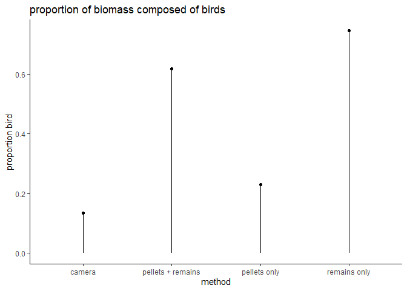
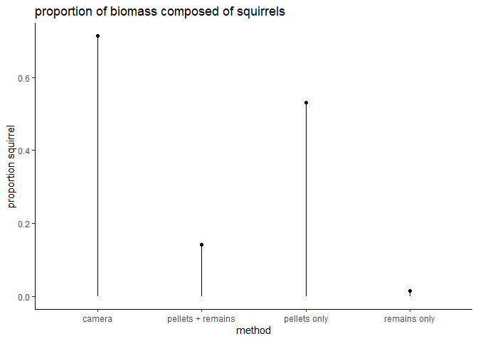

remains and pellets and cameras oh my
================

1.  Add missing models are re-run.
      - Prerequisites:
          - ~~choose canopy cover categories~~
          - ~~make canopy cover rasters~~
          - ~~make older forest rasters~~
2.  Fix some stuff I’ve been doing wrong.
      - remake landcover rasters at 100m scale
      - rerun diet breakdown with counts Next steps:
      - ~~compare counts and biomass breakdowns~~
3.  Run the models also for physical specimen data.
      - Prerequisites:
          - finish cleaning physical data
          - determine if there’s a cutoff for sample size
      - Next steps:
          - compare results from camera and physical data
4.  Compare diet between coastal and transition zones.
      - Prerequisites:
          - assign each site to cs or tz
      - Next steps:
          - compare results from camera and physical data

<!-- end list -->

``` r
# Import conflict settings.
source('../src/conflicted.R')

# Load some libraries.
library(tidyverse)
library(lubridate)
library(vegan)
library(ggplot2)

# Bring in data.
source('../src/prey_attributes_revised.R')
```

``` r
sample.size <- diet.items %>% 
  group_by(method) %>% 
  mutate(method.count=n()) %>% 
  ungroup() %>% group_by(source) %>% 
  mutate(source.count=n()) %>% 
  select(method, source, method.count, source.count) %>% 
  distinct() %>% 
  pivot_longer(!c(method, source), names_to='group', values_to='count') %>% 
  mutate(name=case_when(
    source == 'C' & group == 'method.count' ~ 'camera',
    source == 'R' & group == 'method.count' ~ 'pellets + remains',
    source == 'R' & group == 'source.count' ~ 'remains only',
    source == 'P' & group == 'source.count' ~ 'pellets only',
    TRUE ~ NA_character_
  )) %>% 
  drop_na()

ggplot(sample.size, aes(x=name, y=count)) +
  geom_point() +
  geom_segment( aes(x=name, xend=name, y=0, yend=count)) +
  theme_classic() +
  labs(y='count of items', x='method', title='Number of prey items identified to any level')
```

<!-- -->

``` r
select(sample.size, name, count)
```

    ## # A tibble: 4 x 3
    ## # Groups:   source [3]
    ##   source name              count
    ##   <chr>  <chr>             <int>
    ## 1 R      pellets + remains   139
    ## 2 R      remains only         68
    ## 3 C      camera              554
    ## 4 P      pellets only         71

``` r
# Calculate proportion mammal.
proportion.mammal <- diet.items %>% 
  group_by(method) %>% 
  mutate(method.mass=sum(mass, na.rm=TRUE)) %>% 
  ungroup() %>% group_by(source) %>% 
  mutate(source.mass=sum(mass, na.rm=TRUE)) %>%
  filter(class == 'Mammalia') %>% 
  ungroup() %>% group_by(method) %>% 
  mutate(method.mm=sum(mass, na.rm=TRUE)) %>%
  ungroup() %>% group_by(source) %>% 
  mutate(source.mm=sum(mass, na.rm=TRUE)) %>%
  mutate(method.prop.mm=method.mm/method.mass, source.prop.mm=source.mm/source.mass) %>% 
  select(method, source, method.prop.mm, source.prop.mm) %>% 
  distinct() %>% 
  pivot_longer(!c(method, source), names_to='group', values_to='proportion') %>% 
  mutate(name=case_when(
    source == 'C' & group == 'method.prop.mm' ~ 'camera',
    source == 'R' & group == 'method.prop.mm' ~ 'pellets + remains',
    source == 'R' & group == 'source.prop.mm' ~ 'remains only',
    source == 'P' & group == 'source.prop.mm' ~ 'pellets only',
    TRUE ~ NA_character_
  )) %>% 
  drop_na()

ggplot(proportion.mammal, aes(x=name, y=proportion)) +
  geom_point() +
  geom_segment( aes(x=name, xend=name, y=0, yend=proportion)) +
  theme_classic() +
  labs(y='proportion mammal', x='method', title='proportion of biomass composed of mammals')
```

<!-- -->

``` r
# Calculate proportion avian.
proportion.avian <- diet.items %>% 
  group_by(method) %>% 
  mutate(method.mass=sum(mass, na.rm=TRUE)) %>% 
  ungroup() %>% group_by(source) %>% 
  mutate(source.mass=sum(mass, na.rm=TRUE)) %>%
  filter(class == 'Aves') %>% 
  ungroup() %>% group_by(method) %>% 
  mutate(method.av=sum(mass, na.rm=TRUE)) %>%
  ungroup() %>% group_by(source) %>% 
  mutate(source.av=sum(mass, na.rm=TRUE)) %>%
  mutate(method.prop.av=method.av/method.mass, source.prop.av=source.av/source.mass) %>% 
  select(method, source, method.prop.av, source.prop.av) %>% 
  distinct() %>% 
  pivot_longer(!c(method, source), names_to='group', values_to='proportion') %>% 
  mutate(name=case_when(
    source == 'C' & group == 'method.prop.av' ~ 'camera',
    source == 'R' & group == 'method.prop.av' ~ 'pellets + remains',
    source == 'R' & group == 'source.prop.av' ~ 'remains only',
    source == 'P' & group == 'source.prop.av' ~ 'pellets only',
    TRUE ~ NA_character_
  )) %>% 
  drop_na()

ggplot(proportion.avian, aes(x=name, y=proportion)) +
  geom_point() +
  geom_segment( aes(x=name, xend=name, y=0, yend=proportion)) +
  theme_classic() +
  labs(y='proportion bird', x='method', title='proportion of biomass composed of birds')
```

<!-- -->

``` r
# Calculate proportion squirrel.
proportion.squirrel <- diet.items %>% 
  group_by(method) %>% 
  mutate(method.mass=sum(mass, na.rm=TRUE)) %>% 
  ungroup() %>% group_by(source) %>% 
  mutate(source.mass=sum(mass, na.rm=TRUE)) %>% 
  filter(genus == 'Tamiasciurus') %>% 
  ungroup() %>% group_by(method) %>% 
  mutate(method.sq=sum(mass, na.rm=TRUE)) %>%
  ungroup() %>% group_by(source) %>% 
  mutate(source.sq=sum(mass, na.rm=TRUE)) %>%
  mutate(method.prop.sq=method.sq/method.mass, source.prop.sq=source.sq/source.mass) %>% 
  select(method, source, method.prop.sq, source.prop.sq) %>% 
  distinct() %>% 
  pivot_longer(!c(method, source), names_to='group', values_to='proportion') %>% 
  mutate(name=case_when(
    source == 'C' & group == 'method.prop.sq' ~ 'camera',
    source == 'R' & group == 'method.prop.sq' ~ 'pellets + remains',
    source == 'R' & group == 'source.prop.sq' ~ 'remains only',
    source == 'P' & group == 'source.prop.sq' ~ 'pellets only',
    TRUE ~ NA_character_
  )) %>% 
  drop_na()

ggplot(proportion.squirrel, aes(x=name, y=proportion)) +
  geom_point() +
  geom_segment( aes(x=name, xend=name, y=0, yend=proportion)) +
  theme_classic() +
  labs(y='proportion squirrel', x='method', title='proportion of biomass composed of squirrels')
```

<!-- -->
