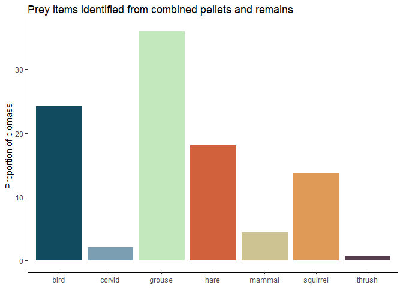
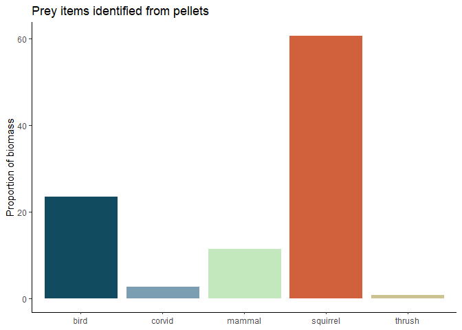

Final specimens
================

Fantastic news is that I have finished processing all of my physical
remains. So let’s see what the final results are.

``` r
# Import conflict settings.
source('../src/conflicted.R')

#Load some libraries.
library(tidyverse)
library(ggplot2)
library(lubridate)
library(vegan)

# Let's name some colors.
aves <- '#89b0ae'
mammalia <- '#e9c46a'
unknown <- 'lightgrey'
bird <- '#114b5f' # Midnight green eagle
corvid <- '#7c9eb2' # Pewter blue
grouse <- '#c3e8bd' # Tea green
hare <- '#d1603d' # Copper red
mammal <- '#cdc392' # Sage
squirrel <- '#df9a57' # Persian orange
thrush <- '#553e4e' # Eggplant

# Bring in diet data.
remains.data <- read_csv('../data/raw/20210118_specimens.csv', guess_max=7000) %>% 
  ## filter only records with at least size assigned...
  filter(size != 'U') %>% 
  ## and rename a confusing column.
  rename(name=site)

# Bring in a list of site abbreviations and site names.
nest.list <- read_csv('../data/processed/site_abbreviations.csv')

# Join the site list to the remains data by site name.
remains.data <- left_join(remains.data, nest.list, by='name')

# Add a unique site/year identifier.
remains.data <- remains.data %>% 
  mutate(year=year(date), nest=paste(site, year, sep=''))

# Select just the relevant columns...
remains.data <- remains.data %>% 
  select(id, site, year, nest, class, order, family, genus, species, common, size, source) %>% 
  ## then change the size column wording to make it look nicer...
  mutate(size=case_when(
    size == 'S' ~ 'small',
    size == 'M' ~ 'medium',
    size == 'L' ~ 'large'
  )) %>% 
  ## and replace all the "U"s with "Unknown"...
  mutate_at(c('class', 'order', 'family', 'genus'), funs(case_when(
    . == 'U' ~ 'Unknown',
    TRUE ~ .
  ))) %>% 
  ## in species as well...
  mutate(species=case_when(
    species == 'U' ~ 'unknown',
    TRUE ~ species
  ))

# Make sure species is lowercase.
remains.data$species <- str_to_lower(remains.data$species)

# Bring in a list of all known prey.
prey.list <- read_csv('../data/interim/prey_attributes.csv')

# Join the biomass data to the list of diet items.
diet.items <- prey.list %>% select(genus, species, binomial, common, category, mass) %>% 
  right_join(remains.data, by=c('genus', 'species', 'common'))

# For unidentified items, classify them by size and class.
diet.items <- diet.items %>% mutate(category=case_when(
  is.na(category) & class == 'Mammalia' & size == 'small' ~ 'small mammal',
  is.na(category) & class == 'Mammalia' & size == 'medium' ~ 'medium mammal',
  is.na(category) & class == 'Mammalia' & size == 'large' ~ 'large mammal',
  is.na(category) & class == 'Aves' & size == 'small' ~ 'small bird',
  is.na(category) & class == 'Aves' & size == 'medium' ~ 'medium bird',
  is.na(category) & class == 'Aves' & size == 'large' ~ 'large bird',
  is.na(category) & class == 'Unknown' ~ paste(size, 'item'),
  TRUE ~ category))

# For unidentified items, fill in the binomial column.
diet.items <- diet.items %>% replace_na(list(binomial = 'Unidentified item'))

# Create a table with average masses by collecting all the items of known mass...
average.sizes <- diet.items %>% drop_na(mass) %>% 
  group_by(category) %>% 
  ## averaging the mass for each size & class category...
  summarize(average=mean(mass)) %>% 
  pivot_wider(names_from=category, values_from=average) %>% 
  ## calculating the average mass for complete unknowns...
  mutate(`large item` = mean(`large bird`, `large mammal`),
         `medium item` = mean(`medium bird`, `medium mammal`),
         `small item` = mean(`small bird`, `small mammal`)) %>% 
  ## and reassembling it in a tidy format.
  pivot_longer(everything(), names_to='category', values_to='average')

# Join average mass to diet items...
diet.items <- left_join(diet.items, average.sizes, by='category') %>% 
  ## and fill in missing mass with average values
  mutate(mass=coalesce(mass, average)) %>% 
  ## then drop no longer needed average column and rearrange.
  select(id, site, year, nest, class, order, family, genus, species, binomial, common, 
         category, size, mass, source)
```

There are a few odd cases to clear up:

  - There are specimens from a site called Comsock that has no nest
    associated with it. Since there’s no strong reason to suppose these
    are NOGO prey remains, I’ll drop them.
  - There are several NOGO remains, some of which may represent prey and
    some which may not.
      - Item 1120 (MTF2019) was previously IDed as a SSHA, but after
        closer examination of the remains and the camera footage, is
        probably the chick that fell from the nest and not actually a
        prey item. So it should be dropped.
      - Item 1171 (GRC2020) looks to be a shed feather and not prey
        remains. (Although this nest def saw some cannibalism\!) So it
        should be dropped.

<!-- end list -->

``` r
sc <- diet.items %>% filter(id != 1120) %>% 
  filter(id != 1171)
```

Let’s start with some basic summaries.

``` r
# Total number of items.
summarize(sc, n())
```

    ## # A tibble: 1 x 1
    ##   `n()`
    ##   <int>
    ## 1   257

``` r
# Number of items per year.
sc %>% group_by(year) %>% 
  summarize(n())
```

    ## # A tibble: 2 x 2
    ##    year `n()`
    ##   <dbl> <int>
    ## 1  2019   135
    ## 2  2020   122

``` r
# Biomass per year.
sc %>% group_by(year) %>% 
  summarize(sum(mass))
```

    ## # A tibble: 2 x 2
    ##    year `sum(mass)`
    ##   <dbl>       <dbl>
    ## 1  2019      41734.
    ## 2  2020      50515.

``` r
# Weird. Mean biomass of items for each year?
sc %>% group_by(year) %>% 
  summarize(mean(mass))
```

    ## # A tibble: 2 x 2
    ##    year `mean(mass)`
    ##   <dbl>        <dbl>
    ## 1  2019         309.
    ## 2  2020         414.

So about the same number of things in both years, though slightly fewer
and slightly heavier things in 2020 than 2019. Probs all those hare from
PCR.

Let’s look at the species list for each year.

``` r
# For 2019.
sp.2019 <- sc %>% filter(year=='2019') %>% distinct (binomial) %>% arrange()
sp.2019
```

    ## # A tibble: 21 x 1
    ##    binomial              
    ##    <chr>                 
    ##  1 Larus canus           
    ##  2 Patagoienas fasciata  
    ##  3 Corvus caurinus       
    ##  4 Cyanocitta stelleri   
    ##  5 Pipilo maculatus      
    ##  6 Dendragapus fulignosus
    ##  7 Tetraoninae sp        
    ##  8 Catharus sp           
    ##  9 Ixoreus naevius       
    ## 10 Colaptes auratus      
    ## # ... with 11 more rows

``` r
# For 2020.
sp.2020 <- sc %>% filter(year=='2020') %>% distinct (binomial) %>% arrange()
sp.2020
```

    ## # A tibble: 17 x 1
    ##    binomial              
    ##    <chr>                 
    ##  1 Cyanocitta stelleri   
    ##  2 Pipilo maculatus      
    ##  3 Bonasa umbellus       
    ##  4 Dendragapus fulignosus
    ##  5 Tetraoninae sp        
    ##  6 Ixoreus naevius       
    ##  7 Picoides villosus     
    ##  8 Picoides sp           
    ##  9 Colaptes auratus      
    ## 10 Dryocopus pileatus    
    ## 11 Sphyrapicus ruber     
    ## 12 Accipiter gentilis    
    ## 13 Anas sp               
    ## 14 Lepus americanus      
    ## 15 Tamiasciurus douglasii
    ## 16 Arvicolinae sp        
    ## 17 Unidentified item

``` r
# Unique to 2019.
anti_join(sp.2019, sp.2020, by='binomial')
```

    ## # A tibble: 9 x 1
    ##   binomial               
    ##   <chr>                  
    ## 1 Larus canus            
    ## 2 Patagoienas fasciata   
    ## 3 Corvus caurinus        
    ## 4 Catharus sp            
    ## 5 Anas platyrhynchos     
    ## 6 Strix varia            
    ## 7 Neotoma cinerea        
    ## 8 Tamiasciurus hudsonicus
    ## 9 Neotamias sp

``` r
# Unique to 2020.
anti_join(sp.2020, sp.2019, by='binomial')
```

    ## # A tibble: 5 x 1
    ##   binomial          
    ##   <chr>             
    ## 1 Bonasa umbellus   
    ## 2 Picoides villosus 
    ## 3 Picoides sp       
    ## 4 Dryocopus pileatus
    ## 5 Accipiter gentilis

Let’s see if there are any major differences between prey groups.

``` r
# Add grouping variable.
by.group <- sc %>% mutate(group=case_when(
  class == 'Aves' & family == 'Phasianidae' ~ 'grouse',
  class == 'Aves' & family == 'Corvidae' ~ 'corvid',
  class == 'Aves' & family == 'Turdidae' ~ 'thrush',
  class == 'Aves' ~ 'bird',
  class == 'Mammalia' & genus == 'Tamiasciurus' ~ 'squirrel',
  class == 'Mammalia' & genus == 'Lepus' ~ 'hare',
  class == 'Mammalia' ~ 'mammal',
  TRUE ~ 'unknown'
))

# Make a frequency table.
freq.by.year <- by.group %>% group_by(year, group) %>% 
  mutate(count=n()) %>% 
  select(year, group, count) %>% 
  distinct() %>% ungroup() %>% 
  pivot_wider(names_from='group', values_from='count', values_fill=0) %>% 
  column_to_rownames(var='year')

# Run a chi-squared test for differences between years (is this even the right way to do it??)
chi.year <- chisq.test(freq.by.year, correct=FALSE, simulate.p.value=TRUE)

chi.year
```

    ## 
    ##  Pearson's Chi-squared test with simulated p-value (based on 2000
    ##  replicates)
    ## 
    ## data:  freq.by.year
    ## X-squared = 5.5798, df = NA, p-value = 0.5002

Profoundly insignificant, which is great news.

That’s enough comparisons, let’s look at the final numbers for the total
data. Start with the combined pellets + remains:

``` r
by.group %>% 
  mutate(total.mass=sum(mass)) %>% 
  group_by(group) %>% 
  mutate(group.mass=sum(mass),
         proportion.mass=group.mass/total.mass*100) %>% 
  distinct(group, group.mass, proportion.mass) %>% 
  ungroup() %>% 
  ggplot(aes(x=group, y=proportion.mass, fill=group)) +
  geom_bar(stat='identity', color='white') +
  scale_fill_manual(values=c(bird, corvid, grouse,
                             hare, mammal, squirrel,
                             thrush, unknown)) +
  labs(y='Proportion of biomass', 
       title='Prey items identified from combined pellets and remains') +
  theme_classic() +
  theme(axis.title.x=element_blank(),
        legend.position='none')
```

<!-- -->

A lot more grouse than seen here previously, because I finally got the
knack of identifying grouse keelbones and went back through a lot of
previously unidentified things and identified them.

And then pellets only:

``` r
by.group %>% filter(source == 'P') %>% 
  mutate(total.mass=sum(mass)) %>% 
  group_by(group) %>% 
  mutate(group.mass=sum(mass),
         proportion.mass=group.mass/total.mass*100) %>% 
  distinct(group, group.mass, proportion.mass) %>% 
  ungroup() %>% 
  ggplot(aes(x=group, y=proportion.mass, fill=group)) +
  geom_bar(stat='identity', color='white') +
  scale_fill_manual(values=c(bird, corvid, grouse,
                             hare, mammal, squirrel,
                             thrush, unknown)) +
  labs(y='Proportion of biomass', 
       title='Prey items identified from pellets') +
  theme_classic() +
  theme(axis.title.x=element_blank(),
        legend.position='none')
```

<!-- -->

Total species list:

``` r
sc %>% distinct (binomial) %>% arrange()
```

    ## # A tibble: 26 x 1
    ##    binomial              
    ##    <chr>                 
    ##  1 Larus canus           
    ##  2 Patagoienas fasciata  
    ##  3 Corvus caurinus       
    ##  4 Cyanocitta stelleri   
    ##  5 Pipilo maculatus      
    ##  6 Bonasa umbellus       
    ##  7 Dendragapus fulignosus
    ##  8 Tetraoninae sp        
    ##  9 Catharus sp           
    ## 10 Ixoreus naevius       
    ## # ... with 16 more rows

It’s pretty obvious here how my sp issue screws up everything. Voles are
very distinctive, it doesn’t make sense to classify them as
“unidentified small mammal” when they’re clearly a vole, especially
because that makes my biomass calculation much sloppier. But because
voles span multiple genera, it’s impossible to classify them properly
here, which screws up my richness/diversity calculations.
