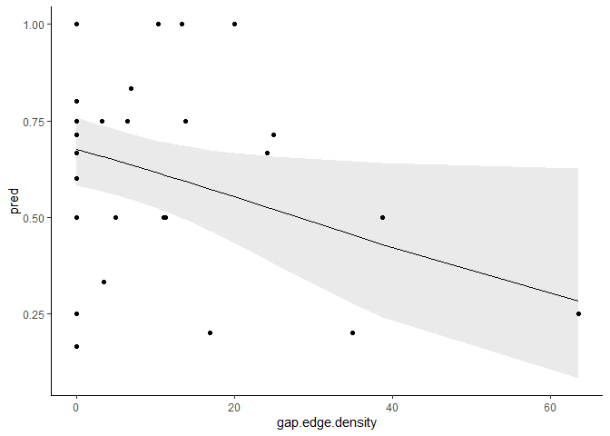
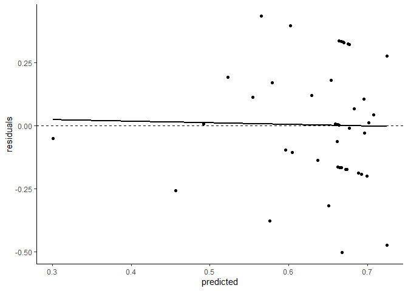

Less desperate multivariates
================

Playing with multivariate models that just might work??

# Setup

``` r
# Import conflict settings.
source('../src/conflicted.R')

# Load some libraries.
library(tidyverse)
library(ggplot2)
library(raster)
library(sf)
library(landscapemetrics)
library(knitr)
library(kableExtra)
library(broom)
library(AICcmodavg)
library(modelr)

# Load in the processed data from last time.
data <- read_csv('../data/processed/landscape_metrics_index.csv')

# Remove problematic TCR.
df <- data %>% filter(site != 'TCR')
```

I didn’t have ready-calculated HSI diversity, so I can add that (I
think…). Start by bringing in the raster and prepping it.

``` r
# Load HSI raster.
r.hsi <- raster('../data/processed/foraging_sc.tif')

# Define levels.
hsi.levels <- data.frame(ID=c(-10, -2, -1, 0, 1, 2, 3), 
                         class.name=c('ocean', 'freshwater', 'river', 
                                      'nil', 'low', 'moderate', 'high'))

# Add levels to raster.
levels(r.hsi) <- hsi.levels

# Assign crs to raster.
crs(r.hsi) <- CRS('+proj=utm +zone=10 +datum=NAD83 +units=m +no_defs')
```

Then get landscape sizes and sites set up.

``` r
# Define landscape sizes.
landscape <- data.frame(
  size=c('PFA', 'breeding area', 'home range', 'maximum range'),
  area=c(60, 200, 3800, 15600)
)

# Convert area in hectares to radii in meters.
landscape <- landscape %>% mutate(radius=sqrt(area*10000/pi))

# Read in the data.
nests <- read_csv('../data/processed/sc_nests.csv')

# Calculate a centroid for each site, and keep only ones with a quality index.
centroids <- nests %>% group_by(site) %>% 
  mutate(mean.x=mean(xcoord), mean.y=mean(ycoord)) %>% 
  distinct(site, name, mean.x, mean.y)

sites <- semi_join(centroids, data, by=c('site', 'name')) %>% 
  rename(xcoord=mean.x, ycoord=mean.y)

# Make it a spatial object for later.
sites.sf <- sites %>% 
  st_as_sf(coords=c('xcoord', 'ycoord')) %>% 
  st_set_crs('+proj=utm +zone=10 +datum=WGS84 +units=m +no_defs') %>% 
  st_as_sf()

# Also make a list of site names for later.
site.names <- sites.sf$site
```

Then do the actual calculations.

``` r
# Make a list of metrics to calculate.
hsi.metrics <- c('lsm_l_sidi')

# Make a function to do the calculations and formatting.
calc.hsi.metrics <- function(x) {
  sample_lsm(r.hsi, y=sites.sf, size=x, plot_id=site.names, shape='circle', 
             what=hsi.metrics) %>% 
    left_join(hsi.levels, by=c('class'='ID')) %>% 
    mutate(class.name=ifelse(is.na(class.name), metric, class.name)) %>% 
    select(-class, -metric, -level) %>%  
    pivot_wider(names_from=class.name, values_from=value) %>% 
    mutate(radius=x) %>% 
    rename(hsi.inside=percentage_inside)
}

# Run the function for each sample size.
hsi.landscape.metrics <- map_df(landscape$radius, calc.hsi.metrics)

# Do some cleanup
hsi.landscape.metrics <- hsi.landscape.metrics %>% 
  select(radius, hsi.inside, nest=plot_id, hsi.diversity=sidi)

hsi.landscape.metrics <- select(landscape, radius, size) %>% right_join(hsi.landscape.metrics, by=c('radius'))

# Join to data frame.
df <- left_join(df, hsi.landscape.metrics, by=c('site'='nest', 'size', 'radius', 'hsi.inside'))
```

# The models

``` r
# Proportion suitable
proportion.suitable.model <- function(df) {
  glm(cbind(years.detect, years.no.detect) ~ proportion.suitable, data=df, family=binomial(logit))
}

# Proportion suitable + HSI diversity
suitable.diversity.model <- function(df) {
  glm(cbind(years.detect, years.no.detect) ~ proportion.suitable + hsi.diversity, data=df, family=binomial(logit))
}

# Proportion suitable + suitable edge density
suitable.edge.density.model <- function(df) {
  glm(cbind(years.detect, years.no.detect) ~ proportion.suitable + suitable.edge.density, data=df, family=binomial(logit))
}

# Proportion suitable + HSI diversity + suitable edge density
suitable.sink.model <- function(df) {
  glm(cbind(years.detect, years.no.detect) ~ proportion.suitable + 
        suitable.edge.density + hsi.diversity, data=df, family=binomial(logit))
}

# Proportion mature forest
proportion.mature.model <- function(df) {
  glm(cbind(years.detect, years.no.detect) ~ proportion.cover.mature, data=df, family=binomial(logit))
}

# Proportion mature + landcover diversity
mature.diversity.model <- function(df) {
  glm(cbind(years.detect, years.no.detect) ~ proportion.cover.mature + cover.diversity, data=df, family=binomial(logit))
}

# Proportion mature + gap edge density
mature.edge.density.model <- function(df) {
  glm(cbind(years.detect, years.no.detect) ~ proportion.cover.mature + gap.edge.density, data=df, family=binomial(logit))
}

# Proportion mature + gap edge density + landcover diversity
mature.sink.model <- function(df) {
  glm(cbind(years.detect, years.no.detect) ~ proportion.cover.mature + 
        gap.edge.density + cover.diversity, data=df, family=binomial(logit))
}

# Null
null.model <- function(df) {
  glm(cbind(years.detect, years.no.detect) ~ 1, data=df, family=binomial(logit))
}
```

Then nest the data frame for ease of coding and apply each function to
generate a disturbingly large number of models really fast.

``` r
# Nest the data frame.
nf <- df %>% group_by(size) %>% nest()

# Apply the functions.
nf <- nf %>% 
  mutate(
    m.proportion.suitable=map(data, proportion.suitable.model),
    m.suitable.diversity=map(data, suitable.diversity.model),
    m.suitable.edge.density=map(data, suitable.edge.density.model),
    m.suitable.sink=map(data, suitable.sink.model),
    m.proportion.mature=map(data, proportion.mature.model),
    m.mature.diversity=map(data, mature.diversity.model),
    m.mature.edge.density=map(data, mature.edge.density.model),
    m.mature.sink=map(data, mature.sink.model),
    m.null=map(data, null.model)
         )
```

Now let’s split this up by size.

``` r
pfa.models <- nf %>% filter(size == 'PFA') %>% 
  pivot_longer(-c(size, data), names_to='modname', values_to='model')

ba.models <- nf %>% filter(size == 'breeding area') %>% 
  pivot_longer(-c(size, data), names_to='modname', values_to='model')

hr.models <- nf %>% filter(size == 'home range') %>% 
  pivot_longer(-c(size, data), names_to='modname', values_to='model')

mr.models <- nf %>% filter(size == 'maximum range') %>% 
  pivot_longer(-c(size, data), names_to='modname', values_to='model')
```

## PFA

``` r
aictab(pfa.models$model, modnames=pfa.models$modname) %>% 
  kable() %>% kable_styling(bootstrap_options=c('striped'))
```

<table class="table table-striped" style="margin-left: auto; margin-right: auto;">

<thead>

<tr>

<th style="text-align:left;">

</th>

<th style="text-align:left;">

Modnames

</th>

<th style="text-align:right;">

K

</th>

<th style="text-align:right;">

AICc

</th>

<th style="text-align:right;">

Delta\_AICc

</th>

<th style="text-align:right;">

ModelLik

</th>

<th style="text-align:right;">

AICcWt

</th>

<th style="text-align:right;">

LL

</th>

<th style="text-align:right;">

Cum.Wt

</th>

</tr>

</thead>

<tbody>

<tr>

<td style="text-align:left;">

7

</td>

<td style="text-align:left;">

m.mature.edge.density

</td>

<td style="text-align:right;">

3

</td>

<td style="text-align:right;">

107.7464

</td>

<td style="text-align:right;">

0.0000000

</td>

<td style="text-align:right;">

1.0000000

</td>

<td style="text-align:right;">

0.2978257

</td>

<td style="text-align:right;">

\-50.56552

</td>

<td style="text-align:right;">

0.2978257

</td>

</tr>

<tr>

<td style="text-align:left;">

9

</td>

<td style="text-align:left;">

m.null

</td>

<td style="text-align:right;">

1

</td>

<td style="text-align:right;">

107.8802

</td>

<td style="text-align:right;">

0.1338069

</td>

<td style="text-align:right;">

0.9352855

</td>

<td style="text-align:right;">

0.2785521

</td>

<td style="text-align:right;">

\-52.89134

</td>

<td style="text-align:right;">

0.5763778

</td>

</tr>

<tr>

<td style="text-align:left;">

8

</td>

<td style="text-align:left;">

m.mature.sink

</td>

<td style="text-align:right;">

4

</td>

<td style="text-align:right;">

109.7521

</td>

<td style="text-align:right;">

2.0056605

</td>

<td style="text-align:right;">

0.3668397

</td>

<td style="text-align:right;">

0.1092543

</td>

<td style="text-align:right;">

\-50.34973

</td>

<td style="text-align:right;">

0.6856321

</td>

</tr>

<tr>

<td style="text-align:left;">

5

</td>

<td style="text-align:left;">

m.proportion.mature

</td>

<td style="text-align:right;">

2

</td>

<td style="text-align:right;">

110.0698

</td>

<td style="text-align:right;">

2.3233543

</td>

<td style="text-align:right;">

0.3129609

</td>

<td style="text-align:right;">

0.0932078

</td>

<td style="text-align:right;">

\-52.88489

</td>

<td style="text-align:right;">

0.7788399

</td>

</tr>

<tr>

<td style="text-align:left;">

1

</td>

<td style="text-align:left;">

m.proportion.suitable

</td>

<td style="text-align:right;">

2

</td>

<td style="text-align:right;">

110.0711

</td>

<td style="text-align:right;">

2.3246506

</td>

<td style="text-align:right;">

0.3127581

</td>

<td style="text-align:right;">

0.0931474

</td>

<td style="text-align:right;">

\-52.88554

</td>

<td style="text-align:right;">

0.8719873

</td>

</tr>

<tr>

<td style="text-align:left;">

3

</td>

<td style="text-align:left;">

m.suitable.edge.density

</td>

<td style="text-align:right;">

3

</td>

<td style="text-align:right;">

111.3990

</td>

<td style="text-align:right;">

3.6526090

</td>

<td style="text-align:right;">

0.1610075

</td>

<td style="text-align:right;">

0.0479522

</td>

<td style="text-align:right;">

\-52.39183

</td>

<td style="text-align:right;">

0.9199395

</td>

</tr>

<tr>

<td style="text-align:left;">

2

</td>

<td style="text-align:left;">

m.suitable.diversity

</td>

<td style="text-align:right;">

3

</td>

<td style="text-align:right;">

112.0763

</td>

<td style="text-align:right;">

4.3298261

</td>

<td style="text-align:right;">

0.1147599

</td>

<td style="text-align:right;">

0.0341785

</td>

<td style="text-align:right;">

\-52.73044

</td>

<td style="text-align:right;">

0.9541180

</td>

</tr>

<tr>

<td style="text-align:left;">

6

</td>

<td style="text-align:left;">

m.mature.diversity

</td>

<td style="text-align:right;">

3

</td>

<td style="text-align:right;">

112.3844

</td>

<td style="text-align:right;">

4.6379446

</td>

<td style="text-align:right;">

0.0983746

</td>

<td style="text-align:right;">

0.0292985

</td>

<td style="text-align:right;">

\-52.88450

</td>

<td style="text-align:right;">

0.9834165

</td>

</tr>

<tr>

<td style="text-align:left;">

4

</td>

<td style="text-align:left;">

m.suitable.sink

</td>

<td style="text-align:right;">

4

</td>

<td style="text-align:right;">

113.5226

</td>

<td style="text-align:right;">

5.7761947

</td>

<td style="text-align:right;">

0.0556821

</td>

<td style="text-align:right;">

0.0165835

</td>

<td style="text-align:right;">

\-52.23500

</td>

<td style="text-align:right;">

1.0000000

</td>

</tr>

</tbody>

</table>

### Top model

We can visualize the top model. Maybe.

``` r
# Separate out the data.
pfa.data <- df %>% filter(size == 'PFA')

# Re-write the top model on its own.
top.model <- glm(cbind(years.detect, years.no.detect) ~ proportion.cover.mature + 
                   gap.edge.density, data=pfa.data, family=binomial(logit))

# Create a grid and add predictions.
fake <- data_grid(pfa.data, gap.edge.density, .model=top.model) %>% 
  mutate(pred=predict(top.model, newdata=., type='response'))

# Grab the inverse link function from the model.
inv <- family(top.model)$linkinv

# Add fit and SE data.
fake <- bind_cols(fake, setNames(as_tibble(predict(top.model, fake, se.fit = TRUE)[1:2]),
                           c('fit.link','se.link')))

# Create confidence interval.
fake <- fake %>% mutate(fit.resp  = inv(fit.link),
                  right.upr = inv(fit.link + (2 * se.link)),
                  right.lwr = inv(fit.link - (2 * se.link)))

# Plot them?
ggplot(fake, aes(x=gap.edge.density, y=pred)) +
  geom_line() +
  geom_ribbon(aes(ymin=right.lwr, ymax=right.upr), alpha=0.1) +
  geom_point(data=pfa.data, aes(x=gap.edge.density, y=quality.index)) +
  theme_classic()
```

<!-- -->

Let’s check how the model is running.

``` r
summary(top.model)
```

    ## 
    ## Call:
    ## glm(formula = cbind(years.detect, years.no.detect) ~ proportion.cover.mature + 
    ##     gap.edge.density, family = binomial(logit), data = pfa.data)
    ## 
    ## Deviance Residuals: 
    ##      Min        1Q    Median        3Q       Max  
    ## -2.53289  -0.48471   0.00978   0.84730   2.21869  
    ## 
    ## Coefficients:
    ##                          Estimate Std. Error z value Pr(>|z|)  
    ## (Intercept)              0.987286   0.494648   1.996   0.0459 *
    ## proportion.cover.mature -0.003267   0.006296  -0.519   0.6038  
    ## gap.edge.density        -0.026327   0.012525  -2.102   0.0356 *
    ## ---
    ## Signif. codes:  0 '***' 0.001 '**' 0.01 '*' 0.05 '.' 0.1 ' ' 1
    ## 
    ## (Dispersion parameter for binomial family taken to be 1)
    ## 
    ##     Null deviance: 48.836  on 42  degrees of freedom
    ## Residual deviance: 44.184  on 40  degrees of freedom
    ## AIC: 107.13
    ## 
    ## Number of Fisher Scoring iterations: 4

Of course the p- and z-values don’t mean anything in this context. Yes,
gap edge density has a negative effect. Weird (really, really weird)
that the proportion of mature cover also has a negative effect.

``` r
# Look at some diagnostics.
data.frame(predicted=predict(top.model, type='response'),
           residuals=residuals(top.model, type='response')) %>% 
  ggplot(aes(x=predicted, y=residuals)) +
  geom_point() +
  geom_hline(yintercept=0, linetype='dashed') +
  geom_smooth(method='lm', se=FALSE, color='black') +
  theme_classic()
```

<!-- -->

That’s… maybe not terrible? And the dispersion is 44.184 residual
deviance / 40 residual df = 1.1 so a little overdispersed but also not
terrible.

### All models

``` r
pfa.models %>% mutate(glance=map(model, glance)) %>% 
  unnest(glance) %>% ungroup() %>% 
  select(!c(size, data, model))
```

    ## # A tibble: 9 x 8
    ##   modname          null.deviance df.null logLik   AIC   BIC deviance df.residual
    ##   <chr>                    <dbl>   <int>  <dbl> <dbl> <dbl>    <dbl>       <int>
    ## 1 m.proportion.su~          48.8      42  -52.9  110.  113.     48.8          41
    ## 2 m.suitable.dive~          48.8      42  -52.7  111.  117.     48.5          40
    ## 3 m.suitable.edge~          48.8      42  -52.4  111.  116.     47.8          40
    ## 4 m.suitable.sink           48.8      42  -52.2  112.  120.     47.5          39
    ## 5 m.proportion.ma~          48.8      42  -52.9  110.  113.     48.8          41
    ## 6 m.mature.divers~          48.8      42  -52.9  112.  117.     48.8          40
    ## 7 m.mature.edge.d~          48.8      42  -50.6  107.  112.     44.2          40
    ## 8 m.mature.sink             48.8      42  -50.3  109.  116.     43.8          39
    ## 9 m.null                    48.8      42  -52.9  108.  110.     48.8          42

``` r
pfa.models %>% mutate(tidy=map(model, tidy)) %>% 
  unnest(tidy) %>% ungroup() %>% 
  select(!c(size, data, model)) %>% 
  filter(term != '(Intercept)')
```

    ## # A tibble: 16 x 6
    ##    modname              term                estimate std.error statistic p.value
    ##    <chr>                <chr>                  <dbl>     <dbl>     <dbl>   <dbl>
    ##  1 m.proportion.suitab~ proportion.suitable  1.32e-3   0.0123     0.108   0.914 
    ##  2 m.suitable.diversity proportion.suitable  5.53e-3   0.0145     0.382   0.702 
    ##  3 m.suitable.diversity hsi.diversity        5.57e-1   1.00       0.556   0.578 
    ##  4 m.suitable.edge.den~ proportion.suitable -1.88e-2   0.0241    -0.778   0.436 
    ##  5 m.suitable.edge.den~ suitable.edge.dens~ -1.97e-2   0.0199    -0.991   0.322 
    ##  6 m.suitable.sink      proportion.suitable -1.46e-2   0.0253    -0.576   0.565 
    ##  7 m.suitable.sink      suitable.edge.dens~ -1.98e-2   0.0199    -0.992   0.321 
    ##  8 m.suitable.sink      hsi.diversity        5.61e-1   1.00       0.559   0.576 
    ##  9 m.proportion.mature  proportion.cover.m~  6.65e-4   0.00586    0.114   0.910 
    ## 10 m.mature.diversity   proportion.cover.m~  6.09e-4   0.00619    0.0984  0.922 
    ## 11 m.mature.diversity   cover.diversity     -2.91e-2   1.03      -0.0282  0.978 
    ## 12 m.mature.edge.densi~ proportion.cover.m~ -3.27e-3   0.00630   -0.519   0.604 
    ## 13 m.mature.edge.densi~ gap.edge.density    -2.63e-2   0.0125    -2.10    0.0356
    ## 14 m.mature.sink        proportion.cover.m~ -2.17e-3   0.00642   -0.338   0.735 
    ## 15 m.mature.sink        gap.edge.density    -2.89e-2   0.0132    -2.19    0.0283
    ## 16 m.mature.sink        cover.diversity      7.31e-1   1.11       0.657   0.511

## Breeding area

``` r
aictab(ba.models$model, modnames=pfa.models$modname) %>% 
  kable() %>% kable_styling(bootstrap_options=c('striped'))
```

<table class="table table-striped" style="margin-left: auto; margin-right: auto;">

<thead>

<tr>

<th style="text-align:left;">

</th>

<th style="text-align:left;">

Modnames

</th>

<th style="text-align:right;">

K

</th>

<th style="text-align:right;">

AICc

</th>

<th style="text-align:right;">

Delta\_AICc

</th>

<th style="text-align:right;">

ModelLik

</th>

<th style="text-align:right;">

AICcWt

</th>

<th style="text-align:right;">

LL

</th>

<th style="text-align:right;">

Cum.Wt

</th>

</tr>

</thead>

<tbody>

<tr>

<td style="text-align:left;">

7

</td>

<td style="text-align:left;">

m.mature.edge.density

</td>

<td style="text-align:right;">

3

</td>

<td style="text-align:right;">

107.0983

</td>

<td style="text-align:right;">

0.0000000

</td>

<td style="text-align:right;">

1.0000000

</td>

<td style="text-align:right;">

0.3154823

</td>

<td style="text-align:right;">

\-50.24146

</td>

<td style="text-align:right;">

0.3154823

</td>

</tr>

<tr>

<td style="text-align:left;">

9

</td>

<td style="text-align:left;">

m.null

</td>

<td style="text-align:right;">

1

</td>

<td style="text-align:right;">

107.8802

</td>

<td style="text-align:right;">

0.7819439

</td>

<td style="text-align:right;">

0.6763991

</td>

<td style="text-align:right;">

0.2133920

</td>

<td style="text-align:right;">

\-52.89134

</td>

<td style="text-align:right;">

0.5288743

</td>

</tr>

<tr>

<td style="text-align:left;">

2

</td>

<td style="text-align:left;">

m.suitable.diversity

</td>

<td style="text-align:right;">

3

</td>

<td style="text-align:right;">

109.1524

</td>

<td style="text-align:right;">

2.0541244

</td>

<td style="text-align:right;">

0.3580573

</td>

<td style="text-align:right;">

0.1129607

</td>

<td style="text-align:right;">

\-51.26852

</td>

<td style="text-align:right;">

0.6418350

</td>

</tr>

<tr>

<td style="text-align:left;">

8

</td>

<td style="text-align:left;">

m.mature.sink

</td>

<td style="text-align:right;">

4

</td>

<td style="text-align:right;">

109.3621

</td>

<td style="text-align:right;">

2.2638375

</td>

<td style="text-align:right;">

0.3224140

</td>

<td style="text-align:right;">

0.1017159

</td>

<td style="text-align:right;">

\-50.15475

</td>

<td style="text-align:right;">

0.7435509

</td>

</tr>

<tr>

<td style="text-align:left;">

1

</td>

<td style="text-align:left;">

m.proportion.suitable

</td>

<td style="text-align:right;">

2

</td>

<td style="text-align:right;">

109.4433

</td>

<td style="text-align:right;">

2.3449604

</td>

<td style="text-align:right;">

0.3095981

</td>

<td style="text-align:right;">

0.0976727

</td>

<td style="text-align:right;">

\-52.57163

</td>

<td style="text-align:right;">

0.8412237

</td>

</tr>

<tr>

<td style="text-align:left;">

5

</td>

<td style="text-align:left;">

m.proportion.mature

</td>

<td style="text-align:right;">

2

</td>

<td style="text-align:right;">

110.0609

</td>

<td style="text-align:right;">

2.9625667

</td>

<td style="text-align:right;">

0.2273457

</td>

<td style="text-align:right;">

0.0717236

</td>

<td style="text-align:right;">

\-52.88043

</td>

<td style="text-align:right;">

0.9129472

</td>

</tr>

<tr>

<td style="text-align:left;">

4

</td>

<td style="text-align:left;">

m.suitable.sink

</td>

<td style="text-align:right;">

4

</td>

<td style="text-align:right;">

111.5653

</td>

<td style="text-align:right;">

4.4670035

</td>

<td style="text-align:right;">

0.1071525

</td>

<td style="text-align:right;">

0.0338047

</td>

<td style="text-align:right;">

\-51.25633

</td>

<td style="text-align:right;">

0.9467519

</td>

</tr>

<tr>

<td style="text-align:left;">

3

</td>

<td style="text-align:left;">

m.suitable.edge.density

</td>

<td style="text-align:right;">

3

</td>

<td style="text-align:right;">

111.7572

</td>

<td style="text-align:right;">

4.6589141

</td>

<td style="text-align:right;">

0.0973486

</td>

<td style="text-align:right;">

0.0307118

</td>

<td style="text-align:right;">

\-52.57091

</td>

<td style="text-align:right;">

0.9774637

</td>

</tr>

<tr>

<td style="text-align:left;">

6

</td>

<td style="text-align:left;">

m.mature.diversity

</td>

<td style="text-align:right;">

3

</td>

<td style="text-align:right;">

112.3762

</td>

<td style="text-align:right;">

5.2779510

</td>

<td style="text-align:right;">

0.0714344

</td>

<td style="text-align:right;">

0.0225363

</td>

<td style="text-align:right;">

\-52.88043

</td>

<td style="text-align:right;">

1.0000000

</td>

</tr>

</tbody>

</table>

## Home range

``` r
aictab(hr.models$model, modnames=pfa.models$modname) %>% 
  kable() %>% kable_styling(bootstrap_options=c('striped'))
```

<table class="table table-striped" style="margin-left: auto; margin-right: auto;">

<thead>

<tr>

<th style="text-align:left;">

</th>

<th style="text-align:left;">

Modnames

</th>

<th style="text-align:right;">

K

</th>

<th style="text-align:right;">

AICc

</th>

<th style="text-align:right;">

Delta\_AICc

</th>

<th style="text-align:right;">

ModelLik

</th>

<th style="text-align:right;">

AICcWt

</th>

<th style="text-align:right;">

LL

</th>

<th style="text-align:right;">

Cum.Wt

</th>

</tr>

</thead>

<tbody>

<tr>

<td style="text-align:left;">

9

</td>

<td style="text-align:left;">

m.null

</td>

<td style="text-align:right;">

1

</td>

<td style="text-align:right;">

107.8802

</td>

<td style="text-align:right;">

0.000000

</td>

<td style="text-align:right;">

1.0000000

</td>

<td style="text-align:right;">

0.3992188

</td>

<td style="text-align:right;">

\-52.89134

</td>

<td style="text-align:right;">

0.3992188

</td>

</tr>

<tr>

<td style="text-align:left;">

5

</td>

<td style="text-align:left;">

m.proportion.mature

</td>

<td style="text-align:right;">

2

</td>

<td style="text-align:right;">

109.6719

</td>

<td style="text-align:right;">

1.791648

</td>

<td style="text-align:right;">

0.4082711

</td>

<td style="text-align:right;">

0.1629895

</td>

<td style="text-align:right;">

\-52.68594

</td>

<td style="text-align:right;">

0.5622083

</td>

</tr>

<tr>

<td style="text-align:left;">

1

</td>

<td style="text-align:left;">

m.proportion.suitable

</td>

<td style="text-align:right;">

2

</td>

<td style="text-align:right;">

110.0826

</td>

<td style="text-align:right;">

2.202379

</td>

<td style="text-align:right;">

0.3324754

</td>

<td style="text-align:right;">

0.1327304

</td>

<td style="text-align:right;">

\-52.89131

</td>

<td style="text-align:right;">

0.6949388

</td>

</tr>

<tr>

<td style="text-align:left;">

2

</td>

<td style="text-align:left;">

m.suitable.diversity

</td>

<td style="text-align:right;">

3

</td>

<td style="text-align:right;">

111.2805

</td>

<td style="text-align:right;">

3.400240

</td>

<td style="text-align:right;">

0.1826616

</td>

<td style="text-align:right;">

0.0729219

</td>

<td style="text-align:right;">

\-52.33255

</td>

<td style="text-align:right;">

0.7678607

</td>

</tr>

<tr>

<td style="text-align:left;">

6

</td>

<td style="text-align:left;">

m.mature.diversity

</td>

<td style="text-align:right;">

3

</td>

<td style="text-align:right;">

111.5556

</td>

<td style="text-align:right;">

3.675393

</td>

<td style="text-align:right;">

0.1591837

</td>

<td style="text-align:right;">

0.0635491

</td>

<td style="text-align:right;">

\-52.47012

</td>

<td style="text-align:right;">

0.8314098

</td>

</tr>

<tr>

<td style="text-align:left;">

7

</td>

<td style="text-align:left;">

m.mature.edge.density

</td>

<td style="text-align:right;">

3

</td>

<td style="text-align:right;">

111.6600

</td>

<td style="text-align:right;">

3.779751

</td>

<td style="text-align:right;">

0.1510906

</td>

<td style="text-align:right;">

0.0603182

</td>

<td style="text-align:right;">

\-52.52230

</td>

<td style="text-align:right;">

0.8917280

</td>

</tr>

<tr>

<td style="text-align:left;">

3

</td>

<td style="text-align:left;">

m.suitable.edge.density

</td>

<td style="text-align:right;">

3

</td>

<td style="text-align:right;">

111.7731

</td>

<td style="text-align:right;">

3.892872

</td>

<td style="text-align:right;">

0.1427820

</td>

<td style="text-align:right;">

0.0570013

</td>

<td style="text-align:right;">

\-52.57886

</td>

<td style="text-align:right;">

0.9487293

</td>

</tr>

<tr>

<td style="text-align:left;">

4

</td>

<td style="text-align:left;">

m.suitable.sink

</td>

<td style="text-align:right;">

4

</td>

<td style="text-align:right;">

112.9667

</td>

<td style="text-align:right;">

5.086489

</td>

<td style="text-align:right;">

0.0786109

</td>

<td style="text-align:right;">

0.0313830

</td>

<td style="text-align:right;">

\-51.95705

</td>

<td style="text-align:right;">

0.9801123

</td>

</tr>

<tr>

<td style="text-align:left;">

8

</td>

<td style="text-align:left;">

m.mature.sink

</td>

<td style="text-align:right;">

4

</td>

<td style="text-align:right;">

113.8791

</td>

<td style="text-align:right;">

5.998814

</td>

<td style="text-align:right;">

0.0498166

</td>

<td style="text-align:right;">

0.0198877

</td>

<td style="text-align:right;">

\-52.41321

</td>

<td style="text-align:right;">

1.0000000

</td>

</tr>

</tbody>

</table>

## Maximum range

``` r
aictab(mr.models$model, modnames=pfa.models$modname) %>% 
  kable() %>% kable_styling(bootstrap_options=c('striped'))
```

<table class="table table-striped" style="margin-left: auto; margin-right: auto;">

<thead>

<tr>

<th style="text-align:left;">

</th>

<th style="text-align:left;">

Modnames

</th>

<th style="text-align:right;">

K

</th>

<th style="text-align:right;">

AICc

</th>

<th style="text-align:right;">

Delta\_AICc

</th>

<th style="text-align:right;">

ModelLik

</th>

<th style="text-align:right;">

AICcWt

</th>

<th style="text-align:right;">

LL

</th>

<th style="text-align:right;">

Cum.Wt

</th>

</tr>

</thead>

<tbody>

<tr>

<td style="text-align:left;">

9

</td>

<td style="text-align:left;">

m.null

</td>

<td style="text-align:right;">

1

</td>

<td style="text-align:right;">

107.8802

</td>

<td style="text-align:right;">

0.000000

</td>

<td style="text-align:right;">

1.0000000

</td>

<td style="text-align:right;">

0.3661612

</td>

<td style="text-align:right;">

\-52.89134

</td>

<td style="text-align:right;">

0.3661612

</td>

</tr>

<tr>

<td style="text-align:left;">

5

</td>

<td style="text-align:left;">

m.proportion.mature

</td>

<td style="text-align:right;">

2

</td>

<td style="text-align:right;">

109.6570

</td>

<td style="text-align:right;">

1.776720

</td>

<td style="text-align:right;">

0.4113298

</td>

<td style="text-align:right;">

0.1506130

</td>

<td style="text-align:right;">

\-52.67848

</td>

<td style="text-align:right;">

0.5167742

</td>

</tr>

<tr>

<td style="text-align:left;">

1

</td>

<td style="text-align:left;">

m.proportion.suitable

</td>

<td style="text-align:right;">

2

</td>

<td style="text-align:right;">

110.0662

</td>

<td style="text-align:right;">

2.185923

</td>

<td style="text-align:right;">

0.3352223

</td>

<td style="text-align:right;">

0.1227454

</td>

<td style="text-align:right;">

\-52.88308

</td>

<td style="text-align:right;">

0.6395196

</td>

</tr>

<tr>

<td style="text-align:left;">

3

</td>

<td style="text-align:left;">

m.suitable.edge.density

</td>

<td style="text-align:right;">

3

</td>

<td style="text-align:right;">

110.4104

</td>

<td style="text-align:right;">

2.530153

</td>

<td style="text-align:right;">

0.2822176

</td>

<td style="text-align:right;">

0.1033372

</td>

<td style="text-align:right;">

\-51.89750

</td>

<td style="text-align:right;">

0.7428568

</td>

</tr>

<tr>

<td style="text-align:left;">

7

</td>

<td style="text-align:left;">

m.mature.edge.density

</td>

<td style="text-align:right;">

3

</td>

<td style="text-align:right;">

111.0740

</td>

<td style="text-align:right;">

3.193804

</td>

<td style="text-align:right;">

0.2025230

</td>

<td style="text-align:right;">

0.0741561

</td>

<td style="text-align:right;">

\-52.22933

</td>

<td style="text-align:right;">

0.8170129

</td>

</tr>

<tr>

<td style="text-align:left;">

2

</td>

<td style="text-align:left;">

m.suitable.diversity

</td>

<td style="text-align:right;">

3

</td>

<td style="text-align:right;">

111.6312

</td>

<td style="text-align:right;">

3.750971

</td>

<td style="text-align:right;">

0.1532805

</td>

<td style="text-align:right;">

0.0561254

</td>

<td style="text-align:right;">

\-52.50791

</td>

<td style="text-align:right;">

0.8731382

</td>

</tr>

<tr>

<td style="text-align:left;">

4

</td>

<td style="text-align:left;">

m.suitable.sink

</td>

<td style="text-align:right;">

4

</td>

<td style="text-align:right;">

111.7162

</td>

<td style="text-align:right;">

3.835987

</td>

<td style="text-align:right;">

0.1469014

</td>

<td style="text-align:right;">

0.0537896

</td>

<td style="text-align:right;">

\-51.33180

</td>

<td style="text-align:right;">

0.9269278

</td>

</tr>

<tr>

<td style="text-align:left;">

6

</td>

<td style="text-align:left;">

m.mature.diversity

</td>

<td style="text-align:right;">

3

</td>

<td style="text-align:right;">

111.8176

</td>

<td style="text-align:right;">

3.937338

</td>

<td style="text-align:right;">

0.1396426

</td>

<td style="text-align:right;">

0.0511317

</td>

<td style="text-align:right;">

\-52.60110

</td>

<td style="text-align:right;">

0.9780595

</td>

</tr>

<tr>

<td style="text-align:left;">

8

</td>

<td style="text-align:left;">

m.mature.sink

</td>

<td style="text-align:right;">

4

</td>

<td style="text-align:right;">

113.5097

</td>

<td style="text-align:right;">

5.629483

</td>

<td style="text-align:right;">

0.0599202

</td>

<td style="text-align:right;">

0.0219405

</td>

<td style="text-align:right;">

\-52.22855

</td>

<td style="text-align:right;">

1.0000000

</td>

</tr>

</tbody>

</table>
