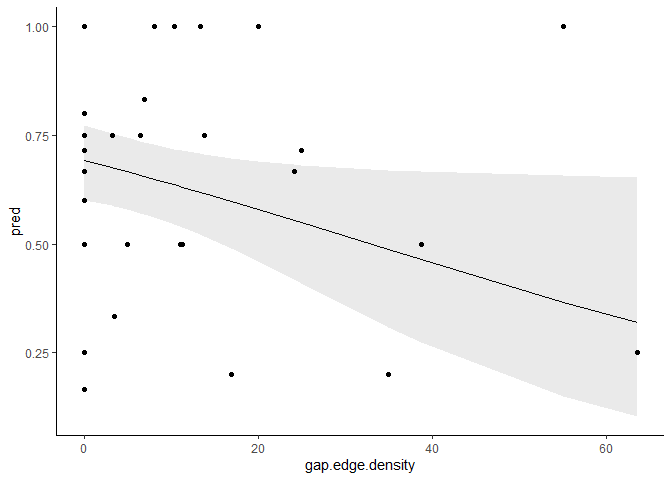
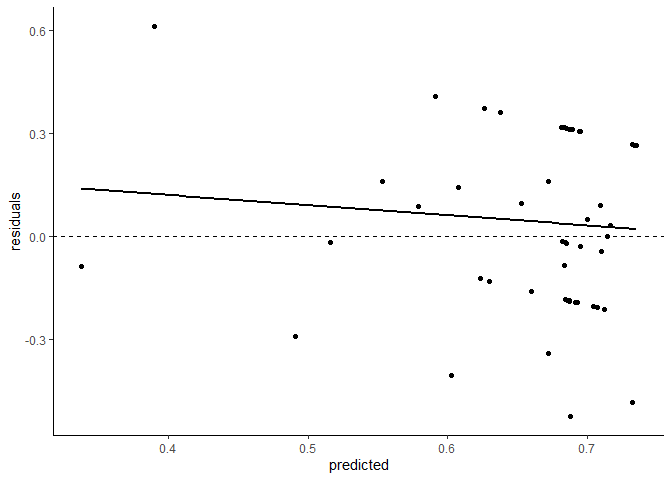
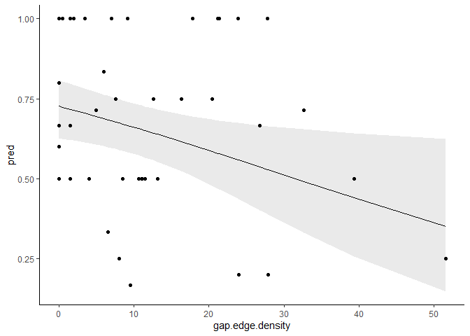
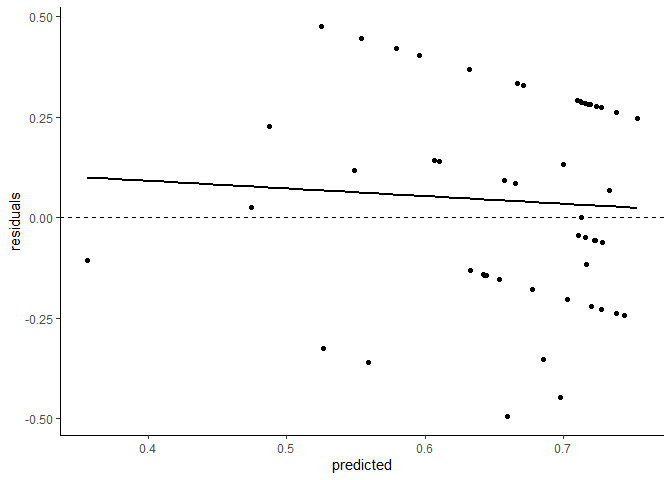

Onesies
================

Ok, so I originally dropped all the onesies (sites with only one year of
survey data) from the analysis because they’re almost always active (and
if they’re not active they’re a zero and get dropped anyway), and I was
concerned there was a potential for bias.

``` r
# Import conflict settings.
source('../src/conflicted.R')

# Load some libraries.
library(tidyverse)
library(ggplot2)
library(raster)
library(sf)
library(landscapemetrics)
library(knitr)
library(kableExtra)
library(broom)
library(AICcmodavg)
library(modelr)

# Load in the processed data from last time.
data <- read_csv('../data/processed/landscape_metrics_full.csv')

# Remove problematic TCR.
df <- data %>% filter(site != 'TCR')

# Keep only sites with occupancy data.
df <- df %>% drop_na(years.surveyed) #90

# Remove sites that are missing sufficient landscape data.
df <- df %>% filter_at(vars(contains('inside')), all_vars(. >=90))
```

Looks like that filtered out one scale at one site. Does it matter if I
don’t have a full set of scales per site? That is, if some sites only
have some scales? Probably not.

I didn’t have ready-calculated HSI diversity, so I can add that (I
think…). Start by bringing in the raster and prepping it.

``` r
# Load HSI raster.
r.hsi <- raster('../data/processed/foraging_sc.tif')

# Define levels.
hsi.levels <- data.frame(ID=c(-10, -2, -1, 0, 1, 2, 3), 
                         class.name=c('ocean', 'freshwater', 'river', 
                                      'nil', 'low', 'moderate', 'high'))

# Add levels to raster.
levels(r.hsi) <- hsi.levels

# Assign crs to raster.
crs(r.hsi) <- CRS('+proj=utm +zone=10 +datum=NAD83 +units=m +no_defs')
```

Then get landscape sizes and sites set up.

``` r
# Define landscape sizes.
landscape <- data.frame(
  size=c('PFA', 'breeding area', 'home range', 'maximum range'),
  area=c(60, 200, 3800, 15600)
)

# Convert area in hectares to radii in meters.
landscape <- landscape %>% mutate(radius=sqrt(area*10000/pi))

# Read in the data.
nests <- read_csv('../data/processed/sc_nests.csv')

# Calculate a centroid for each site, and keep only ones with a quality index.
centroids <- nests %>% group_by(site) %>% 
  mutate(mean.x=mean(xcoord), mean.y=mean(ycoord)) %>% 
  distinct(site, name, mean.x, mean.y)

sites <- semi_join(centroids, data, by=c('site', 'name')) %>% 
  rename(xcoord=mean.x, ycoord=mean.y)

# Make it a spatial object for later.
sites.sf <- sites %>% 
  st_as_sf(coords=c('xcoord', 'ycoord')) %>% 
  st_set_crs('+proj=utm +zone=10 +datum=WGS84 +units=m +no_defs') %>% 
  st_as_sf()

# Also make a list of site names for later.
site.names <- sites.sf$site
```

Then do the actual calculations.

``` r
# Make a list of metrics to calculate.
hsi.metrics <- c('lsm_l_sidi')

# Make a function to do the calculations and formatting.
calc.hsi.metrics <- function(x) {
  sample_lsm(r.hsi, y=sites.sf, size=x, plot_id=site.names, shape='circle', 
             what=hsi.metrics) %>% 
    left_join(hsi.levels, by=c('class'='ID')) %>% 
    mutate(class.name=ifelse(is.na(class.name), metric, class.name)) %>% 
    select(-class, -metric, -level) %>%  
    pivot_wider(names_from=class.name, values_from=value) %>% 
    mutate(radius=x) %>% 
    rename(hsi.inside=percentage_inside)
}

# Run the function for each sample size.
hsi.landscape.metrics <- map_df(landscape$radius, calc.hsi.metrics)

# Do some cleanup
hsi.landscape.metrics <- hsi.landscape.metrics %>% 
  select(radius, hsi.inside, nest=plot_id, hsi.diversity=sidi)

hsi.landscape.metrics <- select(landscape, radius, size) %>% right_join(hsi.landscape.metrics, by=c('radius'))

# Join to data frame.
df <- left_join(df, hsi.landscape.metrics, by=c('site'='nest', 'size', 'radius', 'hsi.inside'))

# Filter out any sites without sufficient landscape coverage.
df <- df %>% filter_at(vars(contains('inside')), all_vars(. >=90))
```

# The models

``` r
# Proportion suitable
proportion.suitable.model <- function(df) {
  glm(cbind(years.detect, years.no.detect) ~ proportion.suitable, data=df, family=binomial(logit))
}

# Proportion suitable + HSI diversity
suitable.diversity.model <- function(df) {
  glm(cbind(years.detect, years.no.detect) ~ proportion.suitable + hsi.diversity, data=df, family=binomial(logit))
}

# Proportion suitable + suitable edge density
suitable.edge.density.model <- function(df) {
  glm(cbind(years.detect, years.no.detect) ~ proportion.suitable + suitable.edge.density, data=df, family=binomial(logit))
}

# Proportion suitable + HSI diversity + suitable edge density
suitable.sink.model <- function(df) {
  glm(cbind(years.detect, years.no.detect) ~ proportion.suitable + 
        suitable.edge.density + hsi.diversity, data=df, family=binomial(logit))
}

# Proportion mature forest
proportion.mature.model <- function(df) {
  glm(cbind(years.detect, years.no.detect) ~ proportion.cover.mature, data=df, family=binomial(logit))
}

# Proportion mature + landcover diversity
mature.diversity.model <- function(df) {
  glm(cbind(years.detect, years.no.detect) ~ proportion.cover.mature + cover.diversity, data=df, family=binomial(logit))
}

# Proportion mature + gap edge density
mature.edge.density.model <- function(df) {
  glm(cbind(years.detect, years.no.detect) ~ proportion.cover.mature + gap.edge.density, data=df, family=binomial(logit))
}

# Proportion mature + gap edge density + landcover diversity
mature.sink.model <- function(df) {
  glm(cbind(years.detect, years.no.detect) ~ proportion.cover.mature + 
        gap.edge.density + cover.diversity, data=df, family=binomial(logit))
}

# Null
null.model <- function(df) {
  glm(cbind(years.detect, years.no.detect) ~ 1, data=df, family=binomial(logit))
}
```

Then nest the data frame for ease of coding and apply each function to
generate a disturbingly large number of models really fast.

``` r
# Nest the data frame.
nf <- df %>% group_by(size) %>% nest()

# Apply the functions.
nf <- nf %>% 
  mutate(
    m.proportion.suitable=map(data, proportion.suitable.model),
    m.suitable.diversity=map(data, suitable.diversity.model),
    m.suitable.edge.density=map(data, suitable.edge.density.model),
    m.suitable.sink=map(data, suitable.sink.model),
    m.proportion.mature=map(data, proportion.mature.model),
    m.mature.diversity=map(data, mature.diversity.model),
    m.mature.edge.density=map(data, mature.edge.density.model),
    m.mature.sink=map(data, mature.sink.model),
    m.null=map(data, null.model)
         )
```

Let’s see if there’s any difference in the big list of models.

``` r
all.models <- nf %>% pivot_longer(-c(size, data), names_to='modname', values_to='model') %>% 
  mutate(name=paste(size, modname))

aictab(all.models$model, modnames=all.models$name) %>% 
  kable() %>% kable_styling(bootstrap_options=c('striped'))
```

<table class="table table-striped" style="margin-left: auto; margin-right: auto;">

<thead>

<tr>

<th style="text-align:left;">

</th>

<th style="text-align:left;">

Modnames

</th>

<th style="text-align:right;">

K

</th>

<th style="text-align:right;">

AICc

</th>

<th style="text-align:right;">

Delta\_AICc

</th>

<th style="text-align:right;">

ModelLik

</th>

<th style="text-align:right;">

AICcWt

</th>

<th style="text-align:right;">

LL

</th>

<th style="text-align:right;">

Cum.Wt

</th>

</tr>

</thead>

<tbody>

<tr>

<td style="text-align:left;">

16

</td>

<td style="text-align:left;">

breeding area m.mature.edge.density

</td>

<td style="text-align:right;">

3

</td>

<td style="text-align:right;">

114.5883

</td>

<td style="text-align:right;">

0.0000000

</td>

<td style="text-align:right;">

1.0000000

</td>

<td style="text-align:right;">

0.1107582

</td>

<td style="text-align:right;">

\-54.04413

</td>

<td style="text-align:right;">

0.1107582

</td>

</tr>

<tr>

<td style="text-align:left;">

36

</td>

<td style="text-align:left;">

maximum range m.null

</td>

<td style="text-align:right;">

1

</td>

<td style="text-align:right;">

114.9945

</td>

<td style="text-align:right;">

0.4062098

</td>

<td style="text-align:right;">

0.8161926

</td>

<td style="text-align:right;">

0.0904000

</td>

<td style="text-align:right;">

\-56.45641

</td>

<td style="text-align:right;">

0.2011582

</td>

</tr>

<tr>

<td style="text-align:left;">

7

</td>

<td style="text-align:left;">

PFA m.mature.edge.density

</td>

<td style="text-align:right;">

3

</td>

<td style="text-align:right;">

115.7622

</td>

<td style="text-align:right;">

1.1739244

</td>

<td style="text-align:right;">

0.5560138

</td>

<td style="text-align:right;">

0.0615831

</td>

<td style="text-align:right;">

\-54.63109

</td>

<td style="text-align:right;">

0.2627412

</td>

</tr>

<tr>

<td style="text-align:left;">

9

</td>

<td style="text-align:left;">

PFA m.null

</td>

<td style="text-align:right;">

1

</td>

<td style="text-align:right;">

115.8520

</td>

<td style="text-align:right;">

1.2637071

</td>

<td style="text-align:right;">

0.5316055

</td>

<td style="text-align:right;">

0.0588797

</td>

<td style="text-align:right;">

\-56.88598

</td>

<td style="text-align:right;">

0.3216209

</td>

</tr>

<tr>

<td style="text-align:left;">

18

</td>

<td style="text-align:left;">

breeding area m.null

</td>

<td style="text-align:right;">

1

</td>

<td style="text-align:right;">

115.8520

</td>

<td style="text-align:right;">

1.2637071

</td>

<td style="text-align:right;">

0.5316055

</td>

<td style="text-align:right;">

0.0588797

</td>

<td style="text-align:right;">

\-56.88598

</td>

<td style="text-align:right;">

0.3805005

</td>

</tr>

<tr>

<td style="text-align:left;">

27

</td>

<td style="text-align:left;">

home range m.null

</td>

<td style="text-align:right;">

1

</td>

<td style="text-align:right;">

115.8520

</td>

<td style="text-align:right;">

1.2637071

</td>

<td style="text-align:right;">

0.5316055

</td>

<td style="text-align:right;">

0.0588797

</td>

<td style="text-align:right;">

\-56.88598

</td>

<td style="text-align:right;">

0.4393802

</td>

</tr>

<tr>

<td style="text-align:left;">

32

</td>

<td style="text-align:left;">

maximum range m.proportion.mature

</td>

<td style="text-align:right;">

2

</td>

<td style="text-align:right;">

116.3629

</td>

<td style="text-align:right;">

1.7746934

</td>

<td style="text-align:right;">

0.4117468

</td>

<td style="text-align:right;">

0.0456043

</td>

<td style="text-align:right;">

\-56.05647

</td>

<td style="text-align:right;">

0.4849845

</td>

</tr>

<tr>

<td style="text-align:left;">

17

</td>

<td style="text-align:left;">

breeding area m.mature.sink

</td>

<td style="text-align:right;">

4

</td>

<td style="text-align:right;">

116.8626

</td>

<td style="text-align:right;">

2.2743709

</td>

<td style="text-align:right;">

0.3207204

</td>

<td style="text-align:right;">

0.0355224

</td>

<td style="text-align:right;">

\-54.00578

</td>

<td style="text-align:right;">

0.5205069

</td>

</tr>

<tr>

<td style="text-align:left;">

23

</td>

<td style="text-align:left;">

home range m.proportion.mature

</td>

<td style="text-align:right;">

2

</td>

<td style="text-align:right;">

116.9046

</td>

<td style="text-align:right;">

2.3163383

</td>

<td style="text-align:right;">

0.3140607

</td>

<td style="text-align:right;">

0.0347848

</td>

<td style="text-align:right;">

\-56.32985

</td>

<td style="text-align:right;">

0.5552917

</td>

</tr>

<tr>

<td style="text-align:left;">

30

</td>

<td style="text-align:left;">

maximum range m.suitable.edge.density

</td>

<td style="text-align:right;">

3

</td>

<td style="text-align:right;">

117.0517

</td>

<td style="text-align:right;">

2.4634993

</td>

<td style="text-align:right;">

0.2917816

</td>

<td style="text-align:right;">

0.0323172

</td>

<td style="text-align:right;">

\-55.27056

</td>

<td style="text-align:right;">

0.5876089

</td>

</tr>

<tr>

<td style="text-align:left;">

28

</td>

<td style="text-align:left;">

maximum range m.proportion.suitable

</td>

<td style="text-align:right;">

2

</td>

<td style="text-align:right;">

117.1609

</td>

<td style="text-align:right;">

2.5726264

</td>

<td style="text-align:right;">

0.2762875

</td>

<td style="text-align:right;">

0.0306011

</td>

<td style="text-align:right;">

\-56.45544

</td>

<td style="text-align:right;">

0.6182100

</td>

</tr>

<tr>

<td style="text-align:left;">

24

</td>

<td style="text-align:left;">

home range m.mature.diversity

</td>

<td style="text-align:right;">

3

</td>

<td style="text-align:right;">

117.1711

</td>

<td style="text-align:right;">

2.5828462

</td>

<td style="text-align:right;">

0.2748793

</td>

<td style="text-align:right;">

0.0304451

</td>

<td style="text-align:right;">

\-55.33555

</td>

<td style="text-align:right;">

0.6486551

</td>

</tr>

<tr>

<td style="text-align:left;">

10

</td>

<td style="text-align:left;">

breeding area m.proportion.suitable

</td>

<td style="text-align:right;">

2

</td>

<td style="text-align:right;">

117.1929

</td>

<td style="text-align:right;">

2.6046109

</td>

<td style="text-align:right;">

0.2719042

</td>

<td style="text-align:right;">

0.0301156

</td>

<td style="text-align:right;">

\-56.47398

</td>

<td style="text-align:right;">

0.6787707

</td>

</tr>

<tr>

<td style="text-align:left;">

33

</td>

<td style="text-align:left;">

maximum range m.mature.diversity

</td>

<td style="text-align:right;">

3

</td>

<td style="text-align:right;">

117.4458

</td>

<td style="text-align:right;">

2.8575370

</td>

<td style="text-align:right;">

0.2396038

</td>

<td style="text-align:right;">

0.0265381

</td>

<td style="text-align:right;">

\-55.46757

</td>

<td style="text-align:right;">

0.7053088

</td>

</tr>

<tr>

<td style="text-align:left;">

11

</td>

<td style="text-align:left;">

breeding area m.suitable.diversity

</td>

<td style="text-align:right;">

3

</td>

<td style="text-align:right;">

117.4946

</td>

<td style="text-align:right;">

2.9063770

</td>

<td style="text-align:right;">

0.2338235

</td>

<td style="text-align:right;">

0.0258979

</td>

<td style="text-align:right;">

\-55.49731

</td>

<td style="text-align:right;">

0.7312067

</td>

</tr>

<tr>

<td style="text-align:left;">

19

</td>

<td style="text-align:left;">

home range m.proportion.suitable

</td>

<td style="text-align:right;">

2

</td>

<td style="text-align:right;">

117.8311

</td>

<td style="text-align:right;">

3.2428710

</td>

<td style="text-align:right;">

0.1976148

</td>

<td style="text-align:right;">

0.0218875

</td>

<td style="text-align:right;">

\-56.79311

</td>

<td style="text-align:right;">

0.7530941

</td>

</tr>

<tr>

<td style="text-align:left;">

14

</td>

<td style="text-align:left;">

breeding area m.proportion.mature

</td>

<td style="text-align:right;">

2

</td>

<td style="text-align:right;">

117.9113

</td>

<td style="text-align:right;">

3.3230900

</td>

<td style="text-align:right;">

0.1898454

</td>

<td style="text-align:right;">

0.0210269

</td>

<td style="text-align:right;">

\-56.83322

</td>

<td style="text-align:right;">

0.7741211

</td>

</tr>

<tr>

<td style="text-align:left;">

34

</td>

<td style="text-align:left;">

maximum range m.mature.edge.density

</td>

<td style="text-align:right;">

3

</td>

<td style="text-align:right;">

117.9475

</td>

<td style="text-align:right;">

3.3591999

</td>

<td style="text-align:right;">

0.1864486

</td>

<td style="text-align:right;">

0.0206507

</td>

<td style="text-align:right;">

\-55.71841

</td>

<td style="text-align:right;">

0.7947718

</td>

</tr>

<tr>

<td style="text-align:left;">

5

</td>

<td style="text-align:left;">

PFA m.proportion.mature

</td>

<td style="text-align:right;">

2

</td>

<td style="text-align:right;">

117.9844

</td>

<td style="text-align:right;">

3.3961244

</td>

<td style="text-align:right;">

0.1830379

</td>

<td style="text-align:right;">

0.0202729

</td>

<td style="text-align:right;">

\-56.86974

</td>

<td style="text-align:right;">

0.8150447

</td>

</tr>

<tr>

<td style="text-align:left;">

1

</td>

<td style="text-align:left;">

PFA m.proportion.suitable

</td>

<td style="text-align:right;">

2

</td>

<td style="text-align:right;">

118.0167

</td>

<td style="text-align:right;">

3.4284966

</td>

<td style="text-align:right;">

0.1800990

</td>

<td style="text-align:right;">

0.0199474

</td>

<td style="text-align:right;">

\-56.88592

</td>

<td style="text-align:right;">

0.8349922

</td>

</tr>

<tr>

<td style="text-align:left;">

8

</td>

<td style="text-align:left;">

PFA m.mature.sink

</td>

<td style="text-align:right;">

4

</td>

<td style="text-align:right;">

118.1132

</td>

<td style="text-align:right;">

3.5249578

</td>

<td style="text-align:right;">

0.1716189

</td>

<td style="text-align:right;">

0.0190082

</td>

<td style="text-align:right;">

\-54.63107

</td>

<td style="text-align:right;">

0.8540004

</td>

</tr>

<tr>

<td style="text-align:left;">

31

</td>

<td style="text-align:left;">

maximum range m.suitable.sink

</td>

<td style="text-align:right;">

4

</td>

<td style="text-align:right;">

118.4286

</td>

<td style="text-align:right;">

3.8403895

</td>

<td style="text-align:right;">

0.1465784

</td>

<td style="text-align:right;">

0.0162348

</td>

<td style="text-align:right;">

\-54.77954

</td>

<td style="text-align:right;">

0.8702351

</td>

</tr>

<tr>

<td style="text-align:left;">

29

</td>

<td style="text-align:left;">

maximum range m.suitable.diversity

</td>

<td style="text-align:right;">

3

</td>

<td style="text-align:right;">

118.8452

</td>

<td style="text-align:right;">

4.2569531

</td>

<td style="text-align:right;">

0.1190185

</td>

<td style="text-align:right;">

0.0131823

</td>

<td style="text-align:right;">

\-56.16728

</td>

<td style="text-align:right;">

0.8834174

</td>

</tr>

<tr>

<td style="text-align:left;">

3

</td>

<td style="text-align:left;">

PFA m.suitable.edge.density

</td>

<td style="text-align:right;">

3

</td>

<td style="text-align:right;">

118.8598

</td>

<td style="text-align:right;">

4.2715579

</td>

<td style="text-align:right;">

0.1181525

</td>

<td style="text-align:right;">

0.0130864

</td>

<td style="text-align:right;">

\-56.17990

</td>

<td style="text-align:right;">

0.8965037

</td>

</tr>

<tr>

<td style="text-align:left;">

25

</td>

<td style="text-align:left;">

home range m.mature.edge.density

</td>

<td style="text-align:right;">

3

</td>

<td style="text-align:right;">

118.9762

</td>

<td style="text-align:right;">

4.3879489

</td>

<td style="text-align:right;">

0.1114728

</td>

<td style="text-align:right;">

0.0123465

</td>

<td style="text-align:right;">

\-56.23810

</td>

<td style="text-align:right;">

0.9088503

</td>

</tr>

<tr>

<td style="text-align:left;">

20

</td>

<td style="text-align:left;">

home range m.suitable.diversity

</td>

<td style="text-align:right;">

3

</td>

<td style="text-align:right;">

119.1868

</td>

<td style="text-align:right;">

4.5985514

</td>

<td style="text-align:right;">

0.1003315

</td>

<td style="text-align:right;">

0.0111125

</td>

<td style="text-align:right;">

\-56.34340

</td>

<td style="text-align:right;">

0.9199628

</td>

</tr>

<tr>

<td style="text-align:left;">

21

</td>

<td style="text-align:left;">

home range m.suitable.edge.density

</td>

<td style="text-align:right;">

3

</td>

<td style="text-align:right;">

119.3824

</td>

<td style="text-align:right;">

4.7941489

</td>

<td style="text-align:right;">

0.0909837

</td>

<td style="text-align:right;">

0.0100772

</td>

<td style="text-align:right;">

\-56.44120

</td>

<td style="text-align:right;">

0.9300400

</td>

</tr>

<tr>

<td style="text-align:left;">

12

</td>

<td style="text-align:left;">

breeding area m.suitable.edge.density

</td>

<td style="text-align:right;">

3

</td>

<td style="text-align:right;">

119.4279

</td>

<td style="text-align:right;">

4.8396762

</td>

<td style="text-align:right;">

0.0889360

</td>

<td style="text-align:right;">

0.0098504

</td>

<td style="text-align:right;">

\-56.46396

</td>

<td style="text-align:right;">

0.9398904

</td>

</tr>

<tr>

<td style="text-align:left;">

26

</td>

<td style="text-align:left;">

home range m.mature.sink

</td>

<td style="text-align:right;">

4

</td>

<td style="text-align:right;">

119.5172

</td>

<td style="text-align:right;">

4.9289798

</td>

<td style="text-align:right;">

0.0850522

</td>

<td style="text-align:right;">

0.0094202

</td>

<td style="text-align:right;">

\-55.33308

</td>

<td style="text-align:right;">

0.9493106

</td>

</tr>

<tr>

<td style="text-align:left;">

35

</td>

<td style="text-align:left;">

maximum range m.mature.sink

</td>

<td style="text-align:right;">

4

</td>

<td style="text-align:right;">

119.5377

</td>

<td style="text-align:right;">

4.9494563

</td>

<td style="text-align:right;">

0.0841859

</td>

<td style="text-align:right;">

0.0093243

</td>

<td style="text-align:right;">

\-55.33407

</td>

<td style="text-align:right;">

0.9586349

</td>

</tr>

<tr>

<td style="text-align:left;">

15

</td>

<td style="text-align:left;">

breeding area m.mature.diversity

</td>

<td style="text-align:right;">

3

</td>

<td style="text-align:right;">

119.5562

</td>

<td style="text-align:right;">

4.9679478

</td>

<td style="text-align:right;">

0.0834111

</td>

<td style="text-align:right;">

0.0092385

</td>

<td style="text-align:right;">

\-56.52810

</td>

<td style="text-align:right;">

0.9678733

</td>

</tr>

<tr>

<td style="text-align:left;">

13

</td>

<td style="text-align:left;">

breeding area m.suitable.sink

</td>

<td style="text-align:right;">

4

</td>

<td style="text-align:right;">

119.7689

</td>

<td style="text-align:right;">

5.1806836

</td>

<td style="text-align:right;">

0.0749944

</td>

<td style="text-align:right;">

0.0083062

</td>

<td style="text-align:right;">

\-55.45893

</td>

<td style="text-align:right;">

0.9761796

</td>

</tr>

<tr>

<td style="text-align:left;">

6

</td>

<td style="text-align:left;">

PFA m.mature.diversity

</td>

<td style="text-align:right;">

3

</td>

<td style="text-align:right;">

119.7989

</td>

<td style="text-align:right;">

5.2106171

</td>

<td style="text-align:right;">

0.0738803

</td>

<td style="text-align:right;">

0.0081829

</td>

<td style="text-align:right;">

\-56.64943

</td>

<td style="text-align:right;">

0.9843624

</td>

</tr>

<tr>

<td style="text-align:left;">

2

</td>

<td style="text-align:left;">

PFA m.suitable.diversity

</td>

<td style="text-align:right;">

3

</td>

<td style="text-align:right;">

120.2718

</td>

<td style="text-align:right;">

5.6835715

</td>

<td style="text-align:right;">

0.0583214

</td>

<td style="text-align:right;">

0.0064596

</td>

<td style="text-align:right;">

\-56.88591

</td>

<td style="text-align:right;">

0.9908220

</td>

</tr>

<tr>

<td style="text-align:left;">

22

</td>

<td style="text-align:left;">

home range m.suitable.sink

</td>

<td style="text-align:right;">

4

</td>

<td style="text-align:right;">

120.7315

</td>

<td style="text-align:right;">

6.1432665

</td>

<td style="text-align:right;">

0.0463454

</td>

<td style="text-align:right;">

0.0051331

</td>

<td style="text-align:right;">

\-55.94023

</td>

<td style="text-align:right;">

0.9959551

</td>

</tr>

<tr>

<td style="text-align:left;">

4

</td>

<td style="text-align:left;">

PFA m.suitable.sink

</td>

<td style="text-align:right;">

4

</td>

<td style="text-align:right;">

121.2081

</td>

<td style="text-align:right;">

6.6198006

</td>

<td style="text-align:right;">

0.0365198

</td>

<td style="text-align:right;">

0.0040449

</td>

<td style="text-align:right;">

\-56.17849

</td>

<td style="text-align:right;">

1.0000000

</td>

</tr>

</tbody>

</table>

Well, that’s reassuring that it’s more or less the same. The top model
is unchanged. Edge density at the PFA scale is a little less persuasive,
but not by much. The nulls are still clustered at the top. The VRI-based
models are still doing better than the HSI-based models.

Let’s break it down by size.

``` r
pfa.models <- nf %>% filter(size == 'PFA') %>% 
  pivot_longer(-c(size, data), names_to='modname', values_to='model')

ba.models <- nf %>% filter(size == 'breeding area') %>% 
  pivot_longer(-c(size, data), names_to='modname', values_to='model')

hr.models <- nf %>% filter(size == 'home range') %>% 
  pivot_longer(-c(size, data), names_to='modname', values_to='model')

mr.models <- nf %>% filter(size == 'maximum range') %>% 
  pivot_longer(-c(size, data), names_to='modname', values_to='model')
```

## PFA

``` r
aictab(pfa.models$model, modnames=pfa.models$modname) %>% 
  kable() %>% kable_styling(bootstrap_options=c('striped'))
```

<table class="table table-striped" style="margin-left: auto; margin-right: auto;">

<thead>

<tr>

<th style="text-align:left;">

</th>

<th style="text-align:left;">

Modnames

</th>

<th style="text-align:right;">

K

</th>

<th style="text-align:right;">

AICc

</th>

<th style="text-align:right;">

Delta\_AICc

</th>

<th style="text-align:right;">

ModelLik

</th>

<th style="text-align:right;">

AICcWt

</th>

<th style="text-align:right;">

LL

</th>

<th style="text-align:right;">

Cum.Wt

</th>

</tr>

</thead>

<tbody>

<tr>

<td style="text-align:left;">

7

</td>

<td style="text-align:left;">

m.mature.edge.density

</td>

<td style="text-align:right;">

3

</td>

<td style="text-align:right;">

115.7622

</td>

<td style="text-align:right;">

0.0000000

</td>

<td style="text-align:right;">

1.0000000

</td>

<td style="text-align:right;">

0.2912212

</td>

<td style="text-align:right;">

\-54.63109

</td>

<td style="text-align:right;">

0.2912212

</td>

</tr>

<tr>

<td style="text-align:left;">

9

</td>

<td style="text-align:left;">

m.null

</td>

<td style="text-align:right;">

1

</td>

<td style="text-align:right;">

115.8520

</td>

<td style="text-align:right;">

0.0897826

</td>

<td style="text-align:right;">

0.9561014

</td>

<td style="text-align:right;">

0.2784370

</td>

<td style="text-align:right;">

\-56.88598

</td>

<td style="text-align:right;">

0.5696581

</td>

</tr>

<tr>

<td style="text-align:left;">

5

</td>

<td style="text-align:left;">

m.proportion.mature

</td>

<td style="text-align:right;">

2

</td>

<td style="text-align:right;">

117.9844

</td>

<td style="text-align:right;">

2.2222000

</td>

<td style="text-align:right;">

0.3291966

</td>

<td style="text-align:right;">

0.0958690

</td>

<td style="text-align:right;">

\-56.86974

</td>

<td style="text-align:right;">

0.6655271

</td>

</tr>

<tr>

<td style="text-align:left;">

1

</td>

<td style="text-align:left;">

m.proportion.suitable

</td>

<td style="text-align:right;">

2

</td>

<td style="text-align:right;">

118.0167

</td>

<td style="text-align:right;">

2.2545722

</td>

<td style="text-align:right;">

0.3239111

</td>

<td style="text-align:right;">

0.0943298

</td>

<td style="text-align:right;">

\-56.88592

</td>

<td style="text-align:right;">

0.7598569

</td>

</tr>

<tr>

<td style="text-align:left;">

8

</td>

<td style="text-align:left;">

m.mature.sink

</td>

<td style="text-align:right;">

4

</td>

<td style="text-align:right;">

118.1132

</td>

<td style="text-align:right;">

2.3510334

</td>

<td style="text-align:right;">

0.3086595

</td>

<td style="text-align:right;">

0.0898882

</td>

<td style="text-align:right;">

\-54.63107

</td>

<td style="text-align:right;">

0.8497451

</td>

</tr>

<tr>

<td style="text-align:left;">

3

</td>

<td style="text-align:left;">

m.suitable.edge.density

</td>

<td style="text-align:right;">

3

</td>

<td style="text-align:right;">

118.8598

</td>

<td style="text-align:right;">

3.0976335

</td>

<td style="text-align:right;">

0.2124993

</td>

<td style="text-align:right;">

0.0618843

</td>

<td style="text-align:right;">

\-56.17990

</td>

<td style="text-align:right;">

0.9116294

</td>

</tr>

<tr>

<td style="text-align:left;">

6

</td>

<td style="text-align:left;">

m.mature.diversity

</td>

<td style="text-align:right;">

3

</td>

<td style="text-align:right;">

119.7989

</td>

<td style="text-align:right;">

4.0366926

</td>

<td style="text-align:right;">

0.1328750

</td>

<td style="text-align:right;">

0.0386960

</td>

<td style="text-align:right;">

\-56.64943

</td>

<td style="text-align:right;">

0.9503254

</td>

</tr>

<tr>

<td style="text-align:left;">

2

</td>

<td style="text-align:left;">

m.suitable.diversity

</td>

<td style="text-align:right;">

3

</td>

<td style="text-align:right;">

120.2718

</td>

<td style="text-align:right;">

4.5096471

</td>

<td style="text-align:right;">

0.1048921

</td>

<td style="text-align:right;">

0.0305468

</td>

<td style="text-align:right;">

\-56.88591

</td>

<td style="text-align:right;">

0.9808722

</td>

</tr>

<tr>

<td style="text-align:left;">

4

</td>

<td style="text-align:left;">

m.suitable.sink

</td>

<td style="text-align:right;">

4

</td>

<td style="text-align:right;">

121.2081

</td>

<td style="text-align:right;">

5.4458762

</td>

<td style="text-align:right;">

0.0656815

</td>

<td style="text-align:right;">

0.0191278

</td>

<td style="text-align:right;">

\-56.17849

</td>

<td style="text-align:right;">

1.0000000

</td>

</tr>

</tbody>

</table>

Again, very similar. The VRI-based kitchen sink does worse.

### Top model

We can visualize the top model. Maybe.

``` r
# Separate out the data.
pfa.data <- df %>% filter(size == 'PFA')

# Re-write the top model on its own.
pfa.top.model <- glm(cbind(years.detect, years.no.detect) ~ proportion.cover.mature + 
                   gap.edge.density, data=pfa.data, family=binomial(logit))

# Create a grid and add predictions.
pfa.predicted <- data_grid(pfa.data, gap.edge.density, .model=pfa.top.model) %>% 
  mutate(pred=predict(pfa.top.model, newdata=., type='response'))

# Grab the inverse link function from the model.
inv <- family(pfa.top.model)$linkinv

# Add fit and SE data.
pfa.predicted <- bind_cols(pfa.predicted, setNames(as_tibble(predict(pfa.top.model, pfa.predicted, 
                                                                     se.fit = TRUE)[1:2]),
                           c('fit.link','se.link')))

# Create confidence interval.
pfa.predicted <- pfa.predicted %>% mutate(fit.resp  = inv(fit.link),
                  right.upr = inv(fit.link + (2 * se.link)),
                  right.lwr = inv(fit.link - (2 * se.link)))

# Plot them?
ggplot(pfa.predicted, aes(x=gap.edge.density, y=pred)) +
  geom_line() +
  geom_ribbon(aes(ymin=right.lwr, ymax=right.upr), alpha=0.1) +
  geom_point(data=pfa.data, aes(x=gap.edge.density, y=quality.index)) +
  theme_classic()
```

<!-- -->

``` r
summary(pfa.top.model)
```

    ## 
    ## Call:
    ## glm(formula = cbind(years.detect, years.no.detect) ~ proportion.cover.mature + 
    ##     gap.edge.density, family = binomial(logit), data = pfa.data)
    ## 
    ## Deviance Residuals: 
    ##      Min        1Q    Median        3Q       Max  
    ## -2.64395  -0.54093   0.07567   0.87604   2.13112  
    ## 
    ## Coefficients:
    ##                          Estimate Std. Error z value Pr(>|z|)  
    ## (Intercept)              1.022278   0.475144   2.152   0.0314 *
    ## proportion.cover.mature -0.002605   0.006019  -0.433   0.6651  
    ## gap.edge.density        -0.024780   0.011910  -2.081   0.0375 *
    ## ---
    ## Signif. codes:  0 '***' 0.001 '**' 0.01 '*' 0.05 '.' 0.1 ' ' 1
    ## 
    ## (Dispersion parameter for binomial family taken to be 1)
    ## 
    ##     Null deviance: 56.825  on 51  degrees of freedom
    ## Residual deviance: 52.315  on 49  degrees of freedom
    ## AIC: 115.26
    ## 
    ## Number of Fisher Scoring iterations: 4

``` r
# Look at some diagnostics.
data.frame(predicted=predict(pfa.top.model, type='response'),
           residuals=residuals(pfa.top.model, type='response')) %>% 
  ggplot(aes(x=predicted, y=residuals)) +
  geom_point() +
  geom_hline(yintercept=0, linetype='dashed') +
  geom_smooth(method='lm', se=FALSE, color='black') +
  theme_classic()
```

<!-- -->

Well, the residuals are noticeably worse, so that’s unfortunate.

### All models

``` r
pfa.models %>% mutate(glance=map(model, glance)) %>% 
  unnest(glance) %>% ungroup() %>% 
  select(!c(size, data, model))
```

    ## # A tibble: 9 x 8
    ##   modname          null.deviance df.null logLik   AIC   BIC deviance df.residual
    ##   <chr>                    <dbl>   <int>  <dbl> <dbl> <dbl>    <dbl>       <int>
    ## 1 m.proportion.su~          56.8      51  -56.9  118.  122.     56.8          50
    ## 2 m.suitable.dive~          56.8      51  -56.9  120.  126.     56.8          49
    ## 3 m.suitable.edge~          56.8      51  -56.2  118.  124.     55.4          49
    ## 4 m.suitable.sink           56.8      51  -56.2  120.  128.     55.4          48
    ## 5 m.proportion.ma~          56.8      51  -56.9  118.  122.     56.8          50
    ## 6 m.mature.divers~          56.8      51  -56.6  119.  125.     56.4          49
    ## 7 m.mature.edge.d~          56.8      51  -54.6  115.  121.     52.3          49
    ## 8 m.mature.sink             56.8      51  -54.6  117.  125.     52.3          48
    ## 9 m.null                    56.8      51  -56.9  116.  118.     56.8          51

``` r
pfa.models %>% mutate(tidy=map(model, tidy)) %>% 
  unnest(tidy) %>% ungroup() %>% 
  select(!c(size, data, model)) %>% 
  filter(term != '(Intercept)')
```

    ## # A tibble: 16 x 6
    ##    modname             term                 estimate std.error statistic p.value
    ##    <chr>               <chr>                   <dbl>     <dbl>     <dbl>   <dbl>
    ##  1 m.proportion.suita~ proportion.suitable   1.19e-4   0.0114    0.0104   0.992 
    ##  2 m.suitable.diversi~ proportion.suitable   1.55e-4   0.0134    0.0116   0.991 
    ##  3 m.suitable.diversi~ hsi.diversity         5.06e-3   0.971     0.00521  0.996 
    ##  4 m.suitable.edge.de~ proportion.suitable  -2.24e-2   0.0227   -0.986    0.324 
    ##  5 m.suitable.edge.de~ suitable.edge.dens~  -2.29e-2   0.0194   -1.18     0.236 
    ##  6 m.suitable.sink     proportion.suitable  -2.20e-2   0.0236   -0.935    0.350 
    ##  7 m.suitable.sink     suitable.edge.dens~  -2.30e-2   0.0194   -1.19     0.236 
    ##  8 m.suitable.sink     hsi.diversity         5.19e-2   0.977     0.0531   0.958 
    ##  9 m.proportion.mature proportion.cover.m~   1.01e-3   0.00560   0.180    0.857 
    ## 10 m.mature.diversity  proportion.cover.m~  -7.75e-5   0.00592  -0.0131   0.990 
    ## 11 m.mature.diversity  cover.diversity      -6.40e-1   0.970    -0.660    0.509 
    ## 12 m.mature.edge.dens~ proportion.cover.m~  -2.61e-3   0.00602  -0.433    0.665 
    ## 13 m.mature.edge.dens~ gap.edge.density     -2.48e-2   0.0119   -2.08     0.0375
    ## 14 m.mature.sink       proportion.cover.m~  -2.60e-3   0.00616  -0.422    0.673 
    ## 15 m.mature.sink       gap.edge.density     -2.48e-2   0.0126   -1.98     0.0482
    ## 16 m.mature.sink       cover.diversity       5.75e-3   1.04      0.00552  0.996

## Breeding area

``` r
aictab(ba.models$model, modnames=ba.models$modname) %>% 
  kable() %>% kable_styling(bootstrap_options=c('striped'))
```

<table class="table table-striped" style="margin-left: auto; margin-right: auto;">

<thead>

<tr>

<th style="text-align:left;">

</th>

<th style="text-align:left;">

Modnames

</th>

<th style="text-align:right;">

K

</th>

<th style="text-align:right;">

AICc

</th>

<th style="text-align:right;">

Delta\_AICc

</th>

<th style="text-align:right;">

ModelLik

</th>

<th style="text-align:right;">

AICcWt

</th>

<th style="text-align:right;">

LL

</th>

<th style="text-align:right;">

Cum.Wt

</th>

</tr>

</thead>

<tbody>

<tr>

<td style="text-align:left;">

7

</td>

<td style="text-align:left;">

m.mature.edge.density

</td>

<td style="text-align:right;">

3

</td>

<td style="text-align:right;">

114.5883

</td>

<td style="text-align:right;">

0.000000

</td>

<td style="text-align:right;">

1.0000000

</td>

<td style="text-align:right;">

0.3577509

</td>

<td style="text-align:right;">

\-54.04413

</td>

<td style="text-align:right;">

0.3577509

</td>

</tr>

<tr>

<td style="text-align:left;">

9

</td>

<td style="text-align:left;">

m.null

</td>

<td style="text-align:right;">

1

</td>

<td style="text-align:right;">

115.8520

</td>

<td style="text-align:right;">

1.263707

</td>

<td style="text-align:right;">

0.5316055

</td>

<td style="text-align:right;">

0.1901824

</td>

<td style="text-align:right;">

\-56.88598

</td>

<td style="text-align:right;">

0.5479333

</td>

</tr>

<tr>

<td style="text-align:left;">

8

</td>

<td style="text-align:left;">

m.mature.sink

</td>

<td style="text-align:right;">

4

</td>

<td style="text-align:right;">

116.8626

</td>

<td style="text-align:right;">

2.274371

</td>

<td style="text-align:right;">

0.3207204

</td>

<td style="text-align:right;">

0.1147380

</td>

<td style="text-align:right;">

\-54.00578

</td>

<td style="text-align:right;">

0.6626714

</td>

</tr>

<tr>

<td style="text-align:left;">

1

</td>

<td style="text-align:left;">

m.proportion.suitable

</td>

<td style="text-align:right;">

2

</td>

<td style="text-align:right;">

117.1929

</td>

<td style="text-align:right;">

2.604611

</td>

<td style="text-align:right;">

0.2719042

</td>

<td style="text-align:right;">

0.0972740

</td>

<td style="text-align:right;">

\-56.47398

</td>

<td style="text-align:right;">

0.7599454

</td>

</tr>

<tr>

<td style="text-align:left;">

2

</td>

<td style="text-align:left;">

m.suitable.diversity

</td>

<td style="text-align:right;">

3

</td>

<td style="text-align:right;">

117.4946

</td>

<td style="text-align:right;">

2.906377

</td>

<td style="text-align:right;">

0.2338235

</td>

<td style="text-align:right;">

0.0836506

</td>

<td style="text-align:right;">

\-55.49731

</td>

<td style="text-align:right;">

0.8435960

</td>

</tr>

<tr>

<td style="text-align:left;">

5

</td>

<td style="text-align:left;">

m.proportion.mature

</td>

<td style="text-align:right;">

2

</td>

<td style="text-align:right;">

117.9113

</td>

<td style="text-align:right;">

3.323090

</td>

<td style="text-align:right;">

0.1898454

</td>

<td style="text-align:right;">

0.0679174

</td>

<td style="text-align:right;">

\-56.83322

</td>

<td style="text-align:right;">

0.9115133

</td>

</tr>

<tr>

<td style="text-align:left;">

3

</td>

<td style="text-align:left;">

m.suitable.edge.density

</td>

<td style="text-align:right;">

3

</td>

<td style="text-align:right;">

119.4279

</td>

<td style="text-align:right;">

4.839676

</td>

<td style="text-align:right;">

0.0889360

</td>

<td style="text-align:right;">

0.0318169

</td>

<td style="text-align:right;">

\-56.46396

</td>

<td style="text-align:right;">

0.9433303

</td>

</tr>

<tr>

<td style="text-align:left;">

6

</td>

<td style="text-align:left;">

m.mature.diversity

</td>

<td style="text-align:right;">

3

</td>

<td style="text-align:right;">

119.5562

</td>

<td style="text-align:right;">

4.967948

</td>

<td style="text-align:right;">

0.0834111

</td>

<td style="text-align:right;">

0.0298404

</td>

<td style="text-align:right;">

\-56.52810

</td>

<td style="text-align:right;">

0.9731707

</td>

</tr>

<tr>

<td style="text-align:left;">

4

</td>

<td style="text-align:left;">

m.suitable.sink

</td>

<td style="text-align:right;">

4

</td>

<td style="text-align:right;">

119.7689

</td>

<td style="text-align:right;">

5.180684

</td>

<td style="text-align:right;">

0.0749944

</td>

<td style="text-align:right;">

0.0268293

</td>

<td style="text-align:right;">

\-55.45893

</td>

<td style="text-align:right;">

1.0000000

</td>

</tr>

</tbody>

</table>

Here the VRI-based kitchen sink does *better*, and actually the
HSI-based suitable does better than the VRI-based mature–but both still
much worse than the null.

### Top model

We can also visualize the top model for the breeding area.

``` r
# Separate out the data.
ba.data <- df %>% filter(size == 'breeding area')

# Re-write the top model on its own.
ba.top.model <- glm(cbind(years.detect, years.no.detect) ~ proportion.cover.mature + 
                   gap.edge.density, data=ba.data, family=binomial(logit))

# Create a grid and add predictions.
ba.predicted <- data_grid(ba.data, gap.edge.density, .model=ba.top.model) %>% 
  mutate(pred=predict(ba.top.model, newdata=., type='response'))

# Grab the inverse link function from the model.
ba.inv <- family(ba.top.model)$linkinv

# Add fit and SE data.
ba.predicted <- bind_cols(ba.predicted, setNames(as_tibble(predict(ba.top.model, ba.predicted, 
                                                                     se.fit = TRUE)[1:2]),
                           c('fit.link','se.link')))

# Create confidence interval.
ba.predicted <- ba.predicted %>% mutate(fit.resp  = ba.inv(fit.link),
                  right.upr = ba.inv(fit.link + (2 * se.link)),
                  right.lwr = ba.inv(fit.link - (2 * se.link)))

# Plot them?
ggplot(ba.predicted, aes(x=gap.edge.density, y=pred)) +
  geom_line() +
  geom_ribbon(aes(ymin=right.lwr, ymax=right.upr), alpha=0.1) +
  geom_point(data=ba.data, aes(x=gap.edge.density, y=quality.index)) +
  theme_classic()
```

<!-- -->

``` r
summary(ba.top.model)
```

    ## 
    ## Call:
    ## glm(formula = cbind(years.detect, years.no.detect) ~ proportion.cover.mature + 
    ##     gap.edge.density, family = binomial(logit), data = ba.data)
    ## 
    ## Deviance Residuals: 
    ##     Min       1Q   Median       3Q      Max  
    ## -2.4904  -0.4734   0.2378   0.8952   1.9936  
    ## 
    ## Coefficients:
    ##                          Estimate Std. Error z value Pr(>|z|)  
    ## (Intercept)              1.115127   0.490781   2.272   0.0231 *
    ## proportion.cover.mature -0.002096   0.006653  -0.315   0.7527  
    ## gap.edge.density        -0.030983   0.013282  -2.333   0.0197 *
    ## ---
    ## Signif. codes:  0 '***' 0.001 '**' 0.01 '*' 0.05 '.' 0.1 ' ' 1
    ## 
    ## (Dispersion parameter for binomial family taken to be 1)
    ## 
    ##     Null deviance: 56.825  on 51  degrees of freedom
    ## Residual deviance: 51.141  on 49  degrees of freedom
    ## AIC: 114.09
    ## 
    ## Number of Fisher Scoring iterations: 4

``` r
# Look at some diagnostics.
data.frame(predicted=predict(ba.top.model, type='response'),
           residuals=residuals(ba.top.model, type='response')) %>% 
  ggplot(aes(x=predicted, y=residuals)) +
  geom_point() +
  geom_hline(yintercept=0, linetype='dashed') +
  geom_smooth(method='lm', se=FALSE, color='black') +
  theme_classic()
```

<!-- -->

Again, residuals are worse.

### All models

``` r
ba.models %>% mutate(glance=map(model, glance)) %>% 
  unnest(glance) %>% ungroup() %>% 
  select(!c(size, data, model))
```

    ## # A tibble: 9 x 8
    ##   modname          null.deviance df.null logLik   AIC   BIC deviance df.residual
    ##   <chr>                    <dbl>   <int>  <dbl> <dbl> <dbl>    <dbl>       <int>
    ## 1 m.proportion.su~          56.8      51  -56.5  117.  121.     56.0          50
    ## 2 m.suitable.dive~          56.8      51  -55.5  117.  123.     54.0          49
    ## 3 m.suitable.edge~          56.8      51  -56.5  119.  125.     56.0          49
    ## 4 m.suitable.sink           56.8      51  -55.5  119.  127.     54.0          48
    ## 5 m.proportion.ma~          56.8      51  -56.8  118.  122.     56.7          50
    ## 6 m.mature.divers~          56.8      51  -56.5  119.  125.     56.1          49
    ## 7 m.mature.edge.d~          56.8      51  -54.0  114.  120.     51.1          49
    ## 8 m.mature.sink             56.8      51  -54.0  116.  124.     51.1          48
    ## 9 m.null                    56.8      51  -56.9  116.  118.     56.8          51

``` r
ba.models %>% mutate(tidy=map(model, tidy)) %>% 
  unnest(tidy) %>% ungroup() %>% 
  select(!c(size, data, model)) %>% 
  filter(term != '(Intercept)')
```

    ## # A tibble: 16 x 6
    ##    modname             term                 estimate std.error statistic p.value
    ##    <chr>               <chr>                   <dbl>     <dbl>     <dbl>   <dbl>
    ##  1 m.proportion.suita~ proportion.suitable   1.14e-2   0.0126    0.908    0.364 
    ##  2 m.suitable.diversi~ proportion.suitable   2.63e-2   0.0168    1.57     0.117 
    ##  3 m.suitable.diversi~ hsi.diversity         1.88e+0   1.35      1.39     0.166 
    ##  4 m.suitable.edge.de~ proportion.suitable   8.49e-3   0.0244    0.348    0.727 
    ##  5 m.suitable.edge.de~ suitable.edge.dens~  -3.42e-3   0.0241   -0.142    0.887 
    ##  6 m.suitable.sink     proportion.suitable   2.08e-2   0.0261    0.795    0.427 
    ##  7 m.suitable.sink     suitable.edge.dens~  -6.73e-3   0.0243   -0.277    0.782 
    ##  8 m.suitable.sink     hsi.diversity         1.91e+0   1.36      1.40     0.160 
    ##  9 m.proportion.mature proportion.cover.m~   2.04e-3   0.00628   0.325    0.745 
    ## 10 m.mature.diversity  proportion.cover.m~  -3.02e-5   0.00692  -0.00436  0.997 
    ## 11 m.mature.diversity  cover.diversity      -9.33e-1   1.21     -0.770    0.441 
    ## 12 m.mature.edge.dens~ proportion.cover.m~  -2.10e-3   0.00665  -0.315    0.753 
    ## 13 m.mature.edge.dens~ gap.edge.density     -3.10e-2   0.0133   -2.33     0.0197
    ## 14 m.mature.sink       proportion.cover.m~  -2.77e-3   0.00713  -0.389    0.697 
    ## 15 m.mature.sink       gap.edge.density     -3.02e-2   0.0136   -2.22     0.0266
    ## 16 m.mature.sink       cover.diversity      -3.44e-1   1.25     -0.276    0.783

## Home range

``` r
aictab(hr.models$model, modnames=hr.models$modname) %>% 
  kable() %>% kable_styling(bootstrap_options=c('striped'))
```

<table class="table table-striped" style="margin-left: auto; margin-right: auto;">

<thead>

<tr>

<th style="text-align:left;">

</th>

<th style="text-align:left;">

Modnames

</th>

<th style="text-align:right;">

K

</th>

<th style="text-align:right;">

AICc

</th>

<th style="text-align:right;">

Delta\_AICc

</th>

<th style="text-align:right;">

ModelLik

</th>

<th style="text-align:right;">

AICcWt

</th>

<th style="text-align:right;">

LL

</th>

<th style="text-align:right;">

Cum.Wt

</th>

</tr>

</thead>

<tbody>

<tr>

<td style="text-align:left;">

9

</td>

<td style="text-align:left;">

m.null

</td>

<td style="text-align:right;">

1

</td>

<td style="text-align:right;">

115.8520

</td>

<td style="text-align:right;">

0.000000

</td>

<td style="text-align:right;">

1.0000000

</td>

<td style="text-align:right;">

0.3033679

</td>

<td style="text-align:right;">

\-56.88598

</td>

<td style="text-align:right;">

0.3033679

</td>

</tr>

<tr>

<td style="text-align:left;">

5

</td>

<td style="text-align:left;">

m.proportion.mature

</td>

<td style="text-align:right;">

2

</td>

<td style="text-align:right;">

116.9046

</td>

<td style="text-align:right;">

1.052631

</td>

<td style="text-align:right;">

0.5907776

</td>

<td style="text-align:right;">

0.1792230

</td>

<td style="text-align:right;">

\-56.32985

</td>

<td style="text-align:right;">

0.4825909

</td>

</tr>

<tr>

<td style="text-align:left;">

6

</td>

<td style="text-align:left;">

m.mature.diversity

</td>

<td style="text-align:right;">

3

</td>

<td style="text-align:right;">

117.1711

</td>

<td style="text-align:right;">

1.319139

</td>

<td style="text-align:right;">

0.5170738

</td>

<td style="text-align:right;">

0.1568636

</td>

<td style="text-align:right;">

\-55.33555

</td>

<td style="text-align:right;">

0.6394545

</td>

</tr>

<tr>

<td style="text-align:left;">

1

</td>

<td style="text-align:left;">

m.proportion.suitable

</td>

<td style="text-align:right;">

2

</td>

<td style="text-align:right;">

117.8311

</td>

<td style="text-align:right;">

1.979164

</td>

<td style="text-align:right;">

0.3717321

</td>

<td style="text-align:right;">

0.1127716

</td>

<td style="text-align:right;">

\-56.79311

</td>

<td style="text-align:right;">

0.7522261

</td>

</tr>

<tr>

<td style="text-align:left;">

7

</td>

<td style="text-align:left;">

m.mature.edge.density

</td>

<td style="text-align:right;">

3

</td>

<td style="text-align:right;">

118.9762

</td>

<td style="text-align:right;">

3.124242

</td>

<td style="text-align:right;">

0.2096909

</td>

<td style="text-align:right;">

0.0636135

</td>

<td style="text-align:right;">

\-56.23810

</td>

<td style="text-align:right;">

0.8158395

</td>

</tr>

<tr>

<td style="text-align:left;">

2

</td>

<td style="text-align:left;">

m.suitable.diversity

</td>

<td style="text-align:right;">

3

</td>

<td style="text-align:right;">

119.1868

</td>

<td style="text-align:right;">

3.334844

</td>

<td style="text-align:right;">

0.1887330

</td>

<td style="text-align:right;">

0.0572555

</td>

<td style="text-align:right;">

\-56.34340

</td>

<td style="text-align:right;">

0.8730951

</td>

</tr>

<tr>

<td style="text-align:left;">

3

</td>

<td style="text-align:left;">

m.suitable.edge.density

</td>

<td style="text-align:right;">

3

</td>

<td style="text-align:right;">

119.3824

</td>

<td style="text-align:right;">

3.530442

</td>

<td style="text-align:right;">

0.1711490

</td>

<td style="text-align:right;">

0.0519211

</td>

<td style="text-align:right;">

\-56.44120

</td>

<td style="text-align:right;">

0.9250162

</td>

</tr>

<tr>

<td style="text-align:left;">

8

</td>

<td style="text-align:left;">

m.mature.sink

</td>

<td style="text-align:right;">

4

</td>

<td style="text-align:right;">

119.5172

</td>

<td style="text-align:right;">

3.665273

</td>

<td style="text-align:right;">

0.1599912

</td>

<td style="text-align:right;">

0.0485362

</td>

<td style="text-align:right;">

\-55.33308

</td>

<td style="text-align:right;">

0.9735524

</td>

</tr>

<tr>

<td style="text-align:left;">

4

</td>

<td style="text-align:left;">

m.suitable.sink

</td>

<td style="text-align:right;">

4

</td>

<td style="text-align:right;">

120.7315

</td>

<td style="text-align:right;">

4.879560

</td>

<td style="text-align:right;">

0.0871801

</td>

<td style="text-align:right;">

0.0264476

</td>

<td style="text-align:right;">

\-55.94023

</td>

<td style="text-align:right;">

1.0000000

</td>

</tr>

</tbody>

</table>

No point in digging in to the models here, since none of them are any
good, but here’s some more general info.

### All models

``` r
hr.models %>% mutate(glance=map(model, glance)) %>% 
  unnest(glance) %>% ungroup() %>% 
  select(!c(size, data, model))
```

    ## # A tibble: 9 x 8
    ##   modname          null.deviance df.null logLik   AIC   BIC deviance df.residual
    ##   <chr>                    <dbl>   <int>  <dbl> <dbl> <dbl>    <dbl>       <int>
    ## 1 m.proportion.su~          56.8      51  -56.8  118.  121.     56.6          50
    ## 2 m.suitable.dive~          56.8      51  -56.3  119.  125.     55.7          49
    ## 3 m.suitable.edge~          56.8      51  -56.4  119.  125.     55.9          49
    ## 4 m.suitable.sink           56.8      51  -55.9  120.  128.     54.9          48
    ## 5 m.proportion.ma~          56.8      51  -56.3  117.  121.     55.7          50
    ## 6 m.mature.divers~          56.8      51  -55.3  117.  123.     53.7          49
    ## 7 m.mature.edge.d~          56.8      51  -56.2  118.  124.     55.5          49
    ## 8 m.mature.sink             56.8      51  -55.3  119.  126.     53.7          48
    ## 9 m.null                    56.8      51  -56.9  116.  118.     56.8          51

``` r
hr.models %>% mutate(tidy=map(model, tidy)) %>% 
  unnest(tidy) %>% ungroup() %>% 
  select(!c(size, data, model)) %>% 
  filter(term != '(Intercept)')
```

    ## # A tibble: 16 x 6
    ##    modname              term                estimate std.error statistic p.value
    ##    <chr>                <chr>                  <dbl>     <dbl>     <dbl>   <dbl>
    ##  1 m.proportion.suitab~ proportion.suitable  0.00529    0.0123    0.430    0.667
    ##  2 m.suitable.diversity proportion.suitable -0.00229    0.0148   -0.155    0.877
    ##  3 m.suitable.diversity hsi.diversity       -3.26       3.46     -0.943    0.346
    ##  4 m.suitable.edge.den~ proportion.suitable  0.00648    0.0125    0.518    0.604
    ##  5 m.suitable.edge.den~ suitable.edge.dens~ -0.0195     0.0233   -0.835    0.404
    ##  6 m.suitable.sink      proportion.suitable -0.00142    0.0150   -0.0948   0.924
    ##  7 m.suitable.sink      suitable.edge.dens~ -0.0210     0.0235   -0.893    0.372
    ##  8 m.suitable.sink      hsi.diversity       -3.47       3.50     -0.993    0.320
    ##  9 m.proportion.mature  proportion.cover.m~  0.0109     0.0104    1.04     0.296
    ## 10 m.mature.diversity   proportion.cover.m~  0.00428    0.0124    0.344    0.731
    ## 11 m.mature.diversity   cover.diversity     -3.13       2.54     -1.23     0.218
    ## 12 m.mature.edge.densi~ proportion.cover.m~  0.0113     0.0105    1.08     0.281
    ## 13 m.mature.edge.densi~ gap.edge.density    -0.0105     0.0244   -0.429    0.668
    ## 14 m.mature.sink        proportion.cover.m~  0.00407    0.0128    0.318    0.751
    ## 15 m.mature.sink        gap.edge.density     0.00185    0.0263    0.0702   0.944
    ## 16 m.mature.sink        cover.diversity     -3.20       2.72     -1.17     0.240

## Maximum range

``` r
aictab(mr.models$model, modnames=mr.models$modname) %>% 
  kable() %>% kable_styling(bootstrap_options=c('striped'))
```

<table class="table table-striped" style="margin-left: auto; margin-right: auto;">

<thead>

<tr>

<th style="text-align:left;">

</th>

<th style="text-align:left;">

Modnames

</th>

<th style="text-align:right;">

K

</th>

<th style="text-align:right;">

AICc

</th>

<th style="text-align:right;">

Delta\_AICc

</th>

<th style="text-align:right;">

ModelLik

</th>

<th style="text-align:right;">

AICcWt

</th>

<th style="text-align:right;">

LL

</th>

<th style="text-align:right;">

Cum.Wt

</th>

</tr>

</thead>

<tbody>

<tr>

<td style="text-align:left;">

9

</td>

<td style="text-align:left;">

m.null

</td>

<td style="text-align:right;">

1

</td>

<td style="text-align:right;">

114.9945

</td>

<td style="text-align:right;">

0.000000

</td>

<td style="text-align:right;">

1.0000000

</td>

<td style="text-align:right;">

0.3173570

</td>

<td style="text-align:right;">

\-56.45641

</td>

<td style="text-align:right;">

0.3173570

</td>

</tr>

<tr>

<td style="text-align:left;">

5

</td>

<td style="text-align:left;">

m.proportion.mature

</td>

<td style="text-align:right;">

2

</td>

<td style="text-align:right;">

116.3629

</td>

<td style="text-align:right;">

1.368483

</td>

<td style="text-align:right;">

0.5044726

</td>

<td style="text-align:right;">

0.1600979

</td>

<td style="text-align:right;">

\-56.05647

</td>

<td style="text-align:right;">

0.4774549

</td>

</tr>

<tr>

<td style="text-align:left;">

3

</td>

<td style="text-align:left;">

m.suitable.edge.density

</td>

<td style="text-align:right;">

3

</td>

<td style="text-align:right;">

117.0517

</td>

<td style="text-align:right;">

2.057289

</td>

<td style="text-align:right;">

0.3574911

</td>

<td style="text-align:right;">

0.1134523

</td>

<td style="text-align:right;">

\-55.27056

</td>

<td style="text-align:right;">

0.5909072

</td>

</tr>

<tr>

<td style="text-align:left;">

1

</td>

<td style="text-align:left;">

m.proportion.suitable

</td>

<td style="text-align:right;">

2

</td>

<td style="text-align:right;">

117.1609

</td>

<td style="text-align:right;">

2.166417

</td>

<td style="text-align:right;">

0.3385078

</td>

<td style="text-align:right;">

0.1074278

</td>

<td style="text-align:right;">

\-56.45544

</td>

<td style="text-align:right;">

0.6983350

</td>

</tr>

<tr>

<td style="text-align:left;">

6

</td>

<td style="text-align:left;">

m.mature.diversity

</td>

<td style="text-align:right;">

3

</td>

<td style="text-align:right;">

117.4458

</td>

<td style="text-align:right;">

2.451327

</td>

<td style="text-align:right;">

0.2935628

</td>

<td style="text-align:right;">

0.0931642

</td>

<td style="text-align:right;">

\-55.46757

</td>

<td style="text-align:right;">

0.7914993

</td>

</tr>

<tr>

<td style="text-align:left;">

7

</td>

<td style="text-align:left;">

m.mature.edge.density

</td>

<td style="text-align:right;">

3

</td>

<td style="text-align:right;">

117.9475

</td>

<td style="text-align:right;">

2.952990

</td>

<td style="text-align:right;">

0.2284370

</td>

<td style="text-align:right;">

0.0724961

</td>

<td style="text-align:right;">

\-55.71841

</td>

<td style="text-align:right;">

0.8639953

</td>

</tr>

<tr>

<td style="text-align:left;">

4

</td>

<td style="text-align:left;">

m.suitable.sink

</td>

<td style="text-align:right;">

4

</td>

<td style="text-align:right;">

118.4286

</td>

<td style="text-align:right;">

3.434180

</td>

<td style="text-align:right;">

0.1795880

</td>

<td style="text-align:right;">

0.0569935

</td>

<td style="text-align:right;">

\-54.77954

</td>

<td style="text-align:right;">

0.9209888

</td>

</tr>

<tr>

<td style="text-align:left;">

2

</td>

<td style="text-align:left;">

m.suitable.diversity

</td>

<td style="text-align:right;">

3

</td>

<td style="text-align:right;">

118.8452

</td>

<td style="text-align:right;">

3.850743

</td>

<td style="text-align:right;">

0.1458216

</td>

<td style="text-align:right;">

0.0462775

</td>

<td style="text-align:right;">

\-56.16728

</td>

<td style="text-align:right;">

0.9672663

</td>

</tr>

<tr>

<td style="text-align:left;">

8

</td>

<td style="text-align:left;">

m.mature.sink

</td>

<td style="text-align:right;">

4

</td>

<td style="text-align:right;">

119.5377

</td>

<td style="text-align:right;">

4.543247

</td>

<td style="text-align:right;">

0.1031446

</td>

<td style="text-align:right;">

0.0327337

</td>

<td style="text-align:right;">

\-55.33407

</td>

<td style="text-align:right;">

1.0000000

</td>

</tr>

</tbody>

</table>

### All models

``` r
mr.models %>% mutate(glance=map(model, glance)) %>% 
  unnest(glance) %>% ungroup() %>% 
  select(!c(size, data, model))
```

    ## # A tibble: 9 x 8
    ##   modname          null.deviance df.null logLik   AIC   BIC deviance df.residual
    ##   <chr>                    <dbl>   <int>  <dbl> <dbl> <dbl>    <dbl>       <int>
    ## 1 m.proportion.su~          56.0      50  -56.5  117.  121.     56.0          49
    ## 2 m.suitable.dive~          56.0      50  -56.2  118.  124.     55.4          48
    ## 3 m.suitable.edge~          56.0      50  -55.3  117.  122.     53.6          48
    ## 4 m.suitable.sink           56.0      50  -54.8  118.  125.     52.6          47
    ## 5 m.proportion.ma~          56.0      50  -56.1  116.  120.     55.2          49
    ## 6 m.mature.divers~          56.0      50  -55.5  117.  123.     54.0          48
    ## 7 m.mature.edge.d~          56.0      50  -55.7  117.  123.     54.5          48
    ## 8 m.mature.sink             56.0      50  -55.3  119.  126.     53.7          47
    ## 9 m.null                    56.0      50  -56.5  115.  117.     56.0          50

``` r
mr.models %>% mutate(tidy=map(model, tidy)) %>% 
  unnest(tidy) %>% ungroup() %>% 
  select(!c(size, data, model)) %>% 
  filter(term != '(Intercept)')
```

    ## # A tibble: 16 x 6
    ##    modname              term                estimate std.error statistic p.value
    ##    <chr>                <chr>                  <dbl>     <dbl>     <dbl>   <dbl>
    ##  1 m.proportion.suitab~ proportion.suitable  6.54e-4    0.0148    0.0442   0.965
    ##  2 m.suitable.diversity proportion.suitable -2.45e-3    0.0156   -0.158    0.875
    ##  3 m.suitable.diversity hsi.diversity       -2.63e+0    3.50     -0.752    0.452
    ##  4 m.suitable.edge.den~ proportion.suitable  6.71e-3    0.0155    0.433    0.665
    ##  5 m.suitable.edge.den~ suitable.edge.dens~ -4.81e-2    0.0317   -1.52     0.129
    ##  6 m.suitable.sink      proportion.suitable  3.32e-3    0.0162    0.205    0.837
    ##  7 m.suitable.sink      suitable.edge.dens~ -5.35e-2    0.0328   -1.63     0.103
    ##  8 m.suitable.sink      hsi.diversity       -3.57e+0    3.66     -0.976    0.329
    ##  9 m.proportion.mature  proportion.cover.m~  1.10e-2    0.0124    0.890    0.373
    ## 10 m.mature.diversity   proportion.cover.m~  1.17e-2    0.0130    0.905    0.365
    ## 11 m.mature.diversity   cover.diversity     -2.30e+0    2.29     -1.00     0.316
    ## 12 m.mature.edge.densi~ proportion.cover.m~  1.54e-2    0.0135    1.13     0.257
    ## 13 m.mature.edge.densi~ gap.edge.density    -2.21e-2    0.0269   -0.823    0.411
    ## 14 m.mature.sink        proportion.cover.m~  1.45e-2    0.0140    1.04     0.300
    ## 15 m.mature.sink        gap.edge.density    -1.46e-2    0.0283   -0.517    0.605
    ## 16 m.mature.sink        cover.diversity     -1.92e+0    2.34     -0.822    0.411

So again, larger scales are meaningless, but VRI-based composition
consistently does better than HSI-based composition even when not really
significant.
