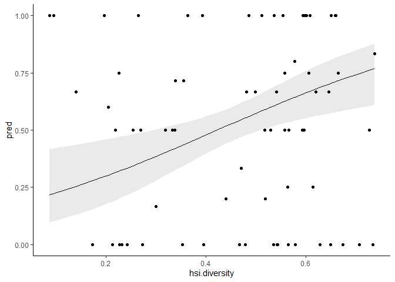

Zeroes
================

Including or excluding onesies didn’t make much of a difference, so I
wanted to confirm that it was the zeroes that were driving this weird
pattern.

``` r
# Import conflict settings.
source('../src/conflicted.R')

# Load some libraries.
library(tidyverse)
library(ggplot2)
library(raster)
library(sf)
library(landscapemetrics)
library(knitr)
library(kableExtra)
library(broom)
library(AICcmodavg)
library(modelr)

# Load in the processed data from last time.
data <- read_csv('../data/processed/landscape_metrics_zeroes.csv')

# Remove problematic TCR.
df <- data %>% filter(site != 'TCR')

# Keep only sites with occupancy data.
df <- df %>% drop_na(years.surveyed) #90

# Remove sites that are missing sufficient landscape data.
df <- df %>% filter_at(vars(contains('inside')), all_vars(. >=90))
```

How many zeroes are there, and what do they look like?

``` r
df %>% filter(years.detect == 0) %>% 
  distinct(name, .keep_all=TRUE) %>% 
  select(site, name, years.surveyed, years.detect, years.no.detect)
```

    ## # A tibble: 20 x 5
    ##    site  name            years.surveyed years.detect years.no.detect
    ##    <chr> <chr>                    <dbl>        <dbl>           <dbl>
    ##  1 BSL   Big Silver                   1            0               1
    ##  2 BPT   Bohn Point                   1            0               1
    ##  3 CCR   Center Creek                 4            0               4
    ##  4 CHR   Cheakamus River              1            0               1
    ##  5 DKL   Duck Lake                    2            0               2
    ##  6 ELA   Elaho                        2            0               2
    ##  7 EMT   Elk Mountain                 2            0               2
    ##  8 GIS   Goat Island                  3            0               3
    ##  9 HKM   Heakamie                     1            0               1
    ## 10 HSL   Hope Slide                   1            0               1
    ## 11 HVA   Hope Valley                  1            0               1
    ## 12 JVC   Jarvis Creek                 5            0               5
    ## 13 LIL   Lillooette                   3            0               3
    ## 14 MLR   Millers Ridge                1            0               1
    ## 15 MTH   Mount Holden                 2            0               2
    ## 16 QUA   Quatam                       1            0               1
    ## 17 RTK   Red Tusk                     1            0               1
    ## 18 SLB   Saltery Bay                  3            0               3
    ## 19 SIS   Stewart Island               3            0               3
    ## 20 VRI   Vancouver River              1            0               1

First off, that’s 20 (\!) sites that are zeroes. Some of these might be
resolvable with a more precise data set… I think Red Tusk, for example,
had actually been surveyed more than one year. Some of this may also be
time-series issue… again, I think Red Tusk has been harvested, so these
older occupancy data + more recent VRI data could explain why including
zeroes gives me unusual results. But also very interesting that some of
these sites have been surveyed for *years* and never been active, like
Jarvis Creek at 5 (\!) years. That supports the idea that at least some
of these are either not NOGO territories or are so low quality that they
bear no resemblance to “normal” NOGO territories.

I didn’t have ready-calculated HSI diversity, so I can add that (I
think…). Start by bringing in the raster and prepping it.

``` r
# Load HSI raster.
r.hsi <- raster('../data/processed/foraging_sc.tif')

# Define levels.
hsi.levels <- data.frame(ID=c(-10, -2, -1, 0, 1, 2, 3), 
                         class.name=c('ocean', 'freshwater', 'river', 
                                      'nil', 'low', 'moderate', 'high'))

# Add levels to raster.
levels(r.hsi) <- hsi.levels

# Assign crs to raster.
crs(r.hsi) <- CRS('+proj=utm +zone=10 +datum=NAD83 +units=m +no_defs')
```

Then get landscape sizes and sites set up.

``` r
# Define landscape sizes.
landscape <- data.frame(
  size=c('PFA', 'breeding area', 'home range', 'maximum range'),
  area=c(60, 200, 3800, 15600)
)

# Convert area in hectares to radii in meters.
landscape <- landscape %>% mutate(radius=sqrt(area*10000/pi))

# Read in the data.
nests <- read_csv('../data/processed/sc_nests.csv')

# Calculate a centroid for each site, and keep only ones with a quality index.
centroids <- nests %>% group_by(site) %>% 
  mutate(mean.x=mean(xcoord), mean.y=mean(ycoord)) %>% 
  distinct(site, name, mean.x, mean.y)

sites <- semi_join(centroids, data, by=c('site', 'name')) %>% 
  rename(xcoord=mean.x, ycoord=mean.y)

# Make it a spatial object for later.
sites.sf <- sites %>% 
  st_as_sf(coords=c('xcoord', 'ycoord')) %>% 
  st_set_crs('+proj=utm +zone=10 +datum=WGS84 +units=m +no_defs') %>% 
  st_as_sf()

# Also make a list of site names for later.
site.names <- sites.sf$site
```

Then do the actual calculations.

``` r
# Make a list of metrics to calculate.
hsi.metrics <- c('lsm_l_sidi')

# Make a function to do the calculations and formatting.
calc.hsi.metrics <- function(x) {
  sample_lsm(r.hsi, y=sites.sf, size=x, plot_id=site.names, shape='circle', 
             what=hsi.metrics) %>% 
    left_join(hsi.levels, by=c('class'='ID')) %>% 
    mutate(class.name=ifelse(is.na(class.name), metric, class.name)) %>% 
    select(-class, -metric, -level) %>%  
    pivot_wider(names_from=class.name, values_from=value) %>% 
    mutate(radius=x) %>% 
    rename(hsi.inside=percentage_inside)
}

# Run the function for each sample size.
hsi.landscape.metrics <- map_df(landscape$radius, calc.hsi.metrics)

# Do some cleanup
hsi.landscape.metrics <- hsi.landscape.metrics %>% 
  select(radius, hsi.inside, nest=plot_id, hsi.diversity=sidi)

hsi.landscape.metrics <- select(landscape, radius, size) %>% right_join(hsi.landscape.metrics, by=c('radius'))

# Join to data frame.
df <- left_join(df, hsi.landscape.metrics, by=c('site'='nest', 'size', 'radius', 'hsi.inside'))

# Filter out any sites without sufficient landscape coverage.
df <- df %>% filter_at(vars(contains('inside')), all_vars(. >=90))
```

# The models

``` r
# Proportion suitable
proportion.suitable.model <- function(df) {
  glm(cbind(years.detect, years.no.detect) ~ proportion.suitable, data=df, family=binomial(logit))
}

# Proportion suitable + HSI diversity
suitable.diversity.model <- function(df) {
  glm(cbind(years.detect, years.no.detect) ~ proportion.suitable + hsi.diversity, data=df, family=binomial(logit))
}

# Proportion suitable + suitable edge density
suitable.edge.density.model <- function(df) {
  glm(cbind(years.detect, years.no.detect) ~ proportion.suitable + suitable.edge.density, data=df, family=binomial(logit))
}

# Proportion suitable + HSI diversity + suitable edge density
suitable.sink.model <- function(df) {
  glm(cbind(years.detect, years.no.detect) ~ proportion.suitable + 
        suitable.edge.density + hsi.diversity, data=df, family=binomial(logit))
}

# Proportion mature forest
proportion.mature.model <- function(df) {
  glm(cbind(years.detect, years.no.detect) ~ proportion.cover.mature, data=df, family=binomial(logit))
}

# Proportion mature + landcover diversity
mature.diversity.model <- function(df) {
  glm(cbind(years.detect, years.no.detect) ~ proportion.cover.mature + cover.diversity, data=df, family=binomial(logit))
}

# Proportion mature + gap edge density
mature.edge.density.model <- function(df) {
  glm(cbind(years.detect, years.no.detect) ~ proportion.cover.mature + gap.edge.density, data=df, family=binomial(logit))
}

# Proportion mature + gap edge density + landcover diversity
mature.sink.model <- function(df) {
  glm(cbind(years.detect, years.no.detect) ~ proportion.cover.mature + 
        gap.edge.density + cover.diversity, data=df, family=binomial(logit))
}

# Null
null.model <- function(df) {
  glm(cbind(years.detect, years.no.detect) ~ 1, data=df, family=binomial(logit))
}
```

Then nest the data frame for ease of coding and apply each function to
generate a disturbingly large number of models really fast.

``` r
# Nest the data frame.
nf <- df %>% group_by(size) %>% nest()

# Apply the functions.
nf <- nf %>% 
  mutate(
    m.proportion.suitable=map(data, proportion.suitable.model),
    m.suitable.diversity=map(data, suitable.diversity.model),
    m.suitable.edge.density=map(data, suitable.edge.density.model),
    m.suitable.sink=map(data, suitable.sink.model),
    m.proportion.mature=map(data, proportion.mature.model),
    m.mature.diversity=map(data, mature.diversity.model),
    m.mature.edge.density=map(data, mature.edge.density.model),
    m.mature.sink=map(data, mature.sink.model),
    m.null=map(data, null.model)
         )
```

Let’s see if there’s any difference in the big list of models.

``` r
all.models <- nf %>% pivot_longer(-c(size, data), names_to='modname', values_to='model') %>% 
  mutate(name=paste(size, modname))

aictab(all.models$model, modnames=all.models$name) %>% 
  kable() %>% kable_styling(bootstrap_options=c('striped'))
```

<table class="table table-striped" style="margin-left: auto; margin-right: auto;">

<thead>

<tr>

<th style="text-align:left;">

</th>

<th style="text-align:left;">

Modnames

</th>

<th style="text-align:right;">

K

</th>

<th style="text-align:right;">

AICc

</th>

<th style="text-align:right;">

Delta\_AICc

</th>

<th style="text-align:right;">

ModelLik

</th>

<th style="text-align:right;">

AICcWt

</th>

<th style="text-align:right;">

LL

</th>

<th style="text-align:right;">

Cum.Wt

</th>

</tr>

</thead>

<tbody>

<tr>

<td style="text-align:left;">

11

</td>

<td style="text-align:left;">

breeding area m.suitable.diversity

</td>

<td style="text-align:right;">

3

</td>

<td style="text-align:right;">

170.4396

</td>

<td style="text-align:right;">

0.000000

</td>

<td style="text-align:right;">

1.0000000

</td>

<td style="text-align:right;">

0.5243927

</td>

<td style="text-align:right;">

\-82.04331

</td>

<td style="text-align:right;">

0.5243927

</td>

</tr>

<tr>

<td style="text-align:left;">

13

</td>

<td style="text-align:left;">

breeding area m.suitable.sink

</td>

<td style="text-align:right;">

4

</td>

<td style="text-align:right;">

172.4820

</td>

<td style="text-align:right;">

2.042439

</td>

<td style="text-align:right;">

0.3601554

</td>

<td style="text-align:right;">

0.1888629

</td>

<td style="text-align:right;">

\-81.94249

</td>

<td style="text-align:right;">

0.7132556

</td>

</tr>

<tr>

<td style="text-align:left;">

1

</td>

<td style="text-align:left;">

PFA m.proportion.suitable

</td>

<td style="text-align:right;">

2

</td>

<td style="text-align:right;">

175.5904

</td>

<td style="text-align:right;">

5.150819

</td>

<td style="text-align:right;">

0.0761226

</td>

<td style="text-align:right;">

0.0399182

</td>

<td style="text-align:right;">

\-85.70823

</td>

<td style="text-align:right;">

0.7531737

</td>

</tr>

<tr>

<td style="text-align:left;">

2

</td>

<td style="text-align:left;">

PFA m.suitable.diversity

</td>

<td style="text-align:right;">

3

</td>

<td style="text-align:right;">

175.9297

</td>

<td style="text-align:right;">

5.490175

</td>

<td style="text-align:right;">

0.0642427

</td>

<td style="text-align:right;">

0.0336884

</td>

<td style="text-align:right;">

\-84.78840

</td>

<td style="text-align:right;">

0.7868621

</td>

</tr>

<tr>

<td style="text-align:left;">

16

</td>

<td style="text-align:left;">

breeding area m.mature.edge.density

</td>

<td style="text-align:right;">

3

</td>

<td style="text-align:right;">

176.2359

</td>

<td style="text-align:right;">

5.796381

</td>

<td style="text-align:right;">

0.0551229

</td>

<td style="text-align:right;">

0.0289060

</td>

<td style="text-align:right;">

\-84.94150

</td>

<td style="text-align:right;">

0.8157682

</td>

</tr>

<tr>

<td style="text-align:left;">

35

</td>

<td style="text-align:left;">

maximum range m.mature.sink

</td>

<td style="text-align:right;">

4

</td>

<td style="text-align:right;">

176.6375

</td>

<td style="text-align:right;">

6.197963

</td>

<td style="text-align:right;">

0.0450951

</td>

<td style="text-align:right;">

0.0236475

</td>

<td style="text-align:right;">

\-84.01107

</td>

<td style="text-align:right;">

0.8394157

</td>

</tr>

<tr>

<td style="text-align:left;">

34

</td>

<td style="text-align:left;">

maximum range m.mature.edge.density

</td>

<td style="text-align:right;">

3

</td>

<td style="text-align:right;">

176.6641

</td>

<td style="text-align:right;">

6.224528

</td>

<td style="text-align:right;">

0.0445001

</td>

<td style="text-align:right;">

0.0233355

</td>

<td style="text-align:right;">

\-85.15023

</td>

<td style="text-align:right;">

0.8627512

</td>

</tr>

<tr>

<td style="text-align:left;">

7

</td>

<td style="text-align:left;">

PFA m.mature.edge.density

</td>

<td style="text-align:right;">

3

</td>

<td style="text-align:right;">

177.5006

</td>

<td style="text-align:right;">

7.061065

</td>

<td style="text-align:right;">

0.0292893

</td>

<td style="text-align:right;">

0.0153591

</td>

<td style="text-align:right;">

\-85.57384

</td>

<td style="text-align:right;">

0.8781103

</td>

</tr>

<tr>

<td style="text-align:left;">

3

</td>

<td style="text-align:left;">

PFA m.suitable.edge.density

</td>

<td style="text-align:right;">

3

</td>

<td style="text-align:right;">

177.6871

</td>

<td style="text-align:right;">

7.247493

</td>

<td style="text-align:right;">

0.0266825

</td>

<td style="text-align:right;">

0.0139921

</td>

<td style="text-align:right;">

\-85.66706

</td>

<td style="text-align:right;">

0.8921025

</td>

</tr>

<tr>

<td style="text-align:left;">

4

</td>

<td style="text-align:left;">

PFA m.suitable.sink

</td>

<td style="text-align:right;">

4

</td>

<td style="text-align:right;">

177.9820

</td>

<td style="text-align:right;">

7.542394

</td>

<td style="text-align:right;">

0.0230245

</td>

<td style="text-align:right;">

0.0120739

</td>

<td style="text-align:right;">

\-84.69247

</td>

<td style="text-align:right;">

0.9041763

</td>

</tr>

<tr>

<td style="text-align:left;">

17

</td>

<td style="text-align:left;">

breeding area m.mature.sink

</td>

<td style="text-align:right;">

4

</td>

<td style="text-align:right;">

178.4749

</td>

<td style="text-align:right;">

8.035326

</td>

<td style="text-align:right;">

0.0179950

</td>

<td style="text-align:right;">

0.0094364

</td>

<td style="text-align:right;">

\-84.93893

</td>

<td style="text-align:right;">

0.9136128

</td>

</tr>

<tr>

<td style="text-align:left;">

10

</td>

<td style="text-align:left;">

breeding area m.proportion.suitable

</td>

<td style="text-align:right;">

2

</td>

<td style="text-align:right;">

178.4951

</td>

<td style="text-align:right;">

8.055566

</td>

<td style="text-align:right;">

0.0178138

</td>

<td style="text-align:right;">

0.0093414

</td>

<td style="text-align:right;">

\-87.16061

</td>

<td style="text-align:right;">

0.9229542

</td>

</tr>

<tr>

<td style="text-align:left;">

36

</td>

<td style="text-align:left;">

maximum range m.null

</td>

<td style="text-align:right;">

1

</td>

<td style="text-align:right;">

178.5391

</td>

<td style="text-align:right;">

8.099542

</td>

<td style="text-align:right;">

0.0174264

</td>

<td style="text-align:right;">

0.0091383

</td>

<td style="text-align:right;">

\-88.24014

</td>

<td style="text-align:right;">

0.9320924

</td>

</tr>

<tr>

<td style="text-align:left;">

32

</td>

<td style="text-align:left;">

maximum range m.proportion.mature

</td>

<td style="text-align:right;">

2

</td>

<td style="text-align:right;">

178.6594

</td>

<td style="text-align:right;">

8.219818

</td>

<td style="text-align:right;">

0.0164093

</td>

<td style="text-align:right;">

0.0086049

</td>

<td style="text-align:right;">

\-87.24014

</td>

<td style="text-align:right;">

0.9406973

</td>

</tr>

<tr>

<td style="text-align:left;">

26

</td>

<td style="text-align:left;">

home range m.mature.sink

</td>

<td style="text-align:right;">

4

</td>

<td style="text-align:right;">

178.7814

</td>

<td style="text-align:right;">

8.341837

</td>

<td style="text-align:right;">

0.0154381

</td>

<td style="text-align:right;">

0.0080956

</td>

<td style="text-align:right;">

\-85.08767

</td>

<td style="text-align:right;">

0.9487930

</td>

</tr>

<tr>

<td style="text-align:left;">

33

</td>

<td style="text-align:left;">

maximum range m.mature.diversity

</td>

<td style="text-align:right;">

3

</td>

<td style="text-align:right;">

179.4648

</td>

<td style="text-align:right;">

9.025255

</td>

<td style="text-align:right;">

0.0109696

</td>

<td style="text-align:right;">

0.0057524

</td>

<td style="text-align:right;">

\-86.55059

</td>

<td style="text-align:right;">

0.9545453

</td>

</tr>

<tr>

<td style="text-align:left;">

20

</td>

<td style="text-align:left;">

home range m.suitable.diversity

</td>

<td style="text-align:right;">

3

</td>

<td style="text-align:right;">

179.5833

</td>

<td style="text-align:right;">

9.143778

</td>

<td style="text-align:right;">

0.0103384

</td>

<td style="text-align:right;">

0.0054214

</td>

<td style="text-align:right;">

\-86.61256

</td>

<td style="text-align:right;">

0.9599667

</td>

</tr>

<tr>

<td style="text-align:left;">

8

</td>

<td style="text-align:left;">

PFA m.mature.sink

</td>

<td style="text-align:right;">

4

</td>

<td style="text-align:right;">

179.6936

</td>

<td style="text-align:right;">

9.253993

</td>

<td style="text-align:right;">

0.0097841

</td>

<td style="text-align:right;">

0.0051307

</td>

<td style="text-align:right;">

\-85.54827

</td>

<td style="text-align:right;">

0.9650974

</td>

</tr>

<tr>

<td style="text-align:left;">

27

</td>

<td style="text-align:left;">

home range m.null

</td>

<td style="text-align:right;">

1

</td>

<td style="text-align:right;">

179.8091

</td>

<td style="text-align:right;">

9.369525

</td>

<td style="text-align:right;">

0.0092349

</td>

<td style="text-align:right;">

0.0048427

</td>

<td style="text-align:right;">

\-88.87556

</td>

<td style="text-align:right;">

0.9699402

</td>

</tr>

<tr>

<td style="text-align:left;">

12

</td>

<td style="text-align:left;">

breeding area m.suitable.edge.density

</td>

<td style="text-align:right;">

3

</td>

<td style="text-align:right;">

180.1510

</td>

<td style="text-align:right;">

9.711490

</td>

<td style="text-align:right;">

0.0077835

</td>

<td style="text-align:right;">

0.0040816

</td>

<td style="text-align:right;">

\-86.89905

</td>

<td style="text-align:right;">

0.9740218

</td>

</tr>

<tr>

<td style="text-align:left;">

25

</td>

<td style="text-align:left;">

home range m.mature.edge.density

</td>

<td style="text-align:right;">

3

</td>

<td style="text-align:right;">

180.2831

</td>

<td style="text-align:right;">

9.843515

</td>

<td style="text-align:right;">

0.0072863

</td>

<td style="text-align:right;">

0.0038209

</td>

<td style="text-align:right;">

\-86.96243

</td>

<td style="text-align:right;">

0.9778427

</td>

</tr>

<tr>

<td style="text-align:left;">

19

</td>

<td style="text-align:left;">

home range m.proportion.suitable

</td>

<td style="text-align:right;">

2

</td>

<td style="text-align:right;">

180.4571

</td>

<td style="text-align:right;">

10.017580

</td>

<td style="text-align:right;">

0.0066790

</td>

<td style="text-align:right;">

0.0035024

</td>

<td style="text-align:right;">

\-88.14033

</td>

<td style="text-align:right;">

0.9813451

</td>

</tr>

<tr>

<td style="text-align:left;">

28

</td>

<td style="text-align:left;">

maximum range m.proportion.suitable

</td>

<td style="text-align:right;">

2

</td>

<td style="text-align:right;">

180.5214

</td>

<td style="text-align:right;">

10.081825

</td>

<td style="text-align:right;">

0.0064678

</td>

<td style="text-align:right;">

0.0033917

</td>

<td style="text-align:right;">

\-88.17114

</td>

<td style="text-align:right;">

0.9847368

</td>

</tr>

<tr>

<td style="text-align:left;">

24

</td>

<td style="text-align:left;">

home range m.mature.diversity

</td>

<td style="text-align:right;">

3

</td>

<td style="text-align:right;">

180.7009

</td>

<td style="text-align:right;">

10.261298

</td>

<td style="text-align:right;">

0.0059127

</td>

<td style="text-align:right;">

0.0031006

</td>

<td style="text-align:right;">

\-87.17132

</td>

<td style="text-align:right;">

0.9878374

</td>

</tr>

<tr>

<td style="text-align:left;">

23

</td>

<td style="text-align:left;">

home range m.proportion.mature

</td>

<td style="text-align:right;">

2

</td>

<td style="text-align:right;">

180.9794

</td>

<td style="text-align:right;">

10.539793

</td>

<td style="text-align:right;">

0.0051441

</td>

<td style="text-align:right;">

0.0026976

</td>

<td style="text-align:right;">

\-88.40144

</td>

<td style="text-align:right;">

0.9905349

</td>

</tr>

<tr>

<td style="text-align:left;">

22

</td>

<td style="text-align:left;">

home range m.suitable.sink

</td>

<td style="text-align:right;">

4

</td>

<td style="text-align:right;">

181.8280

</td>

<td style="text-align:right;">

11.388416

</td>

<td style="text-align:right;">

0.0033654

</td>

<td style="text-align:right;">

0.0017648

</td>

<td style="text-align:right;">

\-86.61096

</td>

<td style="text-align:right;">

0.9922997

</td>

</tr>

<tr>

<td style="text-align:left;">

29

</td>

<td style="text-align:left;">

maximum range m.suitable.diversity

</td>

<td style="text-align:right;">

3

</td>

<td style="text-align:right;">

182.1413

</td>

<td style="text-align:right;">

11.701715

</td>

<td style="text-align:right;">

0.0028774

</td>

<td style="text-align:right;">

0.0015089

</td>

<td style="text-align:right;">

\-87.88882

</td>

<td style="text-align:right;">

0.9938086

</td>

</tr>

<tr>

<td style="text-align:left;">

30

</td>

<td style="text-align:left;">

maximum range m.suitable.edge.density

</td>

<td style="text-align:right;">

3

</td>

<td style="text-align:right;">

182.4118

</td>

<td style="text-align:right;">

11.972195

</td>

<td style="text-align:right;">

0.0025135

</td>

<td style="text-align:right;">

0.0013180

</td>

<td style="text-align:right;">

\-88.02406

</td>

<td style="text-align:right;">

0.9951266

</td>

</tr>

<tr>

<td style="text-align:left;">

21

</td>

<td style="text-align:left;">

home range m.suitable.edge.density

</td>

<td style="text-align:right;">

3

</td>

<td style="text-align:right;">

182.6240

</td>

<td style="text-align:right;">

12.184404

</td>

<td style="text-align:right;">

0.0022604

</td>

<td style="text-align:right;">

0.0011854

</td>

<td style="text-align:right;">

\-88.13288

</td>

<td style="text-align:right;">

0.9963120

</td>

</tr>

<tr>

<td style="text-align:left;">

5

</td>

<td style="text-align:left;">

PFA m.proportion.mature

</td>

<td style="text-align:right;">

2

</td>

<td style="text-align:right;">

183.1932

</td>

<td style="text-align:right;">

12.753682

</td>

<td style="text-align:right;">

0.0017005

</td>

<td style="text-align:right;">

0.0008917

</td>

<td style="text-align:right;">

\-89.50966

</td>

<td style="text-align:right;">

0.9972037

</td>

</tr>

<tr>

<td style="text-align:left;">

31

</td>

<td style="text-align:left;">

maximum range m.suitable.sink

</td>

<td style="text-align:right;">

4

</td>

<td style="text-align:right;">

184.0019

</td>

<td style="text-align:right;">

13.562384

</td>

<td style="text-align:right;">

0.0011349

</td>

<td style="text-align:right;">

0.0005951

</td>

<td style="text-align:right;">

\-87.69328

</td>

<td style="text-align:right;">

0.9977989

</td>

</tr>

<tr>

<td style="text-align:left;">

6

</td>

<td style="text-align:left;">

PFA m.mature.diversity

</td>

<td style="text-align:right;">

3

</td>

<td style="text-align:right;">

184.2070

</td>

<td style="text-align:right;">

13.767391

</td>

<td style="text-align:right;">

0.0010244

</td>

<td style="text-align:right;">

0.0005372

</td>

<td style="text-align:right;">

\-88.92700

</td>

<td style="text-align:right;">

0.9983360

</td>

</tr>

<tr>

<td style="text-align:left;">

9

</td>

<td style="text-align:left;">

PFA m.null

</td>

<td style="text-align:right;">

1

</td>

<td style="text-align:right;">

184.2986

</td>

<td style="text-align:right;">

13.859011

</td>

<td style="text-align:right;">

0.0009785

</td>

<td style="text-align:right;">

0.0005131

</td>

<td style="text-align:right;">

\-91.12071

</td>

<td style="text-align:right;">

0.9988491

</td>

</tr>

<tr>

<td style="text-align:left;">

18

</td>

<td style="text-align:left;">

breeding area m.null

</td>

<td style="text-align:right;">

1

</td>

<td style="text-align:right;">

184.2986

</td>

<td style="text-align:right;">

13.859011

</td>

<td style="text-align:right;">

0.0009785

</td>

<td style="text-align:right;">

0.0005131

</td>

<td style="text-align:right;">

\-91.12071

</td>

<td style="text-align:right;">

0.9993622

</td>

</tr>

<tr>

<td style="text-align:left;">

14

</td>

<td style="text-align:left;">

breeding area m.proportion.mature

</td>

<td style="text-align:right;">

2

</td>

<td style="text-align:right;">

184.5828

</td>

<td style="text-align:right;">

14.143224

</td>

<td style="text-align:right;">

0.0008489

</td>

<td style="text-align:right;">

0.0004451

</td>

<td style="text-align:right;">

\-90.20444

</td>

<td style="text-align:right;">

0.9998074

</td>

</tr>

<tr>

<td style="text-align:left;">

15

</td>

<td style="text-align:left;">

breeding area m.mature.diversity

</td>

<td style="text-align:right;">

3

</td>

<td style="text-align:right;">

186.2582

</td>

<td style="text-align:right;">

15.818621

</td>

<td style="text-align:right;">

0.0003673

</td>

<td style="text-align:right;">

0.0001926

</td>

<td style="text-align:right;">

\-89.95262

</td>

<td style="text-align:right;">

1.0000000

</td>

</tr>

</tbody>

</table>

Well, that’s reassuring that it’s more or less the same. The top model
is unchanged. Edge density at the PFA scale is a little less persuasive,
but not by much. The nulls are still clustered at the top. The VRI-based
models are still doing better than the HSI-based models.

Let’s break it down by size.

``` r
pfa.models <- nf %>% filter(size == 'PFA') %>% 
  pivot_longer(-c(size, data), names_to='modname', values_to='model')

ba.models <- nf %>% filter(size == 'breeding area') %>% 
  pivot_longer(-c(size, data), names_to='modname', values_to='model')

hr.models <- nf %>% filter(size == 'home range') %>% 
  pivot_longer(-c(size, data), names_to='modname', values_to='model')

mr.models <- nf %>% filter(size == 'maximum range') %>% 
  pivot_longer(-c(size, data), names_to='modname', values_to='model')
```

## PFA

``` r
aictab(pfa.models$model, modnames=pfa.models$modname) %>% 
  kable() %>% kable_styling(bootstrap_options=c('striped'))
```

<table class="table table-striped" style="margin-left: auto; margin-right: auto;">

<thead>

<tr>

<th style="text-align:left;">

</th>

<th style="text-align:left;">

Modnames

</th>

<th style="text-align:right;">

K

</th>

<th style="text-align:right;">

AICc

</th>

<th style="text-align:right;">

Delta\_AICc

</th>

<th style="text-align:right;">

ModelLik

</th>

<th style="text-align:right;">

AICcWt

</th>

<th style="text-align:right;">

LL

</th>

<th style="text-align:right;">

Cum.Wt

</th>

</tr>

</thead>

<tbody>

<tr>

<td style="text-align:left;">

1

</td>

<td style="text-align:left;">

m.proportion.suitable

</td>

<td style="text-align:right;">

2

</td>

<td style="text-align:right;">

175.5904

</td>

<td style="text-align:right;">

0.000000

</td>

<td style="text-align:right;">

1.0000000

</td>

<td style="text-align:right;">

0.3269184

</td>

<td style="text-align:right;">

\-85.70823

</td>

<td style="text-align:right;">

0.3269184

</td>

</tr>

<tr>

<td style="text-align:left;">

2

</td>

<td style="text-align:left;">

m.suitable.diversity

</td>

<td style="text-align:right;">

3

</td>

<td style="text-align:right;">

175.9297

</td>

<td style="text-align:right;">

0.339356

</td>

<td style="text-align:right;">

0.8439365

</td>

<td style="text-align:right;">

0.2758984

</td>

<td style="text-align:right;">

\-84.78840

</td>

<td style="text-align:right;">

0.6028168

</td>

</tr>

<tr>

<td style="text-align:left;">

7

</td>

<td style="text-align:left;">

m.mature.edge.density

</td>

<td style="text-align:right;">

3

</td>

<td style="text-align:right;">

177.5006

</td>

<td style="text-align:right;">

1.910246

</td>

<td style="text-align:right;">

0.3847648

</td>

<td style="text-align:right;">

0.1257867

</td>

<td style="text-align:right;">

\-85.57384

</td>

<td style="text-align:right;">

0.7286034

</td>

</tr>

<tr>

<td style="text-align:left;">

3

</td>

<td style="text-align:left;">

m.suitable.edge.density

</td>

<td style="text-align:right;">

3

</td>

<td style="text-align:right;">

177.6871

</td>

<td style="text-align:right;">

2.096674

</td>

<td style="text-align:right;">

0.3505202

</td>

<td style="text-align:right;">

0.1145915

</td>

<td style="text-align:right;">

\-85.66706

</td>

<td style="text-align:right;">

0.8431950

</td>

</tr>

<tr>

<td style="text-align:left;">

4

</td>

<td style="text-align:left;">

m.suitable.sink

</td>

<td style="text-align:right;">

4

</td>

<td style="text-align:right;">

177.9820

</td>

<td style="text-align:right;">

2.391575

</td>

<td style="text-align:right;">

0.3024656

</td>

<td style="text-align:right;">

0.0988816

</td>

<td style="text-align:right;">

\-84.69247

</td>

<td style="text-align:right;">

0.9420765

</td>

</tr>

<tr>

<td style="text-align:left;">

8

</td>

<td style="text-align:left;">

m.mature.sink

</td>

<td style="text-align:right;">

4

</td>

<td style="text-align:right;">

179.6936

</td>

<td style="text-align:right;">

4.103174

</td>

<td style="text-align:right;">

0.1285308

</td>

<td style="text-align:right;">

0.0420191

</td>

<td style="text-align:right;">

\-85.54827

</td>

<td style="text-align:right;">

0.9840956

</td>

</tr>

<tr>

<td style="text-align:left;">

5

</td>

<td style="text-align:left;">

m.proportion.mature

</td>

<td style="text-align:right;">

2

</td>

<td style="text-align:right;">

183.1932

</td>

<td style="text-align:right;">

7.602863

</td>

<td style="text-align:right;">

0.0223388

</td>

<td style="text-align:right;">

0.0073030

</td>

<td style="text-align:right;">

\-89.50966

</td>

<td style="text-align:right;">

0.9913986

</td>

</tr>

<tr>

<td style="text-align:left;">

6

</td>

<td style="text-align:left;">

m.mature.diversity

</td>

<td style="text-align:right;">

3

</td>

<td style="text-align:right;">

184.2070

</td>

<td style="text-align:right;">

8.616572

</td>

<td style="text-align:right;">

0.0134566

</td>

<td style="text-align:right;">

0.0043992

</td>

<td style="text-align:right;">

\-88.92700

</td>

<td style="text-align:right;">

0.9957978

</td>

</tr>

<tr>

<td style="text-align:left;">

9

</td>

<td style="text-align:left;">

m.null

</td>

<td style="text-align:right;">

1

</td>

<td style="text-align:right;">

184.2986

</td>

<td style="text-align:right;">

8.708192

</td>

<td style="text-align:right;">

0.0128541

</td>

<td style="text-align:right;">

0.0042022

</td>

<td style="text-align:right;">

\-91.12071

</td>

<td style="text-align:right;">

1.0000000

</td>

</tr>

</tbody>

</table>

So here *all* the models perform better than the null, and HSI-based
models generally do better than the VRI-based models.

### Top model

We can visualize the top model. Maybe.

``` r
# Separate out the data.
pfa.data <- df %>% filter(size == 'PFA')

# Re-write the top model on its own.
pfa.top.model <- glm(cbind(years.detect, years.no.detect) ~ proportion.suitable, data=pfa.data, family=binomial(logit))

# Create a grid and add predictions.
pfa.predicted <- data_grid(pfa.data, proportion.suitable, .model=pfa.top.model) %>% 
  mutate(pred=predict(pfa.top.model, newdata=., type='response'))

# Grab the inverse link function from the model.
inv <- family(pfa.top.model)$linkinv

# Add fit and SE data.
pfa.predicted <- bind_cols(pfa.predicted, setNames(as_tibble(predict(pfa.top.model, pfa.predicted, 
                                                                     se.fit = TRUE)[1:2]),
                           c('fit.link','se.link')))

# Create confidence interval.
pfa.predicted <- pfa.predicted %>% mutate(fit.resp  = inv(fit.link),
                  right.upr = inv(fit.link + (2 * se.link)),
                  right.lwr = inv(fit.link - (2 * se.link)))

# Plot them?
ggplot(pfa.predicted, aes(x=proportion.suitable, y=pred)) +
  geom_line() +
  geom_ribbon(aes(ymin=right.lwr, ymax=right.upr), alpha=0.1) +
  geom_point(data=pfa.data, aes(x=proportion.suitable, y=quality.index)) +
  theme_classic()
```

<!-- -->

``` r
summary(pfa.top.model)
```

    ## 
    ## Call:
    ## glm(formula = cbind(years.detect, years.no.detect) ~ proportion.suitable, 
    ##     family = binomial(logit), data = pfa.data)
    ## 
    ## Deviance Residuals: 
    ##     Min       1Q   Median       3Q      Max  
    ## -2.2845  -1.1590  -0.2809   0.9425   2.6883  
    ## 
    ## Coefficients:
    ##                     Estimate Std. Error z value Pr(>|z|)   
    ## (Intercept)         -2.06840    0.69912  -2.959  0.00309 **
    ## proportion.suitable  0.02650    0.00834   3.177  0.00149 **
    ## ---
    ## Signif. codes:  0 '***' 0.001 '**' 0.01 '*' 0.05 '.' 0.1 ' ' 1
    ## 
    ## (Dispersion parameter for binomial family taken to be 1)
    ## 
    ##     Null deviance: 125.29  on 71  degrees of freedom
    ## Residual deviance: 114.47  on 70  degrees of freedom
    ## AIC: 175.42
    ## 
    ## Number of Fisher Scoring iterations: 3

``` r
# Look at some diagnostics.
data.frame(predicted=predict(pfa.top.model, type='response'),
           residuals=residuals(pfa.top.model, type='response')) %>% 
  ggplot(aes(x=predicted, y=residuals)) +
  geom_point() +
  geom_hline(yintercept=0, linetype='dashed') +
  geom_smooth(method='lm', se=FALSE, color='black') +
  theme_classic()
```

<!-- -->

Um, ok, those residuals are pretty wonky: that’s a very strong pattern.

### All models

``` r
pfa.models %>% mutate(glance=map(model, glance)) %>% 
  unnest(glance) %>% ungroup() %>% 
  select(!c(size, data, model))
```

    ## # A tibble: 9 x 8
    ##   modname          null.deviance df.null logLik   AIC   BIC deviance df.residual
    ##   <chr>                    <dbl>   <int>  <dbl> <dbl> <dbl>    <dbl>       <int>
    ## 1 m.proportion.su~          125.      71  -85.7  175.  180.     114.          70
    ## 2 m.suitable.dive~          125.      71  -84.8  176.  182.     113.          69
    ## 3 m.suitable.edge~          125.      71  -85.7  177.  184.     114.          69
    ## 4 m.suitable.sink           125.      71  -84.7  177.  186.     112.          68
    ## 5 m.proportion.ma~          125.      71  -89.5  183.  188.     122.          70
    ## 6 m.mature.divers~          125.      71  -88.9  184.  191.     121.          69
    ## 7 m.mature.edge.d~          125.      71  -85.6  177.  184.     114.          69
    ## 8 m.mature.sink             125.      71  -85.5  179.  188.     114.          68
    ## 9 m.null                    125.      71  -91.1  184.  187.     125.          71

``` r
pfa.models %>% mutate(tidy=map(model, tidy)) %>% 
  unnest(tidy) %>% ungroup() %>% 
  select(!c(size, data, model)) %>% 
  filter(term != '(Intercept)')
```

    ## # A tibble: 16 x 6
    ##    modname              term                estimate std.error statistic p.value
    ##    <chr>                <chr>                  <dbl>     <dbl>     <dbl>   <dbl>
    ##  1 m.proportion.suitab~ proportion.suitable  0.0265    0.00834     3.18  1.49e-3
    ##  2 m.suitable.diversity proportion.suitable  0.0344    0.0104      3.31  9.35e-4
    ##  3 m.suitable.diversity hsi.diversity        1.20      0.890       1.35  1.78e-1
    ##  4 m.suitable.edge.den~ proportion.suitable  0.0228    0.0154      1.48  1.39e-1
    ##  5 m.suitable.edge.den~ suitable.edge.dens~ -0.00443   0.0155     -0.287 7.74e-1
    ##  6 m.suitable.sink      proportion.suitable  0.0289    0.0162      1.78  7.45e-2
    ##  7 m.suitable.sink      suitable.edge.dens~ -0.00685   0.0156     -0.438 6.62e-1
    ##  8 m.suitable.sink      hsi.diversity        1.24      0.897       1.39  1.66e-1
    ##  9 m.proportion.mature  proportion.cover.m~  0.00839   0.00471     1.78  7.51e-2
    ## 10 m.mature.diversity   proportion.cover.m~  0.00675   0.00494     1.37  1.72e-1
    ## 11 m.mature.diversity   cover.diversity     -0.879     0.815      -1.08  2.81e-1
    ## 12 m.mature.edge.densi~ proportion.cover.m~  0.00323   0.00513     0.630 5.28e-1
    ## 13 m.mature.edge.densi~ gap.edge.density    -0.0292    0.0109     -2.68  7.42e-3
    ## 14 m.mature.sink        proportion.cover.m~  0.00301   0.00523     0.575 5.65e-1
    ## 15 m.mature.sink        gap.edge.density    -0.0284    0.0114     -2.49  1.27e-2
    ## 16 m.mature.sink        cover.diversity     -0.195     0.861      -0.226 8.21e-1

## Breeding area

``` r
aictab(ba.models$model, modnames=ba.models$modname) %>% 
  kable() %>% kable_styling(bootstrap_options=c('striped'))
```

<table class="table table-striped" style="margin-left: auto; margin-right: auto;">

<thead>

<tr>

<th style="text-align:left;">

</th>

<th style="text-align:left;">

Modnames

</th>

<th style="text-align:right;">

K

</th>

<th style="text-align:right;">

AICc

</th>

<th style="text-align:right;">

Delta\_AICc

</th>

<th style="text-align:right;">

ModelLik

</th>

<th style="text-align:right;">

AICcWt

</th>

<th style="text-align:right;">

LL

</th>

<th style="text-align:right;">

Cum.Wt

</th>

</tr>

</thead>

<tbody>

<tr>

<td style="text-align:left;">

2

</td>

<td style="text-align:left;">

m.suitable.diversity

</td>

<td style="text-align:right;">

3

</td>

<td style="text-align:right;">

170.4396

</td>

<td style="text-align:right;">

0.000000

</td>

<td style="text-align:right;">

1.0000000

</td>

<td style="text-align:right;">

0.6844321

</td>

<td style="text-align:right;">

\-82.04331

</td>

<td style="text-align:right;">

0.6844321

</td>

</tr>

<tr>

<td style="text-align:left;">

4

</td>

<td style="text-align:left;">

m.suitable.sink

</td>

<td style="text-align:right;">

4

</td>

<td style="text-align:right;">

172.4820

</td>

<td style="text-align:right;">

2.042439

</td>

<td style="text-align:right;">

0.3601554

</td>

<td style="text-align:right;">

0.2465020

</td>

<td style="text-align:right;">

\-81.94249

</td>

<td style="text-align:right;">

0.9309341

</td>

</tr>

<tr>

<td style="text-align:left;">

7

</td>

<td style="text-align:left;">

m.mature.edge.density

</td>

<td style="text-align:right;">

3

</td>

<td style="text-align:right;">

176.2359

</td>

<td style="text-align:right;">

5.796381

</td>

<td style="text-align:right;">

0.0551229

</td>

<td style="text-align:right;">

0.0377279

</td>

<td style="text-align:right;">

\-84.94150

</td>

<td style="text-align:right;">

0.9686619

</td>

</tr>

<tr>

<td style="text-align:left;">

8

</td>

<td style="text-align:left;">

m.mature.sink

</td>

<td style="text-align:right;">

4

</td>

<td style="text-align:right;">

178.4749

</td>

<td style="text-align:right;">

8.035326

</td>

<td style="text-align:right;">

0.0179950

</td>

<td style="text-align:right;">

0.0123163

</td>

<td style="text-align:right;">

\-84.93893

</td>

<td style="text-align:right;">

0.9809783

</td>

</tr>

<tr>

<td style="text-align:left;">

1

</td>

<td style="text-align:left;">

m.proportion.suitable

</td>

<td style="text-align:right;">

2

</td>

<td style="text-align:right;">

178.4951

</td>

<td style="text-align:right;">

8.055566

</td>

<td style="text-align:right;">

0.0178138

</td>

<td style="text-align:right;">

0.0121923

</td>

<td style="text-align:right;">

\-87.16061

</td>

<td style="text-align:right;">

0.9931706

</td>

</tr>

<tr>

<td style="text-align:left;">

3

</td>

<td style="text-align:left;">

m.suitable.edge.density

</td>

<td style="text-align:right;">

3

</td>

<td style="text-align:right;">

180.1510

</td>

<td style="text-align:right;">

9.711490

</td>

<td style="text-align:right;">

0.0077835

</td>

<td style="text-align:right;">

0.0053273

</td>

<td style="text-align:right;">

\-86.89905

</td>

<td style="text-align:right;">

0.9984979

</td>

</tr>

<tr>

<td style="text-align:left;">

9

</td>

<td style="text-align:left;">

m.null

</td>

<td style="text-align:right;">

1

</td>

<td style="text-align:right;">

184.2986

</td>

<td style="text-align:right;">

13.859011

</td>

<td style="text-align:right;">

0.0009785

</td>

<td style="text-align:right;">

0.0006697

</td>

<td style="text-align:right;">

\-91.12071

</td>

<td style="text-align:right;">

0.9991676

</td>

</tr>

<tr>

<td style="text-align:left;">

5

</td>

<td style="text-align:left;">

m.proportion.mature

</td>

<td style="text-align:right;">

2

</td>

<td style="text-align:right;">

184.5828

</td>

<td style="text-align:right;">

14.143224

</td>

<td style="text-align:right;">

0.0008489

</td>

<td style="text-align:right;">

0.0005810

</td>

<td style="text-align:right;">

\-90.20444

</td>

<td style="text-align:right;">

0.9997486

</td>

</tr>

<tr>

<td style="text-align:left;">

6

</td>

<td style="text-align:left;">

m.mature.diversity

</td>

<td style="text-align:right;">

3

</td>

<td style="text-align:right;">

186.2582

</td>

<td style="text-align:right;">

15.818621

</td>

<td style="text-align:right;">

0.0003673

</td>

<td style="text-align:right;">

0.0002514

</td>

<td style="text-align:right;">

\-89.95262

</td>

<td style="text-align:right;">

1.0000000

</td>

</tr>

</tbody>

</table>

Again, null down towards the bottom and HSI-based models generally
better than VRI-based models.

### Top model

We can also visualize the top model for the breeding area.

``` r
# Separate out the data.
ba.data <- df %>% filter(size == 'breeding area')

# Re-write the top model on its own.
ba.top.model <- glm(cbind(years.detect, years.no.detect) ~ proportion.suitable + 
                   hsi.diversity, data=ba.data, family=binomial(logit))

# Create a grid and add predictions.
ba.predicted <- data_grid(ba.data, hsi.diversity, .model=ba.top.model) %>% 
  mutate(pred=predict(ba.top.model, newdata=., type='response'))

# Grab the inverse link function from the model.
ba.inv <- family(ba.top.model)$linkinv

# Add fit and SE data.
ba.predicted <- bind_cols(ba.predicted, setNames(as_tibble(predict(ba.top.model, ba.predicted, 
                                                                     se.fit = TRUE)[1:2]),
                           c('fit.link','se.link')))

# Create confidence interval.
ba.predicted <- ba.predicted %>% mutate(fit.resp  = ba.inv(fit.link),
                  right.upr = ba.inv(fit.link + (2 * se.link)),
                  right.lwr = ba.inv(fit.link - (2 * se.link)))

# Plot them?
ggplot(ba.predicted, aes(x=hsi.diversity, y=pred)) +
  geom_line() +
  geom_ribbon(aes(ymin=right.lwr, ymax=right.upr), alpha=0.1) +
  geom_point(data=ba.data, aes(x=hsi.diversity, y=quality.index)) +
  theme_classic()
```

<!-- -->

``` r
summary(ba.top.model)
```

    ## 
    ## Call:
    ## glm(formula = cbind(years.detect, years.no.detect) ~ proportion.suitable + 
    ##     hsi.diversity, family = binomial(logit), data = ba.data)
    ## 
    ## Deviance Residuals: 
    ##     Min       1Q   Median       3Q      Max  
    ## -2.2724  -1.0593  -0.2405   1.1119   2.9692  
    ## 
    ## Coefficients:
    ##                     Estimate Std. Error z value Pr(>|z|)    
    ## (Intercept)         -5.88006    1.51884  -3.871 0.000108 ***
    ## proportion.suitable  0.05561    0.01413   3.935 8.31e-05 ***
    ## hsi.diversity        3.81977    1.22821   3.110 0.001871 ** 
    ## ---
    ## Signif. codes:  0 '***' 0.001 '**' 0.01 '*' 0.05 '.' 0.1 ' ' 1
    ## 
    ## (Dispersion parameter for binomial family taken to be 1)
    ## 
    ##     Null deviance: 125.29  on 71  degrees of freedom
    ## Residual deviance: 107.14  on 69  degrees of freedom
    ## AIC: 170.09
    ## 
    ## Number of Fisher Scoring iterations: 4

``` r
# Look at some diagnostics.
data.frame(predicted=predict(ba.top.model, type='response'),
           residuals=residuals(ba.top.model, type='response')) %>% 
  ggplot(aes(x=predicted, y=residuals)) +
  geom_point() +
  geom_hline(yintercept=0, linetype='dashed') +
  geom_smooth(method='lm', se=FALSE, color='black') +
  theme_classic()
```

<!-- -->

Again, residuals are worse.

### All models

``` r
ba.models %>% mutate(glance=map(model, glance)) %>% 
  unnest(glance) %>% ungroup() %>% 
  select(!c(size, data, model))
```

    ## # A tibble: 9 x 8
    ##   modname          null.deviance df.null logLik   AIC   BIC deviance df.residual
    ##   <chr>                    <dbl>   <int>  <dbl> <dbl> <dbl>    <dbl>       <int>
    ## 1 m.proportion.su~          125.      71  -87.2  178.  183.     117.          70
    ## 2 m.suitable.dive~          125.      71  -82.0  170.  177.     107.          69
    ## 3 m.suitable.edge~          125.      71  -86.9  180.  187.     117.          69
    ## 4 m.suitable.sink           125.      71  -81.9  172.  181.     107.          68
    ## 5 m.proportion.ma~          125.      71  -90.2  184.  189.     123.          70
    ## 6 m.mature.divers~          125.      71  -90.0  186.  193.     123.          69
    ## 7 m.mature.edge.d~          125.      71  -84.9  176.  183.     113.          69
    ## 8 m.mature.sink             125.      71  -84.9  178.  187.     113.          68
    ## 9 m.null                    125.      71  -91.1  184.  187.     125.          71

``` r
ba.models %>% mutate(tidy=map(model, tidy)) %>% 
  unnest(tidy) %>% ungroup() %>% 
  select(!c(size, data, model)) %>% 
  filter(term != '(Intercept)')
```

    ## # A tibble: 16 x 6
    ##    modname             term                estimate std.error statistic  p.value
    ##    <chr>               <chr>                  <dbl>     <dbl>     <dbl>    <dbl>
    ##  1 m.proportion.suita~ proportion.suitable  0.0273    0.00994    2.74    6.09e-3
    ##  2 m.suitable.diversi~ proportion.suitable  0.0556    0.0141     3.94    8.31e-5
    ##  3 m.suitable.diversi~ hsi.diversity        3.82      1.23       3.11    1.87e-3
    ##  4 m.suitable.edge.de~ proportion.suitable  0.0388    0.0189     2.05    4.06e-2
    ##  5 m.suitable.edge.de~ suitable.edge.dens~  0.0142    0.0197     0.721   4.71e-1
    ##  6 m.suitable.sink     proportion.suitable  0.0628    0.0216     2.91    3.60e-3
    ##  7 m.suitable.sink     suitable.edge.dens~  0.00923   0.0206     0.448   6.54e-1
    ##  8 m.suitable.sink     hsi.diversity        3.78      1.23       3.06    2.19e-3
    ##  9 m.proportion.mature proportion.cover.m~  0.00716   0.00532    1.35    1.78e-1
    ## 10 m.mature.diversity  proportion.cover.m~  0.00608   0.00553    1.10    2.71e-1
    ## 11 m.mature.diversity  cover.diversity     -0.680     0.960     -0.708   4.79e-1
    ## 12 m.mature.edge.dens~ proportion.cover.m~  0.00109   0.00578    0.189   8.50e-1
    ## 13 m.mature.edge.dens~ gap.edge.density    -0.0382    0.0123    -3.12    1.80e-3
    ## 14 m.mature.sink       proportion.cover.m~  0.00117   0.00589    0.199   8.42e-1
    ## 15 m.mature.sink       gap.edge.density    -0.0385    0.0126    -3.05    2.26e-3
    ## 16 m.mature.sink       cover.diversity      0.0713    0.995      0.0716  9.43e-1

## Home range

``` r
aictab(hr.models$model, modnames=hr.models$modname) %>% 
  kable() %>% kable_styling(bootstrap_options=c('striped'))
```

<table class="table table-striped" style="margin-left: auto; margin-right: auto;">

<thead>

<tr>

<th style="text-align:left;">

</th>

<th style="text-align:left;">

Modnames

</th>

<th style="text-align:right;">

K

</th>

<th style="text-align:right;">

AICc

</th>

<th style="text-align:right;">

Delta\_AICc

</th>

<th style="text-align:right;">

ModelLik

</th>

<th style="text-align:right;">

AICcWt

</th>

<th style="text-align:right;">

LL

</th>

<th style="text-align:right;">

Cum.Wt

</th>

</tr>

</thead>

<tbody>

<tr>

<td style="text-align:left;">

8

</td>

<td style="text-align:left;">

m.mature.sink

</td>

<td style="text-align:right;">

4

</td>

<td style="text-align:right;">

178.7814

</td>

<td style="text-align:right;">

0.0000000

</td>

<td style="text-align:right;">

1.0000000

</td>

<td style="text-align:right;">

0.2351236

</td>

<td style="text-align:right;">

\-85.08767

</td>

<td style="text-align:right;">

0.2351236

</td>

</tr>

<tr>

<td style="text-align:left;">

2

</td>

<td style="text-align:left;">

m.suitable.diversity

</td>

<td style="text-align:right;">

3

</td>

<td style="text-align:right;">

179.5833

</td>

<td style="text-align:right;">

0.8019416

</td>

<td style="text-align:right;">

0.6696696

</td>

<td style="text-align:right;">

0.1574551

</td>

<td style="text-align:right;">

\-86.61256

</td>

<td style="text-align:right;">

0.3925788

</td>

</tr>

<tr>

<td style="text-align:left;">

9

</td>

<td style="text-align:left;">

m.null

</td>

<td style="text-align:right;">

1

</td>

<td style="text-align:right;">

179.8091

</td>

<td style="text-align:right;">

1.0276884

</td>

<td style="text-align:right;">

0.5981916

</td>

<td style="text-align:right;">

0.1406490

</td>

<td style="text-align:right;">

\-88.87556

</td>

<td style="text-align:right;">

0.5332277

</td>

</tr>

<tr>

<td style="text-align:left;">

7

</td>

<td style="text-align:left;">

m.mature.edge.density

</td>

<td style="text-align:right;">

3

</td>

<td style="text-align:right;">

180.2831

</td>

<td style="text-align:right;">

1.5016780

</td>

<td style="text-align:right;">

0.4719704

</td>

<td style="text-align:right;">

0.1109714

</td>

<td style="text-align:right;">

\-86.96243

</td>

<td style="text-align:right;">

0.6441991

</td>

</tr>

<tr>

<td style="text-align:left;">

1

</td>

<td style="text-align:left;">

m.proportion.suitable

</td>

<td style="text-align:right;">

2

</td>

<td style="text-align:right;">

180.4571

</td>

<td style="text-align:right;">

1.6757439

</td>

<td style="text-align:right;">

0.4326302

</td>

<td style="text-align:right;">

0.1017216

</td>

<td style="text-align:right;">

\-88.14033

</td>

<td style="text-align:right;">

0.7459207

</td>

</tr>

<tr>

<td style="text-align:left;">

6

</td>

<td style="text-align:left;">

m.mature.diversity

</td>

<td style="text-align:right;">

3

</td>

<td style="text-align:right;">

180.7009

</td>

<td style="text-align:right;">

1.9194610

</td>

<td style="text-align:right;">

0.3829961

</td>

<td style="text-align:right;">

0.0900514

</td>

<td style="text-align:right;">

\-87.17132

</td>

<td style="text-align:right;">

0.8359721

</td>

</tr>

<tr>

<td style="text-align:left;">

5

</td>

<td style="text-align:left;">

m.proportion.mature

</td>

<td style="text-align:right;">

2

</td>

<td style="text-align:right;">

180.9794

</td>

<td style="text-align:right;">

2.1979560

</td>

<td style="text-align:right;">

0.3332114

</td>

<td style="text-align:right;">

0.0783459

</td>

<td style="text-align:right;">

\-88.40144

</td>

<td style="text-align:right;">

0.9143180

</td>

</tr>

<tr>

<td style="text-align:left;">

4

</td>

<td style="text-align:left;">

m.suitable.sink

</td>

<td style="text-align:right;">

4

</td>

<td style="text-align:right;">

181.8280

</td>

<td style="text-align:right;">

3.0465790

</td>

<td style="text-align:right;">

0.2179936

</td>

<td style="text-align:right;">

0.0512554

</td>

<td style="text-align:right;">

\-86.61096

</td>

<td style="text-align:right;">

0.9655735

</td>

</tr>

<tr>

<td style="text-align:left;">

3

</td>

<td style="text-align:left;">

m.suitable.edge.density

</td>

<td style="text-align:right;">

3

</td>

<td style="text-align:right;">

182.6240

</td>

<td style="text-align:right;">

3.8425672

</td>

<td style="text-align:right;">

0.1464189

</td>

<td style="text-align:right;">

0.0344265

</td>

<td style="text-align:right;">

\-88.13288

</td>

<td style="text-align:right;">

1.0000000

</td>

</tr>

</tbody>

</table>

### Top model

``` r
# Separate out the data.
hr.data <- df %>% filter(size == 'home range')

# Re-write the top model on its own.
hr.top.model <- glm(cbind(years.detect, years.no.detect) ~ proportion.cover.mature + 
        gap.edge.density + cover.diversity, data=hr.data, family=binomial(logit))

# Create a grid and add predictions.
hr.predicted <- data_grid(hr.data, gap.edge.density, .model=hr.top.model) %>% 
  mutate(pred=predict(hr.top.model, newdata=., type='response'))

# Grab the inverse link function from the model.
hr.inv <- family(hr.top.model)$linkinv

# Add fit and SE data.
hr.predicted <- bind_cols(hr.predicted, setNames(as_tibble(predict(hr.top.model, hr.predicted, 
                                                                     se.fit = TRUE)[1:2]),
                           c('fit.link','se.link')))

# Create confidence interval.
hr.predicted <- hr.predicted %>% mutate(fit.resp  = hr.inv(fit.link),
                  right.upr = hr.inv(fit.link + (2 * se.link)),
                  right.lwr = hr.inv(fit.link - (2 * se.link)))

# Plot them?
ggplot(hr.predicted, aes(x=gap.edge.density, y=pred)) +
  geom_line() +
  geom_ribbon(aes(ymin=right.lwr, ymax=right.upr), alpha=0.1) +
  geom_point(data=hr.data, aes(x=gap.edge.density, y=quality.index)) +
  theme_classic()
```

<!-- -->

``` r
summary(hr.top.model)
```

    ## 
    ## Call:
    ## glm(formula = cbind(years.detect, years.no.detect) ~ proportion.cover.mature + 
    ##     gap.edge.density + cover.diversity, family = binomial(logit), 
    ##     data = hr.data)
    ## 
    ## Deviance Residuals: 
    ##      Min        1Q    Median        3Q       Max  
    ## -2.26896  -1.19142  -0.08727   1.07213   2.51586  
    ## 
    ## Coefficients:
    ##                          Estimate Std. Error z value Pr(>|z|)  
    ## (Intercept)             -1.378034   0.995964  -1.384   0.1665  
    ## proportion.cover.mature  0.009682   0.008241   1.175   0.2401  
    ## gap.edge.density        -0.044628   0.022108  -2.019   0.0435 *
    ## cover.diversity          2.341545   1.281406   1.827   0.0677 .
    ## ---
    ## Signif. codes:  0 '***' 0.001 '**' 0.01 '*' 0.05 '.' 0.1 ' ' 1
    ## 
    ## (Dispersion parameter for binomial family taken to be 1)
    ## 
    ##     Null deviance: 120.80  on 70  degrees of freedom
    ## Residual deviance: 113.23  on 67  degrees of freedom
    ## AIC: 178.18
    ## 
    ## Number of Fisher Scoring iterations: 4

### All models

``` r
hr.models %>% mutate(glance=map(model, glance)) %>% 
  unnest(glance) %>% ungroup() %>% 
  select(!c(size, data, model))
```

    ## # A tibble: 9 x 8
    ##   modname          null.deviance df.null logLik   AIC   BIC deviance df.residual
    ##   <chr>                    <dbl>   <int>  <dbl> <dbl> <dbl>    <dbl>       <int>
    ## 1 m.proportion.su~          121.      70  -88.1  180.  185.     119.          69
    ## 2 m.suitable.dive~          121.      70  -86.6  179.  186.     116.          68
    ## 3 m.suitable.edge~          121.      70  -88.1  182.  189.     119.          68
    ## 4 m.suitable.sink           121.      70  -86.6  181.  190.     116.          67
    ## 5 m.proportion.ma~          121.      70  -88.4  181.  185.     120.          69
    ## 6 m.mature.divers~          121.      70  -87.2  180.  187.     117.          68
    ## 7 m.mature.edge.d~          121.      70  -87.0  180.  187.     117.          68
    ## 8 m.mature.sink             121.      70  -85.1  178.  187.     113.          67
    ## 9 m.null                    121.      70  -88.9  180.  182.     121.          70

``` r
hr.models %>% mutate(tidy=map(model, tidy)) %>% 
  unnest(tidy) %>% ungroup() %>% 
  select(!c(size, data, model)) %>% 
  filter(term != '(Intercept)')
```

    ## # A tibble: 16 x 6
    ##    modname              term                estimate std.error statistic p.value
    ##    <chr>                <chr>                  <dbl>     <dbl>     <dbl>   <dbl>
    ##  1 m.proportion.suitab~ proportion.suitable -0.0122    0.0101    -1.21    0.227 
    ##  2 m.suitable.diversity proportion.suitable -0.0253    0.0128    -1.97    0.0484
    ##  3 m.suitable.diversity hsi.diversity       -5.28      3.05      -1.73    0.0840
    ##  4 m.suitable.edge.den~ proportion.suitable -0.0121    0.0101    -1.20    0.229 
    ##  5 m.suitable.edge.den~ suitable.edge.dens~  0.00247   0.0202     0.122   0.903 
    ##  6 m.suitable.sink      proportion.suitable -0.0253    0.0129    -1.97    0.0490
    ##  7 m.suitable.sink      suitable.edge.dens~  0.00116   0.0204     0.0567  0.955 
    ##  8 m.suitable.sink      hsi.diversity       -5.27      3.06      -1.72    0.0846
    ##  9 m.proportion.mature  proportion.cover.m~  0.00760   0.00783    0.970   0.332 
    ## 10 m.mature.diversity   proportion.cover.m~  0.00778   0.00805    0.967   0.334 
    ## 11 m.mature.diversity   cover.diversity      1.84      1.23       1.50    0.133 
    ## 12 m.mature.edge.densi~ proportion.cover.m~  0.00906   0.00792    1.14    0.252 
    ## 13 m.mature.edge.densi~ gap.edge.density    -0.0361    0.0215    -1.68    0.0922
    ## 14 m.mature.sink        proportion.cover.m~  0.00968   0.00824    1.17    0.240 
    ## 15 m.mature.sink        gap.edge.density    -0.0446    0.0221    -2.02    0.0435
    ## 16 m.mature.sink        cover.diversity      2.34      1.28       1.83    0.0677

## Maximum range

``` r
aictab(mr.models$model, modnames=mr.models$modname) %>% 
  kable() %>% kable_styling(bootstrap_options=c('striped'))
```

<table class="table table-striped" style="margin-left: auto; margin-right: auto;">

<thead>

<tr>

<th style="text-align:left;">

</th>

<th style="text-align:left;">

Modnames

</th>

<th style="text-align:right;">

K

</th>

<th style="text-align:right;">

AICc

</th>

<th style="text-align:right;">

Delta\_AICc

</th>

<th style="text-align:right;">

ModelLik

</th>

<th style="text-align:right;">

AICcWt

</th>

<th style="text-align:right;">

LL

</th>

<th style="text-align:right;">

Cum.Wt

</th>

</tr>

</thead>

<tbody>

<tr>

<td style="text-align:left;">

8

</td>

<td style="text-align:left;">

m.mature.sink

</td>

<td style="text-align:right;">

4

</td>

<td style="text-align:right;">

176.6375

</td>

<td style="text-align:right;">

0.000000

</td>

<td style="text-align:right;">

1.0000000

</td>

<td style="text-align:right;">

0.3059493

</td>

<td style="text-align:right;">

\-84.01107

</td>

<td style="text-align:right;">

0.3059493

</td>

</tr>

<tr>

<td style="text-align:left;">

7

</td>

<td style="text-align:left;">

m.mature.edge.density

</td>

<td style="text-align:right;">

3

</td>

<td style="text-align:right;">

176.6641

</td>

<td style="text-align:right;">

0.026565

</td>

<td style="text-align:right;">

0.9868053

</td>

<td style="text-align:right;">

0.3019124

</td>

<td style="text-align:right;">

\-85.15023

</td>

<td style="text-align:right;">

0.6078616

</td>

</tr>

<tr>

<td style="text-align:left;">

9

</td>

<td style="text-align:left;">

m.null

</td>

<td style="text-align:right;">

1

</td>

<td style="text-align:right;">

178.5391

</td>

<td style="text-align:right;">

1.901579

</td>

<td style="text-align:right;">

0.3864357

</td>

<td style="text-align:right;">

0.1182297

</td>

<td style="text-align:right;">

\-88.24014

</td>

<td style="text-align:right;">

0.7260913

</td>

</tr>

<tr>

<td style="text-align:left;">

5

</td>

<td style="text-align:left;">

m.proportion.mature

</td>

<td style="text-align:right;">

2

</td>

<td style="text-align:right;">

178.6594

</td>

<td style="text-align:right;">

2.021855

</td>

<td style="text-align:right;">

0.3638813

</td>

<td style="text-align:right;">

0.1113292

</td>

<td style="text-align:right;">

\-87.24014

</td>

<td style="text-align:right;">

0.8374205

</td>

</tr>

<tr>

<td style="text-align:left;">

6

</td>

<td style="text-align:left;">

m.mature.diversity

</td>

<td style="text-align:right;">

3

</td>

<td style="text-align:right;">

179.4648

</td>

<td style="text-align:right;">

2.827292

</td>

<td style="text-align:right;">

0.2432548

</td>

<td style="text-align:right;">

0.0744236

</td>

<td style="text-align:right;">

\-86.55059

</td>

<td style="text-align:right;">

0.9118442

</td>

</tr>

<tr>

<td style="text-align:left;">

1

</td>

<td style="text-align:left;">

m.proportion.suitable

</td>

<td style="text-align:right;">

2

</td>

<td style="text-align:right;">

180.5214

</td>

<td style="text-align:right;">

3.883862

</td>

<td style="text-align:right;">

0.1434267

</td>

<td style="text-align:right;">

0.0438813

</td>

<td style="text-align:right;">

\-88.17114

</td>

<td style="text-align:right;">

0.9557255

</td>

</tr>

<tr>

<td style="text-align:left;">

2

</td>

<td style="text-align:left;">

m.suitable.diversity

</td>

<td style="text-align:right;">

3

</td>

<td style="text-align:right;">

182.1413

</td>

<td style="text-align:right;">

5.503752

</td>

<td style="text-align:right;">

0.0638080

</td>

<td style="text-align:right;">

0.0195220

</td>

<td style="text-align:right;">

\-87.88882

</td>

<td style="text-align:right;">

0.9752475

</td>

</tr>

<tr>

<td style="text-align:left;">

3

</td>

<td style="text-align:left;">

m.suitable.edge.density

</td>

<td style="text-align:right;">

3

</td>

<td style="text-align:right;">

182.4118

</td>

<td style="text-align:right;">

5.774233

</td>

<td style="text-align:right;">

0.0557367

</td>

<td style="text-align:right;">

0.0170526

</td>

<td style="text-align:right;">

\-88.02406

</td>

<td style="text-align:right;">

0.9923001

</td>

</tr>

<tr>

<td style="text-align:left;">

4

</td>

<td style="text-align:left;">

m.suitable.sink

</td>

<td style="text-align:right;">

4

</td>

<td style="text-align:right;">

184.0019

</td>

<td style="text-align:right;">

7.364421

</td>

<td style="text-align:right;">

0.0251673

</td>

<td style="text-align:right;">

0.0076999

</td>

<td style="text-align:right;">

\-87.69328

</td>

<td style="text-align:right;">

1.0000000

</td>

</tr>

</tbody>

</table>

### Top model

``` r
# Separate out the data.
mr.data <- df %>% filter(size == 'maximum range')

# Re-write the top model on its own.
mr.top.model <- glm(cbind(years.detect, years.no.detect) ~ proportion.cover.mature + 
        gap.edge.density + cover.diversity, data=mr.data, family=binomial(logit))

# Create a grid and add predictions.
mr.predicted <- data_grid(mr.data, gap.edge.density, .model=mr.top.model) %>% 
  mutate(pred=predict(mr.top.model, newdata=., type='response'))

# Grab the inverse link function from the model.
mr.inv <- family(mr.top.model)$linkinv

# Add fit and SE data.
mr.predicted <- bind_cols(mr.predicted, setNames(as_tibble(predict(mr.top.model, mr.predicted, 
                                                                     se.fit = TRUE)[1:2]),
                           c('fit.link','se.link')))

# Create confidence interval.
mr.predicted <- mr.predicted %>% mutate(fit.resp  = mr.inv(fit.link),
                  right.upr = mr.inv(fit.link + (2 * se.link)),
                  right.lwr = mr.inv(fit.link - (2 * se.link)))

# Plot them?
ggplot(mr.predicted, aes(x=gap.edge.density, y=pred)) +
  geom_line() +
  geom_ribbon(aes(ymin=right.lwr, ymax=right.upr), alpha=0.1) +
  geom_point(data=mr.data, aes(x=gap.edge.density, y=quality.index)) +
  theme_classic()
```

<!-- -->

``` r
summary(hr.top.model)
```

    ## 
    ## Call:
    ## glm(formula = cbind(years.detect, years.no.detect) ~ proportion.cover.mature + 
    ##     gap.edge.density + cover.diversity, family = binomial(logit), 
    ##     data = hr.data)
    ## 
    ## Deviance Residuals: 
    ##      Min        1Q    Median        3Q       Max  
    ## -2.26896  -1.19142  -0.08727   1.07213   2.51586  
    ## 
    ## Coefficients:
    ##                          Estimate Std. Error z value Pr(>|z|)  
    ## (Intercept)             -1.378034   0.995964  -1.384   0.1665  
    ## proportion.cover.mature  0.009682   0.008241   1.175   0.2401  
    ## gap.edge.density        -0.044628   0.022108  -2.019   0.0435 *
    ## cover.diversity          2.341545   1.281406   1.827   0.0677 .
    ## ---
    ## Signif. codes:  0 '***' 0.001 '**' 0.01 '*' 0.05 '.' 0.1 ' ' 1
    ## 
    ## (Dispersion parameter for binomial family taken to be 1)
    ## 
    ##     Null deviance: 120.80  on 70  degrees of freedom
    ## Residual deviance: 113.23  on 67  degrees of freedom
    ## AIC: 178.18
    ## 
    ## Number of Fisher Scoring iterations: 4

### All models

``` r
mr.models %>% mutate(glance=map(model, glance)) %>% 
  unnest(glance) %>% ungroup() %>% 
  select(!c(size, data, model))
```

    ## # A tibble: 9 x 8
    ##   modname          null.deviance df.null logLik   AIC   BIC deviance df.residual
    ##   <chr>                    <dbl>   <int>  <dbl> <dbl> <dbl>    <dbl>       <int>
    ## 1 m.proportion.su~          120.      69  -88.2  180.  185.     119.          68
    ## 2 m.suitable.dive~          120.      69  -87.9  182.  189.     119.          67
    ## 3 m.suitable.edge~          120.      69  -88.0  182.  189.     119.          67
    ## 4 m.suitable.sink           120.      69  -87.7  183.  192.     118.          66
    ## 5 m.proportion.ma~          120.      69  -87.2  178.  183.     118.          68
    ## 6 m.mature.divers~          120.      69  -86.6  179.  186.     116.          67
    ## 7 m.mature.edge.d~          120.      69  -85.2  176.  183.     113.          67
    ## 8 m.mature.sink             120.      69  -84.0  176.  185.     111.          66
    ## 9 m.null                    120.      69  -88.2  178.  181.     120.          69

``` r
mr.models %>% mutate(tidy=map(model, tidy)) %>% 
  unnest(tidy) %>% ungroup() %>% 
  select(!c(size, data, model)) %>% 
  filter(term != '(Intercept)')
```

    ## # A tibble: 16 x 6
    ##    modname              term                estimate std.error statistic p.value
    ##    <chr>                <chr>                  <dbl>     <dbl>     <dbl>   <dbl>
    ##  1 m.proportion.suitab~ proportion.suitable -0.00463   0.0125     -0.371  0.710 
    ##  2 m.suitable.diversity proportion.suitable -0.00671   0.0128     -0.523  0.601 
    ##  3 m.suitable.diversity hsi.diversity       -2.29      3.06       -0.748  0.454 
    ##  4 m.suitable.edge.den~ proportion.suitable -0.00295   0.0129     -0.230  0.818 
    ##  5 m.suitable.edge.den~ suitable.edge.dens~ -0.0147    0.0271     -0.542  0.588 
    ##  6 m.suitable.sink      proportion.suitable -0.00496   0.0132     -0.377  0.706 
    ##  7 m.suitable.sink      suitable.edge.dens~ -0.0171    0.0274     -0.624  0.533 
    ##  8 m.suitable.sink      hsi.diversity       -2.50      3.10       -0.809  0.419 
    ##  9 m.proportion.mature  proportion.cover.m~  0.0129    0.00918     1.40   0.160 
    ## 10 m.mature.diversity   proportion.cover.m~  0.00877   0.00988     0.888  0.374 
    ## 11 m.mature.diversity   cover.diversity      1.42      1.24        1.14   0.254 
    ## 12 m.mature.edge.densi~ proportion.cover.m~  0.0229    0.0106      2.17   0.0301
    ## 13 m.mature.edge.densi~ gap.edge.density    -0.0489    0.0242     -2.02   0.0436
    ## 14 m.mature.sink        proportion.cover.m~  0.0187    0.0110      1.70   0.0884
    ## 15 m.mature.sink        gap.edge.density    -0.0546    0.0245     -2.22   0.0262
    ## 16 m.mature.sink        cover.diversity      1.88      1.30        1.44   0.149

Reassuring to see that at these larger scales gap edge density is still
significant, indicating that it is quite an important variable no matter
how you slice it.
