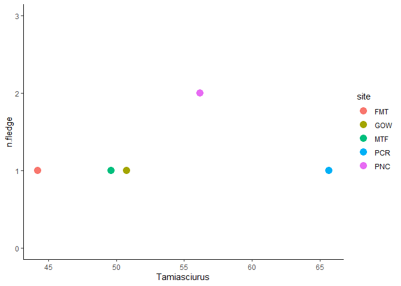

Finalish cameras
================

I think I have all the data I need to run the productivity \~ diet
models. So here goes…

``` r
# Import conflict settings.
source('../src/conflicted.R')

# Load some libraries.
library(tidyverse)
library(lubridate)
library(ggplot2)
library(vegan)
library(broom.mixed)
library(lme4)
library(purrr)
library(modelr)

# Bring in camera data.
camera.data <- read_csv('../data/interim/cameras_20210315.csv', guess_max=7000) %>% 
  ## filter only records with at least size assigned...
  filter(size != 'U')

# To make sure the average sizes work, I also need to bring in the physical remains.
remains.data <- read_csv('../data/raw/20210118_specimens.csv', guess_max=7000) %>% 
  ## filter only records with at least size assigned...
  filter(size != 'U') %>% 
  ## and rename a confusing column.
  rename(name=site) %>% 
  ## and fix a typo
  mutate(genus=case_when(
    genus == 'Picoides' ~ 'Dryobates',
    TRUE ~ genus
  ))

# Bring in a list of site abbreviations and site names.
nest.list <- read_csv('../data/processed/site_abbreviations.csv')

# Standardize the specimen data.
remains.data <- left_join(remains.data, nest.list, by='name') %>% 
  filter(id != 1120) %>% 
  filter(id != 1171) %>% 
  filter(site != 'COM') %>% 
  select(site, date, class, order, family, genus, species, common, size, age, source)

# Standardize the camera data.
camera.data <- camera.data %>% 
  mutate(date=date(datetime), source='C') %>% 
  select(site, date, class, order, family, genus, species, common, size, age, source)

# Join them together.
diet.data <- bind_rows(remains.data, camera.data)

# Add a unique site/year identifier.
diet.data <- diet.data %>% 
  mutate(year=year(date), nest=paste(site, year, sep=''))

# Do some cleanup.
diet.data <- diet.data %>% 
  mutate(size=case_when(
    size %in% c('S', 'Small') ~ 'small',
    size %in% c('M', 'Medium') ~ 'medium',
    size %in% c('L', 'Large') ~ 'large'
  )) %>%  
  ## and replace all the "U"s with "Unknown"...
  mutate_at(c('class', 'order', 'family', 'genus'), funs(case_when(
    . == 'U' ~ 'Unknown',
    TRUE ~ .
  ))) %>% 
  ## in species as well...
  mutate(species=case_when(
    species == 'U' ~ 'unknown',
    TRUE ~ species
  ))
```

That’s the diet data from cameras brought in. Time to add the mass data.

``` r
# Bring in a list of all known prey.
prey.list <- read_csv('../data/interim/prey_attributes.csv')

# Join the biomass data to the list of diet items.
diet.items <- prey.list %>% select(genus, species, binomial, common, category, mass) %>% 
  right_join(diet.data, by=c('genus', 'species', 'common'))

# For unidentified items, classify them by size and class.
diet.items <- diet.items %>% mutate(category=case_when(
  is.na(category) & class == 'Mammalia' & size == 'small' ~ 'small mammal',
  is.na(category) & class == 'Mammalia' & size == 'medium' ~ 'medium mammal',
  is.na(category) & class == 'Mammalia' & size == 'large' ~ 'large mammal',
  is.na(category) & class == 'Aves' & size == 'small' ~ 'small bird',
  is.na(category) & class == 'Aves' & size == 'medium' ~ 'medium bird',
  is.na(category) & class == 'Aves' & size == 'large' ~ 'large bird',
  is.na(category) & class == 'Unknown' ~ paste(size, 'item'),
  TRUE ~ category))

# For unidentified items, fill in the binomial column.
diet.items <- diet.items %>% replace_na(list(binomial = 'Unidentified item'))

# Calculate average masses for unidentified items, based of known species.
mean.mass <- diet.items %>% drop_na(mass) %>% 
  distinct(binomial, mass, category) %>% 
  group_by(category) %>% 
  ## averaging the mass for each size & class category...
  summarize(average=mean(mass)) %>% 
  pivot_wider(names_from=category, values_from=average) %>% 
  ## calculating the average mass for complete unknowns...
  mutate(`large item` = mean(`large bird`, `large mammal`),
         `medium item` = mean(`medium bird`, `medium mammal`),
         `small item` = mean(`small bird`, `small mammal`)) %>% 
  ## and reassembling it in a tidy format.
  pivot_longer(everything(), names_to='category', values_to='average')

# Join average mass to diet items...
diet.items <- left_join(diet.items, mean.mass, by='category') %>% 
  ## and fill in missing mass with average values
  mutate(mass=coalesce(mass, average)) %>% 
  ## then drop no longer needed average column and rearrange.
  select(site, year, nest, class, order, family, genus, species, binomial, common, 
         category, size, age, mass, source)
```

Looks good. One last thing to change is that juveniles need to have
smaller mass than adults. This is a completely arbitrary choice. I don’t
think I have any small species juveniles, only large and mediums. Miller
uses 65-95% of adults mass for medium birds and 55-95% for large birds,
and 50% for mammals. That seems incredibly fine considering the
coarseness of my data, so maybe I’ll just go with a flat 50%?

``` r
# Change mass for juvenile items.
diet.items <- diet.items %>% mutate(mass=case_when(
  age == 'J' ~ 0.5*mass,
  TRUE ~ mass
))
```

Ok, now on to doing all the calculations needed to get things ready for
the models.

``` r
# Make a function to calculate class mass.
class.mass <- function(data) {
    data %>% mutate(total.mass=sum(.data$mass)) %>%
    filter(class %in% c('Mammalia', 'Aves')) %>%
    group_by(class) %>% 
    mutate(class.mass=sum(.data$mass), per.class=class.mass/total.mass*100) %>% 
    distinct(class, per.class) %>% 
    rename(variable=class, percent=per.class)
}

# And a function to calculate squirrel mass.
squirrel.mass <- function(data) {
    data %>% mutate(total.mass=sum(.data$mass)) %>%
    filter(genus == 'Tamiasciurus') %>%
    mutate(genus.mass=sum(.data$mass), per.genus=genus.mass/total.mass*100) %>% 
    distinct(genus, per.genus) %>% 
    rename(variable=genus, percent=per.genus)
}

# Calculate percent mass for each nest.
nest.mass <- diet.items %>% filter(source == 'C') %>% 
  group_by(nest) %>% nest() %>% 
  mutate(class=map(data, class.mass), 
         genus=map(data, squirrel.mass)) %>% 
  pivot_longer(-c(nest, data), names_to='var', values_to='per') %>% 
  unnest(per) %>% 
  select(nest, variable, percent) %>% 
  pivot_wider(id_cols=c(nest), names_from=variable, values_from=percent, values_fill=0)

# Calculate counts of items identified to genus for each nest.
nest.count <- diet.items %>% filter(source == 'C' & binomial != 'Unidentified item') %>% 
  group_by(nest, binomial) %>% 
  mutate(count=n()) %>% 
  select(nest, binomial, count) %>% 
  distinct() %>% 
  pivot_wider(names_from=binomial, values_from=count, values_fill=list(count = 0))

# Diversity per nest.
nest.diversity <- plyr::ddply(nest.count, ~nest, function(x) {
  data.frame(diet.diversity=diversity(x[-1], index='simpson'))
})
```

Calculations done, wrangle it all into a tidy data set.

``` r
# Bring in productivity data.
productivity <- read_csv('../data/raw/productivity.csv')

# Make a happy data set for the models to use.
model.data <- productivity %>% mutate(nest=paste(site, year, sep='')) %>% 
  left_join(nest.diversity, by=c('nest')) %>% 
  left_join(nest.mass, by=c('nest')) %>%
  select(site, year, nest, n.fledge, diet.diversity, Tamiasciurus) %>% 
  filter_all(all_vars(!is.na(.)))

model.data
```

    ## # A tibble: 11 x 6
    ##    site   year nest    n.fledge diet.diversity Tamiasciurus
    ##    <chr> <dbl> <chr>      <dbl>          <dbl>        <dbl>
    ##  1 TCR    2019 TCR2019        2          0.608         50.1
    ##  2 MTC    2019 MTC2019        1          0.580         54.6
    ##  3 UTZ    2019 UTZ2019        2          0.716         48.7
    ##  4 TMC    2019 TMC2019        0          0.651         26.9
    ##  5 MTF    2019 MTF2019        2          0.543         53.1
    ##  6 RLK    2019 RLK2019        3          0.245         51.6
    ##  7 MTF    2020 MTF2020        1          0.410         49.6
    ##  8 PCR    2020 PCR2020        1          0.420         65.7
    ##  9 PNC    2020 PNC2020        2          0             56.1
    ## 10 GOW    2020 GOW2020        1          0.311         50.8
    ## 11 FMT    2020 FMT2020        1          0.665         44.2

PNC looks wrong because the diversity is 0, but that is technically
correct: the only things identified with any level of precision were
squirrels.

Before we make the models, let’s look at some graphs.

``` r
# All the data together.
ggplot(model.data, aes(x=Tamiasciurus, y=n.fledge, color=site, shape=as.factor(year))) +
  geom_point(size=4) +
  theme_classic()
```

<!-- -->

And break it apart to make it a little easier to see.

``` r
# 2019.
model.data %>% filter(year == 2019) %>% 
  ggplot(aes(x=Tamiasciurus, y=n.fledge, color=site)) +
  geom_point(size=4) +
  ylim(0, 3) +
  theme_classic()
```

<!-- -->

``` r
# 2020.
model.data %>% filter(year == 2020) %>% 
  ggplot(aes(x=Tamiasciurus, y=n.fledge, color=site)) +
  geom_point(size=4) +
  ylim(0, 3) +
  theme_classic()
```

<!-- -->

Let’s try making some models.

``` r
# Start with just squirrels.
squirrel.model <- lmer(n.fledge ~ Tamiasciurus + (1|year), data=model.data)

# Look at it.
summary(squirrel.model)
```

    ## Linear mixed model fit by REML ['lmerMod']
    ## Formula: n.fledge ~ Tamiasciurus + (1 | year)
    ##    Data: model.data
    ## 
    ## REML criterion at convergence: 29.6
    ## 
    ## Scaled residuals: 
    ##     Min      1Q  Median      3Q     Max 
    ## -1.2884 -0.5673  0.1333  0.4965  1.7681 
    ## 
    ## Random effects:
    ##  Groups   Name        Variance Std.Dev.
    ##  year     (Intercept) 0.1906   0.4366  
    ##  Residual             0.5013   0.7081  
    ## Number of obs: 11, groups:  year, 2
    ## 
    ## Fixed effects:
    ##              Estimate Std. Error t value
    ## (Intercept)  -0.91977    1.29618  -0.710
    ## Tamiasciurus  0.04691    0.02466   1.902
    ## 
    ## Correlation of Fixed Effects:
    ##             (Intr)
    ## Tamiasciurs -0.957

``` r
# Look at some diagnostics.
data.frame(predicted=predict(squirrel.model, type='response'),
           residuals=residuals(squirrel.model, type='response')) %>% 
  ggplot(aes(x=predicted, y=residuals)) +
  geom_point() +
  geom_hline(yintercept=0, linetype='dashed') +
  geom_smooth(method='lm', formula='y~x', se=FALSE, color='black') +
  theme_classic()
```

<!-- -->

Because there is only one site repeated between years, it’s probably not
crazy to run this as a simple linear model.

``` r
# Try it without MTF in 2019.
mod1 <- model.data %>% filter(nest != 'MTF2019') %>% lm(n.fledge ~ Tamiasciurus, data=.)

# Try it without MTF in 2020.
mod2 <- model.data %>% filter(nest != 'MTF2020') %>% lm(n.fledge ~ Tamiasciurus, data=.)

# Try it with both.
mod3 <- model.data %>% lm(n.fledge ~ Tamiasciurus, data=.)

# Put them all in a data frame.
mods <- tribble(~name, ~model, ~data,
        'mod1', mod1, model.data,
        'mod2', mod2, model.data,
        'mod3', mod3, model.data)

# Calculate some stuff.
mods <- mods %>% mutate(gl=map(model, glance), td=map(model, tidy))

# Look at them.
mods %>% unnest(gl)
```

    ## # A tibble: 3 x 15
    ##   name  model data  r.squared adj.r.squared sigma statistic p.value    df logLik
    ##   <chr> <lis> <lis>     <dbl>         <dbl> <dbl>     <dbl>   <dbl> <int>  <dbl>
    ## 1 mod1  <lm>  <tib~     0.182        0.0795 0.809      1.78   0.219     2  -11.0
    ## 2 mod2  <lm>  <tib~     0.194        0.0937 0.809      1.93   0.202     2  -11.0
    ## 3 mod3  <lm>  <tib~     0.191        0.101  0.778      2.12   0.179     2  -11.7
    ## # ... with 5 more variables: AIC <dbl>, BIC <dbl>, deviance <dbl>,
    ## #   df.residual <int>, td <list>

``` r
mods %>% unnest(td) %>% arrange(term, name)
```

    ## # A tibble: 6 x 9
    ##   name  model  data       gl        term    estimate std.error statistic p.value
    ##   <chr> <list> <list>     <list>    <chr>      <dbl>     <dbl>     <dbl>   <dbl>
    ## 1 mod1  <lm>   <tibble [~ <tibble ~ (Inter~  -0.416     1.39      -0.300   0.772
    ## 2 mod2  <lm>   <tibble [~ <tibble ~ (Inter~  -0.395     1.39      -0.285   0.783
    ## 3 mod3  <lm>   <tibble [~ <tibble ~ (Inter~  -0.453     1.33      -0.340   0.742
    ## 4 mod1  <lm>   <tibble [~ <tibble ~ Tamias~   0.0364    0.0273     1.33    0.219
    ## 5 mod2  <lm>   <tibble [~ <tibble ~ Tamias~   0.0378    0.0272     1.39    0.202
    ## 6 mod3  <lm>   <tibble [~ <tibble ~ Tamias~   0.0380    0.0261     1.46    0.179

None of them are anything like significant. This is a problem because
even when you pull out just the 2019 data it stays insignificant.

``` r
# Run with just 2019 data.
model.data %>% filter(year == 2019) %>% lm(n.fledge ~ Tamiasciurus, data=.) %>% summary()
```

    ## 
    ## Call:
    ## lm(formula = n.fledge ~ Tamiasciurus, data = .)
    ## 
    ## Residuals:
    ##        1        2        3        4        5        6 
    ##  0.14382 -1.17525  0.24394 -0.18379 -0.06981  1.04109 
    ## 
    ## Coefficients:
    ##              Estimate Std. Error t value Pr(>|t|)
    ## (Intercept)  -1.75102    1.68881  -1.037    0.358
    ## Tamiasciurus  0.07195    0.03487   2.063    0.108
    ## 
    ## Residual standard error: 0.8037 on 4 degrees of freedom
    ## Multiple R-squared:  0.5155, Adjusted R-squared:  0.3944 
    ## F-statistic: 4.256 on 1 and 4 DF,  p-value: 0.1081

This is an even bigger problem because when I try to re-run my
“storytime” code, which originally produced such a nice p-value, I
cannot reproduce those results: the p-value is still non-significant.

So in summary

  - running with two years of data produces no significant results
  - running with one year of data produces no significant results, even
    though it did previously
  - running with original code produces no significant results, even
    though it did previously
  - I am unable to reproduce previous results, I have no explanation for
    why, and I therefore have no evidence previous significant results
    were every actually real

I can go over my data very carefully to see if I’ve made a huge mistake
in this most recent iteration of the data set but it seems unlikely.

``` r
# Make some confidence intervals, etc.
pred1 <- predict(mod1, interval='confidence')
pred1 <- model.data %>% filter(nest != 'MTF2019') %>% cbind(pred1)

pred2 <- predict(mod2, interval='confidence')
pred2 <- model.data %>% filter(nest != 'MTF2020') %>% cbind(pred2)

pred3 <- predict(mod3, interval='confidence')
pred3 <- model.data %>% cbind(pred3)

# Plot them.
ggplot() +
  geom_point(data=model.data, aes(x=Tamiasciurus, y=n.fledge)) +
  geom_line(data=pred1, aes(x=Tamiasciurus, y=fit), color='red') +
  geom_line(data=pred2, aes(x=Tamiasciurus, y=fit), color='blue') +
  geom_line(data=pred3, aes(x=Tamiasciurus, y=fit), color='purple') +
  geom_ribbon(data=pred1, aes(x=Tamiasciurus, y=fit, ymin=lwr, ymax=upr), fill='red', alpha=0.1) +
  geom_ribbon(data=pred2, aes(x=Tamiasciurus, y=fit, ymin=lwr, ymax=upr), fill='blue', alpha=0.1) +
  geom_ribbon(data=pred3, aes(x=Tamiasciurus, y=fit, ymin=lwr, ymax=upr), fill='purple', alpha=0.1) +
  theme_classic()
```

<!-- -->

So no real difference whether one or the other is included, or both.

One last item for David:

``` r
glm(n.fledge ~ Tamiasciurus, family=poisson, data=model.data) %>% summary()
```

    ## 
    ## Call:
    ## glm(formula = n.fledge ~ Tamiasciurus, family = poisson, data = model.data)
    ## 
    ## Deviance Residuals: 
    ##     Min       1Q   Median       3Q      Max  
    ## -1.1869  -0.4494  -0.1706   0.4124   1.1054  
    ## 
    ## Coefficients:
    ##              Estimate Std. Error z value Pr(>|z|)
    ## (Intercept)  -1.15161    1.66738  -0.691    0.490
    ## Tamiasciurus  0.02979    0.03156   0.944    0.345
    ## 
    ## (Dispersion parameter for poisson family taken to be 1)
    ## 
    ##     Null deviance: 5.6918  on 10  degrees of freedom
    ## Residual deviance: 4.7295  on  9  degrees of freedom
    ## AIC: 32.176
    ## 
    ## Number of Fisher Scoring iterations: 5

``` r
glm(n.fledge ~ diet.diversity, family=poisson, data=model.data) %>% summary()
```

    ## 
    ## Call:
    ## glm(formula = n.fledge ~ diet.diversity, family = poisson, data = model.data)
    ## 
    ## Deviance Residuals: 
    ##     Min       1Q   Median       3Q      Max  
    ## -1.5637  -0.4328  -0.1943   0.5645   0.8704  
    ## 
    ## Coefficients:
    ##                Estimate Std. Error z value Pr(>|z|)
    ## (Intercept)      0.7612     0.5440   1.399    0.162
    ## diet.diversity  -0.8612     1.1277  -0.764    0.445
    ## 
    ## (Dispersion parameter for poisson family taken to be 1)
    ## 
    ##     Null deviance: 5.6918  on 10  degrees of freedom
    ## Residual deviance: 5.1332  on  9  degrees of freedom
    ## AIC: 32.58
    ## 
    ## Number of Fisher Scoring iterations: 5

``` r
ggplot(model.data, aes(x=Tamiasciurus, y=n.fledge)) +
  geom_smooth(method='glm', formula='y ~ x') +
  geom_point() +
  theme_classic()
```

<!-- -->
