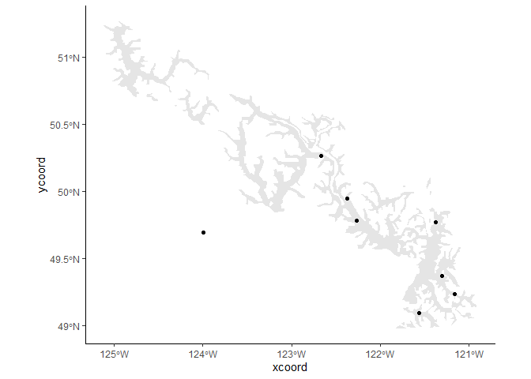

Coastal and Transition definitions
================

# Setup

I noticed a concerning pattern with the distribution of hare relative to
the assignment of transition zone status for sites, so I want to
double-check that sites are being assigned to zones correctly and, if
so, what this hare situation says about the zone definitions.

``` r
# Import conflict settings.
source('../src/conflicted.R')

# Load some libraries.
library(tidyverse)
library(lubridate)
library(sf)
library(rmapshaper)
library(broom)
```

Then bring in the diet data and get it ready.

``` r
# Bring in specimen data.
remains.data <- read_csv('../data/processed/specimens_20210318.csv', guess_max=7000) %>% 
  ## filter only records with at least size assigned...
  filter(size != 'U')

# Bring in camera data.
photos <- read_csv('../data/interim/cameras_20210623.csv', guess_max=7000)
camera.data <- photos %>% 
  ## filter only records with at least size assigned...
  filter(size != 'U')

# Bring in a list of site abbreviations and site names.
nest.list <- read_csv('../data/processed/site_abbreviations.csv')

# Standardize the specimen data.
remains.data <- left_join(remains.data, nest.list, by=c('name', 'site')) %>% 
  select(site, date, class, order, family, genus, species, common, size, age, source)

# Standardize the camera data.
camera.data <- camera.data %>% 
  mutate(date=date(datetime), source='C') %>% 
  select(site, date, class, order, family, genus, species, common, size, age, source)

# Join them together.
diet.data <- bind_rows(remains.data, camera.data)

# Add a unique site/year identifier.
diet.data <- diet.data %>% 
  mutate(year=year(date), nest=paste(site, year, sep=''))

# Do some cleanup.
diet.data <- diet.data %>% 
  mutate(size=case_when(
    size %in% c('S', 'Small') ~ 'small',
    size %in% c('M', 'Medium') ~ 'medium',
    size %in% c('L', 'Large') ~ 'large'
  ))

# Fix the gray jay.
diet.data <- diet.data %>% mutate(common=case_when(
  common == 'gray jay' ~ 'canada jay',
  TRUE ~ common
))
```

Then do the biomass thing.

``` r
# Bring in a list of all known prey.
prey.list <- read_csv('../data/interim/prey_attributes.csv')

# Fix the gray jay.
prey.list <- prey.list %>% mutate(common=case_when(
  common == 'gray jay' ~ 'canada jay',
  TRUE ~ common
))

# Join the biomass data to the list of diet items.
diet.items <- prey.list %>% select(genus, species, binomial, common, category, mass) %>% 
  right_join(diet.data, by=c('genus', 'species', 'common'))

# For unidentified items, classify them by size and class.
diet.items <- diet.items %>% mutate(category=case_when(
  is.na(category) & class == 'Mammalia' & size == 'small' ~ 'small mammal',
  is.na(category) & class == 'Mammalia' & size == 'medium' ~ 'medium mammal',
  is.na(category) & class == 'Mammalia' & size == 'large' ~ 'large mammal',
  is.na(category) & class == 'Aves' & size == 'small' ~ 'small bird',
  is.na(category) & class == 'Aves' & size == 'medium' ~ 'medium bird',
  is.na(category) & class == 'Aves' & size == 'large' ~ 'large bird',
  is.na(category) & class == 'Unknown' ~ paste(size, 'item'),
  TRUE ~ category))

# For unidentified items, fill in the binomial column.
diet.items <- diet.items %>% replace_na(list(binomial = 'Unidentified item'))

# Calculate average masses for unidentified items, based of known species.
mean.mass <- diet.items %>% drop_na(mass) %>% 
  distinct(binomial, mass, category) %>% 
  group_by(category) %>% 
  ## averaging the mass for each size & class category...
  summarize(average=mean(mass)) %>% 
  pivot_wider(names_from=category, values_from=average) %>% 
  ## calculating the average mass for complete unknowns...
  mutate(`large item` = mean(c(`large bird`, `large mammal`)),
         `medium item` = mean(c(`medium bird`, `medium mammal`)),
         `small item` = mean(c(`small bird`, `small mammal`))) %>% 
  ## and reassembling it in a tidy format.
  pivot_longer(everything(), names_to='category', values_to='average')

# Join average mass to diet items...
diet.items <- left_join(diet.items, mean.mass, by='category') %>% 
  ## and fill in missing mass with average values
  mutate(mass=coalesce(mass, average)) %>% 
  ## then drop no longer needed average column and rearrange.
  select(site, year, nest, class, order, family, genus, species, binomial, common, 
         category, size, mass, age, source)

# Change mass for juvenile items.
diet.items <- diet.items %>% mutate(mass=case_when(
  age == 'J' ~ 0.5*mass,
  TRUE ~ mass
))

# Add grouping categories.
diet.items <- diet.items %>% mutate(group=case_when(
  class == 'Aves' & family == 'Phasianidae' ~ 'grouse',
  class == 'Aves' & family == 'Corvidae' ~ 'corvid',
  class == 'Aves' & family == 'Turdidae' ~ 'thrush',
  class == 'Aves' ~ 'bird',
  class == 'Mammalia' & genus == 'Tamiasciurus' ~ 'squirrel',
  class == 'Mammalia' & genus == 'Lepus' ~ 'hare',
  class == 'Mammalia' ~ 'mammal',
  TRUE ~ 'unknown'
))
```

# Checking zone accuracy

That’s all the diet data brought in and cleaned up. Now to bring in the
shapefiles and sites.

FLNRORD provided me with a transtion zone shapefile but I noticed early
on that the borders of the transition zone, as defined in that
shapefile, do not conform to the borders of the BEC zones which are
supposed to make up the zone. For consistency, I created a new shapefile
based on the lastest BEC zone data from the province, which makes the
borders of the transition zone the same as the BEC zones which comprise
it.

``` r
# Read in nest data.
nests <- read_csv('../data/processed/sc_nests.csv')

# Calculate a centroid for each site.
centroids <- nests %>% group_by(site) %>% 
  mutate(xcoord=mean(xcoord), ycoord=mean(ycoord)) %>% 
  distinct(site, name, xcoord, ycoord) %>% ungroup()

# Make it a spatial object for later.
centroids.sf <- centroids %>% 
  st_as_sf(coords=c('xcoord', 'ycoord')) %>% 
  st_set_crs('+proj=utm +zone=10 +datum=WGS84 +units=m +no_defs') %>% 
  st_as_sf()

# Bring in study area shapefile.
tz.region <- read_sf(dsn='../data/processed/new_transition_zone.shp', 
                     layer='new_transition_zone') %>% 
  ms_simplify()

# Add zone information to centroids.
centroids.sf <- centroids.sf %>% mutate(
  zone=as.integer(st_intersects(geometry, tz.region)),
  zone=case_when(
    is.na(zone) ~ 'cs',
    TRUE ~ 'tz'
  )
)
```

Let’s start by looking at that shapefile and make sure it contains the
correct BEC zones.

``` r
# Look at the actual BEC zones contained here.
as.data.frame(tz.region) %>% distinct(MAP_LABEL)
```

    ##   MAP_LABEL
    ## 1    CWHds1
    ## 2    CWHms1

Well, this is kind of terrifying because the transition is supposed to
made up of more subzones than that: \* CWH ds1 \* CWH ds2 \* CWH ms1 \*
CWH ms2 \* CWH ws1 \* CWH ws2

Let’s check the original transition zone shapefile I got from FLNR.

``` r
# Bring in the shapefile.
tz.original <- read_sf(dsn='../data/external/transition_zone.shp', 
                     layer='transition_zone')
```

Well, ok, nevermind. Apparently that shapefile doesn’t even have BEC
zones listed in its data. When I check my shapefile in QGIS, it has the
correct \#1 variants, but not the \#2 variants.

The other way to look at this is to see if I get a different set of
sites depending on whether I use the original tz shapefile or my own.

``` r
# What are the current tz sites?
new.tz.sites <- as.data.frame(centroids.sf) %>% filter(zone == 'tz') %>% distinct(site, name)

new.tz.sites
```

    ##    site              name
    ## 1   BSL        Big Silver
    ## 2   BKH        Birkenhead
    ## 3   BKR  Birkenhead River
    ## 4   BLC    Blakeney Creek
    ## 5   BWC        Brew Creek
    ## 6   CCR      Center Creek
    ## 7   CHR   Cheakamus River
    ## 8   CLB        Cloudburst
    ## 9   DWC     Dewdney Creek
    ## 10  DCR      Dipper Creek
    ## 11  DGC     Douglas Creek
    ## 12  EOT              E125
    ## 13  ETO              E315
    ## 14  EMC  Eight Mile Creek
    ## 15  ELA             Elaho
    ## 16  ECR   Endurance Creek
    ## 17  FMT     Fire Mountain
    ## 18  GLK      Glacier Lake
    ## 19  GOW       Gowan Creek
    ## 20  GRV           Gravell
    ## 21  HAY    Haylmore Creek
    ## 22  HKM          Heakamie
    ## 23  HKO          Homathko
    ## 24  HSL        Hope Slide
    ## 25  HVA       Hope Valley
    ## 26  JVC      Jarvis Creek
    ## 27  JFC      Joffre Creek
    ## 28  KAF             Kafir
    ## 29  LMT Landmark Mountain
    ## 30  LIL        Lillooette
    ## 31  LIX             Lixon
    ## 32  MLP      Millars Pond
    ## 33  MLR     Millers Ridge
    ## 34  MTF        Mount Ford
    ## 35  MTH      Mount Holden
    ## 36  PCR       Peers Creek
    ## 37  PXC      Phelix Creek
    ## 38  RYR        Ryan River
    ## 39  SLV            Silver
    ## 40  SMC        Sims Creek
    ## 41  SLC     Sloquet Creek
    ## 42  SMT   Superb Mountain
    ## 43  TCR      Turbid Creek
    ## 44  TMC Twenty Mile Creek
    ## 45  TOC    Twin One Creek
    ## 46  UTZ           Utzilus
    ## 47  WCR       Wedge Creek
    ## 48  WRA        Wray Creek
    ## 49  YJC  Young John Creek

And now check the original.

``` r
# Add zone information to centroids.
old.tz.sites <- centroids.sf %>% mutate(
  zone=as.integer(st_intersects(geometry, tz.original)),
  zone=case_when(
    is.na(zone) ~ 'cs',
    TRUE ~ 'tz'
  )
) %>% 
  as.data.frame() %>% filter(zone == 'tz') %>% distinct(site, name)

old.tz.sites
```

    ##    site              name
    ## 1   BSL        Big Silver
    ## 2   BKH        Birkenhead
    ## 3   BKR  Birkenhead River
    ## 4   BLC    Blakeney Creek
    ## 5   BWC        Brew Creek
    ## 6   CCR      Center Creek
    ## 7   CHR   Cheakamus River
    ## 8   CLB        Cloudburst
    ## 9   DWC     Dewdney Creek
    ## 10  DCR      Dipper Creek
    ## 11  DGC     Douglas Creek
    ## 12  EOT              E125
    ## 13  ETO              E315
    ## 14  EMC  Eight Mile Creek
    ## 15  ELA             Elaho
    ## 16  ECR   Endurance Creek
    ## 17  FMT     Fire Mountain
    ## 18  GLK      Glacier Lake
    ## 19  GOW       Gowan Creek
    ## 20  GRV           Gravell
    ## 21  HAY    Haylmore Creek
    ## 22  HKM          Heakamie
    ## 23  HKO          Homathko
    ## 24  HSL        Hope Slide
    ## 25  HVA       Hope Valley
    ## 26  JVC      Jarvis Creek
    ## 27  KAF             Kafir
    ## 28  LMT Landmark Mountain
    ## 29  LIL        Lillooette
    ## 30  LIX             Lixon
    ## 31  MLP      Millars Pond
    ## 32  MLR     Millers Ridge
    ## 33  MTF        Mount Ford
    ## 34  MTH      Mount Holden
    ## 35  PCR       Peers Creek
    ## 36  RYR        Ryan River
    ## 37  SLV            Silver
    ## 38  SMC        Sims Creek
    ## 39  SLC     Sloquet Creek
    ## 40  SMT   Superb Mountain
    ## 41  TCR      Turbid Creek
    ## 42  TMC Twenty Mile Creek
    ## 43  TOC    Twin One Creek
    ## 44  UTZ           Utzilus
    ## 45  WCR       Wedge Creek
    ## 46  WRA        Wray Creek
    ## 47  YJC  Young John Creek

And is there a difference?

``` r
anti_join(new.tz.sites, old.tz.sites)
```

    ##   site         name
    ## 1  JFC Joffre Creek
    ## 2  PXC Phelix Creek

An anti join keeps all the cases x that have no match in y. So this is
any sites in the new tz set which would not count as tz using the old tz
shapefile. It’s just two, and they’re sites we don’t have any data for.

And the other way around?

``` r
anti_join(old.tz.sites, new.tz.sites)
```

    ## [1] site name
    ## <0 rows> (or 0-length row.names)

Nothing. So all sites classified as tz using the new shapefile are also
classified as tz with the old shapefile.

In other words, my “improved” shapefile classifies sites exactly the
same as the old shapefile with the exception of two site which we don’t
have any data for anyway.

That’s a huge relief\!

Now, what about these hare sites?

``` r
# Looking where different prey are found.
diet.items %>% distinct(site, common, group) %>%
  left_join(centroids, by=c('site')) %>%
  filter(group=='hare'
         ) %>%
  ggplot() +
  #geom_sf(data=cs.region, aes(fill=coastal), color=NA) +
  geom_sf(data=tz.region, color=NA) +
  geom_point(aes(x=xcoord, y=ycoord)) +
  theme_classic()
```

<!-- -->

Ok this is horrifying. All of those points are sites where hare was
located, and they are all definitely in the transition zone. How, then,
is there no significant difference in amount of hare between coastand
transition zone? Did my code misclassify them?

``` r
diet.items %>% distinct(site, common, group) %>%
  left_join(centroids.sf, by=c('site')) %>%
  filter(group=='hare')
```

    ## # A tibble: 8 x 6
    ##   site  common        group name                        geometry zone 
    ##   <chr> <chr>         <chr> <chr>                    <POINT [m]> <chr>
    ## 1 PCR   snowshoe hare hare  Peers Creek       (624551.7 5471272) tz   
    ## 2 TMC   snowshoe hare hare  Twenty Mile Creek (634441.8 5456645) tz   
    ## 3 UTZ   snowshoe hare hare  Utzilus           (619263.6 5515817) tz   
    ## 4 FMT   snowshoe hare hare  Fire Mountain     (553854.3 5517199) tz   
    ## 5 MTF   snowshoe hare hare  Mount Ford        (605508.6 5440540) tz   
    ## 6 GRV   snowshoe hare hare  Gravell             (524103 5570856) tz   
    ## 7 RLK   snowshoe hare hare  Ruby Lake         (427374.1 5507130) cs   
    ## 8 GOW   snowshoe hare hare  Gowan Creek         (546185 5535347) tz

So 8 sites had hare, and all but one are in the transition zone. This
means they were correctly classified. But did that classification get
lost on the way to the chi-square test, somehow?

# Chi-square

This is the code I used in the thesis:

``` r
# Calculate counts per group per zone per source.
zone.counts <- left_join(diet.items, centroids.sf, by=c('site')) %>% 
  group_by(source) %>% nest() %>% 
  mutate(count=map(data, function(data) {
    data %>% group_by(zone, group) %>% 
      mutate(count=n()) %>% 
      select(zone, group, count) %>% 
      distinct()
  })) %>% 
  unnest(count) %>% select(!data)
```

For pellets:

``` r
# Hares in pellets.
zone.counts %>% pivot_wider(names_from=source, values_from=count) %>% 
  mutate(RP=R + P) %>% 
  pivot_longer(cols=c('R', 'C', 'P', 'RP'), names_to='source', values_to='count') %>% 
  filter(!is.na(count)) %>% filter(source == 'P') %>% 
  pivot_wider(names_from=group, values_from=count, values_fill=0)
```

    ## # A tibble: 2 x 7
    ##   zone  source  bird corvid thrush mammal squirrel
    ##   <chr> <chr>  <int>  <int>  <int>  <int>    <int>
    ## 1 cs    P         32      1      1      9       26
    ## 2 tz    P         17      3      2     15       29

No hare at all, which makes sense.

And for pellets and remains:

``` r
# Hares in pellets + remains.
zone.counts %>% pivot_wider(names_from=source, values_from=count) %>% 
  mutate(RP=R + P) %>% 
  pivot_longer(cols=c('R', 'C', 'P', 'RP'), names_to='source', values_to='count') %>% 
  filter(!is.na(count)) %>% filter(source == 'RP') %>% 
  pivot_wider(names_from=group, values_from=count, values_fill=0)
```

    ## # A tibble: 2 x 7
    ##   zone  source  bird corvid thrush mammal squirrel
    ##   <chr> <chr>  <int>  <int>  <int>  <int>    <int>
    ## 1 cs    RP        55      4      3     10        0
    ## 2 tz    RP        35      9      8     17       36

Uh here’s a big problem. Because there are definitely hare in the
remains sample. How did this happen?

``` r
zone.counts %>% pivot_wider(names_from=source, values_from=count) %>% 
  mutate(RP=R + P)
```

    ## # A tibble: 16 x 6
    ##    zone  group        R     C     P    RP
    ##    <chr> <chr>    <int> <int> <int> <int>
    ##  1 cs    bird        23     6    32    55
    ##  2 tz    corvid       6     9     3     9
    ##  3 cs    corvid       3     2     1     4
    ##  4 tz    bird        18    54    17    35
    ##  5 tz    grouse      22     6    NA    NA
    ##  6 cs    grouse      19     1    NA    NA
    ##  7 tz    thrush       6    32     2     8
    ##  8 cs    thrush       2    11     1     3
    ##  9 tz    hare        11     5    NA    NA
    ## 10 cs    hare         1    NA    NA    NA
    ## 11 tz    mammal       2    47    15    17
    ## 12 tz    squirrel     7   169    29    36
    ## 13 cs    mammal       1     5     9    10
    ## 14 cs    squirrel    NA    34    26    NA
    ## 15 tz    unknown     NA    79    NA    NA
    ## 16 cs    unknown     NA    37    NA    NA

Oh, shit. So the NAs mean that all of my arithmetic failed completely.
Ok, so fix the bad code and produce numbers instead of NAs:

``` r
zone.counts %>% pivot_wider(names_from=source, values_from=count, values_fill=0) %>% 
  mutate(RP=R + P)
```

    ## # A tibble: 16 x 6
    ##    zone  group        R     C     P    RP
    ##    <chr> <chr>    <int> <int> <int> <int>
    ##  1 cs    bird        23     6    32    55
    ##  2 tz    corvid       6     9     3     9
    ##  3 cs    corvid       3     2     1     4
    ##  4 tz    bird        18    54    17    35
    ##  5 tz    grouse      22     6     0    22
    ##  6 cs    grouse      19     1     0    19
    ##  7 tz    thrush       6    32     2     8
    ##  8 cs    thrush       2    11     1     3
    ##  9 tz    hare        11     5     0    11
    ## 10 cs    hare         1     0     0     1
    ## 11 tz    mammal       2    47    15    17
    ## 12 tz    squirrel     7   169    29    36
    ## 13 cs    mammal       1     5     9    10
    ## 14 cs    squirrel     0    34    26    26
    ## 15 tz    unknown      0    79     0     0
    ## 16 cs    unknown      0    37     0     0

That looks better. With this code, what happens if I re-run the
chi-square?

``` r
zone.chi <- zone.counts %>% pivot_wider(names_from=source, values_from=count, values_fill=0) %>% 
  mutate(RP=R + P) %>% 
  pivot_longer(cols=c('R', 'C', 'P', 'RP'), names_to='source', values_to='count') %>% 
  filter(!is.na(count)) %>% 
  group_by(source) %>% nest() %>% 
  mutate(ch=map(data, function(data) {
    data %>% pivot_wider(names_from=group, values_from=count, values_fill=0) %>% 
      column_to_rownames(var='zone') %>% 
      chisq.test(., correct=FALSE, simulate.p.value=TRUE)
  }),
        gl=map(ch, glance))
```

Well, that throws an error. What’s happening? Probably that, especially
for the pellets, there are zeroes in both zones for some groups.

Dropping zeroes and then filling zeroes back in as needed after pivoting
fixes this.

``` r
# Run the chi-squared test.
zone.chi <- zone.counts %>% pivot_wider(names_from=source, values_from=count, values_fill=0) %>% 
    mutate(RP=R + P) %>% 
    pivot_longer(cols=c('R', 'C', 'P', 'RP'), names_to='source', values_to='count') %>% 
    filter(count > 0) %>% 
    group_by(source) %>% nest() %>% 
    mutate(ch=map(data, function(data) {
      data %>% pivot_wider(names_from=group, values_from=count, values_fill=0) %>% 
        column_to_rownames(var='zone') %>% 
        chisq.test(., correct=FALSE, simulate.p.value=TRUE)
    }),
    gl=map(ch, glance))

# Look at the results.
zone.chi %>% unnest(gl)
```

    ## # A tibble: 4 x 7
    ## # Groups:   source [4]
    ##   source data      ch     statistic p.value parameter method                    
    ##   <chr>  <list>    <list>     <dbl>   <dbl> <lgl>     <chr>                     
    ## 1 R      <tibble ~ <htes~     15.7  0.0115  NA        "Pearson's Chi-squared te~
    ## 2 C      <tibble ~ <htes~     21.5  0.00450 NA        "Pearson's Chi-squared te~
    ## 3 P      <tibble ~ <htes~      7.53 0.100   NA        "Pearson's Chi-squared te~
    ## 4 RP     <tibble ~ <htes~     19.2  0.00250 NA        "Pearson's Chi-squared te~

Again, no difference in pellets–expected, nothing changed here. A
difference in cameras, nothing should have changed here, either. A
difference in pooled pellets-and-remains, but is it the same difference?

## Post-hoc of pellets and remains.

Start with a post-hoc test of the pooled pellets and remains.

For a post-hoc test with a bonferroni adjustment, we need the number of
comparisons being made.

``` r
# How many groups are present?
zone.chi %>% filter(source == 'RP') %>% unnest(data) %>% distinct(group)
```

    ## # A tibble: 7 x 2
    ## # Groups:   source [1]
    ##   source group   
    ##   <chr>  <chr>   
    ## 1 RP     bird    
    ## 2 RP     corvid  
    ## 3 RP     grouse  
    ## 4 RP     thrush  
    ## 5 RP     hare    
    ## 6 RP     mammal  
    ## 7 RP     squirrel

That’s 7 different comparisons. That means my p-value for this test
needs to be less than 0.05 / 7 to be significant.

``` r
# Set the bonferroni adjustment.
bon.rp <- 0.05/7

# What is it?
bon.rp
```

    ## [1] 0.007142857

And now run each individual chi-square.

``` r
# Set up the data.
post.hoc.rp <- zone.chi %>% filter(source == 'RP') %>% ungroup() %>% 
    select(data) %>% unnest(data) %>%
    group_by(group) %>% nest()
```

At this point I have a bunch of little data frames, and each one looks
like this:

``` r
# Look at it.
post.hoc.rp %>% filter(group == 'hare') %>% unnest(data)
```

    ## # A tibble: 2 x 3
    ## # Groups:   group [1]
    ##   group zone  count
    ##   <chr> <chr> <int>
    ## 1 hare  tz       11
    ## 2 hare  cs        1

This gives me the group-by-group counts I need. Supposedly. But I have
run into some sources that suggest this is wrong, that I should be doing
group A vs total, group B vs total, and so on. So I actually need,
supposedly, 2x2 tables like this:

``` r
zone.chi %>% filter(source == 'RP') %>% ungroup() %>% 
  select(data) %>% unnest(data) %>%
  pivot_wider(names_from=group, values_from=count) %>% 
  mutate(everything=bird + corvid + grouse + thrush + hare + mammal + squirrel) %>% 
  pivot_longer(-c(zone, everything), names_to='group', values_to='count') %>% 
  group_by(group) %>% nest() %>% 
  mutate(data=map(data, function(data){
    data %>% mutate(everything.else = everything - count) %>% 
      select(zone, count, everything.else)
  })) %>% 
  filter(group == 'hare') %>% unnest(data)
```

    ## # A tibble: 2 x 4
    ## # Groups:   group [1]
    ##   group zone  count everything.else
    ##   <chr> <chr> <int>           <int>
    ## 1 hare  cs        1             117
    ## 2 hare  tz       11             127

Where “everything.else” refers to the total items (less the items which
are hare), and “count” refers to the items which are hare.

Now to actually run the tests. I feel more confident about the former
approach, but I’m really not sure what I should be doing???

``` r
# Run the chi-square test group-by-group.
post.hoc.rp <- zone.chi %>% filter(source == 'RP') %>% ungroup() %>% 
    select(data) %>% unnest(data) %>%
    group_by(group) %>% nest() %>% ungroup() %>% 
    mutate(ch=map(data, function(data) {
    data %>% column_to_rownames(var='zone') %>% 
      chisq.test(., correct=FALSE, simulate.p.value=TRUE)
  }),
  gl=map(ch, glance))

# Look at them.
post.hoc.rp %>% unnest(gl) %>% arrange(p.value)
```

    ## # A tibble: 7 x 7
    ##   group  data      ch    statistic p.value parameter method                     
    ##   <chr>  <list>    <lis>     <dbl>   <dbl> <lgl>     <chr>                      
    ## 1 hare   <tibble ~ <hte~     8.33  0.00700 NA        "Chi-squared test for give~
    ## 2 bird   <tibble ~ <hte~     4.44  0.0365  NA        "Chi-squared test for give~
    ## 3 thrush <tibble ~ <hte~     2.27  0.233   NA        "Chi-squared test for give~
    ## 4 corvid <tibble ~ <hte~     1.92  0.238   NA        "Chi-squared test for give~
    ## 5 squir~ <tibble ~ <hte~     1.61  0.242   NA        "Chi-squared test for give~
    ## 6 mammal <tibble ~ <hte~     1.81  0.267   NA        "Chi-squared test for give~
    ## 7 grouse <tibble ~ <hte~     0.220 0.762   NA        "Chi-squared test for give~

``` r
# Reminder what the bonferonni-adjusted p-value is.
bon.rp
```

    ## [1] 0.007142857

Then yes, hare is marginally significant, and the only thing by a long
shot. But what if I do it the other way?

``` r
# Run the chi-square test group-vs-everything else.
zone.chi %>% filter(source == 'RP') %>% ungroup() %>% 
  select(data) %>% unnest(data) %>%
  pivot_wider(names_from=group, values_from=count, values_fill=0) %>% 
  mutate(everything=bird + corvid + grouse + thrush + hare + mammal + squirrel) %>% 
  pivot_longer(-c(zone, everything), names_to='group', values_to='count') %>% 
  group_by(group) %>% nest() %>% 
  mutate(data=map(data, function(data){
    data %>% mutate(everything.else = everything - count) %>% 
      select(zone, count, everything.else)
  }),
  ch=map(data, function(data) {
    data %>% column_to_rownames(var='zone') %>% 
      chisq.test(., correct=FALSE, simulate.p.value=TRUE)
  }),
  gl=map(ch, glance)) %>% 
  unnest(gl) %>% 
  arrange(p.value)
```

    ## # A tibble: 7 x 7
    ## # Groups:   group [7]
    ##   group  data      ch    statistic p.value parameter method                     
    ##   <chr>  <list>    <lis>     <dbl>   <dbl> <lgl>     <chr>                      
    ## 1 bird   <tibble ~ <hte~  12.6     5.00e-4 NA        "Pearson's Chi-squared tes~
    ## 2 hare   <tibble ~ <hte~   7.22    9.00e-3 NA        "Pearson's Chi-squared tes~
    ## 3 thrush <tibble ~ <hte~   1.64    2.49e-1 NA        "Pearson's Chi-squared tes~
    ## 4 corvid <tibble ~ <hte~   1.29    3.84e-1 NA        "Pearson's Chi-squared tes~
    ## 5 mammal <tibble ~ <hte~   0.996   4.03e-1 NA        "Pearson's Chi-squared tes~
    ## 6 squir~ <tibble ~ <hte~   0.569   4.61e-1 NA        "Pearson's Chi-squared tes~
    ## 7 grouse <tibble ~ <hte~   0.00121 1.00e+0 NA        "Pearson's Chi-squared tes~

``` r
# Reminder what the bonferonni-adjusted p-value is.
bon.rp
```

    ## [1] 0.007142857

Then hare is still significant, but “other bird” is also very
significant.

**Which method is correct?\!???\!**

And I suppose I should do this all again for cameras, just to be sure.

The camera data have all 8 categories, so

``` r
# Set the bonferroni adjustment.
bon.c <- 0.05/8

# What is it?
bon.c
```

    ## [1] 0.00625

``` r
# Run the chi-square test.
post.hoc.c <- zone.chi %>% filter(source == 'C') %>% ungroup() %>% 
  select(data) %>% unnest(data) %>% 
  pivot_wider(names_from=group, values_from=count, values_fill=0) %>% 
  pivot_longer(-zone, names_to='group', values_to='count') %>% 
  group_by(group) %>% nest() %>% 
  mutate(ch=map(data, function(data) {
    data %>% column_to_rownames(var='zone') %>% 
      chisq.test(., correct=FALSE, simulate.p.value=TRUE)
  }),
  gl=map(ch, glance))

# Look at them.
post.hoc.c %>% unnest(gl) %>% arrange(p.value)
```

    ## # A tibble: 8 x 7
    ## # Groups:   group [8]
    ##   group  data      ch    statistic p.value parameter method                     
    ##   <chr>  <list>    <lis>     <dbl>   <dbl> <lgl>     <chr>                      
    ## 1 bird   <tibble ~ <hte~     38.4  5.00e-4 NA        "Chi-squared test for give~
    ## 2 mammal <tibble ~ <hte~     33.9  5.00e-4 NA        "Chi-squared test for give~
    ## 3 squir~ <tibble ~ <hte~     89.8  5.00e-4 NA        "Chi-squared test for give~
    ## 4 unkno~ <tibble ~ <hte~     15.2  1.00e-3 NA        "Chi-squared test for give~
    ## 5 thrush <tibble ~ <hte~     10.3  2.00e-3 NA        "Chi-squared test for give~
    ## 6 hare   <tibble ~ <hte~      5    6.80e-2 NA        "Chi-squared test for give~
    ## 7 corvid <tibble ~ <hte~      4.45 7.40e-2 NA        "Chi-squared test for give~
    ## 8 grouse <tibble ~ <hte~      3.57 1.17e-1 NA        "Chi-squared test for give~

``` r
# Reminder what the bonferonni-adjusted p-value is.
bon.c
```

    ## [1] 0.00625

Oh yeah, I fucked up.

But how did this happen in the cameras?? I didn’t change the
calculations at all…but I don’t think I did the post-hoc correctly
before, so that could be what this is.

That was the group-by-group method. What if I do this the
group-vs-everything else way?

``` r
# Run the chi-square test group-vs-everything else.
zone.chi %>% filter(source == 'C') %>% ungroup() %>% 
  select(data) %>% unnest(data) %>%
  pivot_wider(names_from=group, values_from=count, values_fill=0) %>% 
  mutate(everything=bird + corvid + grouse + thrush + hare + mammal + squirrel + unknown) %>% 
  pivot_longer(-c(zone, everything), names_to='group', values_to='count') %>% 
  group_by(group) %>% nest() %>% 
  mutate(data=map(data, function(data){
    data %>% mutate(everything.else = everything - count) %>% 
      select(zone, count, everything.else)
  }),
  ch=map(data, function(data) {
    data %>% column_to_rownames(var='zone') %>% 
      chisq.test(., correct=FALSE, simulate.p.value=TRUE)
  }),
  gl=map(ch, glance)) %>% 
  unnest(gl) %>% 
  arrange(p.value)
```

    ## # A tibble: 8 x 7
    ## # Groups:   group [8]
    ##   group  data      ch    statistic p.value parameter method                     
    ##   <chr>  <list>    <lis>     <dbl>   <dbl> <lgl>     <chr>                      
    ## 1 unkno~ <tibble ~ <hte~  15.4     5.00e-4 NA        "Pearson's Chi-squared tes~
    ## 2 bird   <tibble ~ <hte~   3.80    5.15e-2 NA        "Pearson's Chi-squared tes~
    ## 3 mammal <tibble ~ <hte~   3.51    6.45e-2 NA        "Pearson's Chi-squared tes~
    ## 4 squir~ <tibble ~ <hte~   1.45    2.30e-1 NA        "Pearson's Chi-squared tes~
    ## 5 thrush <tibble ~ <hte~   1.19    3.20e-1 NA        "Pearson's Chi-squared tes~
    ## 6 hare   <tibble ~ <hte~   1.21    5.77e-1 NA        "Pearson's Chi-squared tes~
    ## 7 corvid <tibble ~ <hte~   0.00928 1.00e+0 NA        "Pearson's Chi-squared tes~
    ## 8 grouse <tibble ~ <hte~   0.115   1.00e+0 NA        "Pearson's Chi-squared tes~

``` r
# Reminder what the bonferonni-adjusted p-value is.
bon.rp
```

    ## [1] 0.007142857

That, at least, matches my previous findings–only “unknowns” are
different between zones. But it’s drastically different depending on
which method I use\!
